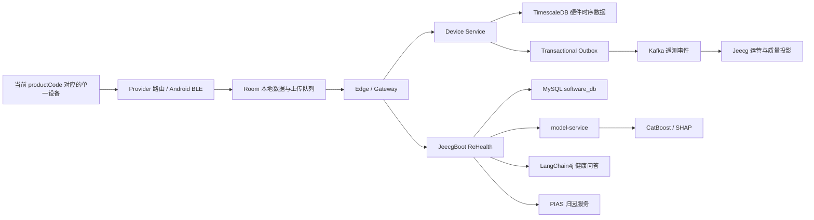

# ReHealth AI / 睿禾健康

ReHealth 是面向可穿戴设备和健康干预场景的软硬件一体化系统。当前 MVP
以 MRD、RWFit 智能戒指和 HBand 手表/手环为设备接入，完成从设备采集、本地持久化、离线上传、
云端时序存储，到 CVD 风险评分、干预建议和用户反馈的闭环。

本文档是仓库级项目入口和结构说明。具体接口、数据契约、部署细节和当前
验收状态，以“文档索引”中列出的专项文档为准。

## 1. 项目目标

当前主链路：

```text
登录与健康访谈
  -> 按 productCode 绑定单一可穿戴设备
  -> BLE 前台/后台采集
  -> Room 本地持久化
  -> 本地上传队列
  -> Gateway / Device Service
  -> TimescaleDB + Transactional Outbox
  -> CVD 16 维特征与模型评分
  -> 干预建议
  -> 用户反馈与风险趋势
```

Android 按 `productCode` 选择单一有效 Provider，Release 已注册 MRD、RWFit 和 HBand。
RWFit 使用固定版本官方 SDK，当前仍需采购型号的真机能力和单位验证；HBand 已完成
隔离 Provider 并进入真机联调，已按设备能力接入心率、步数/活动、睡眠、血氧、HRV、血压、
血糖、压力、MET、ECG、血液成分和身体成分的测量或历史同步，并接入血糖校准与经期设置；
HRV 与 MET 直测分别按官方基础能力位和 App 测量能力位双重判定，条件成立时优先调用 SDK
专用 API，否则 HRV/压力走一键体检或历史、MET 读取设备历史。MT116 对旧版三项通用专用
命令返回 `unknown action` 的真机证据仍用于验证兼容兜底，不会阻断声明新能力的设备直测；
HBand 体温因当前真机验证不通过，已从 `RH-HB-E01` 商品能力和数据页移除；MT116 已加入
该商品的扫描优先提示，能力判定合并新版分包报告，并由 2 号能力包优先确认 ECG；
采购设备的完整连接、能力与数据验收仍待完成。当前不支持多设备同时连接或数据融合。
HBand ECG 已补齐与固定 SDK 匹配的四 ABI 原生库，实时 ADC 按设备增益换算为 mV；Android Room v5
保存导联、采样/绘制频率、时长、校准方式、平均心率和接触质量，并提供实时及本机历史单导联波形详情。
ECG 和身体成分在下发设备测量命令前先展示电极接触与稳定姿势说明，用户确认后才开始测量。
SDK 疾病风险不作为诊断展示，界面明确标注仅供健康参考、不能替代医疗诊断。
Debug 设备页可验证套餐切换顺序；Release 不允许用户在客户端自行改变套餐。
后台恢复只重连加密保存的当前绑定；HBand 所需四项真实画像使用按用户哈希隔离的
加密缓存，不使 BLE 采集依赖网络。
Android 在重新登录和进入个人页时按当前用户读取类型化个人资料及最近健康问答；这些读取与
风险/干预服务解耦，退出后清除上一用户的内存资料。健康问答用户消息先写按用户隔离的
Room v8 本地库（v7 会话/消息表及可空的设备睡眠总时长），再调用服务端并由 `software_db` 保存完整会话；问答中明确自述的姓名、性别、
年龄、身高和体重由 JeecgBoot 合并写入类型化个人档案，并在同轮回复中确认更新字段；麦克风语音入口按需解释并申请权限，应用不保存录音。
新注册账号的健康初始问答状态按账号隔离，既有账号登录不重复提示；每次认证创建新的活动健康
对话，历史仍按账号保留。数据页默认今日，跨午夜睡眠按结束日统计；HBand 优先展示 SDK 的
`allSleepTime`，不会把起止跨度或清醒时长计为实际睡眠；同一晚的累积回调按结束日只取最终
最大值，周期睡眠只平均每天最终值。周期健康指数仅聚合已确认的
每日真实风险结果。
健康问答默认由 JeecgBoot Java LangChain4j 执行；身份类问题通过只绑定当前认证账号、且不接受
`userId` 参数的服务端资料工具读取最新昵称与基本资料，`model-service` 对话接口仅保留为显式回滚。
数据页的睡眠/步数/活动按钮只在设备已连接时执行日常增量同步；HBand 对近期数据使用两天重叠窗口并
跳过无缺口时的长原始历史读取，首次或发现活动缺口时仍补读设备历史。后台前台服务保留显式恢复重连。

## 2. 系统架构



架构边界：

| 组件 | 主要职责 | 不应承担的职责 |
| --- | --- | --- |
| Android | BLE/厂商 SDK、Room、本地轻量特征、离线队列、用户交互 | CatBoost、SHAP、LLM、云端归因 |
| Gateway | 统一公网入口、路由、安全头处理、未来限流 | 业务数据持久化、模型推理 |
| Device Service | 硬件遥测校验、设备授权、TimescaleDB、Outbox | 用户业务档案、模型推理 |
| JeecgBoot | 账号、租户、设备绑定、业务编排、LangChain4j 健康问答、后台权限、software_db | 直接拥有硬件时序库、运行 CatBoost/SHAP/归因模型 |
| model-service | CVD 风险、SHAP、干预生成；保留旧健康助手接口用于灰度回退 | 用户认证、设备接入、业务主数据、权威聊天历史 |
| PIAS | 生产个体归因 | Android 端计算、静默 Mock 回退 |
| rehealth-algorithms | 训练、仿真、算法研究及独立 PIAS 实现 | 患者移动端业务入口 |

## 3. 仓库结构

```text
rehealth_tongbu/
├─ Android-apk/                 Android Compose 客户端
│  ├─ app/src/main/java/com/rehealth/genie/
│  │  ├─ ring/                  可穿戴领域、BLE 仓库、MRD/RWFit/HBand 适配
│  │  ├─ ring/provider/         单一有效绑定、商品目录与 Provider 路由
│  │  ├─ ring/data/             Room 遥测实体与 DAO
│  │  ├─ service/               前台采集服务
│  │  ├─ work/                  WorkManager 上传与恢复任务
│  │  ├─ data/sync/             本地上传队列与反馈同步
│  │  ├─ features/              CVD 16 维特征提取
│  │  ├─ network/               认证客户端、API 与 DTO
│  │  ├─ phm/                   风险/干预服务抽象
│  │  └─ ui/                    Compose 页面
│  └─ docs/                     Android 契约、同步计划和 QA 文档
│
├─ backend/
│  ├─ contracts/                公共 OpenAPI、遥测 Java 契约、事件 Schema、ADR
│  ├─ device-service/           独立硬件遥测接入服务
│  ├─ jeecg-boot/               JeecgBoot Java 后端
│  │  └─ jeecg-boot-module/
│  │     └─ jeecg-module-rehealth/  ReHealth 业务模块
│  ├─ jeecgboot-vue3/           JeecgBoot 管理前端
│  ├─ deploy/rehealth/          Compose、Gateway、Kafka、TimescaleDB、监控
│  └─ qa/                       拓扑、迁移和发布门禁
│
├─ model-service/               FastAPI 模型与健康助手服务
│  ├─ app/                      API、模型加载、执行保护和安全策略
│  ├─ models/                   本地模型制品挂载位置
│  ├─ tests/                    Python 自动化测试
│  └─ docs/                     模型契约、制品和注册表文档
│
├─ rehealth-algorithms/         HealthAgent、PIAS、训练和算法研究
├─ docs/archive/                历史验收与 QA 快照（只读参考）
├─ tools/                       仓库级源码辅助工具（不存放下载的工具链）
├─ STATUS.md                    当前实现与发布状态唯一入口
├─ ENGINEERING.md               MVP 工程实施总纲
├─ QA_TEST_PLAN.md              测试计划
└─ RELEASE_CHECKLIST.md         发布检查清单
```

## 4. 核心数据流

### 4.1 设备采集与本地优先

```text
productCode / 单一有效绑定
  -> ActiveRingRepository
  -> MRD BLE、RWFit SDK 或 HBand SDK（当前 productCode 对应的唯一 Provider）
  -> RingRepository
  -> 规范化测量、睡眠、活动记录
  -> Room
  -> durable upload queue
  -> WorkManager
```

必须先完成 Room 写入，再创建上传任务。网络或后端不可用不得阻塞 BLE 采集。

### 4.2 硬件遥测上传

公共路径保持稳定：

```text
POST /jeecg-boot/rehealth/mobile/measurements/batch
GET  /jeecg-boot/rehealth/mobile/measurements/recent
POST /jeecg-boot/rehealth/viomi/report        (云米/viomi 平台主动上报回调；JWT HS256 验签)
```

`/rehealth/viomi/report` 是手表厂商（云米 miwitracker）主动上报的回调端点：云米平台
先把数据发给自己的云，再按我们提供的回调地址（AppId/AppKey 鉴权）推送到本端点，
复用与手机 batch 同一条 `hardware` 落库链路。端点契约与字段映射见
`backend/docs/HARDWARE_INGEST_ARCHITECTURE.md` 的"Viomi Adapter"一节。

Gateway 在完成切换审批后把这两个路径路由到 Device Service。Device Service
校验批次、通过 JeecgBoot 确认用户/租户/设备绑定，并在一个 TimescaleDB
事务中写入：

1. 上传批次和幂等收据；
2. 规范化测量、睡眠、活动和质量事件；
3. 对账状态；
4. 待发布的 Outbox 事件。

只有数据库事务成功后，Android 才能把本地队列项标记为完成。

### 4.3 风险、干预与反馈

遥测上传不直接触发模型评分。当前标准路径是：

```text
Android Room
  -> HealthFeatureExtractor
  -> CVD 16 feature vector
  -> JeecgBoot /features/evaluate
  -> model-service /v1/cvd/risk/evaluate
  -> software_db 持久化风险结果
  -> 生成干预
  -> Android 本地反馈队列
  -> JeecgBoot feedback API
```

归因页“个人风险趋势”以已确认的 RDI-16 历史绘制实线，并直接使用 PIAS 返回的
维持现状、完成计划和置信区间序列绘制两条虚线与淡色预测区间；情景模拟不表达
未来疾病发生概率，接口不可用时不生成模拟曲线。

未来若需要持续云端分析，应增加独立 Feature Pipeline 消费遥测持久化事件，
按事件中的批次/设备引用读取授权范围内的 TimescaleDB 数据，再生成版本化特征；
不要把原始健康值直接放入 Kafka 事件。

## 5. 数据存储边界

| 数据 | 权威存储 | 说明 |
| --- | --- | --- |
| Android 本地遥测和待上传任务 | Room | 本地优先、离线可用 |
| 规范化硬件时序数据 | TimescaleDB | Device Service 独占写入和读取 |
| 用户、档案、绑定、风险、干预、反馈、健康问答历史 | MySQL `software_db` | JeecgBoot 业务权威；聊天按用户+租户隔离 |
| 遥测持久化/质量事件 | Kafka | 事件通知，不存原始健康值 |
| 模型制品 | 只读制品挂载 | model-service 校验签名/哈希后加载 |
| 原始 PPG/RRI | 当前禁止云端上传 | 未来必须经过同意、加密和保留策略评审 |

`software_db` 的核心可查询业务字段使用类型化列或明细表；完整 JSON 仅用于模型证据快照、版本化扩展和可重放队列载荷，不作为个人档案或访谈的唯一权威表示。

## 6. 主要开发与验证命令

### Android

```powershell
cd Android-apk
.\gradlew.bat testDebugUnitTest
.\gradlew.bat assembleDebug
```

Debug APK：`Android-apk/app/build/outputs/apk/debug/app-debug.apk`

### Device Service 与遥测契约

```powershell
mvn -f backend/contracts/telemetry/pom.xml test
mvn -f backend/device-service/pom.xml test
```

Device Service 的 TimescaleDB/Kafka 集成测试需要 Docker 和对应测试配置。

### JeecgBoot ReHealth 模块

```powershell
mvn -f backend/jeecg-boot/pom.xml -pl jeecg-boot-module/jeecg-module-rehealth -am test
```

### model-service

```powershell
cd model-service
python -m pip install -r requirements.txt
python -m pytest
```

### 契约与部署门禁

```powershell
python backend/contracts/scripts/validate_contracts.py
python backend/qa/rehealth_stack_gate.py topology `
  --compose backend/deploy/rehealth/docker-compose.yml `
  --profiles staging,production `
  --report topology.json
```

## 7. 安全与隐私原则

- 不在生产日志记录原始健康值、原始信号、token、手机号、BLE MAC 或直接标识符。
- Android 上传 SHA-256 地址摘要和稳定设备 ID，不上传原始 BLE MAC。
- 客户端不能通过请求体声明数据所有者；用户和租户来自可信认证上下文。
- 模型和健康助手凭据只存在于后端/model-service 运行时 secret 中。
- 医疗建议必须保守，不能声称诊断、处方或替代医生。
- Mock 输出必须显式携带 Mock 标记，生产和 staging 不允许静默回退。

## 8. 当前已知边界

- 真实 MRD 扫描、长时间重连、锁屏采集、功耗和测量准确性仍需要物理设备 QA。
- HBand 已开始真机联调；管理器和连接回调所需的 JieLi/Nordic 运行时依赖已补齐，
  心率、步数/活动、睡眠、血氧、HRV、血压、血糖、压力、MET、ECG、
  血液/身体成分及设备设置均受能力门控；
  ECG 波形只保存在本地；新 HBand 波形以校准 mV 和结构化导联/采样元数据保存，升级前旧记录保留为相对幅值，
  完整重装后的连接、认证、画像、能力、准确性与后台数据 QA 仍待完成。
- Android 已有 MRD/RWFit/HBand 单一有效 Provider 路由；RWFit 的具体型号、固件、HRV
  单位和长时间采集仍待真机确认；HBand 的扫描、认证、画像同步、数据准确性和后台
  稳定性仍待完整真机验证；不支持多设备同时连接或数据融合。
- 本地遥测与上传队列仍需进一步按用户和设备隔离，并改成完整增量同步。
- Kafka 当前主要承载持久化/质量事件和运营投影，云端连续 Feature Pipeline 尚未实现。
- 独立 IoT 设备直连所需的 MQTT、mTLS、设备证书、激活和吊销体系尚未实现。
- 生产容量、故障转移、备份恢复和长时间硬件压力测试仍需专项验收。

## 9. 文档索引

| 文档 | 用途 | 何时更新 |
| --- | --- | --- |
| `README.md` | 项目入口、结构、整体架构和开发命令 | 模块、主链路、基础设施、关键命令变化时 |
| `STATUS.md` | 当前实现、阻塞项和清理决策 | 验收结论、发布阻塞或关键清理决策变化时 |
| `ENGINEERING.md` | MVP 原则、范围和工程路线 | 目标、边界、里程碑变化时 |
| `Android-apk/docs/REHEALTH_INTEGRATION_CONTRACT.md` | Android/Backend 正式接口契约 | 路径、认证、DTO、完成语义变化时 |
| `Android-apk/docs/D2_TELEMETRY_SYNC_PLAN.md` | 遥测同步状态和剩余 QA | 队列、重试、持久化确认、硬件 QA 变化时 |
| `Android-apk/docs/wearable/SDK_BASELINE.md` | 厂商 SDK、采购型号与能力证据基线 | SDK、型号、能力或厂商 Demo 证据变化时 |
| `Android-apk/docs/wearable/RWFIT_DEVICE_QA.md` | RWFit 真机安装、采集与证据清单 | RWFit 构建开关、指标映射或真机结果变化时 |
| `Android-apk/docs/wearable/HBAND_DEVICE_QA.md` | HBand 真机安装、认证、采集与证据清单 | HBand 构建开关、指标映射或真机结果变化时 |
| `backend/contracts/openapi/rehealth-mobile-v1.openapi.json` | 公共移动 API 机器可读契约 | 公共 API 字段或路径变化时 |
| `backend/contracts/adrs/` | 跨服务架构决策 | 权威边界、消息系统、数据库或信任模型变化时 |
| `backend/deploy/rehealth/README.md` | 部署拓扑和运行方式 | 服务、端口、环境变量、secret、容器变化时 |
| `model-service/docs/API_CONTRACT.md` | 模型服务接口 | 模型请求/响应、版本或就绪语义变化时 |
| `tools/dev-tunnel/README.md` | 真机联调公网通道（SSH 反向隧道 + ECS nginx） | 隧道链路、域名、ECS 侧配置或自启方式变化时 |
| `QA_TEST_PLAN.md` | QA 范围 | 用户行为、硬件能力和发布门禁变化时 |
| `RELEASE_CHECKLIST.md` | 发布条件 | 新权限、新数据类型、新依赖或新运行时风险出现时 |
| `docs/archive/acceptance/` | 历史阶段验收快照 | 仅归档已失效快照；当前结论写入 `STATUS.md` |

## 10. 文档同步规则

任何实现变更在完成前必须执行一次文档影响检查：

| 变更类型 | 必须同步的文档 |
| --- | --- |
| 新增/删除/重命名模块或服务 | 根 `README.md`、部署 README、相关 ADR |
| 修改 API 路径、认证、DTO 或完成语义 | 集成契约、OpenAPI、模块 README、相关测试 |
| 修改 Room/MySQL/TimescaleDB Schema | 数据说明、迁移文件、相关 QA 文档 |
| 修改 BLE 协议、指标、设备能力或采集策略 | Android README、集成契约、遥测同步计划、QA 计划 |
| 修改 Kafka Topic、事件 Schema 或消费语义 | ADR-002、事件 Schema、部署 README |
| 修改模型输入、输出、版本或 Mock 策略 | model-service 契约、模型治理文档、集成契约 |
| 修改环境变量、端口、secret 或部署拓扑 | 部署 README、`.env.example`、根 README |
| 修改用户可见行为 | QA 测试计划、发布检查清单 |

如果一次变更不需要更新文档，任务或 PR 的验证说明中应明确写出“文档无影响”及
原因。禁止只修改实现而让根 README、接口契约和部署说明长期失真。
