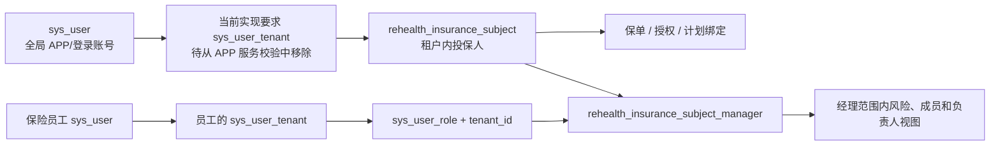

# 保险机构员工与 APP 用户跨机构服务匹配分析

> 文档状态：讨论稿（Living Document）  
> 当前版本：0.4
> 首次整理：2026-08-14  
> 适用范围：保险机构优先；医疗机构等其他机构暂不实现，但 APP 用户与机构服务关系按多机构、多类型基础设计
> 更新方式：后续产品、权限和数据口径讨论统一修改本文，不另建平行分析文档

## 1. 文档目的

本文分析以下问题：

1. 保险机构员工与使用 ReHealth APP 的用户应如何建立负责关系；
2. 如何区分平台级 APP 用户、机构后台员工关系和机构服务关系；
3. 同一个 APP 用户如何同时接受多家保险、医疗及其他机构的服务；
4. 保险员工可以看见哪些用户和哪些数据；
5. 当前代码已经支持什么、还缺少什么；
6. 后续测试数据、数据库迁移、API 和权限改造应如何落地。

本文中的“APP 用户”是 ReHealth 平台级用户，不归属于某一家机构。APP 用户可以接受零个、一个或
多个机构的服务，也可以是团体保险场景下使用 APP 的企业员工。除非特别说明，“机构员工”指
保险、医疗或其他服务机构的内部工作人员；“保险员工”专指保险机构内部工作人员。

## 2. 核心结论

### 2.1 平台身份、后台访问和服务登记必须分离

账号、机构后台关系、机构内角色和用户接受的服务必须拆开：

- `sys_user` 表示全局登录身份；同一个自然人只保留一个账号；
- `sys_user_tenant` 表示机构员工可以进入哪些机构后台，不用于表达 APP 用户接受服务；
- `sys_user_role.tenant_id` 表示机构员工在某个租户内拥有什么后台角色；
- 通用服务登记表示某个 APP 用户正在接受哪家机构的哪项服务；
- `rehealth_insurance_subject` 表示 APP 用户在某一家保险机构内的投保人业务身份；
- `rehealth_insurance_subject_manager` 表示某个保险员工负责哪些投保人。

同一个账号既是某机构员工又接受某机构服务时，只是同时存在“后台员工关系”和“APP 服务登记”，
不需要创建第三种账号类型，也不能根据其中一种关系自动推导另一种关系。

### 2.2 匹配必须发生在租户内

推荐的负责关系是：

```text
服务机构 provider_tenant_id
  + 机构服务 service_id
  + 负责人员 responsible_user_id
  + 负责人员在该机构的专业角色 role_code
  + 被负责 APP 用户 target_user_id
  = 一条用户负责关系
```

投保人不要求匿名，授权员工可以按业务需要看到姓名等可识别信息。数据库负责关系可以直接使用
稳定的 `target_user_id`，但不能只用手机号、姓名或部门名称匹配。所有查询仍必须包含服务机构和
服务范围；知道一个全局用户 ID 不等于有权读取该用户在其他机构的数据。

### 2.3 APP 用户与服务机构是多对多关系

同一个 APP 用户只需要一个 `sys_user`，但可以拥有多条相互独立的机构服务登记：

```text
用户 U100
├─ 9101 睿安保险：保险服务登记 -> 投保人记录 A -> 保单 A / 授权 A / 计划 A
├─ 9102 康泰人寿：保险服务登记 -> 投保人记录 B -> 保单 B / 授权 B / 计划 B
├─ 9201 某医疗机构：医疗服务登记（后续领域实现）
└─ 9103 华宁财险：机构员工后台关系 -> insurer_analyst
```

保险机构内的投保人记录、保单、授权和负责人关系仍相互隔离。停用其中一家机构的服务登记，
不得停用全局账号，也不得影响用户在其他保险、医疗机构的服务或任何机构员工身份。

## 3. 角色与主体定义

| 主体 | 定义 | 是否进入保险后台成员管理 | 是否使用 APP | 数据范围 |
| --- | --- | --- | --- | --- |
| 平台管理员 | ReHealth 平台运维人员 | 否 | 可选 | 平台治理范围，不自动获得保险业务数据 |
| 保险机构管理员 | 管理保险租户设置、员工与负责人分配 | 是 | 否 | 负责用户全部数据；拥有机构管理操作 |
| 保险部门经理 | 负责一组投保人或 APP 用户 | 是 | 否 | 负责用户全部数据；拥有部门业务操作 |
| 保险分析员 | 风险、研究和报表分析 | 是 | 否 | 负责用户全部数据；拥有分析操作 |
| 保险运营员 | 导入、计划运营和反馈处理 | 是 | 否 | 负责用户全部数据；拥有运营操作 |
| 保险查看员 | 只读查看 | 是 | 否 | 负责用户全部数据；只读 |
| 保险审计员 | 查看授权和操作证据 | 是 | 否 | 负责用户全部数据；审计只读 |
| APP 用户 | ReHealth 平台用户，可接受多家机构的多项服务 | 否 | 是 | 自己的数据和有效服务登记 |
| 同时具有员工关系的 APP 用户 | 全局账号既有机构后台员工关系，又有一个或多个机构服务登记 | 仅员工关系进入 | 是 | 后台权限与个人服务分别授权，不能合并推导 |

角色只描述机构员工在后台“能做什么”，不能表达 APP 用户接受了哪些机构服务。目标模型中，
仅使用 APP 服务的用户不应因为接受保险或医疗服务而获得 `sys_user_tenant`；当前保险移动接口
仍要求 APP 用户具备有效租户成员关系，这是需要迁移的现状限制。

### 3.1 APP 用户分类与机构后台角色

可以给 APP 用户增加角色，但必须与机构员工后台角色分开：

| 角色层级 | 示例 | 作用域 | 用途 |
| --- | --- | --- | --- |
| APP 基础角色 | `app_user` | 平台级，可使用 `tenant_id=0` 或等价平台范围 | 表示账号可以使用 APP |
| APP 服务分类角色 | `insurance_service_user`、未来 `medical_service_user` | 平台级，可多选 | 便于 APP 界面分类；只能由有效服务登记派生，不能代替服务授权 |
| 机构后台角色 | `insurance_department_manager`、`insurance_operator`、未来 `medical_doctor`、`medical_nurse` | 必须带机构 `tenant_id` | 机构员工登录 WEB 后台，决定可执行的后台操作 |

普通投保人、患者或其他服务接受者使用 APP，不进入机构后台。`insurance_service_user`、
`medical_service_user` 只表示用户正在接受哪类服务；同一个 APP 用户可以同时拥有多个服务分类角色。
机构员工使用 WEB 后台，在对应机构下拥有保险或医疗后台角色。

机构员工后台角色不开放 APP 专业工作台，客户端范围统一为：

```text
client_scope = WEB
```

服务分类角色不能作为机构员工查询依据。后台员工查询 APP 用户的范围必须是：

```text
机构后台角色允许的操作
  AND 当前人员与目标 APP 用户之间存在有效负责关系
  AND 目标用户正在接受当前机构的对应服务
```

命中上述条件后，当前业务口径允许该后台员工查询被负责 APP 用户的全部数据。不同后台角色之间
主要区分新增、修改、审核、导出等操作权限，不再区分被负责用户的字段可见范围。

示例：

```text
U100：app_user
      + insurance_service_user
      + medical_service_user（未来）
      -> 接受 9101 保险服务
      -> 接受 9201 医疗服务

E200：9101 / insurance_department_manager / WEB
      -> 后台查询 9101 分配给 E200 的 APP 用户全部数据

D300：9201 / medical_doctor / WEB（未来）
      -> 后台查询 9201 分配给 D300 的患者全部数据
```

## 4. 当前实现分析

### 4.1 已具备的基础

1. Jeecg 的 `sys_user` 已作为全局账号；
2. `sys_user_tenant` 支持同一机构员工账号关联多个租户；当前保险移动接口也复用了该表校验
   APP 用户，这会混淆后台成员和服务关系；
3. `sys_user_role` 已包含 `tenant_id`，可以让同一账号在不同租户拥有不同角色；
4. `rehealth_insurance_subject` 已使用 `(tenant_id, rehealth_user_id)` 唯一约束，允许
   同一个 APP 用户在多个保险租户中分别建立投保人身份；
5. 保单、授权、计划绑定和反馈均包含 `tenant_id` 与 `subject_ref`；
6. `rehealth_insurance_subject_manager` 已包含租户、负责人、部门和投保人技术引用；
7. 风险工作台对 `insurance_department_manager` 使用负责人表进行 SQL 层过滤；
8. APP 保险计划绑定会校验当前账号、租户成员关系、投保人映射、有效保单和授权；
9. 停用某租户成员关系时不会停用全局账号；但当前 APP 服务也会随该成员关系失效，说明安全
   复核已存在，服务关系与后台成员关系仍需拆分。

### 4.2 当前匹配链路



当前经理范围的核心判定是：登录用户在当前租户拥有
`insurance_department_manager` 角色时，将该用户 ID 作为 `managerUserId` 传入风险、部门、
成员和负责人查询；查询层再关联 `rehealth_insurance_subject_manager`。

### 4.3 当前缺口

| 编号 | 缺口 | 影响 | 优先级 |
| --- | --- | --- | --- |
| G-01 | APP 保险计划接口要求 APP 用户具有有效 `sys_user_tenant` | 把“接受服务”错误等同于“机构后台成员” | P0 |
| G-02 | 保险成员查询直接读取当前租户全部 `sys_user_tenant` | 当前兼容数据中的 APP 用户可能混入保险员工列表 | P0 |
| G-03 | 负责人写入只校验目标用户是有效租户成员且属于部门，未强制校验员工类型和可负责角色 | 可能把普通 APP 用户或无负责人资格的成员设为负责人 | P0 |
| G-04 | `sys_user_tenant` 当前没有 `(user_id, tenant_id)` 唯一约束 | 并发邀请或历史数据可能产生重复租户关系 | P0 |
| G-05 | 当前只有部门经理自动启用个人负责范围；分析员、运营员、查看员通常按租户范围读取 | 角色范围与实际业务责任可能不一致 | P1 |
| G-06 | APP 缺少跨保险、医疗等机构的“我的服务”统一列表和服务切换流程 | 多机构用户难以明确选择当前服务上下文 | P1 |
| G-07 | 负责人表缺少分配类型、有效期、分配人和变更原因 | 无法完整表达主负责人、协作人、转交和历史审计 | P1 |
| G-08 | 当前保险负责关系只面向 `subject_ref`，缺少可供保险、医疗等角色共用的 APP 用户负责关系 | 后续不同专业角色无法统一按 `target_user_id` 查询其负责用户 | P0 |
| G-09 | 尚无团体客户企业与其员工的独立业务维度 | 团体险场景只能识别投保人，不能按企业客户分组 | P2 |
| G-10 | `sys_tenant` 之外缺少统一的机构类型和服务目录 | 后续医疗等机构无法复用一致的 APP 服务发现与登记流程 | P1 |
| G-11 | 尚无由有效服务登记自动派生和回收 `insurance_service_user`、`medical_service_user` 等 APP 分类角色的机制 | 服务角色可能与用户实际接受的机构服务不一致 | P1 |

## 5. 推荐目标模型

### 5.1 全局身份保持不变

继续使用 `sys_user` 保存平台登录账号、密码、手机号和账号状态。机构不能为同一 APP 用户创建
独立的机构账号副本。机构停用员工后台关系或用户服务登记时，只能影响本机构对应关系。

`login_tenant_id` 只适合作为机构员工默认进入的后台租户，不能决定 APP 用户当前接受的服务。
每次请求都必须使用认证用户、目标机构、服务登记和领域授权重新校验。

### 5.2 分离机构员工关系与 APP 服务登记

机构员工继续使用 Jeecg 的 `sys_user_tenant + sys_user_role.tenant_id`。APP 用户跨机构服务新增
机构类型、服务目录和用户服务登记，不把 APP 用户加入每家服务机构的后台成员表：

```text
rehealth_institution_profile
----------------------------------
tenant_id
institution_type   INSURANCE / MEDICAL / OTHER
status

rehealth_institution_service
----------------------------------
id
provider_tenant_id
service_code
service_name
domain_type        INSURANCE / MEDICAL / OTHER
status

UNIQUE (provider_tenant_id, service_code)

rehealth_user_service_enrollment
----------------------------------
id
user_id
service_id
status             PENDING / ACTIVE / SUSPENDED / ENDED / REVOKED
source_system
enrolled_at
ended_at
created_by
created_at
updated_by
updated_at

UNIQUE (user_id, service_id)
INDEX  (user_id, status)
INDEX  (service_id, status)
```

设计含义：

- 一个 APP 用户可以在同一家机构登记多项服务，也可以在多家不同类型机构登记服务；
- 机构后台成员管理继续只读取 `sys_user_tenant` 和当前租户角色；
- APP“我的服务”通过登记表关联机构服务目录和机构类型；
- APP 用户接受服务本身不产生 `sys_user_tenant`；
- 如果同一账号也是机构员工，则额外存在独立 `sys_user_tenant` 和机构角色；
- 保险、医疗等领域接口在通用服务登记之上继续校验各自的业务身份、授权和资源归属。

### 5.3 保险服务关系继续使用保险领域表

保险场景不需要用通用表替换现有 `rehealth_insurance_subject`。通用服务登记负责回答“用户正在
接受哪家机构的哪项服务”，保险领域表继续回答“用户在该保险机构内对应什么投保人、保单和授权”。

```text
全局 APP 用户
  -> rehealth_user_service_enrollment（通用机构服务登记）
  -> rehealth_insurance_subject
  -> rehealth_insurance_policy
  -> rehealth_insurance_consent
  -> rehealth_insurance_plan_binding
  -> rehealth_insurance_intervention_feedback
```

其中个人健康档案、设备绑定和原始健康数据仍归全局 APP 用户所有，不复制到每家保险机构。
投保人不要求匿名；机构员工通过 WEB 后台命中角色和负责关系后，可以读取该被负责 APP 用户的
全部业务数据。该范围只覆盖被分配用户，不因此开放同机构未分配用户或其他机构的数据。

### 5.4 新增通用 APP 用户负责关系

为了让保险角色和后续医疗角色都能按当前登录人员查询其负责的 APP 用户，建议新增通用负责关系：

```text
rehealth_service_user_assignment
----------------------------------
id
provider_tenant_id
service_id
responsible_user_id
responsible_role_code
target_user_id
department_id
responsibility_type  PRIMARY / COLLABORATOR / REVIEWER / CARE_MEMBER
status               ACTIVE / SUSPENDED / ENDED
assigned_by
assigned_at
effective_from
effective_to
change_reason

UNIQUE (
  provider_tenant_id,
  service_id,
  responsible_user_id,
  target_user_id,
  responsibility_type
)
INDEX (provider_tenant_id, responsible_user_id, responsible_role_code, status)
INDEX (provider_tenant_id, target_user_id, status)
```

负责人写入必须同时验证：

1. 操作人属于当前租户并具备负责人维护权限；
2. 被分配员工在当前租户具有有效 `sys_user_tenant` 后台成员关系；
3. 被分配员工属于当前租户拥有的部门；
4. 被分配员工当前拥有 `responsible_role_code`，且该角色是当前机构有效 WEB 后台角色；
5. `target_user_id` 存在当前机构、当前 `service_id` 的有效服务登记；
6. 保险服务还要验证投保人、保单和授权，未来医疗服务验证患者和医疗授权；
7. 所有机构和服务 ID 一致；
8. 转交时保留旧记录历史，不直接物理删除。

员工查询负责用户时必须同时匹配当前认证账号、当前机构角色和有效负责关系：

```sql
WHERE assignment.provider_tenant_id = :currentTenantId
  AND assignment.responsible_user_id = :currentUserId
  AND assignment.responsible_role_code IN (:currentTenantRoleCodes)
  AND assignment.status = 'ACTIVE'
  AND enrollment.user_id = assignment.target_user_id
  AND enrollment.service_id = assignment.service_id
  AND enrollment.status = 'ACTIVE'
```

角色决定是否有“查询负责用户”的能力，负责关系决定具体能查询哪些用户，两者缺一不可。

现有 `rehealth_insurance_subject_manager` 可作为保险兼容表，通过
`rehealth_insurance_subject.rehealth_user_id` 映射到 `target_user_id`。实现通用负责关系后，可选择
迁移历史分配或在过渡期双写；它不再作为医疗等其他机构的通用模型。

通用唯一键允许同一 APP 用户关联多名专业人员，适合协作和医疗团队场景；如果某项服务规定只能
有一名主负责人，还需要增加“同一机构、服务和目标用户只能有一个有效 `PRIMARY`”约束或事务锁定校验。

## 6. 匹配流程

### 6.1 APP 用户加入保险服务

```text
用户注册或登录 APP
  -> 选择保险机构或输入保单/邀请信息
  -> 后端确认保险租户有效
  -> 确认保单或外部客户记录确实属于当前用户
  -> 创建/激活通用机构服务登记
  -> 创建租户内 rehealth_insurance_subject
  -> 用户阅读并提交该机构的授权版本
  -> 绑定有效保单和服务计划
  -> APP“我的服务”出现该保险机构
```

不能仅凭用户手工输入保单号完成绑定。至少还需要短信认证、保险方预留身份校验、机构邀请、
企业员工名册匹配或其他可信证明之一。具体采用哪种方式是后续产品决策。

### 6.2 保险管理员分配负责人

```text
机构管理员进入当前保险租户
  -> 只查询当前租户后台员工
  -> 选择具备有效保险后台角色的员工和本租户部门
  -> 只查询正在接受本机构保险服务的 APP 用户
  -> 使用 target_user_id 创建 PRIMARY 或协作关系
  -> 写入分配操作审计
```

负责人分配不改变 APP 用户的全局账号、部门或员工角色。仅接受服务的 APP 用户不应加入
保险公司的 `sys_user_tenant` 或 `sys_user_depart`；其业务归属通过通用服务登记、保险投保人、
客户企业和负责人关系表达。

### 6.3 员工查询负责用户

推荐统一采用以下授权判定：

```text
账号有效
AND 当前保险租户有效
AND 当前员工的 sys_user_tenant 有效
AND 当前租户后台角色拥有负责用户查询权限
AND 存在 responsible_user_id = 当前员工的有效负责关系
AND 负责关系的 responsible_role_code 仍是当前员工有效角色
AND 目标 APP 用户仍在接受负责关系指定的机构服务
AND 数据记录 tenant_id = 当前租户
```

上述条件命中后返回被负责用户的全部业务数据；角色差异只影响后台操作能力，不裁剪用户字段。

该判定必须在 JeecgBoot 查询层执行，不能只依赖官网隐藏菜单、浏览器传入的租户头或前端过滤。

### 6.4 用户同时使用多家机构

APP 登录后应提供“我的服务”，而不是把 `login_tenant_id` 当成唯一机构：

```text
我的服务
├─ 睿安保险 / 心血管健康管理 / ACTIVE
├─ 康泰人寿 / 慢病干预计划 / ACTIVE
├─ 华宁财险 / 健康权益 / EXPIRED
└─ 某医疗机构 / 随访服务 / FUTURE（医疗领域暂未实现）
```

切换服务后，APP 向后端提交目标服务登记标识；服务端必须用当前登录用户重新校验登记、服务目录、
服务机构、状态和领域身份。保险服务继续校验投保人、保单和授权；未来医疗服务校验
医疗领域患者关系和医疗授权。不能把客户端传入的租户头当作服务归属依据。

## 7. 员工角色与建议数据范围

下表中的“目标范围”是建议方案，尚未全部实现：

| 角色 | 当前主要范围 | 客户端 | 被负责用户数据范围 | 主要操作差异 |
| --- | --- | --- | --- | --- |
| `insurance_org_admin` | 当前租户机构设置与成员维护，风险查询通常是租户范围 | WEB | 分配给自己的用户全部数据 | 管理机构、员工、角色和负责人关系 |
| `insurance_department_manager` | 已按 `rehealth_insurance_subject_manager` 限制到负责对象 | WEB | 分配给自己的用户全部数据 | 部门管理、随访和任务处理 |
| `insurer_analyst` | 有接口权限时通常是租户范围 | WEB | 分配给自己的用户全部数据 | 分析、研究和报告操作 |
| `insurance_operator` | 导入和运营类租户权限 | WEB | 分配给自己的用户全部数据 | 导入、运营和计划执行 |
| `insurer_viewer` | 租户只读 | WEB | 分配给自己的用户全部数据 | 只读，不允许业务修改 |
| `insurer_auditor` | 租户审计只读 | WEB | 分配给自己的用户全部数据 | 审计和证据查看，不允许业务修改 |
| `medical_doctor`（未来） | 尚未实现 | WEB | 分配给自己的患者全部数据 | 医疗业务操作，后续定义 |
| `medical_nurse`（未来） | 尚未实现 | WEB | 分配给自己的患者全部数据 | 随访和护理操作，后续定义 |

保险、医疗角色使用不同命名空间和权限模板，但共用“后台角色能力 + 机构服务 + 负责关系”的查询
框架。每个角色对其负责用户拥有相同的全部数据读取范围，角色差异只体现在后台操作权限；仅靠角色
名称仍不能自动开放本机构全部用户。

## 8. 团体保险与企业员工场景

如果“使用 APP 的员工”指购买团体保险的企业员工，需要再区分保险机构和客户企业：

```text
保险租户
  -> 客户企业
      -> 团体保单
          -> 企业员工 / APP 用户
              -> 保险投保人记录 / app_user_id
                  -> 保险负责人
```

建议后续增加：

```text
rehealth_insurance_client_org
- id
- tenant_id
- client_org_code
- client_org_name
- status

rehealth_insurance_client_member
- id
- tenant_id
- client_org_id
- app_user_id
- employee_no
- status
```

客户企业默认不需要创建成 Jeecg 租户。只有当客户企业需要自己的管理员、独立后台和权限边界时，
才考虑将其建成独立租户或子组织。保险公司内部部门与客户企业不能共用 `sys_depart` 表达。

## 9. 数据可见性与隐私边界

### 9.1 保险员工可以使用的数据

- 当前机构分配给自己的 APP 用户真实姓名、手机号、证件和基础资料；
- 健康档案、健康问答、设备、测量、睡眠、活动及其他已入库用户数据；
- 风险结果、趋势、干预计划和执行反馈；
- 本机构保单、授权、计划、理赔和服务状态；
- 该用户相关的负责人分配与业务操作记录。

当前业务规则不按保险后台角色裁剪上述字段。机构管理员、部门经理、分析员、运营员、查看员和
审计员只要拥有有效后台角色且命中负责关系，都可读取其负责 APP 用户的全部数据；角色差异只控制
是否可以新增、修改、审批、导入、导出或执行其他后台操作。

### 9.2 默认不得暴露的数据

- APP 用户在其他保险或医疗机构的服务、保单、就诊、授权或负责人；
- 当前员工未被分配负责的 APP 用户数据；
- 其他机构的员工角色、部门和服务使用情况；
- 用户密码、验证码、访问令牌、密钥和平台安全配置；
- 不属于用户业务数据的内部平台运维信息。

### 9.3 可识别投保人与技术关联键

产品已确认投保人不需要匿名。目标负责关系直接使用平台 `target_user_id`，保险员工接口可在权限允许时
关联 `sys_user` 和投保人资料返回真实身份字段。

现有保险表大量使用 `subject_ref`，可以继续保留为内部业务关联键和兼容字段，但不再把它描述为
隐私匿名边界，也不需要升级为 HMAC。新增通用负责关系不依赖 `subject_ref`；过渡查询通过
`rehealth_insurance_subject.rehealth_user_id` 与 `target_user_id` 关联。即使返回全部用户业务数据，
跨机构隔离、角色校验、负责关系和访问审计仍必须保留。

## 10. 推荐 API 边界

### 10.1 APP

| 方法 | 建议路径 | 用途 |
| --- | --- | --- |
| `GET` | `/rehealth/mobile/services` | 返回当前用户跨保险、医疗等机构的可用服务，不返回员工后台租户菜单 |
| `POST` | `/rehealth/mobile/service-enrollments/{enrollmentId}/activate` | 选择当前服务登记并由后端复核用户、机构和服务目录 |
| `POST` | `/rehealth/mobile/insurance/enrollments` | 使用可信证明申请加入保险服务 |
| `GET` | `/rehealth/mobile/insurance/plans/current` | 按当前用户和明确租户读取保险计划；现有接口保留 |
| `POST` | `/rehealth/mobile/insurance/consents/{id}/revoke` | 用户撤回指定机构、指定用途授权 |

### 10.2 保险后台

| 方法 | 建议路径 | 用途 |
| --- | --- | --- |
| `GET` | `/rehealth/insurance/v1/settings/staff` | 只返回当前租户后台员工 |
| `GET` | `/rehealth/insurance/v1/assigned-users` | 按当前后台角色和负责关系返回本人负责的 APP 用户 |
| `GET` | `/rehealth/insurance/v1/assigned-users/{appUserId}` | 校验后台角色和负责关系后返回该用户全部业务数据 |
| `PUT` | `/rehealth/insurance/v1/settings/assignments/{appUserId}` | 建立或变更保险员工与 APP 用户的负责关系 |
| `GET` | `/rehealth/insurance/v1/settings/assignments/history` | 查看分配历史和转交审计 |

现有 `/settings/members` 是否保留为员工接口，还是拆分为 `/settings/staff`，需要兼容官网调用后决定。
现有以 `{subjectRef}` 为参数的负责人接口在迁移期可保留，并在服务端解析为 `target_user_id`；新通用
负责关系和机构 WEB 后台使用 `appUserId`，不再要求调用方理解保险领域技术引用。未来医疗机构使用
独立的医疗后台路径，但可以复用相同的负责关系查询服务。

## 11. 测试数据设计

建议在现有 9101、9102、9103 三个保险租户基础上增加独立、幂等的 APP 用户服务种子：

| 场景 | 数据 |
| --- | --- |
| 基本负责范围 | 每个保险机构登记 12 名 APP 用户，两名具有保险后台角色的部门经理各负责 6 人 |
| 全部数据 | 每个后台角色均可读取其负责用户的全部合成业务数据，不以角色裁剪字段 |
| 多保险服务 | 1 个全局 APP 账号同时登记 9101 和 9102 的保险服务，形成两套独立保险业务记录 |
| 跨类型机构 | 为同一账号预留保险服务与未来医疗服务并存的通用登记用例，当前不生成医疗业务数据 |
| 员工与 APP 并存 | 1 个账号在 9101 有后台员工关系，同时在 9102 有 APP 保险服务登记 |
| 角色与负责范围 | 有保险角色但无分配时返回空列表；有分配但角色被移除后拒绝访问 |
| 转交 | 1 名投保人从经理 A 转交经理 B，旧分配保留为历史 |
| 协作 | 1 名投保人同时有主负责人和审阅人 |
| 授权异常 | 待授权、已撤回授权各 1 人 |
| 业务异常 | 过期保单、停用租户关系各 1 人 |
| 越权 | 9101 员工尝试读取 9102 用户，或篡改 `appUserId` 读取未负责用户，必须返回 `403` 或空结果 |

所有测试数据必须明确标记为合成、非临床、仅限本地，不能用于医疗、核保、理赔或结算决策。

## 12. 分阶段实施建议

### 阶段 A：先分离后台成员和 APP 服务

1. 新增通用机构类型、机构服务目录和 `rehealth_user_service_enrollment`；
2. 清理并为 `sys_user_tenant(user_id, tenant_id)` 增加唯一约束；
3. 将 `sys_user_tenant` 的保险业务用途收敛为机构员工后台关系；
4. 根据现有 `rehealth_insurance_subject` 回填保险服务登记；
5. 先调整 APP 保险接口改查服务登记，再清理仅为 APP 服务兼容而建立的租户成员关系；
6. 成员管理只返回当前租户后台员工；
7. 为 APP 账号配置基础和服务分类角色，机构员工角色统一限定为 WEB 后台。

### 阶段 B：补齐多机构 APP 服务

1. 增加“我的服务”查询；
2. 明确服务切换和租户上下文；
3. 增加加入、撤回授权和退出服务流程；
4. 新增 `rehealth_service_user_assignment` 和角色加负责关系查询；
5. 将现有保险负责人映射迁移或兼容映射到 `target_user_id`；
6. 增加机构 WEB 后台的本人负责用户列表与全部数据详情接口；
7. 验证同一账号多机构的保单、授权、计划、反馈和负责关系完全隔离。

### 阶段 C：完善责任范围和审计

1. 增加主负责人、协作者、审阅人和未来医疗团队成员类型；
2. 增加生效期、转交原因和操作审计；
3. 决定分析员和运营员是租户范围、部门范围还是分配范围；
4. 如确认团体险需求，再增加客户企业及企业员工关系。

医疗机构角色、患者业务关系和医疗数据授权不在当前阶段实现，但通用服务登记和负责关系必须允许
`institution_type=MEDICAL` 及医疗专业角色。后续医疗领域在该基础上增加患者和医疗授权，不复用
保险投保人表；医生与患者的基本负责范围可以复用通用 `target_user_id` 分配框架。

## 13. 验收标准

1. 保险后台成员管理不会展示仅通过 APP 接受服务的用户；
2. 同一机构员工账号可在不同租户拥有不同保险或医疗后台角色；
3. 同一 APP 用户可同时接受多家保险、医疗及其他机构的服务；
4. 每个保险后台角色都可以读取其负责 APP 用户的全部业务数据；
5. 停用一条机构关系不影响其他机构和全局账号；
6. 专业角色只有同时命中有效负责关系时才能读取目标 APP 用户；
7. 有角色但无分配返回空范围，有分配但角色失效必须拒绝访问；
8. 负责人只能从当前租户有效员工及对应机构后台角色中选择；
9. 所有保单、授权、计划、反馈和负责人查询均包含机构与服务范围；
10. 浏览器或 APP 伪造机构、服务、用户 ID 或绑定 ID 均不能跨机构或越过负责范围读取；
11. 分配转交、授权撤回和关系停用均保留审计证据。

## 14. 已确认原则

| 编号 | 已确认原则 | 日期 |
| --- | --- | --- |
| D-001 | APP 用户是 ReHealth 平台级身份，不归属于某一家机构 | 2026-08-14 |
| D-002 | 同一个 APP 用户可以同时接受多家保险、医疗及其他类型机构的服务 | 2026-08-14 |
| D-003 | 机构员工后台关系与 APP 用户机构服务登记是两条独立关系，可以在同一账号上并存 | 2026-08-14 |
| D-004 | 当前优先实现保险服务；医疗领域暂不实现，但通用服务登记必须保留医疗等机构类型扩展能力 | 2026-08-14 |
| D-005 | 投保人不要求匿名；授权员工可以在职责和用途范围内查看真实身份信息 | 2026-08-14 |
| D-006 | 机构员工只使用 WEB 后台；保险、医疗等机构专业角色不开放 APP 专业工作台 | 2026-08-14 |
| D-007 | 查询负责的 APP 用户必须同时满足专业角色权限和有效负责关系，不能只根据角色返回机构全量用户 | 2026-08-14 |
| D-008 | 每个机构后台角色均可读取其负责 APP 用户的全部业务数据，角色之间只区分后台操作权限 | 2026-08-14 |

## 15. 待讨论问题

以下问题尚未定稿，后续沟通结果直接更新本文：

1. 一个投保人是否必须只有一名主负责人？是否允许协作者和审阅人？
2. APP 用户通过保单号、保险机构邀请、企业员工名册还是多种方式加入服务？
3. 用户撤回授权后，保险机构允许保留哪些法定审计和历史业务数据？
4. “使用 APP 的员工”是否明确指团体客户企业员工？客户企业是否需要独立后台？
5. 同一个 APP 用户是否可以在同一家保险机构同时参加多个服务计划？
6. 机构员工本人同时通过 APP 接受本机构或其他机构服务时，如何处理利益冲突和自查数据？
7. 现有 `subject_ref` 作为保险技术兼容键长期保留，还是在接口和负责人迁移完成后逐步退出？
8. 负责人离职时采用自动转交、待分配队列，还是由管理员手工处理？
9. 机构类型和服务目录由平台统一维护，还是允许每家机构在批准范围内配置自己的服务？

## 16. 讨论与修订记录

| 日期 | 版本 | 内容 | 状态 |
| --- | --- | --- | --- |
| 2026-08-14 | 0.1 | 基于现有 Jeecg 多租户、保险投保人、APP 计划绑定和负责人查询整理首版分析 | 待讨论 |
| 2026-08-14 | 0.2 | 明确 APP 用户是平台级身份；将机构员工后台关系与跨保险、医疗等机构的服务登记彻底分离 | 核心原则已确认，细节待讨论 |
| 2026-08-14 | 0.3 | 确认投保人无需匿名；增加 APP 基础角色、机构专业角色和基于角色加负责关系的通用查询模型 | 核心原则已确认，字段与角色细节待讨论 |
| 2026-08-14 | 0.4 | 确认机构员工只使用 WEB 后台；所有后台角色可读取其负责 APP 用户全部数据，角色仅区分操作权限 | 核心原则已确认，分配流程细节待讨论 |
