目前 RDI 的完整链路已经接通：Android 本地计算 → Room 持久化 → 离线队列上传 → JeecgBoot/MySQL → 多租户权限过滤 → 官网 BFF → 保险干预工作台。

需要特别明确：当前“每日 RDI”不经过 model-service，它是 Android 本地规则计算；model-service 负责的是 CVD 风险评分等另一条链路。

```mermaid
flowchart LR
    A["手环/体重/血压/饮食数据"] --> B["Android Room 本地数据库"]
    B --> C["RdiEngine 本地计算"]
    C --> D["RDI 日快照与贡献因素"]
    D --> E["Room 离线上传队列"]
    E --> F["JeecgBoot RDI 接口"]
    F --> G["MySQL RDI 快照表"]
    G --> H["保险工作台聚合服务"]
    H --> I["租户、授权、责任范围过滤"]
    I --> J["官网 BFF"]
    J --> K["人群干预队列与详情"]
```



## 1. 数据从哪里来

Android 首先把采集结果写进 Room，然后 RDI 再读取最近约 28 天的数据，包括：

- 活动：步数、运动分钟数。
- 睡眠：睡眠时长、效率、规律性。
- 恢复：夜间 HRV、静息或平均心率趋势。
- 血压：只采用确认过的上臂式血压数据，不直接采用未验证的手环血压。
- 体重：需要明确减重或增重方向。
- 饮食：使用本地饮食记录进行保守估算。
- 化验、餐食确认数据：目前只有模型和 DAO 骨架，生产写入链路尚未完整接通。

原始健康数据仍按照遥测链路上传到 Device Service/TimescaleDB，不会包含在 RDI 上传报文里。

## 2. Android 如何计算 RDI

核心实现在 [RdiEngine.kt](/E:/code/rehealth_tonbu/Android-apk/app/src/main/java/com/rehealth/genie/rdi/RdiEngine.kt:98)，当前算法版本为 `rdi-rule-1.0.1`。

基础公式是：

```text
原始 RDI = 50 + 活动贡献 + 睡眠贡献 + 恢复贡献
              + 血压/体重贡献 + 化验贡献 + 饮食贡献
最终限制在 0～100
```

各领域贡献有上限，避免单一指标完全控制结果。每个贡献还会乘以数据置信度：

```text
最终贡献分 = 原始贡献分 × 数据置信度
```

显示分数还包含：

- 低置信度时向中性值 50 收缩。
- 正常情况下采用 `30% 新结果 + 70% 上次结果` 平滑。
- 普通情况下每日显示变化最多约 ±3。
- 数据严重不足时可继续展示上次结果，但状态会标明数据不足。

状态包括：

- `BASELINE_BUILDING`：基线建立中。
- `PRELIMINARY`：初步结果。
- `CONFIRMED`：数据相对充分。
- `STALE`：数据过期。
- `NO_DATA`：没有数据。
- `DEBUG_MOCK`：演练数据。

RDI 更准确的含义是“近期可改善负荷指数”，不是疾病诊断概率，也不是 PIAS 因果归因结论。

## 3. 什么情况下触发计算

[RdiRepository.kt](/E:/code/rehealth_tonbu/Android-apk/app/src/main/java/com/rehealth/genie/rdi/RdiRepository.kt:71) 会读取 Room 数据并调用计算引擎。

目前主要触发点是：

- 用户进入 Android 归因/RDI 页面。
- 切换 7 天、30 天、90 天周期。
- 设备同步时间发生变化。
- 干预计划发生变化。
- 用户主动点击重试。

当前存在一个缺口：上传已经有后台 WorkManager，但 RDI 计算本身还不是完全独立的“每日后台定时任务”，仍然偏页面触发。

## 4. 本地保存和离线上传

计算后先保存，不依赖网络：

```text
Room:
rdi_daily_snapshot
rdi_contribution
rdi_baseline
```

随后创建稳定的队列任务：

```text
任务类型：rdi_daily_snapshot
任务ID：rdi:<userId>:<scoredOn>
```

上传接口是：

```http
POST /jeecg-boot/rehealth/mobile/rdi/daily-snapshot
```

上传内容包括：

- 日期。
- 原始分数和显示分数。
- 数据置信度。
- RDI 状态。
- 是否 Mock。
- 算法版本。
- 结构化贡献因素。

不会上传：

- 原始手环数据。
- 手机号码等无关个人信息。
- Android 已经生成的自然语言解释文本。

网络失败时队列按指数退避重试，最长间隔约 30 分钟。没有登录用户时只保留本地结果，不上传到云端。

## 5. JeecgBoot 如何接收

后端入口会从当前登录 Token 取得用户 ID，不相信客户端任意传入的 `userId`。

[RdiDailySnapshotService.java](/E:/code/rehealth_tonbu/backend/jeecg-boot/jeecg-module-demo/src/main/java/org/jeecg/modules/rehealth/service/RdiDailySnapshotService.java:35) 主要执行：

1. 检查报文用户与登录用户是否一致。
2. 校验分数、置信度、状态和贡献项。
3. 按 `(user_id, scored_on)` 幂等新增或更新。
4. 删除并重新写入当天贡献项。
5. 事务成功后返回 `ACCEPTED_PERSISTED`。

数据库主要包含：

```text
rehealth_rdi_daily_snapshot
rehealth_rdi_contribution
```

因此同一个用户同一天重复上传不会产生多条快照。

## 6. 保险机构如何查询

保险后台不是直接根据 `user_id` 查询所有 RDI，而是先经过业务关系过滤：

```text
当前租户
  + 投保人属于该保险机构
  + 服务关系有效
  + 用户已授权
  + 当前员工在责任范围内
```

随后才从 RDI 快照表获取：

- 最新 RDI 分数。
- 置信度和状态。
- 是否 Mock。
- RDI 趋势。
- 最新贡献因素。

对应实现位于 [InsuranceInterventionWorkbenchService.java](/E:/code/rehealth_tonbu/backend/jeecg-boot/jeecg-module-demo/src/main/java/org/jeecg/modules/rehealth/service/InsuranceInterventionWorkbenchService.java:293)。

一个 APP 用户可以同时接受多家保险公司或医疗机构的服务：

- RDI 属于 APP 用户自身的健康结果。
- 每家机构只能通过自己的有效服务关系、授权和责任范围查看。
- 各机构自己的干预计划、负责人、执行记录和反馈仍然相互隔离。

## 7. 官网如何展示

官网后端使用服务端保存的 Jeecg Token 和租户 ID 调用保险接口，浏览器不能自己指定租户。

BFF 对返回字段进行白名单转换，见 [insurer_intervention_normalization.py](/E:/code/RehealthCore_website/backend/api/insurer_intervention_normalization.py:72)。

前端把以下内容分别展示：

- CVD 风险评分。
- RHI 健康指数。
- RDI 可改善负荷指数。
- RDI 趋势。
- RDI 贡献因素。

页面不会用 CVD `risk_score` 临时推导 RDI。Mock 数据也会明确显示“RDI 演练数据”，见 [insurer_psm.html](/E:/code/RehealthCore_website/insurer_psm.html:323)。

## 当前真实接入状态

我通过现有接口核验了 9102 测试租户：

- 12 位服务对象全部能查询到 RDI。
- 每人有 7 个趋势点。
- 贡献因素包含步数、睡眠时长、HRV。
- 但这些数据全部是 `DEBUG_MOCK`。
- 数据来源为 `LOCAL_MULTI_INSURER_APP_QA`。

所以目前结论是：

- 端到端展示和多租户权限链路已经接通。
- Android 本地 RDI 规则已经实现。
- 当前保险工作台中的测试结果还不能作为真实设备 RDI。
- 下一步应补充每日后台计算任务，并使用真实登录 APP 用户、真实设备数据完成一次上传和保险后台查询验收。
- 项目中部分“RDI-16/CVD-16”文案容易混淆，建议统一命名为“CVD-16 风险概率”“RDI 可改善负荷指数”“Factor16 风险解释项”。

本次仅完成现有实现和实时接口分析，没有修改代码，因此没有执行构建或产生提交。