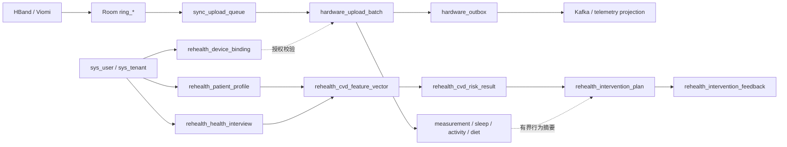
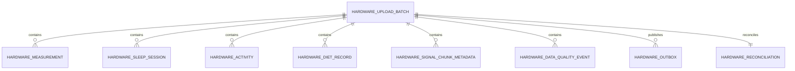
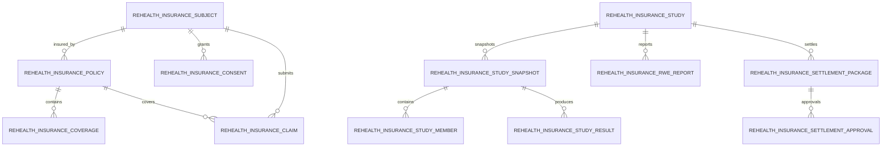

# 数据库表结构说明文档

> 最后生成：2026-08-19。
> 结构基线来自当前运行中的本地开发数据库 catalog、Room v16 导出 schema、SQL 迁移和业务代码。
> 本文档不包含账号、密码、业务数据明细、原始健康值或直接身份信息。

## 1. 文档说明

本文档是 ReHealth 数据库结构的交付与维护入口。逐表字段和索引明细拆分为三个附录：

- [Android Room v16 逐表结构](database/ROOM_SCHEMA_V16.md)
- [MySQL software_db 逐表结构](database/SOFTWARE_DB_TABLES.md)
- [TimescaleDB hardware_db 逐表结构](database/HARDWARE_DB_TABLES.md)

事实优先级为：运行数据库 catalog → Room 导出 schema / CREATE TABLE / 迁移 SQL → 数据库 COMMENT → Entity/DAO/Repository/Mapper → 业务代码。无法确认的含义统一标记为“待确认”。行数只用于说明当前本地开发实例量级，不代表生产容量。

## 2. 数据库整体介绍

ReHealth 不是单库系统，而是三个相互隔离的关系型存储域：

| 数据域 | 实际名称 | 类型与版本 | 基础表 | 视图 | 权威职责 |
| --- | --- | --- | ---: | ---: | --- |
| Android 本地库 | `rehealth-local.db` | SQLite / Room schema v16 | 22 | 0 | 本地遥测、离线队列、聊天、RHI/RDI、饮食 |
| 软件业务库 | `rehealth_software`（逻辑名 `software_db`） | MySQL 8.4.6 | 193 | 0 | Jeecg 用户权限及 ReHealth 业务权威数据 |
| 硬件时序库 | `rehealth_hardware`（逻辑名 `hardware_db`） | PostgreSQL 17.5 + TimescaleDB 2.21.1 | 11 | 0 个业务普通视图 | 规范化硬件时序数据、Outbox 和对账 |

总计 **226 张基础表**。其中 ReHealth 专属业务域表 **85 张**：Room 22 张、MySQL ReHealth 业务表 53 张、TimescaleDB 业务表 10 张。Kafka 是事件传递系统、Redis 是短期状态存储，均不计入关系表总数。

明确可识别的特殊表类别：

| 类别 | 数量 | 口径 |
| --- | ---: | --- |
| 核心/ReHealth 专属业务域表 | 85 | 含本地队列、质量、审计和保险域；排除迁移元数据 |
| 字典表 | 4 | `sys_dict`、`sys_dict_item`、`jimu_dict`、`jimu_dict_item` |
| 明确日志/审计表 | 8 | 本地归因、模型请求、保险审计、系统/数据/OpenAPI/报表导出日志、硬件质量事件 |
| 明确中间/关系表 | 17 | 用户角色权限、租户/部门关系、访谈明细、RHI/RDI 明细、研究成员等 |
| 迁移元数据表 | 3 | Room 使用 schema JSON；MySQL 2 张、TimescaleDB 1 张迁移表 |
| 历史/备份/年/月分表 | 0 | 未发现 `*_history` 之外的物理历史/备份或按年月命名分表；`cvd_risk_history` 是业务历史表，不是备份表 |

MySQL `flyway_schema_history` 当前存在 `3.9.2.0 all upgrade` 失败记录；ReHealth 自定义迁移已到 `software-V20260812.3`。

## 3. 数据库表清单与模块划分

| 存储域/模块 | 表数 | 主要作用 |
| --- | ---: | --- |
| AirAG / AI 平台 | 9 | AI 应用、知识库、模型、流程和提示词 |
| Android CVD 风险 | 1 | 已确认风险日历史 |
| Android RDI | 5 | 本地 RDI 快照、贡献和证据 |
| Android RHI | 5 | 本地 RHI 日指数、领域、特征、质量和手工输入 |
| Android 健康问答 | 2 | 按用户隔离的本地会话和消息 |
| Android 可穿戴数据 | 4 | 本地优先保存设备测量、睡眠、活动和信号 |
| Android 早期骨架 | 2 | 已注册但未完整接线的早期结构 |
| Android 离线同步 | 2 | 持久化上传与反馈重试 |
| Android 饮食 | 1 | 本地餐食及上传关联 |
| Jeecg Online | 26 | 在线表单/报表和拖拽页面元数据 |
| Jeecg 字典 | 2 | 系统字典及字典项 |
| Jeecg 日志 | 2 | 系统操作和数据变更日志 |
| Jeecg 用户权限 | 23 | 账号、角色、权限、租户、部门和关系 |
| Jeecg 系统 | 17 | 公告、配置、消息、文件和系统能力 |
| Jimu 报表 | 16 | 积木报表配置、分享和导出 |
| OpenAPI | 4 | 开放接口、授权、权限和调用日志 |
| ReHealth 保险业务 | 21 | 保险主体、保单、理赔、RWE、结算与审计 |
| ReHealth 审计日志 | 1 | 模型请求最小审计元数据 |
| ReHealth 核心业务 | 29 | 档案、访谈、绑定、风险、干预、问答和行为 |
| ReHealth 运营投影 | 2 | Kafka 生命周期和质量运营投影 |
| 上游订单示例 | 3 | Jeecg 示例订单结构 |
| 旧 MySQL 硬件兼容 | 6 | 权威切换前的硬件表，仅迁移兼容 |
| 演示/测试 | 18 | 上游示例和测试数据表 |
| 硬件上传批次 | 1 | 遥测批次和幂等收据 |
| 硬件信号与质量 | 2 | 信号元数据和质量事件 |
| 硬件可靠性 | 2 | Outbox 和批次对账 |
| 硬件时序事实 | 4 | TimescaleDB 规范化测量、睡眠、活动和饮食 |
| 硬件迁移对账 | 1 | 旧库迁移检查点 |
| 调度 | 12 | Quartz 调度元数据 |
| 迁移元数据 | 3 | Flyway/ReHealth 迁移历史 |

完整 211 表清单及逐字段说明见三个逐表附录。MySQL 中还保留 6 张旧 `hardware_*` 兼容表；当前硬件遥测权威写入已经属于 Device Service/TimescaleDB，旧表只能作为迁移来源或兼容遗留，不能形成双写权威。

## 4. 核心业务表

| 核心聚合 | 主表/表组 | 业务作用 |
| --- | --- | --- |
| 用户与租户 | `sys_user`、`sys_tenant`、`sys_role`、`sys_permission` | 提供认证账号、租户和后台授权基础 |
| 健康档案 | `rehealth_patient_profile` 及 diagnosis/medication/allergy | 权威类型化个人健康档案和病史明细 |
| 健康访谈 | `rehealth_health_interview` 及 answer/baseline/focus | 保存结构化访谈和风险评估上下文 |
| 设备绑定 | `rehealth_device_binding` | 连接认证用户、产品和稳定设备身份 |
| 本地采集 | Room `ring_*` | BLE/厂商数据先本地落库，与网络解耦 |
| 离线同步 | `sync_upload_queue` | 支持幂等、401 暂停、退避和死信 |
| 硬件接入 | `hardware_upload_batch` 及遥测事实表 | 以批次事务写入 TimescaleDB 并返回 durable write 语义 |
| 可靠事件 | `hardware_outbox`、`hardware_reconciliation` | 可靠发布 Kafka 生命周期事件并处理对账 |
| CVD 风险 | `rehealth_cvd_feature_vector`、`rehealth_cvd_risk_result` | 保存版本化 CVD-16 输入、模型输出和解释证据 |
| 个人干预闭环 | `rehealth_intervention_plan`、contraindication、feedback | 保存模型/个人计划、安全限制和用户反馈 |
| 机构计划版本 | `rehealth_care_plan`、revision、item、occurrence、audit | 保存机构计划草稿、不可变发布版本、稳定项目身份、到期任务实例及操作审计 |
| 健康问答 | `rehealth_ai_conversation`、`rehealth_ai_message` | 服务端权威完整聊天历史；Room 保存本地副本 |
| RHI/RDI | Room `rhi_*`、`rdi_*`；MySQL `rehealth_rhi_manual_health_input` | 保存本地透明评分、证据及手工健康输入云端副本 |
| 饮食/行为 | Room `diet_records`、Timescale `hardware_diet_record`、MySQL `rehealth_behavior_record` | 连接手工/拍照行为、本地队列、硬件域事实和结构化业务记录 |
| 保险/RWE | `rehealth_insurance_*` 14 表 | 支持去标识主体、保单、理赔、研究、RWE、结算和审计；当前本地实例均为空表 |

## 5. 主要表关系

### 5.1 物理外键

MySQL ReHealth 业务域已确认 11 组物理关系：档案到诊断/用药/过敏，访谈到回答/基线/关注项，特征向量到风险结果，干预计划到禁忌/反馈，AI 会话到消息，遥测投影到质量工单。

TimescaleDB 已确认 8 组物理外键，均由 `hardware_upload_batch.id` 指向测量、睡眠、活动、饮食、信号元数据、质量事件、Outbox 和对账。`hardware_reconciliation.upload_batch_id` 另有唯一约束，因此批次与对账为一对一；其余主要为一对多。

Room v16 没有声明 SQLite FOREIGN KEY，关系由复合主键、唯一索引、DAO `@Transaction` 和 Repository 写入顺序维护。

### 5.2 逻辑外键

- MySQL `rehealth_*.user_id` → `sys_user.id`，用户来自认证上下文。
- MySQL/Timescale `tenant_id` → `sys_tenant.id`，跨库只做逻辑关联，不做跨库事务。
- Room `owner_user_id/user_id` → 当前认证用户；`device_id` → 服务端设备绑定。
- Room RHI/RDI 子表通过 `index_id/snapshot_id` 逻辑关联日快照主表。
- 保险 14 表使用 `tenant_id + subject_ref/policy_id/study_id/snapshot_id/package_id` 维护逻辑关系，当前没有数据库 FOREIGN KEY。
- 机构计划通过 `plan_id + revision_id + plan_item_id` 绑定版本和任务实例；`logical_item_id` 只用于跨版本追踪同一业务项目，不能替代版本内项目主键。

## 6. ER 关系图

### 6.1 端到端核心关系



### 6.2 MySQL 健康业务 ER

```mermaid
erDiagram
    REHEALTH_PATIENT_PROFILE ||--o{ REHEALTH_PATIENT_DIAGNOSIS : contains
    REHEALTH_PATIENT_PROFILE ||--o{ REHEALTH_PATIENT_MEDICATION : contains
    REHEALTH_PATIENT_PROFILE ||--o{ REHEALTH_PATIENT_ALLERGY : contains
    REHEALTH_HEALTH_INTERVIEW ||--o{ REHEALTH_HEALTH_INTERVIEW_ANSWER : answers
    REHEALTH_HEALTH_INTERVIEW ||--o{ REHEALTH_HEALTH_INTERVIEW_BASELINE : baselines
    REHEALTH_HEALTH_INTERVIEW ||--o{ REHEALTH_HEALTH_INTERVIEW_FOCUS : focuses
    REHEALTH_CVD_FEATURE_VECTOR ||--|| REHEALTH_CVD_RISK_RESULT : produces
    REHEALTH_INTERVENTION_PLAN ||--o{ REHEALTH_INTERVENTION_CONTRAINDICATION : limits
    REHEALTH_INTERVENTION_PLAN ||--o{ REHEALTH_INTERVENTION_FEEDBACK : receives
    REHEALTH_AI_CONVERSATION ||--o{ REHEALTH_AI_MESSAGE : contains
```



### 6.3 TimescaleDB 遥测 ER



### 6.4 保险逻辑 ER



保险图中的关系为逻辑外键，不代表数据库已声明 FOREIGN KEY。

## 7. 公共字段说明

| 字段 | 含义 | 说明 |
| --- | --- | --- |
| `id` | 主键 ID | Room/ReHealth 多使用业务生成的字符串或 UUID；Jeecg 多数实体使用 MyBatis-Plus `ASSIGN_ID`，必须逐表核对 |
| `tenant_id` | 租户 ID | 多租户隔离字段；跨库逻辑关联 `sys_tenant.id` |
| `user_id` / `owner_user_id` | 用户归属 | 来自认证上下文；Android v15/v16 为旧遥测增加可空用户作用域 |
| `create_by/create_time/update_by/update_time/sys_org_code` | Jeecg 公共审计字段 | 由 Jeecg/MyBatis-Plus 基础设施和业务代码维护 |
| `created_at/updated_at` | ReHealth 公共时间 | 使用 `DATETIME(3)`、`TIMESTAMPTZ` 或 Room epoch milliseconds，不能跨库直接比较而忽略时区 |
| `status/state` | 生命周期状态 | 必须以 CHECK、注释或代码枚举为准；没有证据时标记待确认 |
| `request_id/source_record_id` | 幂等键 | 用于请求或上游记录去重，不承担身份认证 |
| `model_version/algorithm_version` | 模型/算法版本 | 保证结果可追溯和可解释 |
| `metadata_json/payload_json/response_json` | 版本化 JSON | 仅用于扩展、证据和重放，不应替代核心类型化字段 |

Jeecg 实体已发现 MyBatis-Plus `@TableId(type = IdType.ASSIGN_ID)` 和部分 `@TableLogic`；是否启用逻辑删除必须按具体实体核对。本轮没有发现 ReHealth 业务实体使用 `@Version`，`rehealth_patient_profile.profile_version` 的乐观锁由 Repository SQL 显式维护。

## 8. 重点枚举字段

| 存储域/表字段 | 已确认值 |
| --- | --- |
| Room `sync_upload_queue.status` | `pending`、`uploading`、`done`、`failed`、`dead_letter` |
| Room `intervention_feedback_queue.status` | `completed`、`partially_completed`、`skipped`、`not_applicable` |
| Room `diet_records.meal_type` | `breakfast`、`lunch`、`dinner`、`snack` |
| Room `rhi_daily_health_index.status` | `provisional`、`initial`、`baseline_confirmed`、`confirmed` |
| Room `rhi_data_quality_snapshot.confidence_grade` | A/B/C/D，阈值见 Room 附录 |
| Timescale `hardware_upload_batch.status` | `RECEIVED`、`PERSISTED`、`EVENT_PENDING`、`EVENT_PUBLISHED`、`REJECTED`、`RETRYABLE_FAILURE`、`DLQ_REVIEW`、`RESOLVED` |
| Timescale `hardware_outbox.status` | `PENDING`、`PUBLISHING`、`PUBLISHED`、`FAILED`、`DLQ_REVIEW` |
| Timescale `hardware_data_quality_event.severity` | `INFO`、`WARN`、`ERROR` |
| Timescale `hardware_diet_record.meal_type` | `breakfast`、`lunch`、`dinner`、`snack` |

MySQL 大量 `status/type/source` 字段没有 CHECK，且部分依赖 Jeecg 字典或业务代码。逐表附录只呈现数据库 COMMENT 或本轮已确认代码值；其他均标“具体枚举值待确认”，不根据字段名编造。

## 9. 索引与主键总体说明

- MySQL 当前有 448 个不同索引，其中 241 个唯一/主键索引；存在大量 Jeecg 平台元数据索引。
- TimescaleDB public schema 当前有 40 个索引、22 个唯一索引和 8 个物理外键。
- Room v16 使用字符串主键、复合主键和用户/时间联合索引；没有自增主键和物理外键。
- Timescale Hypertable 主键包含分区时间列，例如 `hardware_measurement(id, observed_at)`。
- Timescale 来源唯一键同时包含租户、用户、设备、时间、记录类型和来源记录 ID，用于批次重试幂等。

## 10. 日志、字典、历史和生命周期

- 字典：`sys_dict/sys_dict_item` 与 `jimu_dict/jimu_dict_item`。Jeecg 的部分状态含义依赖字典配置，不能仅从列名确定。
- 日志：`sys_log`、`sys_data_log`、`open_api_log`、`jimu_report_export_log`、`rehealth_model_request_log`、`rehealth_insurance_audit_event`、Room `attribution_logs`、Timescale `hardware_data_quality_event`。
- Timescale 测量、睡眠、活动、饮食和质量事件为 Hypertable；默认迁移配置对测量类数据保留 730 天、信号元数据 90 天、运营历史 1,095 天、已发布 Outbox 30 天。
- 未发现物理年表、月表、`*_bak` 备份表。`cvd_risk_history` 是正常业务历史，不是备份。

## 11. Entity/Repository 映射

- Room Entity 与表逐一映射，精确列名来自 `Android-apk/app/schemas/com.rehealth.genie.data.AppDatabase/16.json`；各附录字段行即数据库列映射，字段使用 `@ColumnInfo` 时由导出 schema 解析最终列名。
- 代表性 Room 映射：`RingMeasurementEntity` → `ring_measurements`（`metricType` → `metric_type`、`measuredAt` → `measured_at`）；`UploadQueueEntity` → `sync_upload_queue`；`RdiDailySnapshotEntity` → `rdi_daily_snapshots`；`RhiDailyIndexEntity` → `rhi_daily_health_index`；`DietRecordEntity` → `diet_records`。
- `cvd_risk_cache` 虽有 `@Entity` 与 DAO，但未注册进 `AppDatabase.entities`，不是 Room v16 实际表。
- `health_records`、`attribution_logs` 已注册，但当前 `AppDatabase` 不暴露对应 DAO，属于待清理或待接线骨架。
- ReHealth MySQL 核心业务主要由 `JdbcSoftwareDbReHealthBusinessRepository`、`JdbcHealthAgentConversationRepository`、`JdbcBehaviorRecordRepository` 和保险 JDBC Repository 显式 SQL 映射；保险域另有 `InsurancePolicyEntity` → `rehealth_insurance_policy`、`InsuranceClaimEntity` → `rehealth_insurance_claim` 等 MyBatis-Plus 映射，主键使用 `IdType.INPUT`。
- Jeecg 平台表主要通过 MyBatis-Plus `@TableName/@TableId/@TableLogic` 与 Mapper/XML 映射；例如 `SysUser` 按默认驼峰规则映射 `sys_user`，`id` 使用 `ASSIGN_ID`，`delFlag` → `del_flag` 且带 `@TableLogic`。
- Device Service 通过 Flyway 和 JDBC adapter 映射 TimescaleDB；`hardware_upload_batch` 是批次聚合根，其他事实/可靠性表通过 `upload_batch_id` 关联，Jeecg 不直接查询 Timescale 表。

## 12. 字段命名规范观察

- Room 早期 `health_records.recordedAt` 使用驼峰列名，其他新增表主要使用下划线，存在历史命名不一致。
- MySQL Quartz 表名为大写 `QRTZ_*`，其余主要小写下划线；属于第三方框架差异。
- 用户标识同时出现 `user_id`、`owner_user_id`、`rehealth_user_id`、`actor_user_id`，语义不同，接口和查询中不得混用。
- 时间同时使用 Room epoch milliseconds、MySQL `DATETIME(3)/TIMESTAMP(3)`、PostgreSQL `TIMESTAMPTZ` 和 `DATE`；文档和 API 必须明确单位及时区。
- `software_db`/`hardware_db` 是逻辑名，当前本地实际数据库为 `rehealth_software`/`rehealth_hardware`，部署文档必须避免混淆。

## 13. 数据库设计问题

1. MySQL 仍保留 6 张旧硬件兼容表，容易与 TimescaleDB 权威表混淆；需要保留明确只读/迁移门禁并制定退役条件。
2. 当前 MySQL Flyway `3.9.2.0 all upgrade` 有失败记录；虽然 ReHealth 自定义迁移已完成，平台基线仍需修复并重新验证。
3. 保险 14 表大量使用逻辑外键且当前没有 FOREIGN KEY；应用必须在同一事务中维护引用完整性，并增加孤儿数据巡检。
4. Room RHI/RDI/聊天子表没有物理外键；DAO 已用事务维护主要写入，但删除和覆盖路径仍应持续做迁移测试。
5. Timescale 多个子表的 `upload_batch_id` 没有独立普通索引；如频繁按批次联查或级联删除，应先用真实 `EXPLAIN` 验证后补索引。
6. ReHealth 自建 MySQL 表和字段普遍缺少 COMMENT，导致状态含义依赖代码；应在后续迁移中补充不改变结构的注释。
7. MySQL 实例仍有 18 张 demo/test 表和 3 张上游订单示例表；生产资源置备应使用白名单或单独 schema，避免误授权和备份膨胀。
8. JSON/LONGTEXT 用于模型证据是有意设计，但凡参与过滤、排序、唯一性或外部报表的字段应保持类型化列，避免 JSON 全表扫描。
9. 当前没有业务视图；如为后台或保险分析提供脱敏读取，应优先使用受控 API，确需数据库视图时必须加入租户和最小字段边界。
10. `jimu_report_share` 同一 `report_id` 同时存在 `uniq_jrs_report_id` 与 `uniq_report_id` 两个唯一索引，属于已确认的等价重复索引；应核对上游升级脚本后保留一个。其他前缀重叠索引可能服务不同排序/覆盖查询，未取得 `EXPLAIN` 证据前不应直接删除。

## 14. 优化建议

1. 修复失败的 Jeecg Flyway 迁移，并在发布门禁中同时校验 `flyway_schema_history` 与 `rehealth_schema_migration`。
2. 为保险逻辑关系建立定期孤儿检测 SQL；根据删除策略评审是否逐步增加物理外键。
3. 用生产形态数据对 Timescale `upload_batch_id` 联查、级联删除和 Outbox 扫描执行 `EXPLAIN (ANALYZE, BUFFERS)`，只补有证据的索引。
4. 为 ReHealth 自建表逐步添加 TABLE/COLUMN COMMENT 和版本化枚举说明。
5. 制定旧 MySQL 硬件表和 demo/test 表的归档/移除方案；生产操作必须通过迁移和备份，不得直接破坏性删除。
6. 将本生成器纳入文档检查：数据库结构变化后重新生成附录并检查表数、字段数和链接。
7. 在受控变更中合并 `jimu_report_share` 的重复唯一索引；其余疑似冗余索引先结合慢查询与 `EXPLAIN` 复核。

## 15. 资源置备与迁移

- MySQL ReHealth 基础与追加迁移位于 `backend/jeecg-boot/jeecg-boot-module/jeecg-module-rehealth/src/main/resources/db/software/mysql`。
- TimescaleDB 使用 `backend/device-service/src/main/resources/db/migration/timescale` 下的 Flyway V1–V4；缺少 Timescale 扩展时必须失败关闭。
- Room 使用显式 1→16 迁移并导出 schema；升级不得用破坏性迁移替代正式迁移。
- 旧 MySQL `DATETIME(3)` 迁移到 `TIMESTAMPTZ` 前按 UTC 解释，调用方不得重复应用会话时区。
- 任何跨 `software_db`/`hardware_db` 一致性均通过状态、事件和重试实现，不使用分布式事务。

## 16. 文档生成与复核

```powershell
python tools/generate_database_schema_docs.py
python tools/validate_database_schema_docs.py
```

生成器只读取 catalog 和 Room schema，不读取业务列值。运行实例不可用时，应保留上一次已审核文档，并明确标记无法重新验证，不能以字段名猜测新结构。
