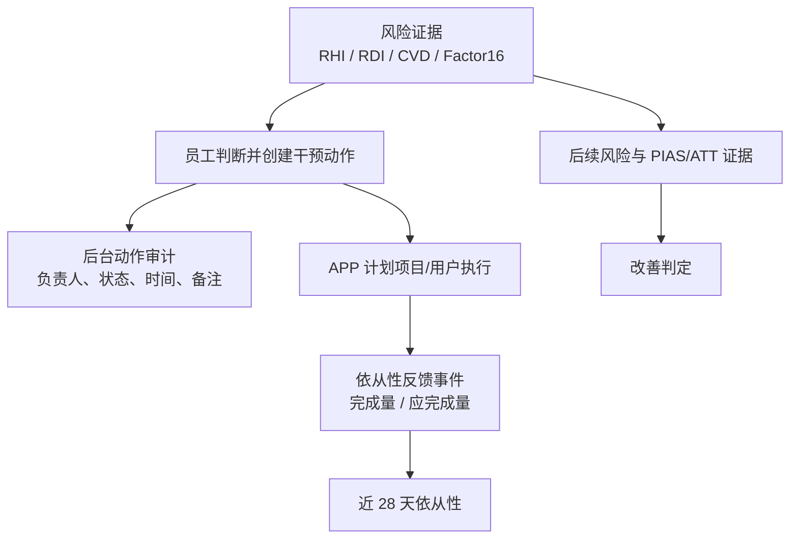

# 保险干预依从性完整链路

> 状态：更新至 2026-08-20 版本化机构计划闭环
>
> 当前适用范围：保险机构为 APP 用户提供干预服务的链路
>
> 目标读者：产品、Android、JeecgBoot 后端、官网后台、数据与 QA

## 1. 结论先行

当前系统中的“依从性”不是模型推断结果，也不是后台员工手工填写的百分比，而是由 APP 用户针对保险计划项目提交的执行反馈事件计算得到：

1. APP 用户先与某个保险租户建立服务关系、保单和授权同意，并读取当前生效的机构发布计划。
2. 用户在 APP 中对计划项目选择“已完成、部分完成、跳过、不适用”。
3. APP 先把反馈写入本地 Room 队列，再异步上传，离线或后端不可用不会丢失本次操作。
4. JeecgBoot 根据任务实例、当前登录用户、租户、服务关系和授权状态重新校验归属。
5. 反馈作为不可变执行事实写入 MySQL；同一任务允许纠正，但聚合只读取最新事实。
6. 保险干预工作台按“当前租户 + 当前员工负责的 APP 用户”汇总近 28 个自然日已到期任务，以加权完成量除以加权应完成量得到个人依从性；机构概览再对当前员工可见人群做总量加权汇总。

当前最重要的语义边界：

- 版本化机构计划只消费绑定稳定 `occurrence_id` 的执行事实；通用干预反馈不进入保险依从性统计。
- 后台员工创建、更新或完成“干预动作”不会自动增加 APP 用户依从性。
- RHI、RDI、CVD 风险、Factor16、PIAS/ATT 改善证据和依从性是不同指标，不应互相替代。
- 当前生效的版本化机构计划以已生成且到期的任务实例构造分母；只有不存在版本化机构计划时，旧绑定链路才按反馈事件中的 `expected_count` 兼容计算，两种口径不混合。

## 2. 核心概念

| 概念 | 当前定义 | 权威来源 |
| --- | --- | --- |
| 版本化机构计划 | 机构发布版本及其稳定项目、任务实例 | `rehealth_care_plan*`、`rehealth_care_plan_occurrence` |
| 任务执行事实 | 用户对具体任务实例的一次评分，可由后续事实纠正 | `rehealth_care_plan_execution` |
| 旧计划绑定 | 无版本化机构计划时保留的兼容关系 | `rehealth_insurance_plan_binding` |
| 个人依从性 | 近 28 个自然日有效任务的加权完成量 / 加权应完成量 | 保险干预工作台查询 |
| 机构依从性 | 当前后台员工可见人群的总完成量 / 总应完成量 | 保险干预工作台汇总 |
| 后台干预动作 | 员工跟进、触达、审核等操作记录 | 工作台动作表及审计链路 |
| 改善 | 风险或因果效果证据达到改善判定 | RDI/PIAS/ATT 等证据链路 |

“依从性”回答的是“计划是否被执行”；“改善”回答的是“执行后健康风险是否朝好的方向变化”。高依从不等于已经改善，低依从也不能直接证明干预无效。

## 3. 端到端链路

```mermaid
flowchart LR
    A["APP 用户登录"] --> B["读取当前生效机构发布版本"]
    B --> C["展开近 28 日稳定任务实例"]
    C --> D0["用户对 occurrence_id 提交执行反馈"]
    D0 --> D["Room 本地反馈队列\n先落库后上传"]
    D --> E["MeasurementSyncWorker\n按当前用户重试上传"]
    E --> F["POST .../care-plan-occurrences/{occurrenceId}/feedback"]
    F --> G["JeecgBoot 校验\n用户、租户、任务实例、服务关系"]
    G --> H["MySQL 不可变执行事实"]
    H --> I["每个任务读取最新执行结果"]
    I --> J["近 28 个自然日到期任务加权聚合"]
    J --> K["当前租户 + 当前员工负责范围"]
    K --> L["JeecgBoot 保险干预工作台 API"]
    L --> M["官网 BFF /api/insurer/interventions/*"]
    M --> N["干预改善工作台\n列表、详情、机构概览"]
```



数据权威边界如下：

- 保险侧工作台读取与 APP 相同的当前生效机构发布版本，并将版本项目逐项展示在“应该采取什么行动”。
- 保险员工创建的人工行动是计划之外的补充执行记录，单独保存状态、期限和审计，不回写或覆盖已发布版本。
- 当没有生效机构计划时，工作台才回退到旧 `insurance_plan_binding`；两种来源通过 `source_type` 明确区分。

- Android 负责采集用户操作、离线持久化和可靠上传，不负责决定最终统计值。
- JeecgBoot 是保险计划归属、反馈合法性和依从性计算的权威服务。
- MySQL 保存可审计的反馈事件。
- 官网 BFF 只做认证转发和字段标准化，前端只展示服务端统计，不应自行修改真实依从性。

## 4. 前置关系与多租户隔离

一名 APP 用户可以同时接受多家保险机构，未来也可以接受医疗机构等其他机构的服务。身份本身不按机构复制，机构服务关系单独建模。

当前保险反馈必须同时满足：

1. APP 用户已登录。
2. 当前保险租户有效。
3. 用户在该租户下存在有效被保人/服务对象关系。
4. 保单有效且属于该服务对象。
5. 授权同意为有效状态，版本满足计划绑定要求。
6. 计划绑定有效，并属于当前登录 APP 用户。

每条反馈绑定 `binding_id`，由绑定反查权威 `tenant_id`、`subject_ref`、`policy_id` 和计划。Android 本地保存的 `tenant_id` 主要用于上下文和排查，服务端不会仅凭客户端租户字段决定数据归属。

后台查询则采用另一层隔离：

- 先由登录会话确定当前保险租户；
- 再通过 `rehealth_insurance_subject_manager` 限定当前员工负责的服务对象；
- 所有列表、详情、统计均同时带租户和负责范围条件；
- 机构员工不能因为知道服务对象 ID 就越权查看其他租户或其他员工范围内的数据。

因此同一个 APP 用户在甲、乙两家保险公司产生的反馈，会落在不同计划绑定和租户下；甲公司员工只能看到甲公司的服务关系及自己负责范围内的聚合结果。

## 5. APP 侧：从用户操作到本地可靠队列

### 5.1 反馈入口

APP 加载当前用户的有效保险计划绑定。用户对具体计划项目反馈时，当前 UI 使用以下映射：

| 用户选择 | `feedback_type` | 默认 `expected_count` | 默认 `completed_count` | 是否进入分母 |
| --- | --- | ---: | ---: | --- |
| 已完成 | `completed` | 1 | 1 | 是 |
| 部分完成 | `partially_completed` | 1 | 0.5 | 是 |
| 跳过 | `skipped` | 1 | 0 | 是 |
| 不适用 | `not_applicable` | 空 | 空 | 否 |

当前 APP 默认验证方式为 `self_report`。后端还允许 `device_verified` 和 `staff_confirmed`，但自动设备核验、员工确认尚未接入当前真实闭环。

### 5.2 先落库、后联网

用户点击提交后，`InterventionFeedbackRepository` 先生成 UUID，并写入 Room 表 `intervention_feedback_queue`。主要字段包括：

- 所属登录用户：`owner_user_id`
- 通用干预标识：`intervention_id`
- 保险上下文：`binding_id`、`tenant_id`、`plan_item_id`
- 执行事实：`status`、`expected_count`、`completed_count`、`verification_type`
- 时间和备注：`checked_at`、`created_at`、`note`
- 同步状态：`upload_status`、`upload_attempts`、`last_error`、`next_retry_at`

这保证网络不可用时操作仍保存在本地，同时避免 BLE/健康数据采集被网络阻塞。

### 5.3 选择上传接口

上传时根据本地事件的计划上下文分流：

- 存在版本化计划 `occurrence_id`：调用 `POST /rehealth/mobile/insurance/care-plan-occurrences/{occurrenceId}/feedback`，进入当前权威任务分母链路。
- 只有旧 `binding_id + plan_item_id`：调用旧保险计划反馈接口，仅在没有版本化机构计划时作为兼容口径。
- 缺少保险计划上下文：调用通用接口 `POST /rehealth/mobile/interventions/{id}/feedback`。该通用反馈不会进入保险工作台当前的 28 天聚合。

版本化任务请求的关键字段为：

```json
{
  "feedbackType": "partially_completed",
  "occurredAt": "2026-08-17T10:00:00+08:00",
  "sourceRecordId": "APP 本地反馈 UUID",
  "verificationType": "self_report",
  "note": "用户备注"
}
```

JeecgBoot 根据 `feedbackType` 固定映射 `1 / 0.5 / 0 / NULL`，不接受客户端自报依从率。

### 5.4 重试与用户隔离

`MeasurementSyncWorker` 处理反馈队列：

- 成功后标记为 `done`；完成记录 7 天后可清理。
- 网络错误或服务暂不可用时，记录失败原因并指数退避重试。
- 401 会暂停本轮队列，等待重新登录或令牌恢复。
- 403、请求格式错误等永久性错误标记失败，不进行无意义重试。
- 只处理当前登录用户拥有的记录；本地记录所属用户不一致时拒绝上传。

数据库从旧版本升级时可能存在 `owner_user_id` 为空的历史反馈。迁移会保留历史数据，但不会把它自动归给后续登录的其他用户。

## 6. JeecgBoot：鉴权、幂等与服务端计分

### 6.1 接口

```text
POST /rehealth/mobile/insurance/care-plan-occurrences/{occurrenceId}/feedback
```

该接口使用 APP 用户认证。服务端根据任务实例反查计划、版本、项目、租户和服务对象，并再次校验当前用户服务关系、授权和任务状态。

### 6.2 幂等

APP 本地 UUID 作为 `sourceRecordId`，服务端使用以下组合查询重复事件：

```text
tenant_id + source_system(rehealth_app) + source_record_id
```

重复上传同一条本地事件时返回原反馈 ID 和 `idempotentReplay=true`，不再次计分。这解决的是网络重试重复提交，不等于“同一计划项目在同一天只能反馈一次”。如果客户端为同一任务生成了两个不同 UUID，当前仍可能被当成两条事件，见第 12 节风险项。

### 6.3 服务端计算规则

当前版本化算法版本：

```text
care-plan-occurrence-adherence-28d-v1
```

规则为：

1. `completed` 计 1，`partially_completed` 计 0.5，`skipped` 计 0。
2. `not_applicable` 的计分为空，任务不进入分子和分母。
3. 每个任务实例只读取按 `occurred_at + created_at + id` 排序后的最新执行事实。
4. 项目 `scoring_weight` 同时作用于分子和分母。
5. 已到期未反馈任务以 0 分进入分母；当天已反馈任务即使尚未到期也进入统计。

```text
adherence_score = Σ(scoring_weight × score_value)
                  / Σ(scoring_weight)
```

工作台返回 0–1 比例，App 展示接口返回 0–100 百分数；无有效分母时均返回空分数，不显示 0%。

### 6.4 持久化

MySQL 表 `rehealth_care_plan_execution` 保存：

- 租户、服务对象、计划、版本、计划项目和任务实例；
- 反馈类型、发生时间和来源记录 ID；
- `score_value`、`verification_type`、来源系统和来源记录 ID；
- 用户备注、业务发生时间及创建时间。

迁移 `V20260819_2__create_care_plan_execution_facts.sql` 建立不可变执行事实及幂等索引。旧表 `rehealth_insurance_intervention_feedback` 仅服务于旧绑定兼容链路。

## 7. 近 28 天个人依从性

保险工作台优先读取版本化任务实例，窗口与 App 权威值一致，逻辑等价于：

```text
个人完成量 = Σ(任务权重 × 最新执行分值)
个人应完成量 = Σ(非不适用的已到期/已反馈任务权重)

个人依从性 = 个人完成量 / 个人应完成量
```

只有没有当前版本化机构计划且窗口内也没有版本化任务实例时，工作台才回退旧事件聚合；旧、新口径不会合并到同一个人的分子和分母。

示例：某用户 28 天内有四次反馈：

| 反馈 | 完成量 | 应完成量 |
| --- | ---: | ---: |
| 已完成 | 1 | 1 |
| 部分完成 | 0.5 | 1 |
| 跳过 | 0 | 1 |
| 不适用 | 不计 | 不计 |

结果为：

```text
(1 + 0.5 + 0) / (1 + 1 + 1) = 50%
```

工作台返回并展示：

- `adherence_score`
- `adherence_completed_count`
- `adherence_expected_count`
- `adherence_window_days = 28`

队列和详情顶部的依从性指标读取上述版本化任务实例与执行事实。详情中的 `feedback` 列表目前仍只返回旧绑定兼容链路近 28 天最多 100 条反馈事件，不能作为版本化计划依从性的明细来源；后续如需展示版本化明细，应新增基于任务实例与最新执行事实的专用字段或接口。

## 8. 机构概览依从性

机构概览不是“每个人百分比的简单平均”，而是对当前员工可见人群做加权汇总：

```text
机构可见范围依从性 = Σ所有人的完成量 / Σ所有人的应完成量
```

例如：

- 用户 A：8 / 10 = 80%
- 用户 B：1 / 2 = 50%

机构结果是 `9 / 12 = 75%`，不是 `(80% + 50%) / 2 = 65%`。这种算法能避免任务很少的用户对整体结果产生不成比例的影响。

若当前范围内总应完成量为 0，服务端返回空值，前端应展示“暂无依从性数据”或“暂无已反馈任务”，不应显示 0%，因为 0% 会错误暗示用户明确跳过了任务。

## 9. 后台展示链路与权限

JeecgBoot 提供：

```text
GET  /rehealth/insurance/v1/interventions/dashboard
GET  /rehealth/insurance/v1/interventions
GET  /rehealth/insurance/v1/interventions/{subjectId}
POST /rehealth/insurance/v1/interventions/{subjectId}/actions
PUT  /rehealth/insurance/v1/intervention-actions/{actionId}
```

查看接口要求 `rehealth:insurance:risk:view`，写入后台干预动作要求 `rehealth:insurance:intervention:manage`。

官网 BFF 使用后台登录得到的 Jeecg token 和服务端绑定的租户 ID 转发到 JeecgBoot：

```text
/api/insurer/interventions/dashboard
/api/insurer/interventions
/api/insurer/interventions/{subjectId}
```

BFF 对字段进行标准化，真实模式下前端展示服务端返回的依从性及完成量/应完成量。演练模式曾有前端本地增加依从性的展示逻辑，该逻辑不能作为真实业务语义；真实模式创建干预动作后应重新读取后端结果。

## 10. 与后台干预动作、风险和改善的关系

当前存在三条相互关联但独立的链路：



当前实现约束：

- 员工完成一个后台动作，只代表员工完成了跟进，不代表用户执行了计划。
- APP 用户提交反馈，只代表执行事实，不直接证明健康结果改善。
- “已改善人群”不能只依赖依从性。工作台当前仍要求非 Mock、证据充分的归因结果及负向个体 ATT 或趋势改善等证据。
- 依从性可以作为分析改善效果的协变量或分层条件，但不能替代 RDI/PIAS/ATT。

后续若需要员工代用户确认执行，应显式生成 `verification_type=staff_confirmed` 的反馈事件，并记录确认员工、证据和审计时间，而不是在后台动作完成时隐式加分。

## 11. 异常、重试和一致性

| 场景 | 当前处理 | 用户/后台表现 |
| --- | --- | --- |
| APP 离线 | 反馈先进入 Room，稍后重试 | 本次操作不丢失，后台暂不可见 |
| 令牌失效/401 | 暂停本轮反馈上传 | 重新登录后继续同步 |
| 无权限/403 | 标记永久失败 | 需要检查绑定、授权和租户关系 |
| 服务暂不可用 | 指数退避 | 后台数据最终一致，不应前端先加分 |
| 重复网络提交 | 同一 `sourceRecordId` 幂等返回 | 不重复计分 |
| 不适用 | 不写完成量和应完成量 | 不进入分子和分母 |
| 28 天无有效事件 | 聚合为空 | 应展示“暂无数据”，不是 0% |
| 用户切换账号 | 队列按 `owner_user_id` 隔离 | 不上传其他账号的反馈 |

依从性是最终一致数据。APP 提交后到后台可见之间可能存在同步延迟，产品上宜展示“待同步/已同步/同步失败”状态，并在后台标注统计截止时间。

## 12. 当前缺口与风险

### 12.1 新旧计划的分母口径不同

旧 `insurance_plan_binding` 兼容链路的 `expected_count` 仍随用户反馈事件提交，因此它表示近 28 天“已反馈计划事件”的加权完成率，不能代表全部到期任务。

版本化机构计划链路已经使用到期任务分母。服务端根据当前及历史生效发布版本的 `schedule_json`，在滚动 28 个自然日内展开 `daily`、`weekly`、`once` 任务；已经到期但没有反馈的有效任务按 0 分进入分母。当天已反馈的任务即使尚未到期，也进入当次统计。两种口径必须分别标识，不能混合聚合。

### 12.2 版本化计划已接通任务展开和执行事实

迁移 `V20260819_1__create_versioned_care_plans.sql` 增加通用 `rehealth_care_plan_occurrence`，并强制任务实例绑定 `plan_id + revision_id + plan_item_id + logical_item_id`。移动端当前计划接口会按需展开规则并生成稳定 `occurrence_id`；`V20260819_2__create_care_plan_execution_facts.sql` 以该 ID 保存不可变执行事实。未知规则只返回“暂不支持”的计划项，不生成虚构任务。

真正的依从性仍必须区分：

- 计划定义：应该做什么、频率多少；
- 任务实例：某天某次具体应完成任务；
- 执行证据：用户、设备或员工确认了什么；
- 聚合窗口：统计哪些任务实例。

### 12.3 同一任务的重复提交

App 用本地反馈 UUID 作为 `source_record_id`，服务端以“租户 + 来源系统 + 来源记录”幂等接收重试。一个任务可以形成多条不可变纠正事实，但聚合只读取该 `occurrence_id` 最新的执行事实，因此不会把同一任务重复加入分母。旧绑定接口仍遵循原有事件口径。

### 12.4 验证等级尚未影响权重

`self_report`、`device_verified`、`staff_confirmed` 当前在算术上等权。验证方式已落库，但还没有证据置信度、冲突裁决或人工复核规则。

### 12.5 发生时间可信度

`occurredAt` 来自客户端；版本化任务反馈只允许回填最近 35 天，并拒绝超过服务端时间 5 分钟的未来时间。服务端按 `Asia/Shanghai` 自然日展开当前产品规则。跨时区计划、设备证明和更强反作弊仍需后续定义。

### 12.6 通用计划核心已建立，当前适配器仍是保险专用

`rehealth_care_plan*` 已使用 `owner_type`、租户、统一 App 用户、计划版本、任务实例和执行事实作为共享核心；当前 App 聚合、权限校验和依从性接口只接入保险机构服务关系，医疗机构适配器尚未接入。医疗数据不能回写保险专用表，机构类型和服务关系继续决定授权上下文。

## 13. 推荐演进顺序

### P0：已完成版本化机构计划的 App 闭环

1. 归因页展示机构、计划版本、今日任务和“近 28 天计划依从性”。
2. 无有效到期任务分母时显示“暂无依从性数据”，不显示 0%。
3. `occurredAt` 使用有界回填和未来时间校验。
4. 执行事实绑定稳定 `occurrence_id`，上传重试使用来源记录幂等键。
5. 返回 `care-plan-occurrence-adherence-28d-v1` 计算版本，算法调整可追溯。

### P1：已完成基础到期任务分母

计划、不可变发布版本、计划项目、任务实例和执行事实已经接通。当前由移动端聚合服务按请求生成应执行任务，并让执行事件绑定 `occurrence_id`：

```text
计划模板 -> 计划绑定 -> 任务实例（due_at） -> 执行事件 -> 任务最终状态
```

统计改为：

```text
依从性 = 窗口内按时/允许延迟完成的任务权重 / 窗口内所有有效到期任务权重
```

已处理版本生效区间、撤回/取消、不适用和计划中途变更。暂停、改期、迟到完成、跨时区和长期预生成调度仍需定义。

机构修改采用以下已实现规则：草稿可编辑；已发布内容不可覆盖；修改时从最新发布版克隆新草稿；新版本发布后旧版本只在 `effective_to` 前有效；旧版本在新生效时间之后的未执行任务会标记为 `cancelled/superseded_by_revision` 并排除。并发写入通过 `expected_lock_version` 检测，冲突返回 `409`。

### P2：接入多源执行证据

1. 设备数据满足规则时生成 `device_verified` 证据。
2. 机构员工审核时生成 `staff_confirmed` 证据并记录操作者。
3. 自报、设备和员工证据冲突时，使用明确状态机裁决，不直接累加三次。
4. 对不同证据输出“完成状态”和“证据置信度”，是否加权需经产品和临床规则确认。

### P3：抽象为多机构通用能力

将保险专用语义抽象为：

- `organization_id / organization_type`
- `service_relationship_id`
- `plan_binding_id`
- `task_occurrence_id`
- `execution_evidence`

保险、医疗等机构共享依从性引擎和 APP 账号，但各自保留业务授权、数据范围、计划类型和监管审计规则。

### P4：进入效果评估闭环

在依从性口径稳定后，将其作为 PIAS/RWE 的协变量、分层变量或剂量暴露指标，分析“谁执行了多少”和“风险改变多少”的关系。仍需保持：

```text
执行事实 != 临床改善 != 因果效果
```

## 14. 验收清单

### APP 与同步

- [ ] 四类反馈映射正确，`not_applicable` 不进入统计。
- [ ] 断网提交后 Room 中可见，恢复网络后只上传一次。
- [ ] 401 后暂停，重新登录后恢复。
- [ ] 切换账号后不会上传或展示其他账号队列。
- [ ] 同一 `sourceRecordId` 重试不产生重复服务端事件。

### 服务端

- [ ] 客户端伪造 `adherenceScore` 不影响服务端结果。
- [ ] 完成量小于 0 或大于应完成量被拒绝。
- [ ] 失效绑定、保单、授权或错误 APP 用户被拒绝。
- [ ] 同一 APP 用户在多个保险租户的数据按绑定正确隔离。
- [ ] 28 天窗口边界、时区和旧数据兼容结果可重复验证。

### 后台

- [ ] 员工只能查看当前租户及本人负责范围。
- [ ] 个人列表、详情事件和机构概览使用相同统计口径。
- [ ] 机构指标按总量加权，而不是人员百分比简单平均。
- [ ] 无有效事件时显示“暂无数据”，不显示 0%。
- [ ] 创建或完成后台干预动作不会在真实模式下本地伪增依从性。
- [ ] 依从性不会单独触发“已改善”判定。

## 15. 人群级干预效果评估报告

### 15.1 目标与链路

保险后台（官网 `insurer_psm.html` 干预改善工作台顶栏）支持一键生成人群级《干预效果评估报告》PDF，页面结构与官网 `templates/rehealth_intervention_report_template.py` 参考模板一致。链路：

```text
官网工作台"生成干预效果评估报告"按钮
  -> 官网 BFF  GET /api/insurer/interventions/report.pdf?period_days=30
  -> JeecgBoot  GET /rehealth/insurance/v1/interventions/report-data?periodDays=30
  -> InsuranceInterventionReportService 按负责关系范围聚合
  -> backend/reporting/  ReportLab 渲染 PDF
  -> 浏览器下载
```

职责边界：JeecgBoot 只做鉴权、租户/负责关系范围过滤、SQL 聚合与口径判定；PDF 排版、字体与视觉资产全部位于官网独立仓库的 `backend/reporting/` 包（ReportLab）。报告 JSON 契约与模板 `ReportData` 的 snake_case 结构逐字段对齐，BFF 拿到 `result` 后直接渲染。

### 15.2 聚合口径

| 报告区块 | 口径 |
| --- | --- |
| 在管总人数 / 高风险待行动 / 干预执行中 / 已改善 | 全部沿用工作台 `workflowStatus`（pending_action / in_progress / improved / pending_review） |
| 全人群风险分布 | 主体最新 CVD 风险经 `normalizeLevel` 归一为 高/中/低 分组计数与占比 |
| 风险迁移（近 N 日） | 窗口起点前最后一条风险等级 vs 当前最新等级；两侧都有真实等级的主体才计入迁移；净向下 = 向下 − 向上 |
| 依从性漏斗（近 28 天） | 收到行动建议 = 有 scheduled occurrence 或生效机构计划；开始行动 = ≥1 条执行事实；连续记录 7/30 天 = 执行事实覆盖 ≥7/≥28 个不同自然日；完成客观复测 = 工作台 improved 判定（非演练、证据充分）；全人群用药确认 = 未形成口径，固定占位文案 |
| 优先行动清单 | 高风险且 pending_action/in_progress 的主体 ≤10 人；优先级按 血压信号→今天找医生 / 其余待行动→尽快复核 / 干预中→健康管理师跟进 |
| 健康指标（RHI/RDI） | "窗口起点前最后快照均值 → 最新快照均值"的人群均值差（RDI 排除 Mock 快照），附样本人数 |
| 收缩压 / LDL-C / 月均赔付 | 未形成人群前后对比口径，输出"待复测口径/未接入"占位，不伪造数据 |
| 因素贡献 | 各主体最新非 Mock RDI 快照的 `rehealth_rdi_contribution.final_points` 按因子平均，取绝对值前 6 |

### 15.3 演练数据与医疗边界

- 范围内任一主体风险/RDI 为 Mock 或合成来源时，封面强制橙色"演练数据 · 不可作为真实改善结论"标签；全真实数据时留空。
- "已改善"沿用工作台证据门槛（非 Mock、数据充分、历史与干预天数达标、可计算效果信号），报告不单独放宽。
- 封面与正文固定免责声明：不构成诊断或治疗建议，不能替代医生诊疗。
- 报告只输出计数、均值与 `subject_ref` 编号，不输出姓名、手机号、设备标识或原始遥测。

### 15.4 渲染与部署

- 渲染包：官网仓库 `backend/reporting/`（`theme.py` + `intervention_report.py`），原 `templates/` 脚本保留 CLI 用法并重定向到该包。
- 字体：Windows 开发机用 `Deng.ttf/Dengb.ttf`；容器用 `fonts-noto-cjk`（Noto Sans CJK SC），已在官网 backend Dockerfile 安装；找不到字体时渲染失败并给出明确错误，不静默降级。
- 依赖：官网 backend `requirements.txt` 新增 `reportlab==4.2.5`。

## 16. 代码与迁移索引

Android：

- `Android-apk/app/src/main/java/com/rehealth/genie/data/sync/InterventionFeedbackEntity.kt`
- `Android-apk/app/src/main/java/com/rehealth/genie/data/sync/InterventionFeedbackDao.kt`
- `Android-apk/app/src/main/java/com/rehealth/genie/data/sync/InterventionFeedbackRepository.kt`
- `Android-apk/app/src/main/java/com/rehealth/genie/ui/InterventionFeedbackViewModel.kt`
- `Android-apk/app/src/main/java/com/rehealth/genie/work/MeasurementSyncWorker.kt`
- `Android-apk/app/src/main/java/com/rehealth/genie/network/dto/InsurancePlanDtos.kt`
- `Android-apk/app/src/main/java/com/rehealth/genie/data/AppDatabase.kt`
- `Android-apk/app/src/main/java/com/rehealth/genie/ui/AttributionScreen.kt`

JeecgBoot：

- `backend/jeecg-boot/jeecg-boot-module/jeecg-module-rehealth/src/main/java/org/jeecg/modules/rehealth/insurance/InsuranceMobilePlanController.java`
- `backend/jeecg-boot/jeecg-boot-module/jeecg-module-rehealth/src/main/java/org/jeecg/modules/rehealth/insurance/InsuranceMobilePlanService.java`
- `backend/jeecg-boot/jeecg-boot-module/jeecg-module-rehealth/src/main/java/org/jeecg/modules/rehealth/insurance/InsuranceMobilePlanRequest.java`
- `backend/jeecg-boot/jeecg-boot-module/jeecg-module-rehealth/src/main/java/org/jeecg/modules/rehealth/insurance/InsuranceMobileCarePlanService.java`
- `backend/jeecg-boot/jeecg-boot-module/jeecg-module-rehealth/src/main/java/org/jeecg/modules/rehealth/insurance/InsuranceMobileCarePlanResponse.java`
- `backend/jeecg-boot/jeecg-boot-module/jeecg-module-rehealth/src/main/java/org/jeecg/modules/rehealth/insurance/InsuranceInterventionWorkbenchController.java`
- `backend/jeecg-boot/jeecg-boot-module/jeecg-module-rehealth/src/main/java/org/jeecg/modules/rehealth/insurance/InsuranceInterventionWorkbenchService.java`
- `backend/jeecg-boot/jeecg-boot-module/jeecg-module-rehealth/src/main/java/org/jeecg/modules/rehealth/insurance/InsuranceInterventionReportService.java`
- `backend/jeecg-boot/jeecg-boot-module/jeecg-module-rehealth/src/main/java/org/jeecg/modules/rehealth/insurance/InsuranceInterventionReportResponse.java`
- `backend/jeecg-boot/jeecg-boot-module/jeecg-module-rehealth/src/main/resources/db/software/mysql/V20260817_1__add_insurance_adherence_events.sql`
- `backend/jeecg-boot/jeecg-boot-module/jeecg-module-rehealth/src/main/resources/db/software/mysql/V20260819_1__create_versioned_care_plans.sql`
- `backend/jeecg-boot/jeecg-boot-module/jeecg-module-rehealth/src/main/resources/db/software/mysql/V20260819_2__create_care_plan_execution_facts.sql`

官网后台（独立仓库 `E:/code/RehealthCore_website`）：

- `backend/api/insurer_routes.py`
- `backend/api/app_backend_client.py`
- `backend/reporting/theme.py`
- `backend/reporting/intervention_report.py`
- `backend/tests/test_intervention_report_renderer.py`
- `frontend/insurer_psm.html`
- `frontend/assets/insurer-api.js`
- `backend/tests/test_insurer_intervention_bridge.py`

## 17. 文档维护规则

以下变化发生时必须同步更新本文：

- 反馈类型、计分公式、统计窗口或验证方式变化；
- APP 本地队列、重试、账号隔离或接口分流变化；
- 保险计划绑定、授权、多租户和负责人范围变化；
- 新增任务实例、到期分母或多源证据裁决；
- 医疗等新机构类型开始复用依从性能力；
- 依从性进入 PIAS/RWE 模型输入或改善判定规则；
- 人群级干预效果评估报告的字段口径、渲染依赖或权限变化。
