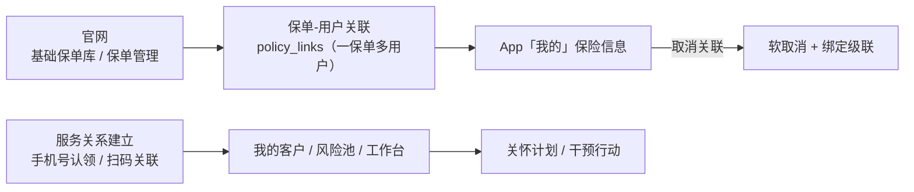

# 2026-08-27 今日工作总结

> 今日主线：**保单库重构（一保单可多用户）→ 保单管理闭环（新建/添加/取消关联）→ 扫码关联二期（员工码 + App 相机扫码）→ 保险侧文档大整合**。
> 涉及 `rehealth_tonbu`（JeecgBoot + Android App + 契约/文档）与 `RehealthCore_website`（官网 BFF + 前端）。两仓库当日改动均已提交，工作区干净。

## 一、能力全景

## 二、rehealth_tonbu（本项目 · 12 个提交）

### 后端 JeecgBoot

- **基础保单库重构**：保单与 App 用户之间新增 `InsurancePolicyLink` 关联表（Flyway `V20260826_4`），实现**一保单可关联多用户**；`InsurancePolicyService` 重构为保单库 + 关联两级模型。
- **取消保单关联**：新增取消端点，**软取消**保单-用户关联并级联处理绑定状态，不影响历史数据。
- **扫码关联二期**：新增 `InsuranceScanLinkService`（319 行核心逻辑）、`employee_qr`（员工 8 位 Base32 码，30 天有效）+ `scan_session`（5 分钟一次性会话）两表（Flyway `V20260826_5`）；支持生成/刷新/停用二维码、App 扫码建会话、用户确认建关系、已有专员二次确认换人（复用转移逻辑、责任链保留），含防枚举/限流/审计防护。
- **移除团队视图**：删除「我的客户」页团队视图相关端点与逻辑，统一按 SELF·TEAM·全机构范围。

### Android App

- **相机扫码**：新增 `ScanCameraScreen`（CameraX 取景）+ `ScanCodeParser`，支持扫描员工二维码（`rehealth://insurance/scan?...`）与手动输码，服务关系建立后「我的」页展示服务专员卡片。
- **修复**：扫码弹窗先收起再开相机（避免遮挡取景）；取消保单关联后回前台强制刷新 + 手动刷新，App 保险信息即时更新。

### 契约与文档

- 同步 `backend/contracts/INSURANCE_BUSINESS_API.md`（保单库/取消关联/扫码端点）。
- **文档大整合**：将分散的十余份保险侧文档整合为 5 份当前实现版：
  - 《保险侧保单与计划管理》
  - 《保险侧服务关系与扫码关联》（重写自方案/实施计划/链路/扫码设计/全景五份）
  - 《保险侧运营与开户》
  - 《数据库迁移与种子脚本总览》
  - 《项目文档总览》（按架构/接口/数据库/部署/测试分类导航）
- 删除已过时文档（开通方案、认领全链路、计划保单闭环等旧版），消除与代码不一致的内容。

## 三、RehealthCore_website（官网 · 5 个提交）

- **基础保单库界面**：我的客户页新增保单库（新建/编辑/添加给用户），对接 BFF `insurer_policy_routes`。
- **取消关联**：已添加用户弹窗 + 取消关联按钮，BFF 转发后端软取消。
- **扫码关联弹窗**：二维码渲染（引入 `qrcode.min.js`）/刷新/停用 + BFF `qr-code` 路由。
- **移除团队视图**：与后端同步下线。

## 四、今日关键数据

| 仓库 | 提交数 | 核心交付 |
| --- | --- | --- |
| rehealth_tonbu | 12 | 保单-用户关联表、取消关联、扫码关联服务、App 相机扫码、文档整合 |
| RehealthCore_website | 5 | 保单库界面、取消关联弹窗、扫码弹窗 + BFF 路由 |

## 五、下一步

1. 验证 App 扫码 → 官网「我的客户」→ 工作台的全链路联调。
2. 保单库批量导入（核心系统对接）与保单派发的服务端流程。
3. 基于授权用户的风险分层与干预闭环验收。
