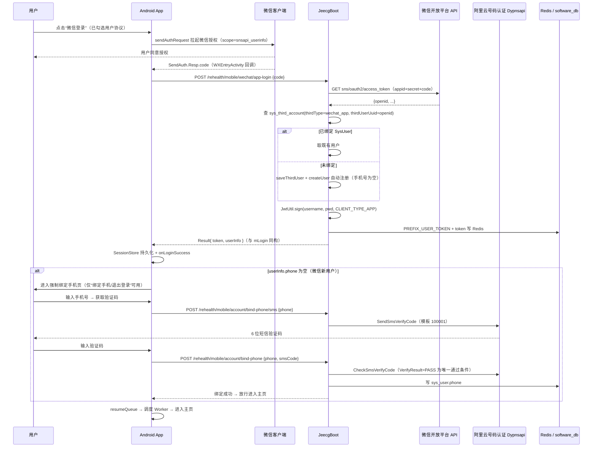

# Android App 微信登录设计方案

> 状态：已按评审决策更新（v1.1）
> 涉及仓库：`rehealth_tonbu`（Android-apk + backend/jeecg-boot）；`RehealthCore_website` 仅作参考，不改动
> 日期：2026-08-27

## 1. 目标与范围

在 ReHealth Android App（`Android-apk`）上新增“微信登录”，复用 JeecgBoot 统一认证与第三方账号体系（`sys_third_account`），并参考官网项目（`RehealthCore_website`）已验证的“服务端持凭据、客户端零敏感信息”模式。登录成功后走与现有账号密码登录一致的登录后生命周期（token 持久化、队列恢复、同步 Worker 调度）。

**本期决策（2026-08-27 已确认）：**

1. 首次微信登录**自动注册**，并**强制绑定手机号**（未绑定前不可使用完整功能）；
2. 本期**不做**官网/小程序/网站端的 unionid 打通；
3. 微信开放平台申请材料清单见 3.1 节；
4. 本期**不做**“我的”页微信绑定/解绑功能（二期）。

## 2. 现状盘点（已核实）

| 部分 | 现状 |
| --- | --- |
| Android 登录 | `LoginViewModel` → `AuthenticatedApiClient.mobileLogin` → `POST /jeecg-boot/sys/mLogin`，成功后 `SessionStore` 存 token/userId/username/realname → `onLoginSuccess(token)` → `resumeQueue` + 调度 Worker。`LoginScreen` 已有“其他登录方式”分区（目前只有游客按钮） |
| Android 依赖 | 无任何微信 SDK 依赖 |
| JeecgBoot 认证 | 账号密码 `mLogin` 签发 `CLIENT_TYPE_APP` JWT + Redis；`sys_third_account` 第三方账号表（`thirdType`/`thirdUserUuid`/`sysUserId`）与 `ISysThirdAccountService.saveThirdUser/createUser` 现成可用 |
| 已有微信能力 | `WechatMiniLoginController` + `WechatMiniLoginServiceImpl`：**微信小程序**登录（`wx.login` code → `jscode2session` → openid → `thirdType=wechat_mini` 查/建用户 → 签发 APP token）。路径 `/rehealth/mobile/wechat/login` |
| 短信验证能力 | `LoginController.registerSms`（`/sys/registerSms`，Redis 60s 冷却/5min 有效期/频控/锁）+ `AliyunSmsVerificationService`（`org.jeecg.common.sms`，`CheckSmsVerifyCode` 以 `VerifyResult=PASS` 为唯一通过条件，模板 100001）。**绑定手机号可整套复用** |
| 官网项目 | FastAPI BFF 走 `POST /sys/webLogin`（`WEB` 客户端类型），服务端 Redis 存 Jeecg Token、浏览器只有 HttpOnly Cookie；**无微信登录**。本期仅作为“凭据不落地客户端”的参考模式 |
| Shiro 放行 | 已有 `/sys/thirdLogin/**`、`/sys/mLogin`、`/sys/registerSms` anon；`/rehealth/mobile/wechat/**` 尚未显式放行（当前 controller 用 `@IgnoreAuth`） |

**关键结论：已有的小程序登录不能直接用于原生 App。** `wx.login` 的 code 只能走 `jscode2session`；原生 App 通过微信 SDK 授权拿到的 code 必须走开放平台 `sns/oauth2/access_token`。两者凭证互不通用，需要新增一条“移动应用”登录链路。

## 3. 方案选型

| 方案 | 说明 | 结论 |
| --- | --- | --- |
| A. 微信开放平台移动应用 + 官方 SDK | App 集成 `wechat-sdk-android`，拉起微信授权，SDK 返回 code，服务端换 token/openid | ✅ **采用**（原生体验、无需扫二维码、行业标准做法） |
| B. 复用小程序 code 接口 | `jscode2session` 只接受小程序 code | ❌ 不可行 |
| C. 内嵌 H5 扫码登录 | 无原生 SDK 依赖，但需用户用另一台手机扫码，体验差 | ❌ 仅作降级备选 |

### 3.1 微信开放平台申请所需内容（前置依赖）

**一、开放平台账号与企业资质（首次）**

| 项目 | 说明 |
| --- | --- |
| 注册邮箱 | 一个未注册过开放平台/公众号/小程序的邮箱，用于注册开发者账号 |
| 企业主体 | 营业执照（企业或个体工商户均可）；主体名称用于资质认证 |
| 法人/管理员信息 | 法人身份证信息；可指定管理员（手机号+身份证）代办 |
| 对公账户 | 用于微信小额打款验证主体真实性 |
| 开发者资质认证费 | 300 元/年（微信开放平台开发者资质认证） |

**二、创建“移动应用”需提交的材料**

| 项目 | 说明 |
| --- | --- |
| 应用名称 / 简介 | 与软著或上架应用名保持一致，减少审核驳回 |
| 应用图标 | 标准 PNG（平台要求尺寸，如 28×28 与 108×108） |
| 官网/下载页链接 | 应用介绍页或应用市场链接 |
| **Android 包名** | `com.rehealth.genie`，必须与 APK 的 `applicationId` 完全一致 |
| **应用签名 MD5** | 用**正式发布 keystore** 生成（见下方命令），审核时同时上传一个用该签名打包的 APK |
| 审核补充材料 | 按平台模板提供应用说明、页面截图等 |

**三、审核通过后交付开发的内容**

- `AppID`（客户端 BuildConfig 使用，非敏感）
- `AppSecret`（**仅配置到 JeecgBoot 服务端**，不进 APK、不进官网、不进 Git）

**四、签名 MD5 生成方式（二选一）**

- 微信官方工具 `Gen_Signature_Android.apk`（开放平台文档提供，安装到手机直接读取已装应用签名）；
- 命令行（keytool 需 JDK）：

```bash
keytool -exportcert -alias <别名> -keystore <正式签名.jks> -storepass <密码> \
  | openssl dgst -md5
```

**五、注意事项**

- 包名与签名一旦提交审核，之后上线包必须用**同一签名**，否则拉起微信会报“签名不一致”；
- Debug 默认 keystore 与 Release 不同 → 联调方案二选一：debug 也用正式签名打包，或开放平台下另建一个测试应用；
- 审核周期通常 1~7 个工作日，**建议现在启动申请**，与后端开发并行。

## 4. 总体流程



说明：

- **是否进入绑定页由 App 根据 `userInfo.phone` 是否为空判断**，响应结构与 mLogin 完全一致，不新增响应字段；
- 绑定中途退出/失败：账号已创建，下次微信登录直接继续绑定页；
- 仅写 `sys_user.phone`，**不修改 username/password**（避免影响已签发 JWT 与既有账号体系）。

## 5. 后端设计（backend/jeecg-boot）

### 5.1 新增接口：微信登录

`jeecg-module-system/jeecg-system-biz` 下新增（与 `WechatMiniLoginController` 同包同风格）：

```
POST /rehealth/mobile/wechat/app-login        @IgnoreAuth
请求: { "code": "微信SDK返回的临时凭证" }
响应: Result<{ token, userInfo }>
```

- 响应结构与 `mLogin` 的 `MobileLoginResponse(token+userInfo)` **保持一致**，Android 侧零改动复用 DTO；
- code 为空 / appid 未配置 / 微信接口错误 → `Result.error`（HTTP 200，业务错误），与现有 mLogin 风格一致；
- Shiro：`ShiroConfig` 增加 `filterChainDefinitionMap.put("/rehealth/mobile/wechat/**", "anon")`。

### 5.2 服务实现 `WechatAppLoginServiceImpl`

参照 `WechatMiniLoginServiceImpl`（171 行的成熟实现），核心差异仅一步：

1. **code 换 openid**：服务端调
   `https://api.weixin.qq.com/sns/oauth2/access_token?appid={appid}&secret={secret}&code={code}&grant_type=authorization_code`（5s 超时，失败关闭）。`errcode!=0` 记 warn（不含 code）。
2. **查/建账号**：`thirdType="wechat_app"`，`thirdUserUuid=openid`（本期不做 unionid 打通；接口若返回 unionid 可顺带落库到 `thirdUserId` 备查，不参与本期逻辑）。查 `sys_third_account`，无则 `saveThirdUser(ThirdLoginModel("wechat_app", openid, "微信用户", avatar), 默认租户)` + `createUser`（新建用户手机号为空）。
3. **签 token**：`JwtUtil.sign(username, password, CLIENT_TYPE_APP)` + Redis `PREFIX_USER_TOKEN`，与小程序实现逐行对齐。

> 可选重构：把小程序实现中的“查/建用户 + 签 token”抽成 `WechatLoginSupport` 共享方法，两者只剩“code→openid”这一步不同。若追求最小改动，可独立实现，二选一在实施时定。

### 5.3 配置（jeecg-system-start/src/main/resources/application-*.yml）

```yaml
rehealth:
  wechat:
    app:
      appid: ""      # 微信开放平台移动应用 AppID
      secret: ""     # AppSecret，仅存服务端
```

未配置时接口返回“微信登录未配置”——**失败关闭**，与 `JEECG_SMS_DEV_MODE` 缺省失败关闭同策略。AppSecret 不进入 APK、不进入官网前端、不进 Git。

### 5.4 为什么不动 `sys_third_account` 表结构

表已有 `thirdType`、`thirdUserUuid`、`thirdUserId`、`sysUserId`、`tenantId` 全部所需字段，**无需迁移**。建议仅核查 `(third_type, third_user_uuid, tenant_id)` 是否有联合索引（小程序查询同模式，若已有则直接复用）。

### 5.5 新增接口：强制绑定手机号（需登录）

复用注册短信整套基础设施（`AliyunSmsVerificationService` + Redis 频控 + Dypnsapi 模板 100001），新增两个需登录接口：

```
POST /rehealth/mobile/account/bind-phone/sms    { "phone": "138..." }
  - 复用 /sys/registerSms 的 Redis 策略：60s 冷却、5min 有效期、集群频控与绑定锁；
  - Dypnsapi SendSmsVerifyCode 云端生成 6 位验证码，验证码不落 Redis 明文；
  - 该手机号已绑定其他账号 → 业务错误，拒绝发送。

POST /rehealth/mobile/account/bind-phone        { "phone": "138...", "smsCode": "..." }
  - CheckSmsVerifyCode 的 VerifyResult=PASS 为唯一通过条件；
  - 通过后写当前登录用户 sys_user.phone（同手机号已存在于其他账号 → 拒绝，提示“该手机号已注册，请使用账号密码登录”；微信身份挂到老账号属二期）；
  - 唯一性校验复用 InsuranceSettingsService 同款 `ensureUniqueAccount("phone", phone)` 逻辑，保证手机号↔账号一对一；
  - 响应：更新后的 userInfo。
```

**拦截策略（MVP 以客户端为主）**：微信登录成功后若 `userInfo.phone` 为空，App 进入绑定页，页面只保留“绑定手机 / 退出登录”两个入口，不进入主页。服务端可选加固（二期）：对未绑手机账号在关键业务接口（设备绑定/上传/问答等）做服务端校验，防止绕过客户端。

## 6. Android 设计（Android-apk）

### 6.1 依赖与清单

| 文件 | 变更 |
| --- | --- |
| `app/build.gradle.kts` | 新增 `implementation("com.tencent.mm.opensdk:wechat-sdk-android:6.8.34")`（实施时取最新稳定版）；buildConfig 字段 `WECHAT_APP_ID`（非敏感） |
| `app/src/main/AndroidManifest.xml` | ① `<queries><package android:name="com.tencent.mm"/></queries>`（Android 11+ 可见性）；② 注册 `com.rehealth.genie.wxapi.WXEntryActivity`（`exported="true"`，`launchMode="singleTask"`） |

### 6.2 新增代码（`com.rehealth.genie` 下）

```text
wechat/
├─ WechatAuthService.kt      # IWXAPI 初始化、registerApp、sendAuthRequest、isWxInstalled
├─ WechatAuthState.kt        # sealed: Idle / Launching / Authorized(code) / Canceled / Failed / NotInstalled
└─ wxapi/WXEntryActivity.kt  # onResp: SendAuth.Resp 取 code/errCode，经回调送回 ViewModel
network/
├─ dto/WechatLoginDto.kt     # WechatAppLoginRequest(code)；响应复用 MobileLoginResponse
├─ dto/BindPhoneDtos.kt      # BindPhoneSmsRequest / BindPhoneRequest
ui/
├─ BindPhoneScreen.kt        # 强制绑定手机页（手机号+验证码+60s 倒计时+退出登录）
└─ BindPhoneViewModel.kt     # 发送/校验验证码、绑定成功后放行
```

- `ReHealthApi.kt`：新增 `@POST("/jeecg-boot/rehealth/mobile/wechat/app-login")`（`@IgnoreAuth` 路径）与两个需登录的 `bind-phone` 端点（走既有 token 拦截器）；
- `LoginViewModel.kt`：新增 `loginWithWeChat(code)`——拿到 `{token, userInfo}` 后**完整复用现有 `login()` 的成功分支**（SessionStore 写四字段 → `onLoginSuccess` → `createConversation()` → `resumeQueue()` → 两个 Worker 调度），抽出私有 `completeLogin(token, userInfo)` 供两入口共用；若 `userInfo.phone` 为空则导航到 `BindPhoneScreen`；
- `LoginScreen.kt`：“其他登录方式”行内加入微信按钮（绿色微信图标 + “微信登录”）：
  - 未勾选用户协议 → 沿用 `showAgreementHint`；
  - `isWxInstalled()==false` → 提示“未检测到微信客户端”，不发起；
  - 授权回调 Cancel → 静默回到登录页；Failed → 错误提示；
- `BindPhoneViewModel`：发送验证码（60s 倒计时，复用注册页交互）、校验码通过后更新内存 userInfo 并放行进入主页；退出登录按钮清空 SessionStore 回登录页。

### 6.3 需要注意的坑

- `WXEntryActivity` 的**包名必须是 `{applicationId}.wxapi`**（即 `com.rehealth.genie.wxapi`），且类名固定，微信客户端按此反射回调；
- **应用签名**：开放平台登记的是签名 MD5。Debug 默认 keystore 与 Release 不同 → 建议开放平台下分别建 debug/release 两个应用，或用 Release 签名打 debug 包联调（见 3.1）；
- code 一次性、5 分钟有效：回调只消费一次，失败不重发旧 code，需用户重新授权；
- 微信 SDK 回调依赖真机 + 微信客户端，**CI 无法全自动验证**，验收在真机清单内；
- 绑定手机页要处理：验证码过期/错误、手机号已被占用、断网重试；退出登录后再次微信登录必须继续走绑定页。

## 7. 与官网项目（RehealthCore_website）的关系（本期）

本期 App 侧实现**不依赖也不修改官网代码**，官网/小程序/网站端的 unionid 打通**不做**。仅保留两点长期参考：

- 官网 BFF 已验证“服务端持 Jeecg Token + Redis 会话、浏览器只有 HttpOnly Cookie”的模式，本方案延续同一原则（AppSecret/token 不落地客户端）；
- `sys_third_account` 已为未来跨端打通预留字段，若日后需要（同一开放平台主体绑定小程序/网站应用后取 unionid），只需新增一条同构的登录链路，**不需要新账号表**。

## 8. 账号策略（已确认）

| 决策点 | 结论 |
| --- | --- |
| 首次微信登录 | **自动注册 + 强制绑定手机号**：自动建 SysUser 并绑定微信（`thirdType=wechat_app`）；手机号为空则必须先完成短信绑定才进入主页 |
| 既有账号 | 不受影响：账号密码登录照旧；微信登录回查到的老账号若已绑手机，直接进主页 |
| 绑定重复 | 同一手机号只能属于一个账号；微信账号绑定后，再次登录不再要求绑定 |
| 绑定冲突 | 该手机号已属于其他账号 → 拒绝并引导用账号密码登录；微信身份挂到老账号属二期 |
| 绑定/解绑页面 | 本期不做（二期，“我的”页提供） |

### 8.1 与手机号依赖业务的衔接（导入被保人 / 分配保单 / 邀请成员）

已核实的依赖点（jeecg-module-rehealth）：

| 业务 | 手机号依赖方式 |
| --- | --- |
| 导入被保人（`InsuranceAssignmentService.enroll`） | `userIdByPhone(phone)` 查 `sys_user.phone`，找不到报“没有注册账号与该手机号匹配” |
| 分配保单（`InsurancePolicyService`） | `phone` 与 `enrollmentId` 二选一，同样 `userIdByPhone` 反查账号 |
| 邀请机构成员（`InsuranceSettingsService.inviteMember`） | 按手机号查注册账号，不存在报“no registered Jeecg account matches the phone number” |
| 机构侧按手机号建号（`InsuranceSettingsService`） | `ensureUniqueAccount("phone", phone)` 保证手机号唯一 |

**结论：这些流程都是“机构侧用手机号反查账号”，与用户用哪种方式登录无关。** 用户端唯一义务是“账号拥有唯一手机号”，而“微信登录后强制绑定手机号”恰好保证了这一点。衔接机制分三层：

1. **流程门禁（App 端）**：微信登录成功且 `userInfo.phone` 为空 → 强制进入绑定页，未绑定只有“绑定手机/退出登录”两个动作 → 能到达业务页面的用户 `sys_user.phone` 必有值；
2. **服务端兜底（可选加固，二期）**：保险业务入口（导入/分配/邀请）在按手机号命中用户后，若 `phone` 为空返回明确错误“该用户尚未在 App 绑定手机号”，替代当前易误导的“没有注册账号与该手机号匹配”；
3. **唯一性校验**：绑定接口复用 `ensureUniqueAccount` 同款校验，手机号↔账号一对一，后续所有按 phone 的 JOIN/匹配不会错绑。

场景对照：

| 场景 | 行为 |
| --- | --- |
| 用户先微信登录并绑定手机号，机构再导入/分配 | 机构输入该手机号 → 命中该微信账号 → 参保/保单关系建立，与老用户无差别 |
| 机构先导入名单，用户后注册微信账号 | 导入时手机号无账号 → 既有错误提示（老用户未注册时同样如此，行为不变）；用户完成注册+绑定后，机构重新导入即可命中 |
| 微信用户想绑定已属于其他账号的手机号 | 拒绝并提示“该手机号已注册，请使用账号密码登录”；把微信挂到老账号属二期“我的-绑定微信”范围 |
| 微信老用户（已绑定过手机）再次登录 | 直接进主页，保险业务照常 |

## 9. 安全与合规

- AppSecret 只在 JeecgBoot 服务端；APK 内仅 AppID；
- 生产日志不落 code/openid/unionid/token/手机号（现有规则延续，warn 只记 errcode）；
- code 防重放：微信侧一次有效 + 服务端兑换后不再接受；
- 短信验证码复用既有安全基线：Redis 只存发送会话/冷却/频控，不存明文验证码；`VerifyResult=PASS` 为唯一通过条件；
- 微信授权前必须勾选《用户协议》《隐私政策》（复用现有 `agreed` 逻辑）；
- 隐私政策需补充“通过微信登录收集的 openid/头像昵称，以及绑定手机号用途”的说明（法务/QA 检查项）；
- 未绑手机账号的客户端拦截属体验层，关键接口的服务端校验列为二期加固。

## 10. 测试与验收

| 层 | 用例 |
| --- | --- |
| JeecgBoot 单测 | `WechatAppLoginService`：code 为空 / 未配置 / 微信返回 errcode / 已绑定直接登录 / 首次自动注册；`BindPhone`：频控与冷却、验证码错误/过期、手机号冲突、VerifyResult=PASS 后写 phone；mock 微信 HTTP 与 Dypnsapi 客户端 |
| 契约测试 | controller 路径、`@IgnoreAuth`、请求体、响应与 `MobileLoginResponse` 同构 |
| Android 单测 | `LoginViewModel.loginWithWeChat` 成功/失败/需绑手机三分支；`BindPhoneViewModel` 发送/校验分支；`WXEntryActivity` errCode 路由 |
| 真机验收 | 安装微信→授权→登录→新用户强制绑定手机→绑定成功进主页→重启 App 保持登录态→退出→微信再登录同账号直接进主页→未装微信降级提示→取消授权静默返回→验证码错误/占用提示 |
| 构建 | `.\gradlew.bat assembleDebug` + JeecgBoot `mvn clean package` |

## 11. 实施步骤（建议顺序）

1. **前置**：微信开放平台申请移动应用（材料见 3.1），审核期间启动后端开发——**现在启动**；
2. 后端：app-login 接口 + 服务 + 配置 + Shiro 放行；bind-phone 两个接口（复用短信基础设施）；单测/契约测试；
3. Android：SDK 依赖 + Manifest + `wxapi/WXEntryActivity` + `WechatAuthService` + DTO + ViewModel/UI 接入；`BindPhoneScreen` + ViewModel；
4. 联调（真机 + 微信，正式签名）、验收清单执行；
5. 文档：README 登录章节、`Android-apk/docs/REHEALTH_INTEGRATION_CONTRACT.md` 增补契约、部署文档补 `rehealth.wechat.app.*` 配置项、隐私政策核对。

## 12. 风险

| 风险 | 应对 |
| --- | --- |
| 开放平台审核周期/驳回 | 提前申请（第 1 步并行启动）；签名与包名先冻结；被驳回不影响既有账号密码登录（微信按钮随配置开关隐藏） |
| Debug/Release 签名不一致 | 双应用或统一签名方案（见 3.1、6.3） |
| 微信 SDK 与 targetSdk 兼容 | 用当前稳定版；升级时回归真机 |
| 接口被滥用刷号 | code 天然一次性；短信链路复用既有频控；后续可加 IP/设备维度频控 |
| 未绑手机账号绕过客户端拦截 | 二期在关键业务接口做服务端校验（5.5 节） |

## 13. 决策记录

| # | 问题 | 结论（2026-08-27） |
| --- | --- | --- |
| 1 | 首次微信登录策略 | 自动注册 + 强制先绑定手机号 |
| 2 | unionid/官网打通 | 本期不做；openid 作为 `thirdUserUuid` |
| 3 | 开放平台材料 | 已整理（3.1 节），待公司准备并提交申请 |
| 4 | 我的页微信绑定/解绑 | 本期不做，二期范围 |
| 5 | 方案选型 | 确认方案 A：微信开放平台移动应用 + 官方 SDK |

## 附：涉及文件清单（实施时）

**后端（backend/jeecg-boot）**

- 新增 `jeecg-module-system/jeecg-system-biz/src/main/java/org/jeecg/modules/system/controller/WechatAppLoginController.java`
- 新增 `.../system/service/IWechatAppLoginService.java`
- 新增 `.../system/service/impl/WechatAppLoginServiceImpl.java`
- 新增 `.../system/controller/MobileAccountBindPhoneController.java`（或并入 rehealth account 包，实施时按短信基础设施归属确定）
- 修改 `jeecg-boot-base-core/.../config/shiro/ShiroConfig.java`（放行 `/rehealth/mobile/wechat/**`）
- 修改 `jeecg-system-start/src/main/resources/application-*.yml`（`rehealth.wechat.app.*`）
- 测试：`WechatAppLoginServiceTest`、`WechatAppLoginControllerContractTest`、`MobileAccountBindPhoneServiceTest`

**Android（Android-apk）**

- 修改 `app/build.gradle.kts`（SDK 依赖、BuildConfig 字段）
- 修改 `app/src/main/AndroidManifest.xml`（queries + WXEntryActivity）
- 新增 `app/src/main/java/com/rehealth/genie/wechat/WechatAuthService.kt`
- 新增 `app/src/main/java/com/rehealth/genie/wechat/WechatAuthState.kt`
- 新增 `app/src/main/java/com/rehealth/genie/wxapi/WXEntryActivity.kt`
- 新增 `app/src/main/java/com/rehealth/genie/network/dto/WechatLoginDto.kt`
- 新增 `app/src/main/java/com/rehealth/genie/network/dto/BindPhoneDtos.kt`
- 修改 `app/src/main/java/com/rehealth/genie/network/ReHealthApi.kt`
- 修改 `app/src/main/java/com/rehealth/genie/network/AuthenticatedApiClient.kt`
- 修改 `app/src/main/java/com/rehealth/genie/ui/LoginViewModel.kt`
- 修改 `app/src/main/java/com/rehealth/genie/ui/LoginScreen.kt`
- 新增 `app/src/main/java/com/rehealth/genie/ui/BindPhoneScreen.kt`
- 新增 `app/src/main/java/com/rehealth/genie/ui/BindPhoneViewModel.kt`

**文档**

- `README.md`（登录与认证章节）
- `Android-apk/docs/REHEALTH_INTEGRATION_CONTRACT.md`（新增微信登录与绑定手机契约）
- `backend/deploy/rehealth/README.md`（`rehealth.wechat.app.*` 配置项）
- 本文档归档评审
