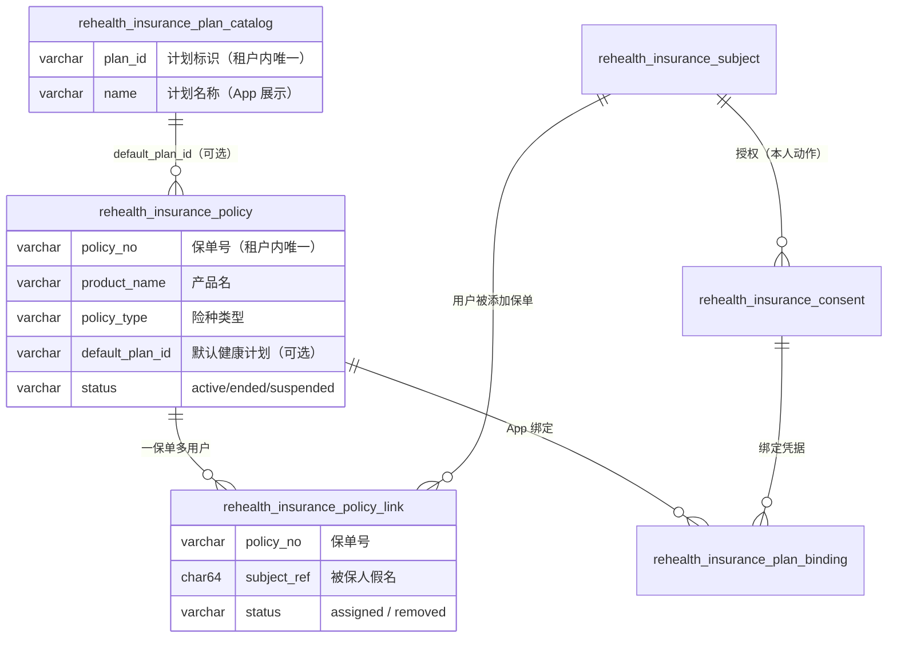
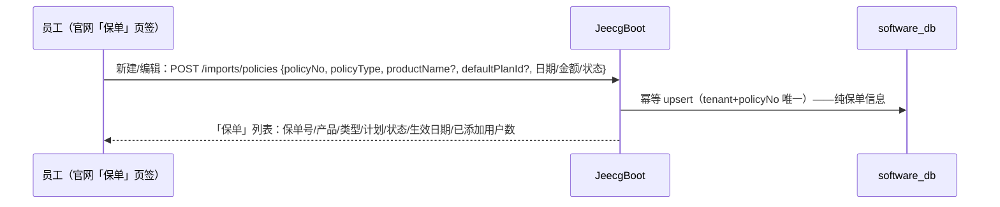
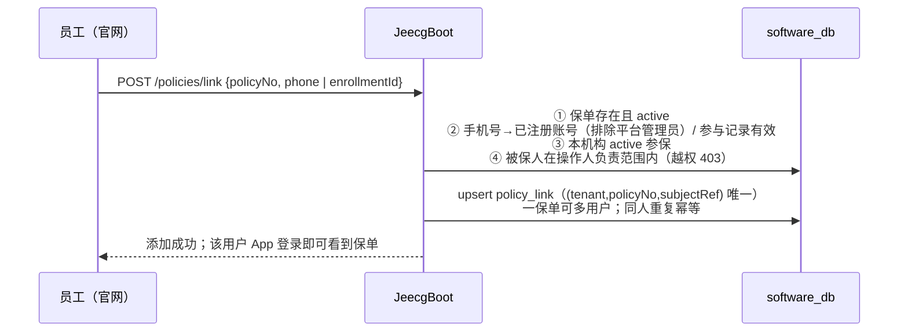
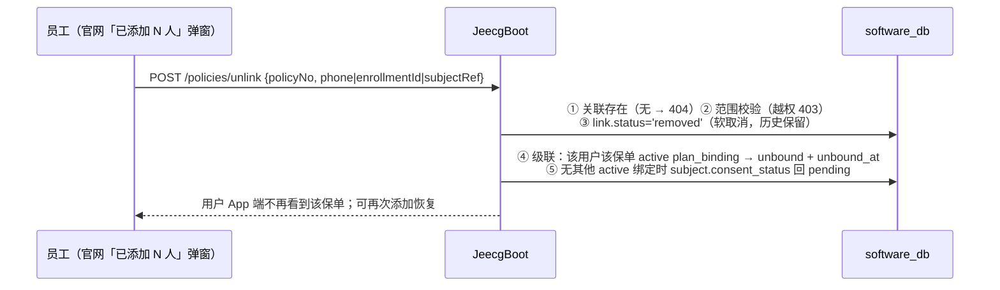
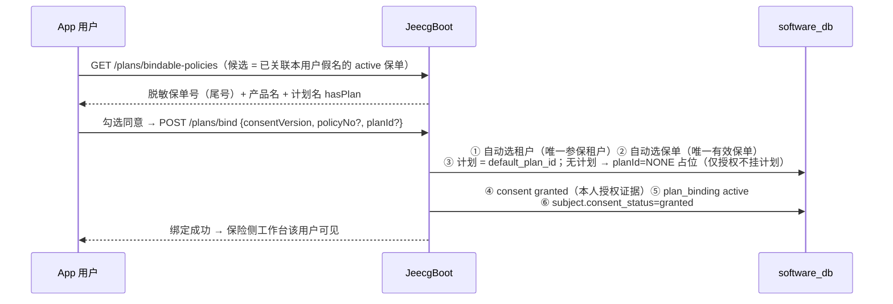

# 保险侧保单与计划管理（当前实现 · 内容优化版）

> 本文以**当前代码实现**为准，重写自早期"保单数据设计/计划与保单闭环/保单创建与派发流程"
> 三份文档。要点：保单是机构的基础保单库（无被保人字段参与），保单与用户的关系在
> `policy_link` 关联表（一保单可多用户），用户授权绑定在 App 完成（计划可选）。
> 接口契约以 `backend/contracts/INSURANCE_BUSINESS_API.md` 为权威。

## 1. 模型总览

三层关系一句话：**计划目录**说"计划是什么"（产品模板）→ 保单 `default_plan_id` 说
"这张保单默认给什么计划"（可空）→ **policy_link** 说"哪个用户被添加了这张保单" →
**plan_binding + consent** 说"用户同意加入了什么计划"（实例级）。

## 2. 基础保单库（新建 / 编辑 / 列表）

- 保单**不包含任何被保人信息**（历史列 `insured_subject_ref`/`assigned_at` 弃用保留，
  仅服务端批量导入兼容——指定时同步建一条关联）；
- 编辑复用同一 upsert（保单号不可改），**不会清除既有的用户关联**；
- 权限：`rehealth:insurance:business:import`（机构管理员/部门经理/运营员/admin，
  迁移 V20260826_1/2 授权）。

## 3. 保单-用户关联（添加 / 取消）

### 3.1 添加保单给用户

入口两处：「保单」页对某保单输入手机号；「我的客户」行内对某客户选保单（自动带参与记录）。

### 3.2 取消关联（软取消 + 级联）

### 3.3 状态与幂等

| 操作 | 状态/幂等 |
| --- | --- |
| 新建/编辑保单 | `(tenant, policy_no)` upsert；编辑不清除关联 |
| 添加给用户 | `(tenant, policy_no, subject_ref)` 唯一；同人重复幂等；一保单多用户 |
| 取消关联 | `removed` 软取消；重复取消幂等；可再添加 |
| 关联列表 | `GET /policies/{policyNo}/links`（按负责范围过滤，userName/员工/状态/时间） |

## 4. 计划目录（产品层模板）

- `rehealth_insurance_plan_catalog`：`(tenant, plan_id)` 唯一，`name`（App/官网展示）、
  `description`、`status`；种子：`PLAN-CHRONIC-2026`（慢病管理关怀计划）、
  `PLAN-CVD-2025`（心血管风险改善计划）；
- 官网「计划目录」弹窗查看/新增；权限 `care-plan:view/manage`；
- 保单导入时 `default_plan_id` 引用目录；**计划可选**——为空 = 仅保单、不挂计划。

## 5. App 授权绑定（零输入 + 计划可选）

- **授权是用户本人动作**（合规）：服务端不做代授权，`consentVersion` 必填；
- 多保单/多机构时用户点选（自动带租户与保单号）；
- 无计划保单绑定为 `NONE` 占位：App 卡片显示"仅授权，暂无健康计划"，后续补录计划后
  同一保单可再次绑定切换。

## 6. 端点与权限速查

| 端点 | 权限 | 说明 |
| --- | --- | --- |
| `POST /imports/policies` | `business:import` | 基础保单 upsert（新建/编辑，`insuredSubjectRef` 为兼容字段） |
| `GET /policies` | `business:import` | 保单库列表（纯保单信息 + linkCount；keyword 搜保单号/产品名） |
| `POST /policies/link` | `business:import` | 添加保单给用户（phone/enrollmentId 二选一） |
| `POST /policies/unlink` | `business:import` | 取消关联（三选一定位；级联终止绑定） |
| `GET /policies/{policyNo}/links` | `business:import` | 关联用户列表（按范围过滤） |
| `GET/POST /plans`（JeecgBoot 目录） | `care-plan:view/manage` | 计划目录 |
| `GET /mobile/.../plans/bindable-policies`、`POST .../bind` | App 登录态 | 候选与零输入绑定 |

## 7. 约束规则

1. 保单 `(tenant, policy_no)` 唯一；假名只接受 64 位 sha256 hex（服务端校验）；
2. 添加/取消关联都必须落在操作人负责范围（SELF/TEAM/全机构）；
3. 关联取消级联终止绑定；绑定终止后无其他 active 绑定则 consent 回 pending（退出工作台队列）；
4. App 绑定只认 `status='active'` 且已关联的保单；未关联保单 App 不可见；
5. 保单状态 ended/suspended 后：不能继续添加给用户、App 候选不再出现。

## 8. 历史演进记录

| 时间 | 变更 |
| --- | --- |
| 一期 | 保单携带 `insured_subject_ref`（被保人必填），导入即派发 |
| 2026-08-26 | 两步式：`insured_subject_ref` 可空 + `assigned_at`，先入库后按手机号分配（已分配他人 409） |
| 2026-08-26 | **基础保单库模型**：新增 `policy_link`（一保单多用户），保单不再参与用户关系；存量假名迁移为首条关联；两步式字段弃用保留；新增 link/unlink/links 端点与官网"已添加 N 人"弹窗 |
| 2026-08-26 | 计划可选（`NONE` 占位仅授权）——折中方案：先做闭环，计划目录可选挂接 |
