# 保险侧保单与计划管理（整合版）

> 本文由 3 篇原文档整合：保单数据设计、计划与保单两层设计及全流程闭环、保单创建与派发流程。
> 各原文内容完整保留为本文章节；接口契约见 `backend/contracts/INSURANCE_BUSINESS_API.md`。

---

## 第 1 部分 · 保单数据模型与表设计（原文档：保险侧保单与计划管理.md）

## 保险侧保单数据设计

> 本文档说明现有项目中"保单"如何建模、如何导入、如何与 App 授权绑定、如何在官网展示，
> 以及给某个被保人（如王老五）补充真实保单时需要提供哪些字段。
> 数据表结构与接口均与当前代码一致（`V20260812_2` 业务 schema、`V20260825_3` 默认计划字段、
> `V20260825_4` 计划目录表 + `InsuranceImportController` + `InsuranceMobilePlanService` + `InsurancePlanCatalogController`）。

## 1. 保单在保险业务模型中的位置

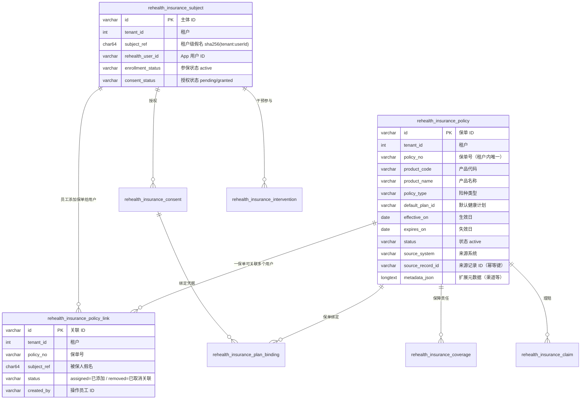

核心约定：
- **基础保单与用户解耦**：保单只存保单自身信息（无被保人字段参与）；保单-用户关系在
  `rehealth_insurance_policy_link`（`tenant_id + policy_no + subject_ref` 唯一，**一保单可关联多个用户**）
- 每张保单属于一个**租户**（保险公司），`(tenant_id, policy_no)` 唯一
- 保单不直接存身份证/手机号，用户身份只经 **subject_ref 假名** 关联
- `insured_subject_ref` / `assigned_at` 为历史列（弃用保留，兼容旧种子脚本；服务端批量导入
  指定被保人时同步写一条关联表行）

## 2. 保单表字段语义（`rehealth_insurance_policy`）

| 字段 | 必填 | 说明 |
| --- | --- | --- |
| `policy_no` | ✅ | 保单号，租户内唯一 |
| `product_code` / `product_name` | 可选 | 产品代码/名称（风险池展示 product_name） |
| `policy_type` | ✅ | 险种类型（如 health / life / accident，自由文本） |
| `default_plan_id` | 可选 | **默认健康计划 ID（保险侧导入保单时指定）**——App 零输入绑定时按它自动选计划 |
| `policyholder_subject_ref` | 可选 | 投保人假名（团单等场景投保人≠被保人） |
| `insured_subject_ref` | **弃用** | 历史列（服务端批量导入兼容，指定时同步建立关联表行）；官网基础保单不再使用 |
| `assigned_at` | **弃用** | 历史列（两步式过渡期使用）；现以 `policy_link.created_at` 为准 |
| `coverage_amount` / `premium_amount` / `deductible_amount` | 可选 | 保额/保费/免赔额（结算与 RWE 用） |
| `waiting_period_days` | 可选 | 等待期（天） |
| `effective_on` / `expires_on` | 可选 | 生效/失效日期（控制有效期） |
| `status` | ✅ | `active` 等；App 绑定只认 active |
| `source_system` / `source_record_id` | ✅ | 来源系统与源记录号，构成幂等唯一键 |
| `metadata_json` | 可选 | 扩展信息；风险池从中读 `$.channel`（渠道） |

## 3. 关联表一览

| 表 | 与保单的关系 | 关键字段 |
| --- | --- | --- |
| `rehealth_insurance_coverage` | 保单下多条保障责任 | `policy_id`、`subject_ref`、`coverage_code/name`、`limit_amount`、起止日、`status` |
| `rehealth_insurance_claim` | 保单下多条理赔 | `policy_id`、`subject_ref`、`claim_type`、事件日、提交/决定日、`billed/approved/paid_amount`、币种、`outcome_code` |
| `rehealth_insurance_consent` | 被保人级授权（与保单解耦） | `subject_ref`、`consent_type/version`、`granted_at/revoked_at`、证据引用 |
| `rehealth_insurance_consent_record` | 绑定时的授权留痕 | `tenant_id`、`subject_ref`、`consent_type/version`、`status=granted` |
| `rehealth_insurance_plan_binding` | **保单 ↔ 健康计划 ↔ 授权** 的绑定 | `tenant_id`、`subject_ref`、`policy_id`、`plan_id`、`consent_id`、`status=active` |
| `rehealth_insurance_plan_catalog` | **产品级计划目录**：保单 `default_plan_id` 引用的计划标识及其展示名称 | `tenant_id + plan_id` 唯一、`name`（App/官网展示计划名称）、`description`、`status` |
| `rehealth_insurance_intervention` | 被保人参与的计划干预 | `subject_ref`、`plan_id`、`consent_id`、`enrolled_at/ended_at`、`last_feedback_at` |

计划目录（`rehealth_insurance_plan_catalog`，`V20260825_4`）保存产品级健康计划模板；对具体用户的
计划实例仍由关怀计划（`care_plan`）承载。官网"我的客户"页顶部「计划目录」弹窗通过
`GET/POST /rehealth/insurance/v1/plans`（BFF `/api/insurer/plans`）按租户查看/新增计划；App 的
`bindable-policies` 与绑定响应返回 `planName`，绑定后“已加入的机构计划”直接展示计划名称。
`V20260825_4` 已为本地验收租户预置 `PLAN-CHRONIC-2026`（慢病管理关怀计划）与
`PLAN-CVD-2025`（心血管风险改善计划）。

## 4. 保单生命周期

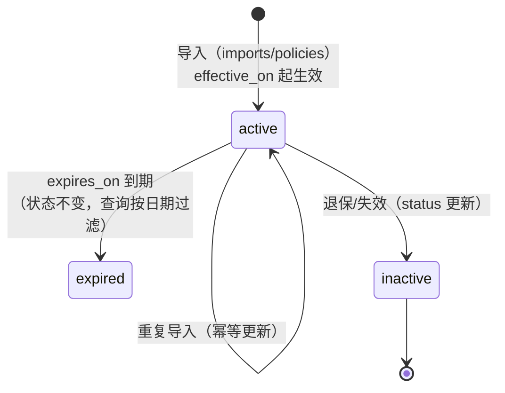

- 状态字段目前主要使用 `active`；到期与否由 `effective_on/expires_on` 判断
- **App 绑定只接受 `status='active'` 且存在 `policy_link` 关联当前用户 subject 的保单**

## 5. 三条核心流程

### 5.1 基础保单库 + 员工为用户添加保单

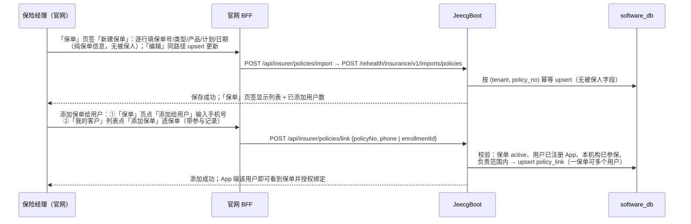

导入单行（`PolicyRow`）字段：`policyNo`（必填）、`productCode/productName`、`policyType`（必填）、
`defaultPlanId`（可选计划）、金额三件套、`waitingPeriodDays`、
`effectiveOn/expiresOn`、`status`、`sourceRecordId`、`metadata`。
（`policyholderSubjectRef`/`insuredSubjectRef` 为服务端批量导入的兼容字段，官网不再使用。）

> 说明：官网「我的客户」页的 **「保单」页签**承载保单库（新建/编辑/列表/添加给用户），
> 「我的客户」列表行内可直接为单个客户添加保单（BFF 转发，浏览器不持有 Jeecg 凭据），
> 权限 `rehealth:insurance:business:import`（机构管理员 / 保险经理 / 运营员）。核心系统对接
> 仍可直连 JeecgBoot 批量导入接口，官网 `/api/insurer/workflow/imports/policies` 支持 CSV/XLSX 文件导入。

### 5.2 App 绑定授权（用户进入干预工作台的授权环节）

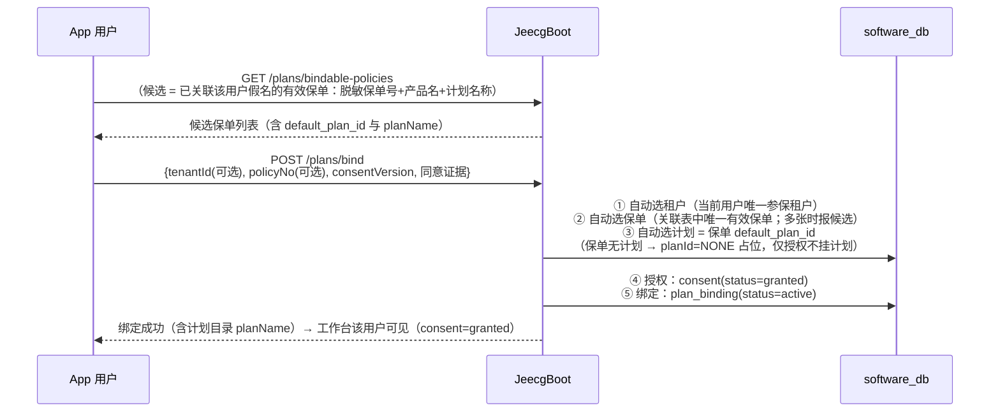

**零输入绑定**：用户不需要输入保单号、计划 ID——只需看到候选保单、勾选"同意授权"、点"加入"。
多保单/多机构时用户点选一次保单（App 自动带上对应租户与保单号）。
**计划可选**：保单 `default_plan_id` 为空时绑定照常成功，`plan_binding.plan_id='NONE'` 占位
（仅授权、不挂计划），`planName` 为空、App 显示"仅授权，暂无健康计划"；后续补录计划后
同一保单可再次绑定切换。

### 5.3 官网保单展示（风险池）

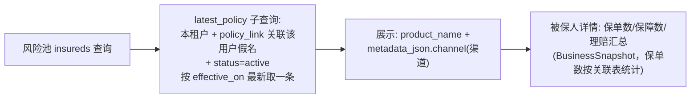

## 6. 幂等与租户隔离规则

1. `(tenant_id, policy_no)` 唯一 → 同保单号重复导入是更新，不会重复建保单
2. `(tenant_id, source_system, source_record_id)` 唯一 → 来源系统幂等键
3. `(tenant_id, policy_no, subject_ref)` 唯一 → 同一保单同一用户只关联一次；一保单可关联多个用户
4. 关联可取消：`unlink` 软取消（`status='removed'`，历史保留）并级联终止该用户该保单的 active `plan_binding`；用户无其他 active 绑定时 consent 回 pending
4. 关联时被保人假名必须在**同一租户**内已存在（先参保、后添加），跨租户直接拒绝
5. 保单不含任何直接身份标识；外部证件号只存哈希（`external_subject_ref_hash`）

## 7. 为王老五补真实保单需要提供的信息

| 字段 | 是否必须 | 示例 | 说明 |
| --- | --- | --- | --- |
| 保单号 `policy_no` | ✅ | `P2026-WLW-0001` | 真实保单号 |
| 险种 `policy_type` | ✅ | `health`（健康险） | 真实险种 |
| 产品名称 `product_name` | 建议 | `XX人寿·慢病管理健康险` | 风险池展示用 |
| 产品代码 `product_code` | 可选 | `RH-HEALTH-01` | 真实产品代码 |
| 保额/保费/免赔 | 可选 | `100000.00 / 1200.00 / 10000.00` | 有则填真实值 |
| 生效日 `effective_on` | ✅ | `2026-08-01` | 须已生效或即将生效 |
| 失效日 `expires_on` | 可选 | `2027-08-01` | 长期险可不填 |
| 渠道 `metadata.channel` | 可选 | `代理人渠道` | 风险池筛选维度 |
| 默认计划 `default_plan_id` | ✅ | `PLAN-CHRONIC-2026` | 健康计划 ID，App 零输入绑定依赖它；名称取自计划目录表（无对应目录条目时 App 回退显示计划 ID） |
| 来源系统/源记录号 | ✅ | `core_system / CORE-P2026...` | 幂等键，用你们核心系统值 |

**用户关联**：建好基础保单后，员工在官网把保单**添加给王老五**（「保单」页输入手机号
`18890254413`，或「我的客户」列表选保单）→ 系统按手机号解析他在租户 1000 的假名并写入
`rehealth_insurance_policy_link`。

**示例导入行（PolicyRow JSON，基础保单）**：

```json
{
  "policyNo": "P2026-WLW-0001",
  "productCode": "RH-HEALTH-01",
  "productName": "睿禾慢病管理健康险",
  "policyType": "health",
  "coverageAmount": 100000.00,
  "premiumAmount": 1200.00,
  "deductibleAmount": 10000.00,
  "waitingPeriodDays": 30,
  "effectiveOn": "2026-08-01",
  "expiresOn": "2027-08-01",
  "status": "active",
  "sourceSystem": "core_system",
  "sourceRecordId": "CORE-P2026-WLW-0001",
  "defaultPlanId": "PLAN-CHRONIC-2026",
  "metadata": {"channel": "代理人渠道"}
}
```

**补完保单之后的授权闭环**：员工为王老五添加保单后，王老五在 App 内执行"加入保险计划"
零输入一键绑定（无需输入保单号：服务端自动选租户/保单/计划，用户勾选同意授权）→
`consent=granted` + 计划绑定生效 → 官网干预改善工作台立即出现该用户（低风险 → 待复核队列）。

## 8. 常见问题

- **保单建不进去**：保单号重复会更新；`source_record_id` 冲突走来源幂等键
- **App 绑定失败**：保单未添加给该用户、保单未生效/已失效、用户无 active 参保关系
- **绑定后只显示计划 ID 不显示名称**：`default_plan_id` 不在当前租户计划目录中，官网"我的客户 → 计划目录"新增对应计划后再编辑保单
- **保单显示"未命名产品"**：`product_name` 未填，风险池展示为空
- **重复导入**：同 `policy_no` 会覆盖更新，不会产生两张保单

---

## 第 2 部分 · 计划与保单两层设计及全流程闭环（原文档：保险侧保单与计划管理.md）

## 保险侧计划与保单设计 · 从用户注册到保单分配的全流程闭环

> 本文档说明"健康计划"与"保单"在系统中的两层设计关系，并串起
> **用户注册 → 导入参保人 → 计划目录 → 保单导入（指定计划）→ 认领 →
> App 零输入绑定授权 → 风险分层/干预工作台** 的完整闭环。
> 表结构与接口均与当前代码一致，配套文档：《保险侧保单与计划管理.md》、
> 《保险侧服务关系与扫码关联.md》、`backend/contracts/INSURANCE_BUSINESS_API.md`。

## 1. 计划与保单的设计关系（两层模型）

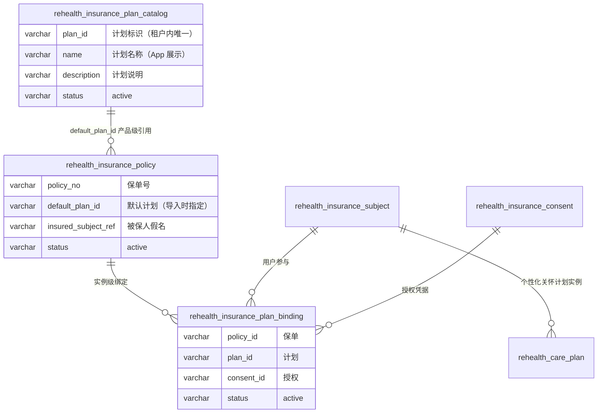

**两层设计**：

| 层 | 表 | 含义 | 谁操作 |
| --- | --- | --- | --- |
| **产品层**（模板） | `rehealth_insurance_plan_catalog` | 计划目录：`plan_id → 名称/说明`，租户级产品模板 | 保险侧（官网「计划目录」查看/新增） |
| **产品层**（挂接） | `rehealth_insurance_policy.default_plan_id` | 保单导入时指定该保单对应哪个计划 | 保险侧导入保单时指定 |
| **实例层**（生效） | `rehealth_insurance_plan_binding` | 用户 × 保单 × 计划 × 授权 的绑定（计划真正落到用户头上） | 用户在 App 一键授权绑定 |
| **实例层**（个性化） | `rehealth_care_plan`（版本化） | 针对具体用户发布的关怀计划内容与任务（可覆盖/增强产品级计划） | 保险侧在工作台创建并发布 |

一句话：**计划目录是"计划是什么"，保单的 default_plan_id 是"这张保单给什么计划"，计划绑定是"这个用户通过这张保单实际加入了什么计划"，关怀计划是"给这个人定制的计划内容"。**

## 2. 全流程闭环总览

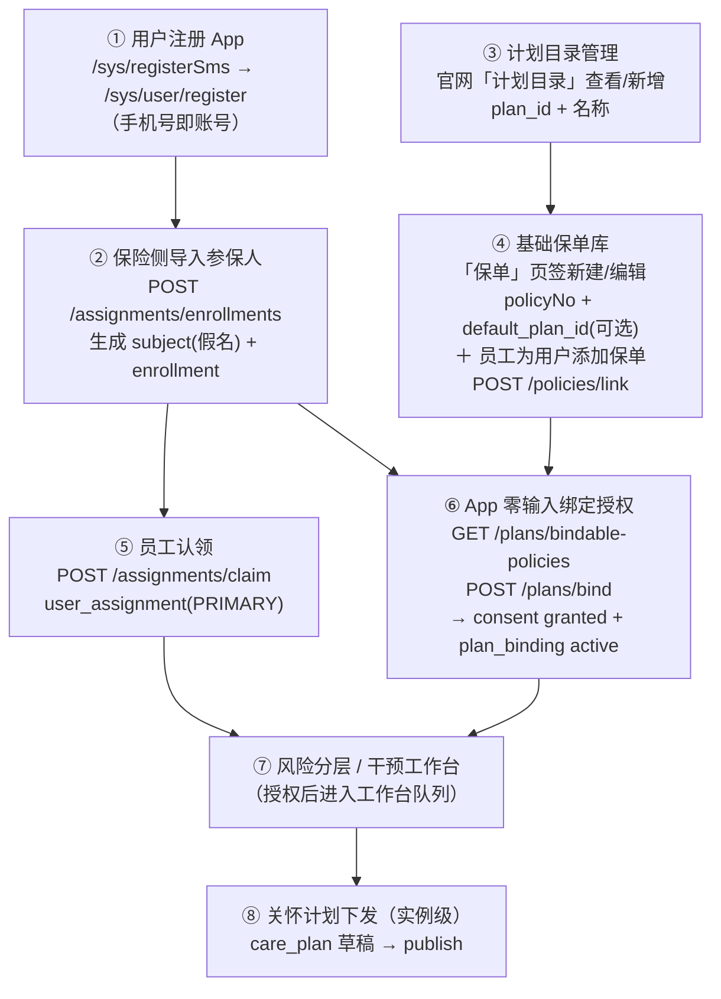

各阶段可以独立发生，但 **⑥ 绑定** 需要 ②（参保）+ ④（保单）+ ⑤（服务关系可选，管理员视角不需要）全部就绪；
**⑦ 工作台** 额外要求 ⑥ 的授权 `consent=granted`。

## 3. 分阶段详解

### 阶段① 用户注册（App 侧）

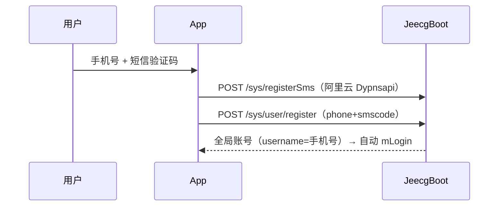

落点：`sys_user`（全局账号，**不归属任何保险租户**）。此时保险侧还看不到该用户。

### 阶段② 保险侧导入参保人

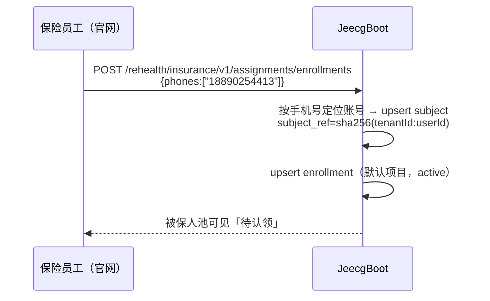

落点：`rehealth_insurance_subject`（consent=pending）、`rehealth_insurance_enrollment`。

### 阶段③ 计划目录管理（保险侧）

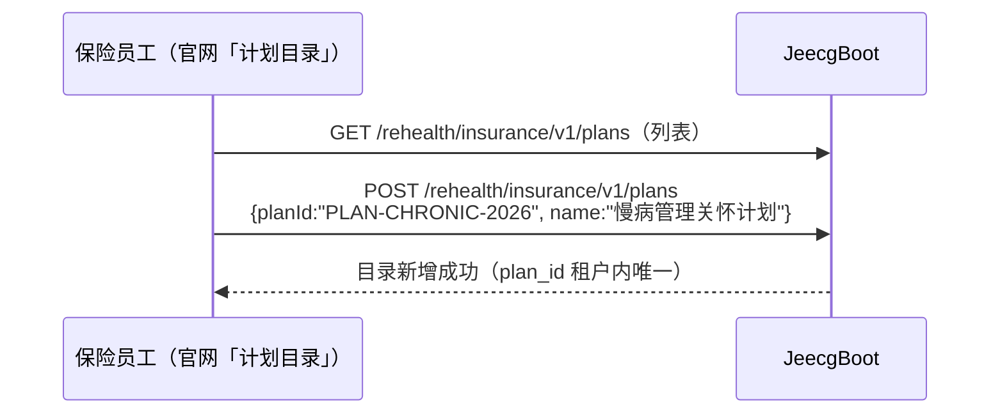

落点：`rehealth_insurance_plan_catalog`。

### 阶段④ 基础保单库 + 员工为用户添加保单（计划可选）

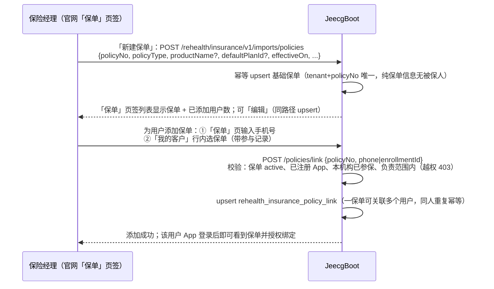

落点：`rehealth_insurance_policy`（基础保单）+ `rehealth_insurance_policy_link`（保单×用户关联）。
约束：添加保单时用户须已参保（即先做阶段②）且在负责范围内；手机号须为已注册 App 的参保用户；
`default_plan_id` 可选，指定时建议先在目录中登记。官网入口为「我的客户 → 保单页签（新建/编辑/添加给用户）
/ 我的客户行内添加保单」，服务端批量导入走同一 JeecgBoot 导入接口（`insuredSubjectRef` 为兼容字段，
指定时同步建立关联）。

### 阶段⑤ 员工认领（服务关系）

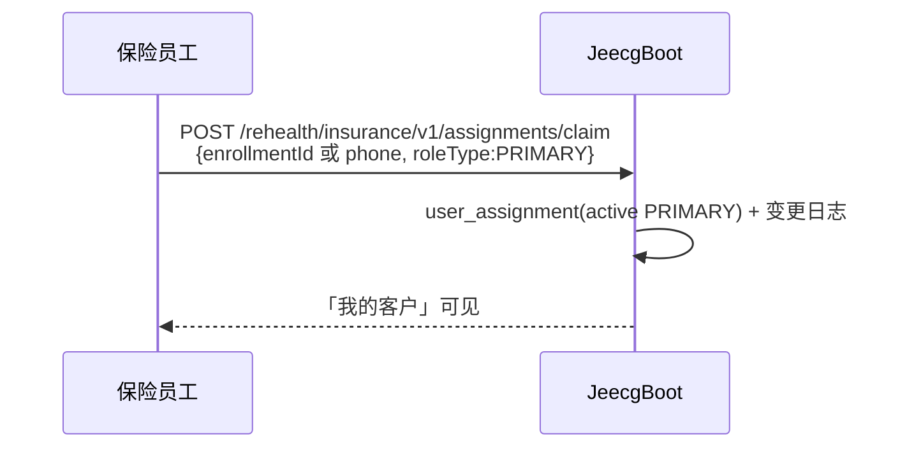

落点：`rehealth_insurance_user_assignment` + `rehealth_insurance_assignment_change_log`。

### 阶段⑥ App 零输入绑定授权（计划真正落到用户）

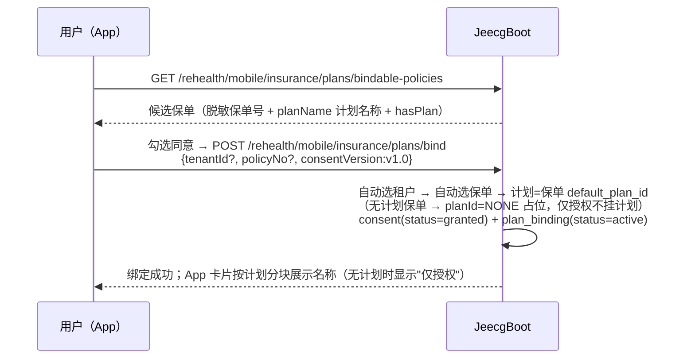

落点：`rehealth_insurance_consent`（granted）、`rehealth_insurance_plan_binding`（active）、
`rehealth_insurance_subject.consent_status=granted`。
多保单/多机构时用户点选候选即可，仍无需输入任何号码。

**计划可选（折中方案）**：`default_plan_id` 允许为空。保单未指定计划时绑定照常成功，
`plan_binding.plan_id = 'NONE'` 占位（仅授权，不挂计划），App 只显示保单、卡片副文案
"仅授权，暂无健康计划"；`planName` 对 `NONE` 返回空。后续补录计划后，同一保单可再次
绑定切换到真实计划。

### 阶段⑦ 风险分层与干预工作台

- 风险池：按服务关系范围展示被保人（不需授权）
- 工作台：要求 `consent=granted`（授权是数据使用的合规门槛），低风险进入"待复核"、
  高风险进入"待行动"，员工创建行动/关怀计划推动 in_progress → improved

### 阶段⑧ 关怀计划下发（实例级个性化）

保险侧在工作台对已授权用户创建关怀计划（`POST /interventions/{subjectId}/care-plans` → 草稿 →
`publish` 发布版本），App 展示计划内容与今日任务，用户反馈驱动依从性与状态流转。

## 4. 各阶段数据落点总表

| 阶段 | 写入表 | 关键状态 |
| --- | --- | --- |
| ① 注册 | `sys_user` | 全局账号，无租户归属 |
| ② 导入参保人 | `rehealth_insurance_subject`、`rehealth_insurance_enrollment` | enrollment=active，consent=pending |
| ③ 计划目录 | `rehealth_insurance_plan_catalog` | active |
| ④ 保单 | `rehealth_insurance_policy`（基础保单）+ `rehealth_insurance_policy_link`（添加给用户） | active / assigned；default_plan_id 可选（为空=仅保单，无计划） |
| ⑤ 认领 | `rehealth_insurance_user_assignment` + change_log | active PRIMARY |
| ⑥ 绑定授权 | `rehealth_insurance_consent`、`rehealth_insurance_plan_binding`、subject.consent | granted / active（plan_id 可为 NONE 占位） |
| ⑦ 工作台 | 只读聚合（风险/反馈/行动） | 按范围 + 授权过滤 |
| ⑧ 关怀计划 | `rehealth_care_plan*` 版本化表 | 草稿 → published |

## 5. 关键约束与幂等规则

1. 保单与计划都是**租户级**：`(tenant_id, policy_no)`、`(tenant_id, plan_id)` 唯一
2. 保单的被保人假名必须在同一租户内已存在（先参保、后保单）
3. `default_plan_id` 可选：指定时建议在计划目录中登记（未登记也能绑定，App 显示计划标识而非名称）；为空时保单照常导入，用户绑定为 `plan_id=NONE` 占位（仅授权、不挂计划，App 显示"仅授权，暂无健康计划"）
4. 绑定授权是**用户本人动作**（App 勾选同意），服务端不做代授权；这是进入工作台的合规门槛
5. 重复导入/重复绑定全部幂等（upsert），不会产生重复保单或重复绑定
6. 一个用户可在多家机构各自参保、各自有保单、各自绑定计划——实例层互相隔离

## 6. 与真实用户对照（王老五实例）

| 阶段 | 实际数据 |
| --- | --- |
| ① 注册 | 账号 18890254413（王老五），App 自助注册 |
| ② 参保 | 租户 1000 与 9102 各有 subject + enrollment（active） |
| ③ 计划目录 | PLAN-CHRONIC-2026 = 慢病管理关怀计划（1000/9102 均有） |
| ④ 保单 | 1000：8850882026080003712；9102：8850882026090004821，均指定 PLAN-CHRONIC-2026 |
| ⑤ 认领 | 1000：陈立峰（PRIMARY）；9102：管理员视角（无需归属） |
| ⑥ 绑定 | 1000 已授权绑定；9102 待用户在 App 点「加入」 |
| ⑦ 工作台 | 1000 已进入（待复核）；9102 授权后进入 |

---

## 第 3 部分 · 保单创建与派发（添加/取消关联）流程（原文档：保险侧保单与计划管理.md）

## 保险侧保单创建与派发流程：谁创建保单、保单如何到达 App 用户

> 本文回答三个问题：**保单由谁创建？由谁"派发"给对应的 App 用户？这一系列流程长什么样？**
> 内容与当前代码一致（JeecgBoot `InsuranceImportController/Service`、
> `InsuranceAssignmentService.enrollUsers`、`InsuranceMobilePlanService`，
> 官网 BFF `insurer_assignment_routes.py`，App `InsurancePlanBindingViewModel`）。
> 配套文档：《保险侧保单与计划管理.md》、《保险侧保单与计划管理.md》、
> `backend/contracts/INSURANCE_BUSINESS_API.md`。

## 0. 一句话结论

- **保单 = 保险机构自己的基础保单库**：机构管理员 / 保险经理 / 保险运营员在官网
  **「保单」页签新建/编辑**基础保单（保单号、产品、类型、计划、日期、状态等**保单自身信息，
  不含被保人**），或经 JeecgBoot 导入接口批量入库，权限 `rehealth:insurance:business:import`。
- **员工为用户添加保单**：在「保单」页签按手机号、或在「我的客户」列表直接对某个客户
  **「添加保单」**（选一张基础保单），写入 `rehealth_insurance_policy_link` 关联表——
  **一张保单可添加给多个用户**。后端校验：保单 active、用户已注册 App、已在本机构参保、
  在操作人负责范围内；同人重复添加幂等。
- **App 用户同意**：添加关联后，用户登录 App 在候选保单里看到该保单，勾选同意完成
  **零输入绑定授权**（合规：授权必须是用户本人动作），授权后进入保险侧工作台。

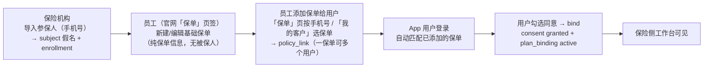

## 1. 角色与职责总表

| 角色 | 动作 | 入口 / 接口 | 权限 |
| --- | --- | --- | --- |
| **App 用户** | 注册 App（手机号即账号） | `/sys/user/register` | 无需 |
| **保险机构（官网）** | 导入参保人：输入已注册 App 的手机号，建立被保人假名与参与关系（被保人池） | 官网「我的客户 → 导入参保人」→ BFF `POST /api/insurer/assignments/enrollments` → JeecgBoot `POST /rehealth/insurance/v1/assignments/enrollments` | `rehealth:insurance:assignment:manage` |
| **保险经理/管理员/运营（官网）** | **创建保单（入库）**：官网「导入保单」弹窗，被保人**可选**（不选则先进保单库），填写保单信息（计划可选） | 官网 BFF `POST /api/insurer/policies/import` → JeecgBoot `POST /rehealth/insurance/v1/imports/policies` | `rehealth:insurance:business:import`（机构管理员 / 保险经理 / 运营员 / admin） |
| **保险经理/管理员/运营（官网）** | **分配保单**：对未分配保单输入用户注册手机号，分配到其名下 | 官网 BFF `POST /api/insurer/policies/assign` → JeecgBoot `POST /rehealth/insurance/v1/policies/assign` | 同上 |
| **保险经理/管理员/运营（官网）** | 查看保单列表（未分配保单全员可见；已分配保单按负责范围） | 官网「保单」页签 → BFF `GET /api/insurer/policies` → JeecgBoot `GET /rehealth/insurance/v1/policies` | 同上 |
| **保险机构（服务端）** | **创建保单**：批量导入（核心系统对接），指定 `insuredSubjectRef` 与可选 `defaultPlanId` | JeecgBoot `POST /rehealth/insurance/v1/imports/policies`（无保险责任角色的服务账号不受范围限制） | 同上 |
| **保险员工** | 认领被保人（服务关系，可选，管理员视角不需要） | 官网「被保人池 → 认领」→ `POST /api/insurer/assignments/claim` | `rehealth:insurance:assignment:manage` |
| **App 用户** | 查看候选保单 → 勾选"同意授权" → 加入 | App `GET /plans/bindable-policies` → `POST /plans/bind` | 本人动作（合规） |
| **保险侧（工作台）** | 授权后在工作台看到该用户，做风险分层 / 干预 / 关怀计划 | 官网「干预改善工作台」 | `rehealth:insurance:assignment:view` 等 |

## 2. 关键机制：被保人假名 `subject_ref`（保单与 App 用户的"挂钩点"）

保单不存手机号、不存 App 账号明文，只存 64 位假名：

```
subject_ref = sha256( tenantId + ":" + userId )   # 租户级假名，跨机构不可关联
```

- `userId` 是全局账号 ID（App 注册产生的 `sys_user`）。
- 同一自然人在不同保险机构各自生成**不同的假名**（前缀含 tenantId），机构间数据不可串。
- 假名的两条创建路径（都会返回/展示 subject_ref 给保险侧）：

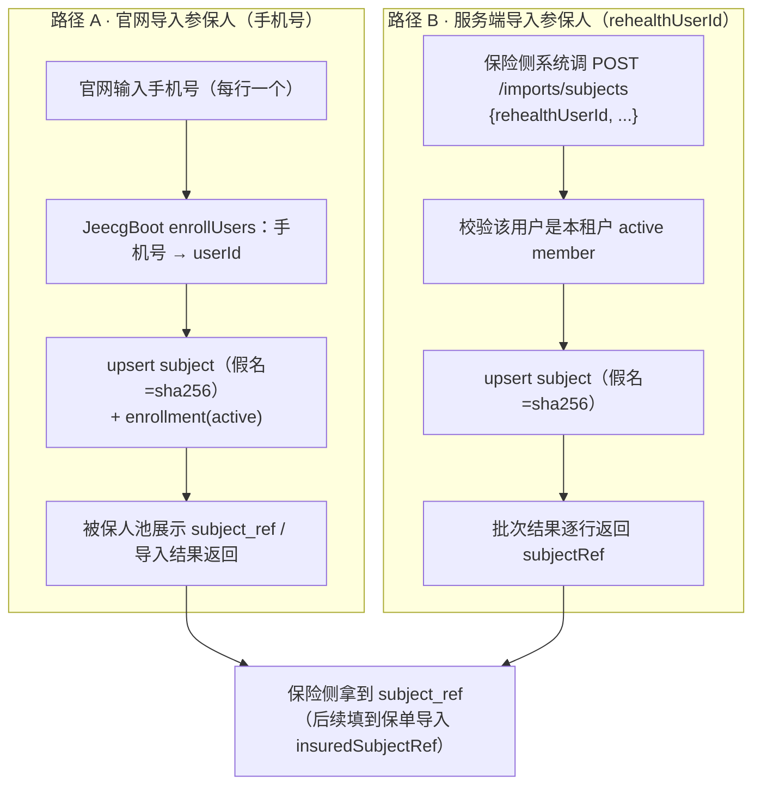

> 保险侧**无需自己计算**假名：官网被保人池、`/imports/subjects` 批次结果、
> `/assignments/enrollments` 列表里都能拿到每条参保记录对应的 `subject_ref`。

## 3. 保单创建（导入）——谁、在哪、怎么建

### 3.1 入口与权限

| 项 | 值 |
| --- | --- |
| 官网入口 | 「我的客户」页 **⇪ 导入保单** 弹窗（逐行：被保人可选 + 保单号 + 类型 + 产品名 + 计划 + 生效日期）、「保单」页签（未分配保单可「分配」） |
| 官网 BFF | `POST /api/insurer/policies/import`、`POST /api/insurer/policies/assign`、`GET /api/insurer/policies`、`GET /api/insurer/policies/dispatchable-subjects`（浏览器不持有 Jeecg 凭据，全部经服务端会话转发） |
| JeecgBoot 接口 | `POST /rehealth/insurance/v1/imports/policies`（新建/编辑基础保单，幂等 upsert）、`POST /rehealth/insurance/v1/policies/link`（为用户添加保单）；`GET /rehealth/insurance/v1/policies`（保单库）、`GET /rehealth/insurance/v1/policies/dispatchable-subjects` |
| 权限 | `rehealth:insurance:business:import`（角色：机构管理员 `insurance_org_admin`、**保险经理 `insurance_department_manager`**、保险运营员 `insurance_operator`、`admin`） |
| 添加范围 | 「添加保单」校验负责范围（员工=自己的客户，主管=团队，管理员=全机构）；保单库本身为机构共享 |
| 幂等 | 行级：`(tenant_id, policy_no)` 唯一 upsert；关联：`(tenant_id, policy_no, subject_ref)` 唯一，同人重复添加幂等；批次级：`idempotencyKey` 重放直接返回原结果 |

### 3.2 官网「新建/编辑基础保单」（保单库）

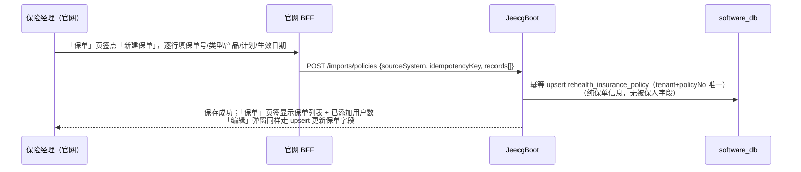

### 3.3 官网「为用户添加保单」（关联表）

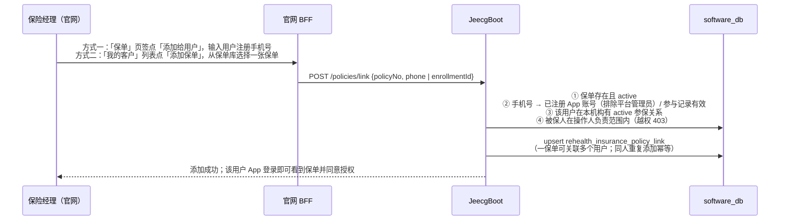

### 3.4 官网「取消保单与用户的关联」（软取消 + 绑定级联）

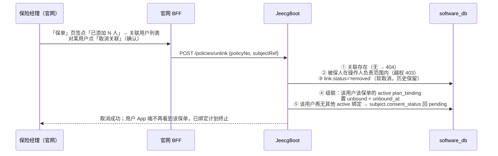

重复取消幂等（`removed` 状态直接返回）；取消后员工可再次「添加保单」恢复关联。

### 3.5 请求字段（PolicyRow / LinkRequest / UnlinkRequest）

| 字段 | 必填 | 说明 |
| --- | --- | --- |
| `policyNo` | ✅ | 保单号，`(tenant_id, policy_no)` 唯一 |
| `policyType` | ✅ | 保单类型 |
| `defaultPlanId` | 可选 | 默认健康计划 ID（指向计划目录）；为空=仅保单、无计划（App 绑定为 `NONE` 占位授权） |
| `productCode` / `productName` | 可选 | 产品代码/名称（App 候选保单展示用） |
| `coverageAmount` / `premiumAmount` / `deductibleAmount` | 可选 | 保额 / 保费 / 免赔额 |
| `waitingPeriodDays` | 可选 | 等待期（非负） |
| `effectiveOn` / `expiresOn` | 可选 | 生效/失效日期（失效不得早于生效） |
| `status` | 可选 | 默认 `active` |
| `insuredSubjectRef` | **弃用** | 服务端批量导入兼容字段：指定时同步建立一条保单-用户关联（仍校验参保+负责范围） |
| LinkRequest `phone` / `enrollmentId` | 二选一 | 手机号（注册 App）或参与记录 ID，用于定位要添加保单的用户 |
| UnlinkRequest `phone` / `enrollmentId` / `subjectRef` | 三选一 | 定位要取消关联的用户（官网弹窗自动带 subjectRef） |

### 3.6 落表

- 基础保单：`rehealth_insurance_policy`（tenant_id、policy_no、default_plan_id、status 等，**无被保人字段参与**；`insured_subject_ref`/`assigned_at` 已弃用保留）
- 保单-用户关联：`rehealth_insurance_policy_link`（`tenant_id + policy_no + subject_ref` 唯一，一保单多用户）

## 4. 保单"到达用户"：添加关联 + App 用户授权绑定

1. **添加保单**（员工动作）：`POST /policies/link`，校验注册/参保/负责范围后写入 `rehealth_insurance_policy_link`（可多个用户）；
2. **系统自动匹配**（用户登录后即生效）：按登录账号找到他的假名，再找**已关联**该假名的有效保单；
3. **用户本人授权绑定**：App 勾选"同意授权"点「加入」，服务端写 consent + plan_binding。

### 4.1 匹配逻辑（bindable-policies）

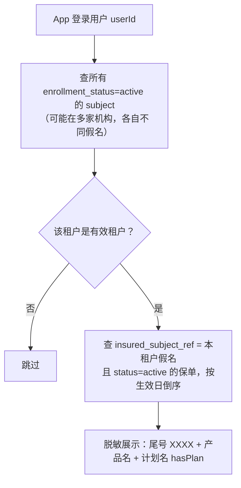

- 候选保单脱敏（仅尾号 4 位）；多机构时按机构分组展示。
- 用户看到的就是"保险公司已经为这张保单挂好的自己"——无需输入保单号。

### 4.2 零输入绑定（bind）

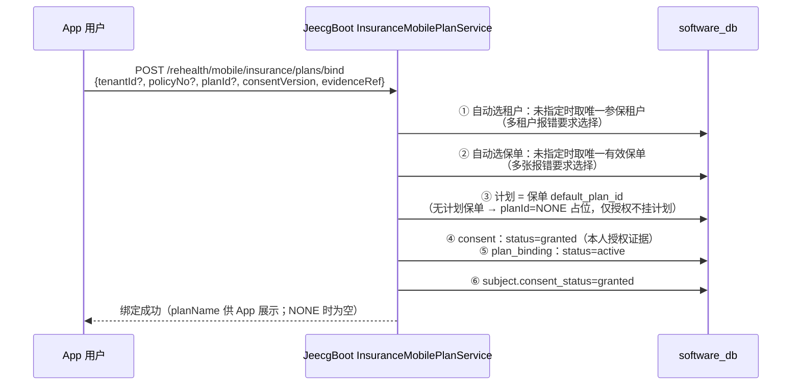

- 幂等：重复绑定（同租户+同假名+同保单+同计划）走 upsert，不产生重复记录。
- 授权后 `subject.consent_status=granted`，该用户进入保险侧工作台队列（授权是数据使用的合规门槛）。

### 4.3 "添加保单"的精确含义

| 通俗说法 | 系统实际机制 |
| --- | --- |
| 员工"把保单派给用户" | 「保单」页按手机号 / 「我的客户」选保单 → `POST /policies/link` 写入 `rehealth_insurance_policy_link`（一保单可多个用户） |
| 用户"收到保单" | App 按登录身份匹配**已关联**该用户假名的有效保单（`bindable-policies`；未关联的保单不可见） |
| 用户"签收" | 勾选同意 → bind → consent granted + plan_binding active |

## 5. 全链路时序图（建保单 → 添加给用户 → 授权 → 工作台）

```mermaid
sequenceDiagram
    participant APP as App 用户
    participant SITE as 官网（保险机构）
    participant JEE as JeecgBoot
    participant DB as software_db
    Note over APP: ① 注册：手机号 → 全局账号 sys_user
    APP->>JEE: /sys/user/register（手机号+验证码）
    SITE->>JEE: ② 导入参保人：POST /assignments/enrollments {phones[]}
    JEE->>DB: subject(假名=sha256(tenantId:userId)) + enrollment(active)
    SITE->>JEE: ③ 新建基础保单：POST /imports/policies {policyNo, policyType, defaultPlanId?}
    JEE->>DB: rehealth_insurance_policy（纯保单信息，无被保人）
    SITE->>JEE: ④ 员工添加保单给用户：POST /policies/link {policyNo, phone|enrollmentId}
    JEE->>DB: 校验注册/参保/负责范围 → policy_link（一保单可多个用户）
    SITE->>JEE: ⑤ （可选）员工认领被保人 → user_assignment(PRIMARY)
    APP->>JEE: ⑥ GET /plans/bindable-policies
    JEE-->>APP: 我的保单候选（脱敏 + 计划名 hasPlan）
    APP->>JEE: ⑦ POST /plans/bind（勾选同意）
    JEE->>DB: consent(granted) + plan_binding(active) + subject.consent=granted
    SITE->>JEE: ⑧ 工作台查询（授权后可见）→ 风险分层/干预/关怀计划
```

## 6. 约束与幂等规则

1. **基础保单与用户解耦**：保单库只存保单自身信息（无被保人）；保单-用户关系在 `rehealth_insurance_policy_link`（`tenant_id + policy_no + subject_ref` 唯一）。
2. **一保单可多个用户**：同一保单可添加给多个用户（家庭单/团单场景）；同人重复添加幂等，不会产生重复关联。取消关联为软取消（`status='removed'`，历史保留），可再次添加恢复。
3. **取消关联级联**：`POST /policies/unlink` 取消关联时，同步终止该用户该保单的 active `plan_binding`（置 `unbound`）；该用户在本租户再无 active 绑定时 `subject.consent_status` 回 `pending`（退出工作台队列）。范围校验同添加（越权 403）；无关联返回 404；重复取消幂等。
3. **添加校验四连**：`POST /policies/link` 要求 ① 保单存在且 active；② 手机号对应已注册 App 账号（排除平台管理员）或参与记录有效；③ 该用户在本机构有 active 参保关系；④ 被保人在操作人负责范围内（越权 403「该被保人不在您的负责范围内」）。
4. **只添加给负责范围的用户**：员工只能给自己的客户，主管可给团队，管理员可给全机构。无保险责任角色的核心系统服务账号不受限（保持服务端对接兼容）。
5. **租户级隔离**：`(tenant_id, policy_no)` 唯一；假名含 tenantId 前缀，跨机构不可关联。
6. **重复导入幂等**：同一保单号重复导入为 update（官网「编辑」同路径），不产生重复保单，也不会清除既有关联；批次 `idempotencyKey` 重放直接回放原结果。
7. **绑定授权是用户本人动作**：服务端不做代授权；`consentVersion` 必填（用户勾选同意的版本证据）。
8. **计划可选**：`defaultPlanId` 为空时用户绑定为 `planId=NONE` 占位（仅授权、不挂计划），App 显示"仅授权，暂无健康计划"；后续补录计划后同一保单可再次绑定切换。
9. **多保单/多机构需要用户选择**：自动匹配仅在"唯一参保租户 / 唯一有效保单"时零输入直通，否则 App 展示候选让用户点选。

## 7. 常见问题

**Q1：官网哪里维护基础保单？**
「我的客户」页 **「保单」页签**：右上角 **▤ 新建保单**（逐行录入保单号/类型/产品/计划/生效日期，
持 `rehealth:insurance:business:import` 权限或机构管理员角色可见，保险经理/部门经理与机构管理员均已具备）；
列表中每张保单可**编辑**（保单号不可改，其余字段 upsert 更新），并显示**已添加用户数**。
核心系统对接仍可直连 JeecgBoot 批量导入接口。
> 若机构管理员此前登录过，提示"缺少保单导入权限"：新权限写入后 JeecgBoot 的 Shiro 权限缓存
> 会按 TTL 自动刷新；本地环境可删除 `shiro:cache:*authorizationCache:<userId>` 立即生效，
> 或重新登录官网（BFF 按角色放行，重登后即可用）。

**Q2：怎么把保单添加给用户？**
两种方式：① 「保单」页签对某保单点 **「添加给用户」**，输入用户**注册手机号**；
② 「我的客户」列表对某个客户点 **「添加保单」**，从保单库选择一张保单（自动带上该客户的参与记录）。
两种方式都要求该用户已注册 App、已在本机构参保、并在您的负责范围内。

**Q3：一张保单能添加给多个用户吗？**
能。关联表按「保单 × 用户」记录，家庭单/团单等一张保单可添加给多个 App 用户；同一用户
重复添加同一保单幂等。用户在 App 端各自看到该保单并各自授权绑定。

**Q4：保单建好了，为什么用户 App 里看不到？**
先看是否已**添加给该用户**（未添加的保单 App 端不可见）；再依次检查：① 该用户在本租户
enrollment 是否 active；② 保单 `status=active` 且存在 `policy_link` 关联该用户假名；③ 租户本身有效。
多机构场景下需确认查的是该用户对应机构。

**Q5：同一机构下同一用户有多张保单会怎样？**
`bindable-policies` 全部展示；`bind` 不指定 `policyNo` 时会报"存在多张有效保单，请先选择保单"，
App 让用户点选一张再绑定。多机构同理需先选机构（自动带上对应租户）。

**Q6：想给还没认领的用户添加保单怎么办？**
先在「被保人池」认领（或由主管/管理员导入），建立服务关系后再添加；未认领用户不在
员工的负责范围内，添加会被拒绝。保单本身可以先建好放在保单库。

## 8. 与真实数据对照（本地 QA 环境）

| 环节 | 实际数据示例 |
| --- | --- |
| App 注册 | 王老五 `18890254413`（App 自助注册） |
| 导入参保 | 王老五在租户 1000 与 9102 各有 subject + enrollment（active），假名分别为 `feff7ec2...` 与 `91bee334...` |
| 保单创建 | 1000：`8850882026080003712`；9102：`8850882026090004821`，均指定 `PLAN-CHRONIC-2026` |
| 无计划保单 | 9101 租户 `RH-9101-POL-0002`（`default_plan_id` 为空） |
| App 授权绑定 | 1000 已授权绑定（工作台可见）；9102 待用户在 App 点「加入」；9101 无计划保单绑定后 `planId=NONE`、status=active |
