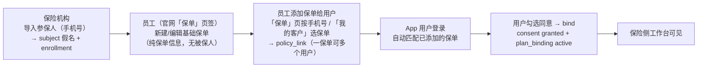
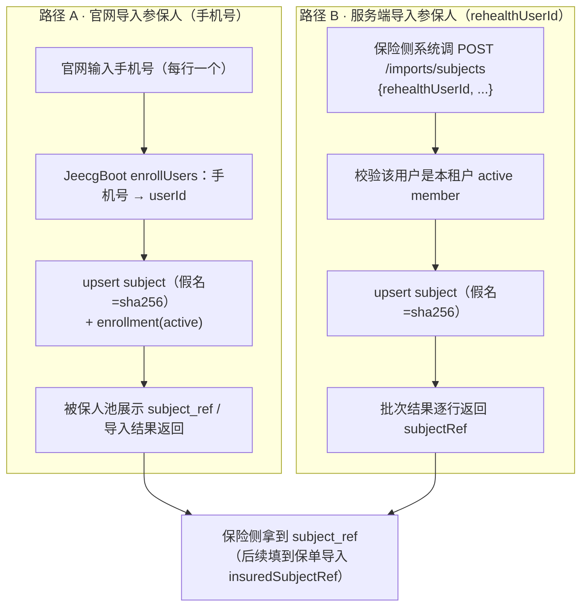
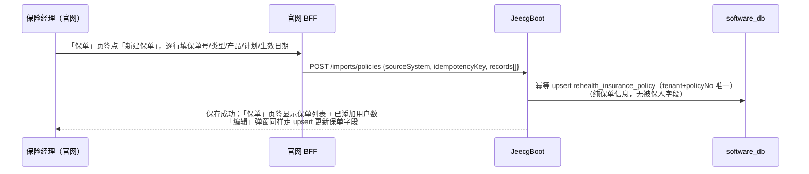
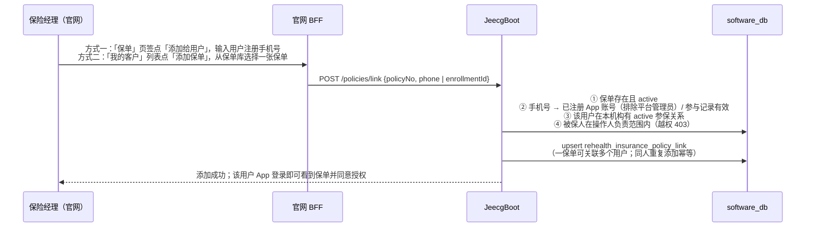
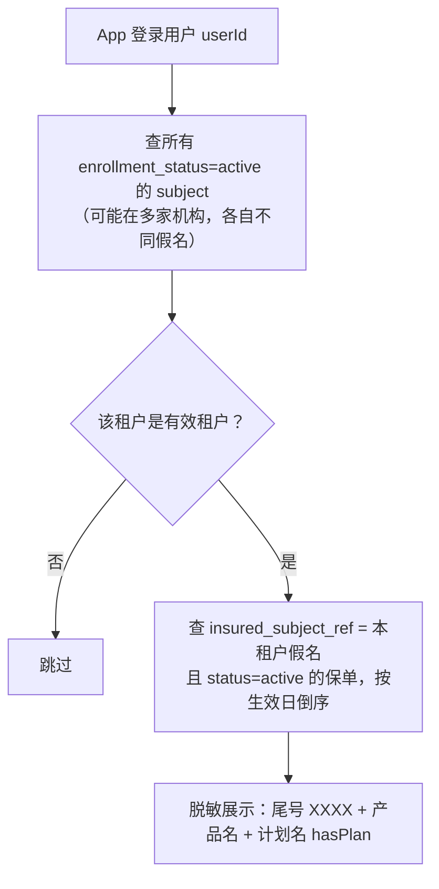
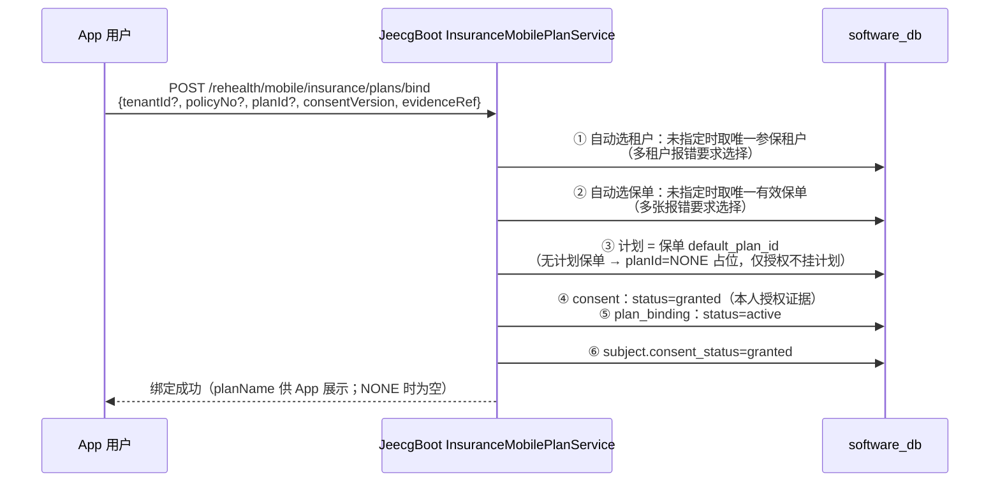
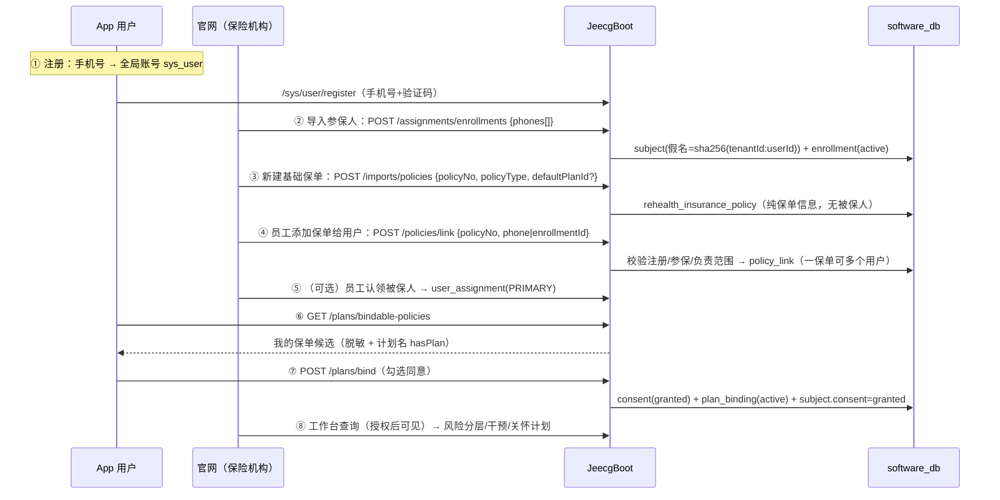

# 保险侧保单创建与派发流程：谁创建保单、保单如何到达 App 用户

> 本文回答三个问题：**保单由谁创建？由谁"派发"给对应的 App 用户？这一系列流程长什么样？**
> 内容与当前代码一致（JeecgBoot `InsuranceImportController/Service`、
> `InsuranceAssignmentService.enrollUsers`、`InsuranceMobilePlanService`，
> 官网 BFF `insurer_assignment_routes.py`，App `InsurancePlanBindingViewModel`）。
> 配套文档：《保险侧保单数据设计.md》、《保险侧计划与保单设计及全流程闭环.md》、
> `backend/contracts/INSURANCE_BUSINESS_API.md`。

## 0. 一句话结论

- **保单 = 保险机构自己的基础保单库**：机构管理员 / 保险经理 / 保险运营员在官网
  **「保单」页签新建/编辑**基础保单（保单号、产品、类型、计划、日期、状态等**保单自身信息，
  不含被保人**），或经 JeecgBoot 导入接口批量入库，权限 `rehealth:insurance:business:import`。
- **员工为用户添加保单**：在「保单」页签按手机号、或在「我的客户」列表直接对某个客户
  **「添加保单」**（选一张基础保单），写入 `rehealth_insurance_policy_link` 关联表——
  **一张保单可添加给多个用户**。后端校验：保单 active、用户已注册 App、已在本机构参保、
  在操作人负责范围内；同人重复添加幂等。
- **App 用户同意**：添加关联后，用户登录 App 在候选保单里看到该保单，勾选同意完成
  **零输入绑定授权**（合规：授权必须是用户本人动作），授权后进入保险侧工作台。



## 1. 角色与职责总表

| 角色 | 动作 | 入口 / 接口 | 权限 |
| --- | --- | --- | --- |
| **App 用户** | 注册 App（手机号即账号） | `/sys/user/register` | 无需 |
| **保险机构（官网）** | 导入参保人：输入已注册 App 的手机号，建立被保人假名与参与关系（被保人池） | 官网「我的客户 → 导入参保人」→ BFF `POST /api/insurer/assignments/enrollments` → JeecgBoot `POST /rehealth/insurance/v1/assignments/enrollments` | `rehealth:insurance:assignment:manage` |
| **保险经理/管理员/运营（官网）** | **创建保单（入库）**：官网「导入保单」弹窗，被保人**可选**（不选则先进保单库），填写保单信息（计划可选） | 官网 BFF `POST /api/insurer/policies/import` → JeecgBoot `POST /rehealth/insurance/v1/imports/policies` | `rehealth:insurance:business:import`（机构管理员 / 保险经理 / 运营员 / admin） |
| **保险经理/管理员/运营（官网）** | **分配保单**：对未分配保单输入用户注册手机号，分配到其名下 | 官网 BFF `POST /api/insurer/policies/assign` → JeecgBoot `POST /rehealth/insurance/v1/policies/assign` | 同上 |
| **保险经理/管理员/运营（官网）** | 查看保单列表（未分配保单全员可见；已分配保单按负责范围） | 官网「保单」页签 → BFF `GET /api/insurer/policies` → JeecgBoot `GET /rehealth/insurance/v1/policies` | 同上 |
| **保险机构（服务端）** | **创建保单**：批量导入（核心系统对接），指定 `insuredSubjectRef` 与可选 `defaultPlanId` | JeecgBoot `POST /rehealth/insurance/v1/imports/policies`（无保险责任角色的服务账号不受范围限制） | 同上 |
| **保险员工** | 认领被保人（服务关系，可选，管理员视角不需要） | 官网「被保人池 → 认领」→ `POST /api/insurer/assignments/claim` | `rehealth:insurance:assignment:manage` |
| **App 用户** | 查看候选保单 → 勾选"同意授权" → 加入 | App `GET /plans/bindable-policies` → `POST /plans/bind` | 本人动作（合规） |
| **保险侧（工作台）** | 授权后在工作台看到该用户，做风险分层 / 干预 / 关怀计划 | 官网「干预改善工作台」 | `rehealth:insurance:assignment:view` 等 |

## 2. 关键机制：被保人假名 `subject_ref`（保单与 App 用户的"挂钩点"）

保单不存手机号、不存 App 账号明文，只存 64 位假名：

```
subject_ref = sha256( tenantId + ":" + userId )   # 租户级假名，跨机构不可关联
```

- `userId` 是全局账号 ID（App 注册产生的 `sys_user`）。
- 同一自然人在不同保险机构各自生成**不同的假名**（前缀含 tenantId），机构间数据不可串。
- 假名的两条创建路径（都会返回/展示 subject_ref 给保险侧）：



> 保险侧**无需自己计算**假名：官网被保人池、`/imports/subjects` 批次结果、
> `/assignments/enrollments` 列表里都能拿到每条参保记录对应的 `subject_ref`。

## 3. 保单创建（导入）——谁、在哪、怎么建

### 3.1 入口与权限

| 项 | 值 |
| --- | --- |
| 官网入口 | 「我的客户」页 **⇪ 导入保单** 弹窗（逐行：被保人可选 + 保单号 + 类型 + 产品名 + 计划 + 生效日期）、「保单」页签（未分配保单可「分配」） |
| 官网 BFF | `POST /api/insurer/policies/import`、`POST /api/insurer/policies/assign`、`GET /api/insurer/policies`、`GET /api/insurer/policies/dispatchable-subjects`（浏览器不持有 Jeecg 凭据，全部经服务端会话转发） |
| JeecgBoot 接口 | `POST /rehealth/insurance/v1/imports/policies`（新建/编辑基础保单，幂等 upsert）、`POST /rehealth/insurance/v1/policies/link`（为用户添加保单）；`GET /rehealth/insurance/v1/policies`（保单库）、`GET /rehealth/insurance/v1/policies/dispatchable-subjects` |
| 权限 | `rehealth:insurance:business:import`（角色：机构管理员 `insurance_org_admin`、**保险经理 `insurance_department_manager`**、保险运营员 `insurance_operator`、`admin`） |
| 添加范围 | 「添加保单」校验负责范围（员工=自己的客户，主管=团队，管理员=全机构）；保单库本身为机构共享 |
| 幂等 | 行级：`(tenant_id, policy_no)` 唯一 upsert；关联：`(tenant_id, policy_no, subject_ref)` 唯一，同人重复添加幂等；批次级：`idempotencyKey` 重放直接返回原结果 |

### 3.2 官网「新建/编辑基础保单」（保单库）



### 3.3 官网「为用户添加保单」（关联表）



### 3.4 请求字段（PolicyRow / LinkRequest）

| 字段 | 必填 | 说明 |
| --- | --- | --- |
| `policyNo` | ✅ | 保单号，`(tenant_id, policy_no)` 唯一 |
| `policyType` | ✅ | 保单类型 |
| `defaultPlanId` | 可选 | 默认健康计划 ID（指向计划目录）；为空=仅保单、无计划（App 绑定为 `NONE` 占位授权） |
| `productCode` / `productName` | 可选 | 产品代码/名称（App 候选保单展示用） |
| `coverageAmount` / `premiumAmount` / `deductibleAmount` | 可选 | 保额 / 保费 / 免赔额 |
| `waitingPeriodDays` | 可选 | 等待期（非负） |
| `effectiveOn` / `expiresOn` | 可选 | 生效/失效日期（失效不得早于生效） |
| `status` | 可选 | 默认 `active` |
| `insuredSubjectRef` | **弃用** | 服务端批量导入兼容字段：指定时同步建立一条保单-用户关联（仍校验参保+负责范围） |
| LinkRequest `phone` / `enrollmentId` | 二选一 | 手机号（注册 App）或参与记录 ID，用于定位要添加保单的用户 |

### 3.5 落表

- 基础保单：`rehealth_insurance_policy`（tenant_id、policy_no、default_plan_id、status 等，**无被保人字段参与**；`insured_subject_ref`/`assigned_at` 已弃用保留）
- 保单-用户关联：`rehealth_insurance_policy_link`（`tenant_id + policy_no + subject_ref` 唯一，一保单多用户）

## 4. 保单"到达用户"：添加关联 + App 用户授权绑定

1. **添加保单**（员工动作）：`POST /policies/link`，校验注册/参保/负责范围后写入 `rehealth_insurance_policy_link`（可多个用户）；
2. **系统自动匹配**（用户登录后即生效）：按登录账号找到他的假名，再找**已关联**该假名的有效保单；
3. **用户本人授权绑定**：App 勾选"同意授权"点「加入」，服务端写 consent + plan_binding。

### 4.1 匹配逻辑（bindable-policies）



- 候选保单脱敏（仅尾号 4 位）；多机构时按机构分组展示。
- 用户看到的就是"保险公司已经为这张保单挂好的自己"——无需输入保单号。

### 4.2 零输入绑定（bind）



- 幂等：重复绑定（同租户+同假名+同保单+同计划）走 upsert，不产生重复记录。
- 授权后 `subject.consent_status=granted`，该用户进入保险侧工作台队列（授权是数据使用的合规门槛）。

### 4.3 "添加保单"的精确含义

| 通俗说法 | 系统实际机制 |
| --- | --- |
| 员工"把保单派给用户" | 「保单」页按手机号 / 「我的客户」选保单 → `POST /policies/link` 写入 `rehealth_insurance_policy_link`（一保单可多个用户） |
| 用户"收到保单" | App 按登录身份匹配**已关联**该用户假名的有效保单（`bindable-policies`；未关联的保单不可见） |
| 用户"签收" | 勾选同意 → bind → consent granted + plan_binding active |

## 5. 全链路时序图（建保单 → 添加给用户 → 授权 → 工作台）



## 6. 约束与幂等规则

1. **基础保单与用户解耦**：保单库只存保单自身信息（无被保人）；保单-用户关系在 `rehealth_insurance_policy_link`（`tenant_id + policy_no + subject_ref` 唯一）。
2. **一保单可多个用户**：同一保单可添加给多个用户（家庭单/团单场景）；同人重复添加幂等，不会产生重复关联。
3. **添加校验四连**：`POST /policies/link` 要求 ① 保单存在且 active；② 手机号对应已注册 App 账号（排除平台管理员）或参与记录有效；③ 该用户在本机构有 active 参保关系；④ 被保人在操作人负责范围内（越权 403「该被保人不在您的负责范围内」）。
4. **只添加给负责范围的用户**：员工只能给自己的客户，主管可给团队，管理员可给全机构。无保险责任角色的核心系统服务账号不受限（保持服务端对接兼容）。
5. **租户级隔离**：`(tenant_id, policy_no)` 唯一；假名含 tenantId 前缀，跨机构不可关联。
6. **重复导入幂等**：同一保单号重复导入为 update（官网「编辑」同路径），不产生重复保单，也不会清除既有关联；批次 `idempotencyKey` 重放直接回放原结果。
7. **绑定授权是用户本人动作**：服务端不做代授权；`consentVersion` 必填（用户勾选同意的版本证据）。
8. **计划可选**：`defaultPlanId` 为空时用户绑定为 `planId=NONE` 占位（仅授权、不挂计划），App 显示"仅授权，暂无健康计划"；后续补录计划后同一保单可再次绑定切换。
9. **多保单/多机构需要用户选择**：自动匹配仅在"唯一参保租户 / 唯一有效保单"时零输入直通，否则 App 展示候选让用户点选。

## 7. 常见问题

**Q1：官网哪里维护基础保单？**
「我的客户」页 **「保单」页签**：右上角 **▤ 新建保单**（逐行录入保单号/类型/产品/计划/生效日期，
持 `rehealth:insurance:business:import` 权限或机构管理员角色可见，保险经理/部门经理与机构管理员均已具备）；
列表中每张保单可**编辑**（保单号不可改，其余字段 upsert 更新），并显示**已添加用户数**。
核心系统对接仍可直连 JeecgBoot 批量导入接口。
> 若机构管理员此前登录过，提示"缺少保单导入权限"：新权限写入后 JeecgBoot 的 Shiro 权限缓存
> 会按 TTL 自动刷新；本地环境可删除 `shiro:cache:*authorizationCache:<userId>` 立即生效，
> 或重新登录官网（BFF 按角色放行，重登后即可用）。

**Q2：怎么把保单添加给用户？**
两种方式：① 「保单」页签对某保单点 **「添加给用户」**，输入用户**注册手机号**；
② 「我的客户」列表对某个客户点 **「添加保单」**，从保单库选择一张保单（自动带上该客户的参与记录）。
两种方式都要求该用户已注册 App、已在本机构参保、并在您的负责范围内。

**Q3：一张保单能添加给多个用户吗？**
能。关联表按「保单 × 用户」记录，家庭单/团单等一张保单可添加给多个 App 用户；同一用户
重复添加同一保单幂等。用户在 App 端各自看到该保单并各自授权绑定。

**Q4：保单建好了，为什么用户 App 里看不到？**
先看是否已**添加给该用户**（未添加的保单 App 端不可见）；再依次检查：① 该用户在本租户
enrollment 是否 active；② 保单 `status=active` 且存在 `policy_link` 关联该用户假名；③ 租户本身有效。
多机构场景下需确认查的是该用户对应机构。

**Q5：同一机构下同一用户有多张保单会怎样？**
`bindable-policies` 全部展示；`bind` 不指定 `policyNo` 时会报"存在多张有效保单，请先选择保单"，
App 让用户点选一张再绑定。多机构同理需先选机构（自动带上对应租户）。

**Q6：想给还没认领的用户添加保单怎么办？**
先在「被保人池」认领（或由主管/管理员导入），建立服务关系后再添加；未认领用户不在
员工的负责范围内，添加会被拒绝。保单本身可以先建好放在保单库。

## 8. 与真实数据对照（本地 QA 环境）

| 环节 | 实际数据示例 |
| --- | --- |
| App 注册 | 王老五 `18890254413`（App 自助注册） |
| 导入参保 | 王老五在租户 1000 与 9102 各有 subject + enrollment（active），假名分别为 `feff7ec2...` 与 `91bee334...` |
| 保单创建 | 1000：`8850882026080003712`；9102：`8850882026090004821`，均指定 `PLAN-CHRONIC-2026` |
| 无计划保单 | 9101 租户 `RH-9101-POL-0002`（`default_plan_id` 为空） |
| App 授权绑定 | 1000 已授权绑定（工作台可见）；9102 待用户在 App 点「加入」；9101 无计划保单绑定后 `planId=NONE`、status=active |
