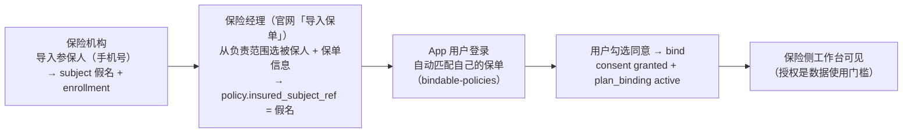
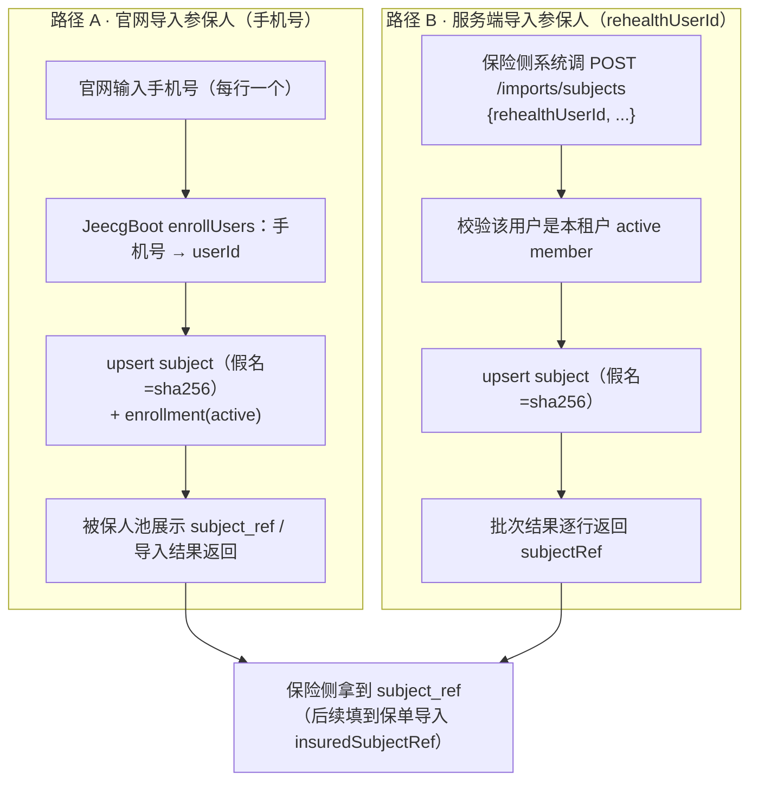
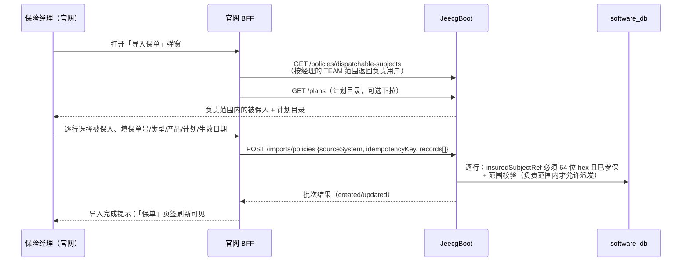
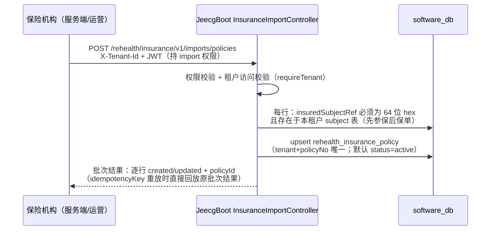
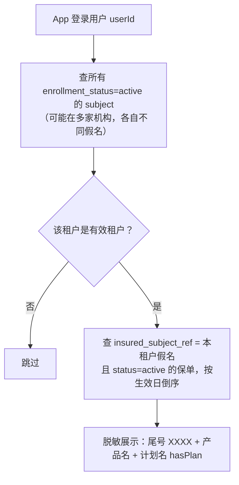
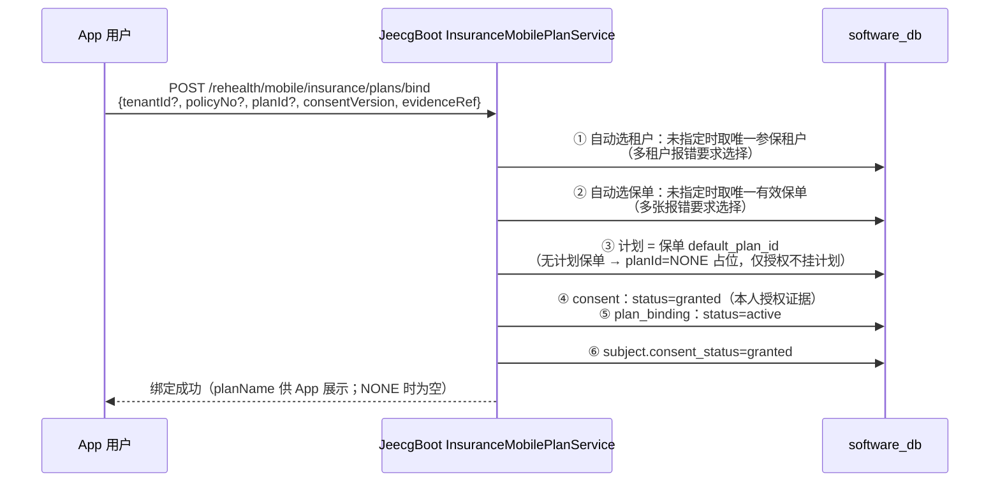
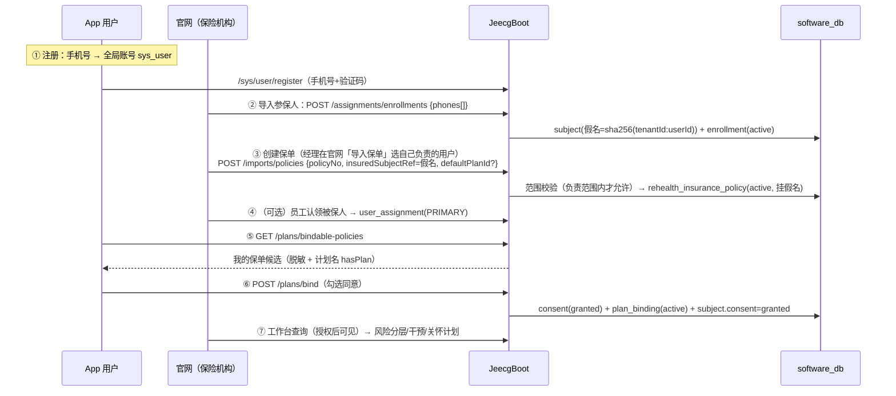

# 保险侧保单创建与派发流程：谁创建保单、保单如何到达 App 用户

> 本文回答三个问题：**保单由谁创建？由谁"派发"给对应的 App 用户？这一系列流程长什么样？**
> 内容与当前代码一致（JeecgBoot `InsuranceImportController/Service`、
> `InsuranceAssignmentService.enrollUsers`、`InsuranceMobilePlanService`，
> 官网 BFF `insurer_assignment_routes.py`，App `InsurancePlanBindingViewModel`）。
> 配套文档：《保险侧保单数据设计.md》、《保险侧计划与保单设计及全流程闭环.md》、
> `backend/contracts/INSURANCE_BUSINESS_API.md`。

## 0. 一句话结论

- **保单由保险机构创建**：机构管理员 / **保险经理（部门经理）** / 保险运营员通过
  **官网「我的客户 → 导入保单」界面**（BFF 转发）或 JeecgBoot 业务导入接口
  `POST /rehealth/insurance/v1/imports/policies` 创建，均需权限 `rehealth:insurance:business:import`
  （2026-08-26 起该权限已授予保险经理角色）。
- **保单由保险经理"派发"给自己负责的 App 用户**：官网导入保单时，被保人下拉列表
  **只列出当前员工负责范围内的用户**（员工=自己的客户，主管=团队，管理员=全机构），
  后端按同一三级范围强校验——**不在负责范围内的被保人会被拒绝**，不能派发。
- 保单到达 App 用户的方式不变：通过 **租户级被保人假名
  `insured_subject_ref = sha256(tenantId:userId)`** 与 App 账号静态挂钩；App 用户登录后
  看到自己的保单，勾选同意完成**零输入绑定授权**（合规：授权必须是用户本人动作）。



## 1. 角色与职责总表

| 角色 | 动作 | 入口 / 接口 | 权限 |
| --- | --- | --- | --- |
| **App 用户** | 注册 App（手机号即账号） | `/sys/user/register` | 无需 |
| **保险机构（官网）** | 导入参保人：输入已注册 App 的手机号，建立被保人假名与参与关系（被保人池） | 官网「我的客户 → 导入参保人」→ BFF `POST /api/insurer/assignments/enrollments` → JeecgBoot `POST /rehealth/insurance/v1/assignments/enrollments` | `rehealth:insurance:assignment:manage` |
| **保险经理/管理员/运营（官网）** | **创建并派发保单**：官网「导入保单」弹窗，从自己负责范围选择被保人 + 填写保单（计划可选） | 官网 BFF `POST /api/insurer/policies/import` → JeecgBoot `POST /rehealth/insurance/v1/imports/policies` | `rehealth:insurance:business:import`（**2026-08-26 起含保险经理/部门经理**） |
| **保险经理/管理员/运营（官网）** | 查看保单列表（负责范围内） | 官网「保单」页签 → BFF `GET /api/insurer/policies` → JeecgBoot `GET /rehealth/insurance/v1/policies` | 同上 |
| **保险机构（服务端）** | **创建保单**：批量导入（核心系统对接），指定 `insuredSubjectRef` 与可选 `defaultPlanId` | JeecgBoot `POST /rehealth/insurance/v1/imports/policies`（无保险责任角色的服务账号不受范围限制） | 同上 |
| **保险员工** | 认领被保人（服务关系，可选，管理员视角不需要） | 官网「被保人池 → 认领」→ `POST /api/insurer/assignments/claim` | `rehealth:insurance:assignment:manage` |
| **App 用户** | 查看候选保单 → 勾选"同意授权" → 加入 | App `GET /plans/bindable-policies` → `POST /plans/bind` | 本人动作（合规） |
| **保险侧（工作台）** | 授权后在工作台看到该用户，做风险分层 / 干预 / 关怀计划 | 官网「干预改善工作台」 | `rehealth:insurance:assignment:view` 等 |

## 2. 关键机制：被保人假名 `subject_ref`（保单与 App 用户的"挂钩点"）

保单不存手机号、不存 App 账号明文，只存 64 位假名：

```
subject_ref = sha256( tenantId + ":" + userId )   # 租户级假名，跨机构不可关联
```

- `userId` 是全局账号 ID（App 注册产生的 `sys_user`）。
- 同一自然人在不同保险机构各自生成**不同的假名**（前缀含 tenantId），机构间数据不可串。
- 假名的两条创建路径（都会返回/展示 subject_ref 给保险侧）：



> 保险侧**无需自己计算**假名：官网被保人池、`/imports/subjects` 批次结果、
> `/assignments/enrollments` 列表里都能拿到每条参保记录对应的 `subject_ref`。

## 3. 保单创建（导入）——谁、在哪、怎么建

### 3.1 入口与权限

| 项 | 值 |
| --- | --- |
| 官网入口 | 「我的客户」页 **⇪ 导入保单** 弹窗（逐行：被保人 + 保单号 + 类型 + 产品名 + 计划 + 生效日期）与「保单」页签 |
| 官网 BFF | `POST /api/insurer/policies/import`、`GET /api/insurer/policies`、`GET /api/insurer/policies/dispatchable-subjects`（浏览器不持有 Jeecg 凭据，全部经服务端会话转发） |
| JeecgBoot 接口 | `POST /rehealth/insurance/v1/imports/policies`（`X-Tenant-Id` 指定租户）；`GET /rehealth/insurance/v1/policies`、`GET /rehealth/insurance/v1/policies/dispatchable-subjects` |
| 权限 | `rehealth:insurance:business:import`（角色：机构管理员 `insurance_org_admin`、**保险经理 `insurance_department_manager`**、保险运营员 `insurance_operator`、`admin`） |
| 派发范围 | 官网下拉只列当前员工负责范围的用户；后端逐行强校验（SELF=自己的客户，TEAM=团队，管理员=全机构；无保险责任角色的服务账号不受限） |
| 幂等 | 行级：`(tenant_id, policy_no)` 唯一 upsert；批次级：`idempotencyKey` 重放直接返回原结果 |

### 3.2 官网「导入保单（派发）」交互流程



### 3.2 请求字段（PolicyRow）

| 字段 | 必填 | 说明 |
| --- | --- | --- |
| `policyNo` | ✅ | 保单号，`(tenant_id, policy_no)` 唯一 |
| `policyType` | ✅ | 保单类型 |
| `insuredSubjectRef` | ✅ | **被保人假名（64 位 sha256 hex）**，必须已存在于本租户 `rehealth_insurance_subject`——即"先参保、后保单" |
| `defaultPlanId` | 可选 | 默认健康计划 ID（指向计划目录）；为空=仅保单、无计划（App 绑定为 `NONE` 占位授权） |
| `policyholderSubjectRef` | 可选 | 投保人假名（64 位 hex，可空） |
| `productCode` / `productName` | 可选 | 产品代码/名称（App 候选保单展示用） |
| `coverageAmount` / `premiumAmount` / `deductibleAmount` | 可选 | 保额 / 保费 / 免赔额 |
| `waitingPeriodDays` | 可选 | 等待期（非负） |
| `effectiveOn` / `expiresOn` | 可选 | 生效/失效日期（失效不得早于生效） |
| `status` | 可选 | 默认 `active` |

### 3.3 导入校验与落表



落点：`rehealth_insurance_policy`（tenant_id、policy_no、insured_subject_ref、default_plan_id、status 等）。

## 4. 保单"派发"：假名自动匹配 + App 用户授权绑定

保单创建完成后**没有派发按钮**。真正让保单"到达"App 用户的是两步：

1. **系统自动匹配**（用户登录后即生效）：按登录账号找到他的假名，再找 `insured_subject_ref = 假名` 的有效保单；
2. **用户本人授权绑定**：App 勾选"同意授权"点「加入」，服务端写 consent + plan_binding。

### 4.1 匹配逻辑（bindable-policies）



- 候选保单脱敏（仅尾号 4 位）；多机构时按机构分组展示。
- 用户看到的就是"保险公司已经为这张保单挂好的自己"——无需输入保单号。

### 4.2 零输入绑定（bind）



- 幂等：重复绑定（同租户+同假名+同保单+同计划）走 upsert，不产生重复记录。
- 授权后 `subject.consent_status=granted`，该用户进入保险侧工作台队列（授权是数据使用的合规门槛）。

### 4.3 "派发"一词的精确含义

| 通俗说法 | 系统实际机制 |
| --- | --- |
| 保险侧"把保单派给用户" | 导入保单时用 `insuredSubjectRef` 假名挂到该用户账号上 |
| 用户"收到保单" | App 按登录身份自动匹配 `bindable-policies` 展示 |
| 用户"签收" | 勾选同意 → bind → consent granted + plan_binding active |

## 5. 全链路时序图（创建 → 匹配 → 授权 → 工作台）



## 6. 约束与幂等规则

1. **先参保、后保单**：`insuredSubjectRef` 必须已存在于本租户 subject 表，否则整行报错。
2. **只派发给负责范围的用户**：官网导入保单逐行做范围校验——员工只能给自己负责的用户派发，主管可给团队，管理员可给全机构；越权行报 403「该被保人不在您的负责范围内，请先认领该用户或选择您负责的用户」。无保险责任角色的核心系统服务账号不受限（保持服务端对接兼容）。
3. **租户级隔离**：`(tenant_id, policy_no)` 唯一；假名含 tenantId 前缀，跨机构不可关联。
4. **假名只接受 64 位 sha256 hex**：导入时强校验，防止误传手机号/明文身份。
5. **重复导入幂等**：同一保单号重复导入为 update，不产生重复保单；批次 `idempotencyKey` 重放直接回放原结果。
6. **绑定授权是用户本人动作**：服务端不做代授权；`consentVersion` 必填（用户勾选同意的版本证据）。
7. **计划可选**：`defaultPlanId` 为空时保单照常导入，用户绑定为 `planId=NONE` 占位（仅授权、不挂计划），App 显示"仅授权，暂无健康计划"；后续补录计划后同一保单可再次绑定切换。
8. **多保单/多机构需要用户选择**：自动匹配仅在"唯一参保租户 / 唯一有效保单"时零输入直通，否则 App 展示候选让用户点选。

## 7. 常见问题

**Q1：官网哪里导入保单？**
「我的客户」页右上角 **⇪ 导入保单**（持 `rehealth:insurance:business:import` 权限或机构管理员
角色可见，2026-08-26 起保险经理/部门经理与机构管理员均已具备）。弹窗里被保人下拉只列出
**当前员工负责范围**的用户，逐行填写保单号/类型/产品/计划/生效日期后确认导入；「保单」页签
展示负责范围内的保单列表。核心系统对接仍可直连 JeecgBoot 批量导入接口。
> 若机构管理员此前登录过，提示"缺少保单导入权限"：新权限写入后 JeecgBoot 的 Shiro 权限缓存
> 会按 TTL 自动刷新；本地环境可删除 `shiro:cache:*authorizationCache:<userId>` 立即生效，
> 或重新登录官网（BFF 按角色放行，重登后即可用）。

**Q2：`insuredSubjectRef` 从哪来？**
官网导入时**无需手动填写**——下拉选择被保人后由前端自动带上该用户的 `subject_ref`。
服务端对接场景从参保环节获取：官网被保人池每条记录含 `subject_ref`；`/imports/subjects`
导入结果逐行返回 `subjectRef`；`/assignments/enrollments` 列表同样返回。

**Q3：保单导入成功了，为什么 App 里看不到？**
依次检查：① 该用户在本租户 enrollment 是否 active；② 保单 `status=active` 且
`insured_subject_ref` 与该用户本租户假名一致；③ 租户本身有效（`countActiveTenant`）。
多机构场景下需确认查的是该用户对应机构。

**Q4：同一机构下同一用户有多张保单会怎样？**
`bindable-policies` 全部展示；`bind` 不指定 `policyNo` 时会报"存在多张有效保单，请先选择保单"，
App 让用户点选一张再绑定。多机构同理需先选机构（自动带上对应租户）。

**Q5：想给还没认领的用户派发保单怎么办？**
先在「被保人池」认领（或由主管/管理员导入），建立服务关系后再派发；未认领用户不在
员工的负责范围内，导入会被拒绝。

## 8. 与真实数据对照（本地 QA 环境）

| 环节 | 实际数据示例 |
| --- | --- |
| App 注册 | 王老五 `18890254413`（App 自助注册） |
| 导入参保 | 王老五在租户 1000 与 9102 各有 subject + enrollment（active），假名分别为 `feff7ec2...` 与 `91bee334...` |
| 保单创建 | 1000：`8850882026080003712`；9102：`8850882026090004821`，均指定 `PLAN-CHRONIC-2026` |
| 无计划保单 | 9101 租户 `RH-9101-POL-0002`（`default_plan_id` 为空） |
| App 授权绑定 | 1000 已授权绑定（工作台可见）；9102 待用户在 App 点「加入」；9101 无计划保单绑定后 `planId=NONE`、status=active |
