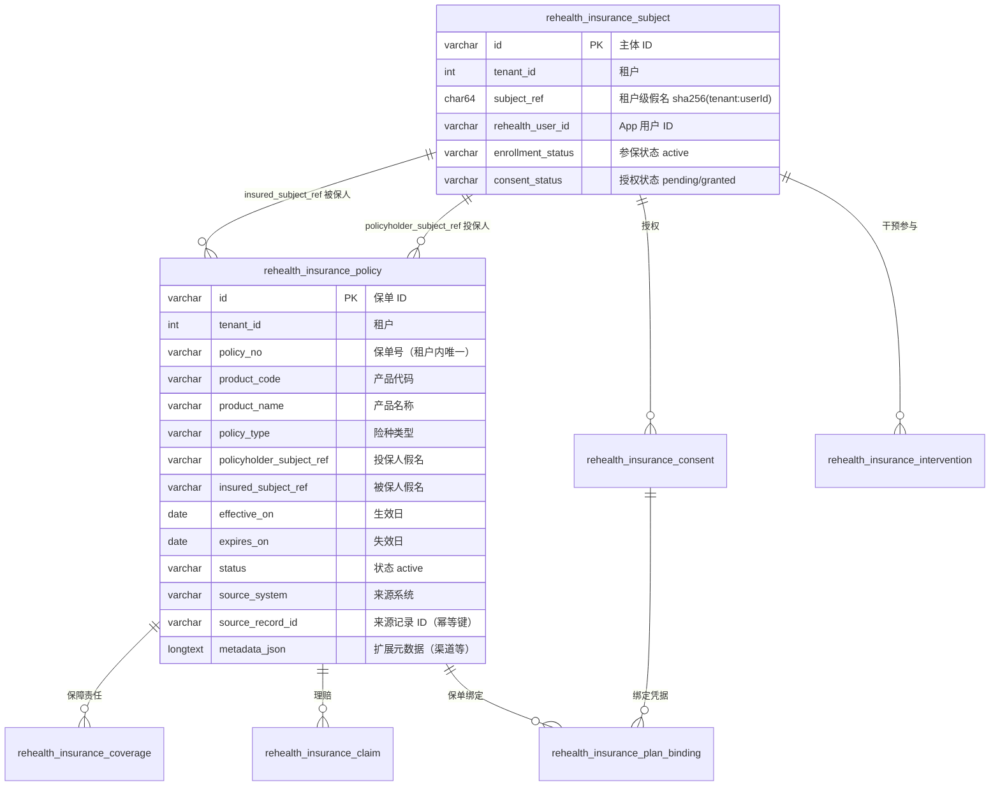
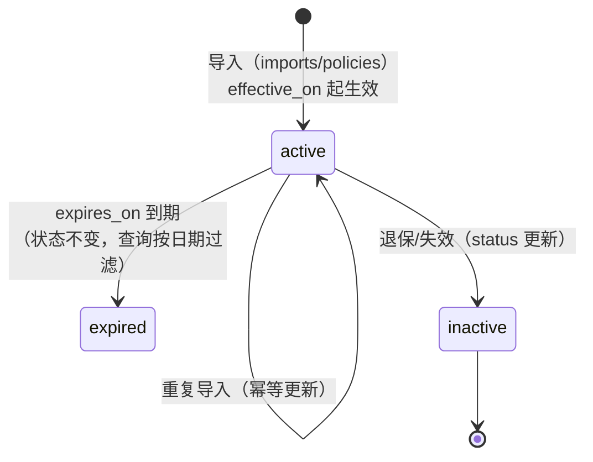
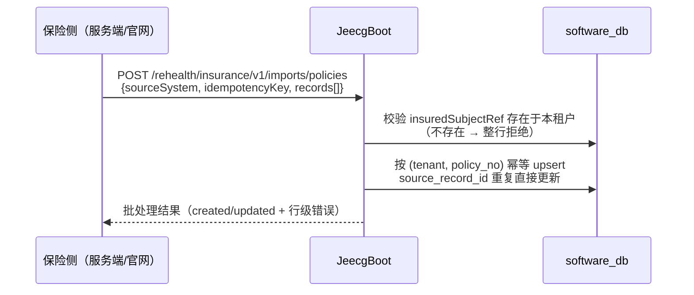
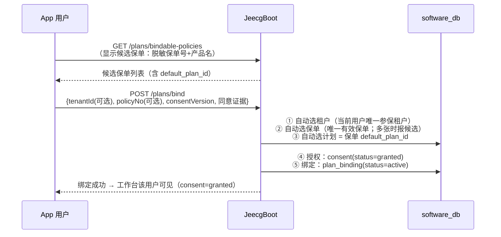
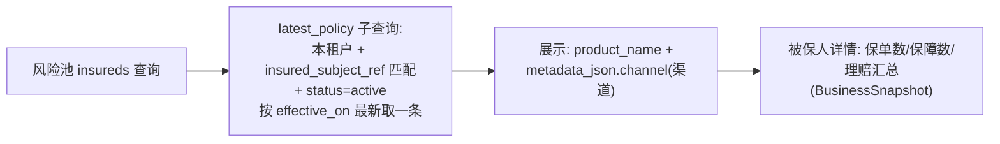

# 保险侧保单数据设计

> 本文档说明现有项目中"保单"如何建模、如何导入、如何与 App 授权绑定、如何在官网展示，
> 以及给某个被保人（如王老五）补充真实保单时需要提供哪些字段。
> 数据表结构与接口均与当前代码一致（`V20260812_2` 业务 schema + `InsuranceImportController` + `InsuranceMobilePlanService`）。

## 1. 保单在保险业务模型中的位置



核心约定：
- 保单不直接存身份证/手机号，只引用 **subject_ref 假名**（被保人/投保人分别引用）
- 每张保单属于一个**租户**（保险公司），`(tenant_id, policy_no)` 唯一
- `insured_subject_ref` 必须指向本租户已存在的参保人（导入时强校验）

## 2. 保单表字段语义（`rehealth_insurance_policy`）

| 字段 | 必填 | 说明 |
| --- | --- | --- |
| `policy_no` | ✅ | 保单号，租户内唯一 |
| `product_code` / `product_name` | 可选 | 产品代码/名称（风险池展示 product_name） |
| `policy_type` | ✅ | 险种类型（如 health / life / accident，自由文本） |
| `default_plan_id` | 可选 | **默认健康计划 ID（保险侧导入保单时指定）**——App 零输入绑定时按它自动选计划 |
| `policyholder_subject_ref` | 可选 | 投保人假名（团单等场景投保人≠被保人） |
| `insured_subject_ref` | ✅ | 被保人假名，须已存在于本租户 |
| `coverage_amount` / `premium_amount` / `deductible_amount` | 可选 | 保额/保费/免赔额（结算与 RWE 用） |
| `waiting_period_days` | 可选 | 等待期（天） |
| `effective_on` / `expires_on` | 可选 | 生效/失效日期（控制有效期） |
| `status` | ✅ | `active` 等；App 绑定只认 active |
| `source_system` / `source_record_id` | ✅ | 来源系统与源记录号，构成幂等唯一键 |
| `metadata_json` | 可选 | 扩展信息；风险池从中读 `$.channel`（渠道） |

## 3. 关联表一览

| 表 | 与保单的关系 | 关键字段 |
| --- | --- | --- |
| `rehealth_insurance_coverage` | 保单下多条保障责任 | `policy_id`、`subject_ref`、`coverage_code/name`、`limit_amount`、起止日、`status` |
| `rehealth_insurance_claim` | 保单下多条理赔 | `policy_id`、`subject_ref`、`claim_type`、事件日、提交/决定日、`billed/approved/paid_amount`、币种、`outcome_code` |
| `rehealth_insurance_consent` | 被保人级授权（与保单解耦） | `subject_ref`、`consent_type/version`、`granted_at/revoked_at`、证据引用 |
| `rehealth_insurance_consent_record` | 绑定时的授权留痕 | `tenant_id`、`subject_ref`、`consent_type/version`、`status=granted` |
| `rehealth_insurance_plan_binding` | **保单 ↔ 健康计划 ↔ 授权** 的绑定 | `tenant_id`、`subject_ref`、`policy_id`、`plan_id`、`consent_id`、`status=active` |
| `rehealth_insurance_intervention` | 被保人参与的计划干预 | `subject_ref`、`plan_id`、`consent_id`、`enrolled_at/ended_at`、`last_feedback_at` |

## 4. 保单生命周期



- 状态字段目前主要使用 `active`；到期与否由 `effective_on/expires_on` 判断
- **App 绑定只接受 `status='active'` 且 `insured_subject_ref` 与当前用户 subject 一致的保单**

## 5. 三条核心流程

### 5.1 保单导入（官网/服务端批量导入）



导入单行（`PolicyRow`）字段：`policyNo`（必填）、`productCode/productName`、`policyType`（必填）、
`policyholderSubjectRef`（可选）、`insuredSubjectRef`（必填 64 位假名）、金额三件套、`waitingPeriodDays`、
`effectiveOn/expiresOn`、`status`、`sourceRecordId`、`metadata`。

> 说明：该导入端点目前只挂在 JeecgBoot（权限 `rehealth:insurance:business:import`），官网 BFF 未透传；
> 需要时可在官网补"保单导入"页面（与参保人导入同模式）。

### 5.2 App 绑定授权（用户进入干预工作台的授权环节）



**零输入绑定**：用户不需要输入保单号、计划 ID——只需看到候选保单、勾选"同意授权"、点"加入"。
多保单/多机构时用户点选一次保单（App 自动带上对应租户与保单号）。

### 5.3 官网保单展示（风险池）



## 6. 幂等与租户隔离规则

1. `(tenant_id, policy_no)` 唯一 → 同保单号重复导入是更新，不会重复建保单
2. `(tenant_id, source_system, source_record_id)` 唯一 → 来源系统幂等键
3. 被保人假名必须在**同一租户**内已存在，跨租户保单导入直接拒绝
4. 保单不含任何直接身份标识；外部证件号只存哈希（`external_subject_ref_hash`）

## 7. 为王老五补真实保单需要提供的信息

| 字段 | 是否必须 | 示例 | 说明 |
| --- | --- | --- | --- |
| 保单号 `policy_no` | ✅ | `P2026-WLW-0001` | 真实保单号 |
| 险种 `policy_type` | ✅ | `health`（健康险） | 真实险种 |
| 产品名称 `product_name` | 建议 | `XX人寿·慢病管理健康险` | 风险池展示用 |
| 产品代码 `product_code` | 可选 | `RH-HEALTH-01` | 真实产品代码 |
| 保额/保费/免赔 | 可选 | `100000.00 / 1200.00 / 10000.00` | 有则填真实值 |
| 生效日 `effective_on` | ✅ | `2026-08-01` | 须已生效或即将生效 |
| 失效日 `expires_on` | 可选 | `2027-08-01` | 长期险可不填 |
| 渠道 `metadata.channel` | 可选 | `代理人渠道` | 风险池筛选维度 |
| 默认计划 `default_plan_id` | ✅ | `PLAN-CHRONIC-2026` | 健康计划 ID，App 零输入绑定依赖它 |
| 来源系统/源记录号 | ✅ | `core_system / CORE-P2026...` | 幂等键，用你们核心系统值 |

**投保人/被保人**：系统侧自动填——`insured_subject_ref` = 王老五在租户 1000 的假名
`ce1fa9b199b60e8a0b2168fc0a8c9c090ce666e3786a8b29222c577f1d3f75e3`；
若投保人是其本人，`policyholder_subject_ref` 填同一假名即可（团单则填团单主体假名）。

**示例导入行（PolicyRow JSON）**：

```json
{
  "policyNo": "P2026-WLW-0001",
  "productCode": "RH-HEALTH-01",
  "productName": "睿禾慢病管理健康险",
  "policyType": "health",
  "policyholderSubjectRef": "ce1fa9b199b60e8a0b2168fc0a8c9c090ce666e3786a8b29222c577f1d3f75e3",
  "insuredSubjectRef": "ce1fa9b199b60e8a0b2168fc0a8c9c090ce666e3786a8b29222c577f1d3f75e3",
  "coverageAmount": 100000.00,
  "premiumAmount": 1200.00,
  "deductibleAmount": 10000.00,
  "waitingPeriodDays": 30,
  "effectiveOn": "2026-08-01",
  "expiresOn": "2027-08-01",
  "status": "active",
  "sourceSystem": "core_system",
  "sourceRecordId": "CORE-P2026-WLW-0001",
  "metadata": {"channel": "代理人渠道"}
}
```

**补完保单之后的授权闭环**：保单入租户 1000 后，王老五在 App 内执行"绑定保险计划"（输入保单号 +
同意授权）→ `consent=granted` + 计划绑定生效 → 官网干预改善工作台立即出现该用户（低风险 → 待复核队列）。

## 8. 常见问题

- **保单导不进去**：`insuredSubjectRef` 不在本租户 → 先导入/参保该用户（官网"导入参保人"）
- **App 绑定失败**：保单未生效/已失效、被保人假名不匹配、用户无 active 参保关系
- **保单显示"未命名产品"**：`product_name` 未填，风险池展示为空
- **重复导入**：同 `policy_no` 会覆盖更新，不会产生两张保单
