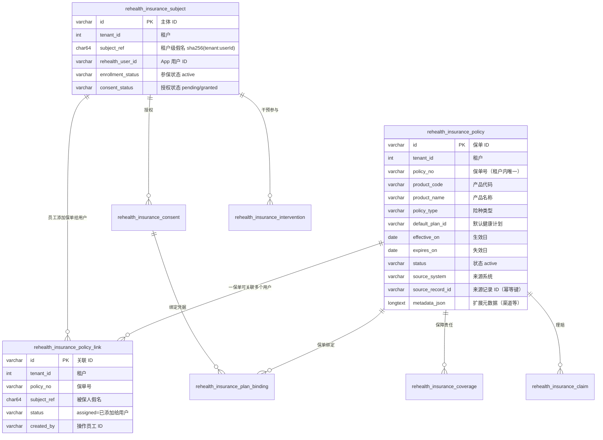
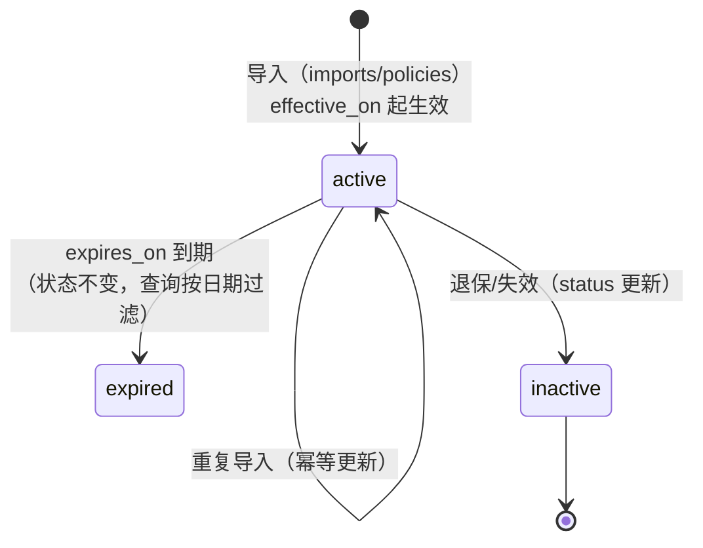
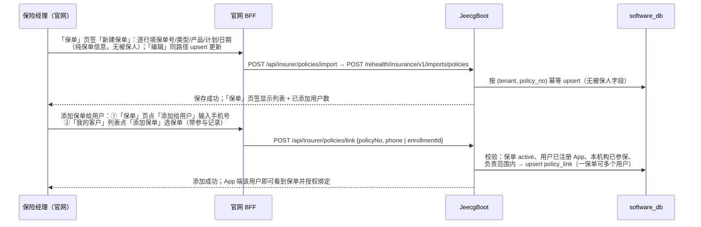
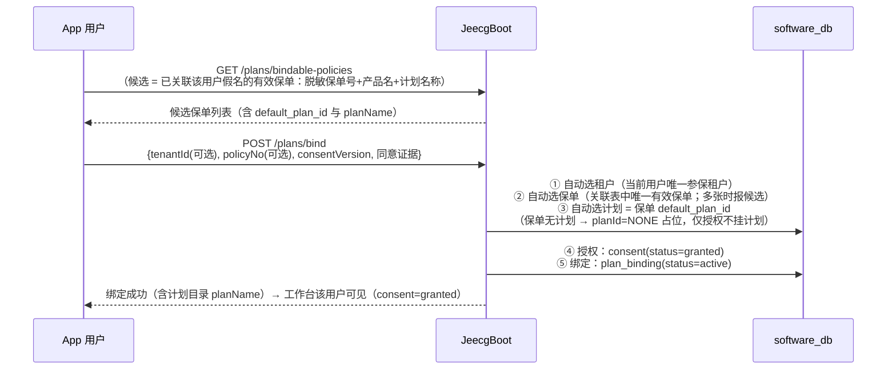
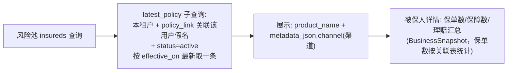

# 保险侧保单数据设计

> 本文档说明现有项目中"保单"如何建模、如何导入、如何与 App 授权绑定、如何在官网展示，
> 以及给某个被保人（如王老五）补充真实保单时需要提供哪些字段。
> 数据表结构与接口均与当前代码一致（`V20260812_2` 业务 schema、`V20260825_3` 默认计划字段、
> `V20260825_4` 计划目录表 + `InsuranceImportController` + `InsuranceMobilePlanService` + `InsurancePlanCatalogController`）。

## 1. 保单在保险业务模型中的位置



核心约定：
- **基础保单与用户解耦**：保单只存保单自身信息（无被保人字段参与）；保单-用户关系在
  `rehealth_insurance_policy_link`（`tenant_id + policy_no + subject_ref` 唯一，**一保单可关联多个用户**）
- 每张保单属于一个**租户**（保险公司），`(tenant_id, policy_no)` 唯一
- 保单不直接存身份证/手机号，用户身份只经 **subject_ref 假名** 关联
- `insured_subject_ref` / `assigned_at` 为历史列（弃用保留，兼容旧种子脚本；服务端批量导入
  指定被保人时同步写一条关联表行）

## 2. 保单表字段语义（`rehealth_insurance_policy`）

| 字段 | 必填 | 说明 |
| --- | --- | --- |
| `policy_no` | ✅ | 保单号，租户内唯一 |
| `product_code` / `product_name` | 可选 | 产品代码/名称（风险池展示 product_name） |
| `policy_type` | ✅ | 险种类型（如 health / life / accident，自由文本） |
| `default_plan_id` | 可选 | **默认健康计划 ID（保险侧导入保单时指定）**——App 零输入绑定时按它自动选计划 |
| `policyholder_subject_ref` | 可选 | 投保人假名（团单等场景投保人≠被保人） |
| `insured_subject_ref` | **弃用** | 历史列（服务端批量导入兼容，指定时同步建立关联表行）；官网基础保单不再使用 |
| `assigned_at` | **弃用** | 历史列（两步式过渡期使用）；现以 `policy_link.created_at` 为准 |
| `coverage_amount` / `premium_amount` / `deductible_amount` | 可选 | 保额/保费/免赔额（结算与 RWE 用） |
| `waiting_period_days` | 可选 | 等待期（天） |
| `effective_on` / `expires_on` | 可选 | 生效/失效日期（控制有效期） |
| `status` | ✅ | `active` 等；App 绑定只认 active |
| `source_system` / `source_record_id` | ✅ | 来源系统与源记录号，构成幂等唯一键 |
| `metadata_json` | 可选 | 扩展信息；风险池从中读 `$.channel`（渠道） |

## 3. 关联表一览

| 表 | 与保单的关系 | 关键字段 |
| --- | --- | --- |
| `rehealth_insurance_coverage` | 保单下多条保障责任 | `policy_id`、`subject_ref`、`coverage_code/name`、`limit_amount`、起止日、`status` |
| `rehealth_insurance_claim` | 保单下多条理赔 | `policy_id`、`subject_ref`、`claim_type`、事件日、提交/决定日、`billed/approved/paid_amount`、币种、`outcome_code` |
| `rehealth_insurance_consent` | 被保人级授权（与保单解耦） | `subject_ref`、`consent_type/version`、`granted_at/revoked_at`、证据引用 |
| `rehealth_insurance_consent_record` | 绑定时的授权留痕 | `tenant_id`、`subject_ref`、`consent_type/version`、`status=granted` |
| `rehealth_insurance_plan_binding` | **保单 ↔ 健康计划 ↔ 授权** 的绑定 | `tenant_id`、`subject_ref`、`policy_id`、`plan_id`、`consent_id`、`status=active` |
| `rehealth_insurance_plan_catalog` | **产品级计划目录**：保单 `default_plan_id` 引用的计划标识及其展示名称 | `tenant_id + plan_id` 唯一、`name`（App/官网展示计划名称）、`description`、`status` |
| `rehealth_insurance_intervention` | 被保人参与的计划干预 | `subject_ref`、`plan_id`、`consent_id`、`enrolled_at/ended_at`、`last_feedback_at` |

计划目录（`rehealth_insurance_plan_catalog`，`V20260825_4`）保存产品级健康计划模板；对具体用户的
计划实例仍由关怀计划（`care_plan`）承载。官网"我的客户"页顶部「计划目录」弹窗通过
`GET/POST /rehealth/insurance/v1/plans`（BFF `/api/insurer/plans`）按租户查看/新增计划；App 的
`bindable-policies` 与绑定响应返回 `planName`，绑定后“已加入的机构计划”直接展示计划名称。
`V20260825_4` 已为本地验收租户预置 `PLAN-CHRONIC-2026`（慢病管理关怀计划）与
`PLAN-CVD-2025`（心血管风险改善计划）。

## 4. 保单生命周期



- 状态字段目前主要使用 `active`；到期与否由 `effective_on/expires_on` 判断
- **App 绑定只接受 `status='active'` 且存在 `policy_link` 关联当前用户 subject 的保单**

## 5. 三条核心流程

### 5.1 基础保单库 + 员工为用户添加保单



导入单行（`PolicyRow`）字段：`policyNo`（必填）、`productCode/productName`、`policyType`（必填）、
`defaultPlanId`（可选计划）、金额三件套、`waitingPeriodDays`、
`effectiveOn/expiresOn`、`status`、`sourceRecordId`、`metadata`。
（`policyholderSubjectRef`/`insuredSubjectRef` 为服务端批量导入的兼容字段，官网不再使用。）

> 说明：官网「我的客户」页的 **「保单」页签**承载保单库（新建/编辑/列表/添加给用户），
> 「我的客户」列表行内可直接为单个客户添加保单（BFF 转发，浏览器不持有 Jeecg 凭据），
> 权限 `rehealth:insurance:business:import`（机构管理员 / 保险经理 / 运营员）。核心系统对接
> 仍可直连 JeecgBoot 批量导入接口，官网 `/api/insurer/workflow/imports/policies` 支持 CSV/XLSX 文件导入。

### 5.2 App 绑定授权（用户进入干预工作台的授权环节）



**零输入绑定**：用户不需要输入保单号、计划 ID——只需看到候选保单、勾选"同意授权"、点"加入"。
多保单/多机构时用户点选一次保单（App 自动带上对应租户与保单号）。
**计划可选**：保单 `default_plan_id` 为空时绑定照常成功，`plan_binding.plan_id='NONE'` 占位
（仅授权、不挂计划），`planName` 为空、App 显示"仅授权，暂无健康计划"；后续补录计划后
同一保单可再次绑定切换。

### 5.3 官网保单展示（风险池）



## 6. 幂等与租户隔离规则

1. `(tenant_id, policy_no)` 唯一 → 同保单号重复导入是更新，不会重复建保单
2. `(tenant_id, source_system, source_record_id)` 唯一 → 来源系统幂等键
3. `(tenant_id, policy_no, subject_ref)` 唯一 → 同一保单同一用户只关联一次；一保单可关联多个用户
4. 关联时被保人假名必须在**同一租户**内已存在（先参保、后添加），跨租户直接拒绝
5. 保单不含任何直接身份标识；外部证件号只存哈希（`external_subject_ref_hash`）

## 7. 为王老五补真实保单需要提供的信息

| 字段 | 是否必须 | 示例 | 说明 |
| --- | --- | --- | --- |
| 保单号 `policy_no` | ✅ | `P2026-WLW-0001` | 真实保单号 |
| 险种 `policy_type` | ✅ | `health`（健康险） | 真实险种 |
| 产品名称 `product_name` | 建议 | `XX人寿·慢病管理健康险` | 风险池展示用 |
| 产品代码 `product_code` | 可选 | `RH-HEALTH-01` | 真实产品代码 |
| 保额/保费/免赔 | 可选 | `100000.00 / 1200.00 / 10000.00` | 有则填真实值 |
| 生效日 `effective_on` | ✅ | `2026-08-01` | 须已生效或即将生效 |
| 失效日 `expires_on` | 可选 | `2027-08-01` | 长期险可不填 |
| 渠道 `metadata.channel` | 可选 | `代理人渠道` | 风险池筛选维度 |
| 默认计划 `default_plan_id` | ✅ | `PLAN-CHRONIC-2026` | 健康计划 ID，App 零输入绑定依赖它；名称取自计划目录表（无对应目录条目时 App 回退显示计划 ID） |
| 来源系统/源记录号 | ✅ | `core_system / CORE-P2026...` | 幂等键，用你们核心系统值 |

**用户关联**：建好基础保单后，员工在官网把保单**添加给王老五**（「保单」页输入手机号
`18890254413`，或「我的客户」列表选保单）→ 系统按手机号解析他在租户 1000 的假名并写入
`rehealth_insurance_policy_link`。

**示例导入行（PolicyRow JSON，基础保单）**：

```json
{
  "policyNo": "P2026-WLW-0001",
  "productCode": "RH-HEALTH-01",
  "productName": "睿禾慢病管理健康险",
  "policyType": "health",
  "coverageAmount": 100000.00,
  "premiumAmount": 1200.00,
  "deductibleAmount": 10000.00,
  "waitingPeriodDays": 30,
  "effectiveOn": "2026-08-01",
  "expiresOn": "2027-08-01",
  "status": "active",
  "sourceSystem": "core_system",
  "sourceRecordId": "CORE-P2026-WLW-0001",
  "defaultPlanId": "PLAN-CHRONIC-2026",
  "metadata": {"channel": "代理人渠道"}
}
```

**补完保单之后的授权闭环**：员工为王老五添加保单后，王老五在 App 内执行"加入保险计划"
零输入一键绑定（无需输入保单号：服务端自动选租户/保单/计划，用户勾选同意授权）→
`consent=granted` + 计划绑定生效 → 官网干预改善工作台立即出现该用户（低风险 → 待复核队列）。

## 8. 常见问题

- **保单建不进去**：保单号重复会更新；`source_record_id` 冲突走来源幂等键
- **App 绑定失败**：保单未添加给该用户、保单未生效/已失效、用户无 active 参保关系
- **绑定后只显示计划 ID 不显示名称**：`default_plan_id` 不在当前租户计划目录中，官网"我的客户 → 计划目录"新增对应计划后再编辑保单
- **保单显示"未命名产品"**：`product_name` 未填，风险池展示为空
- **重复导入**：同 `policy_no` 会覆盖更新，不会产生两张保单
