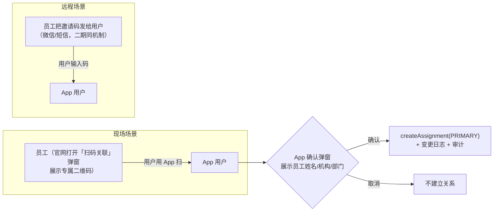
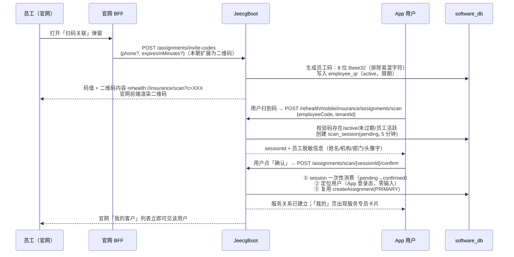
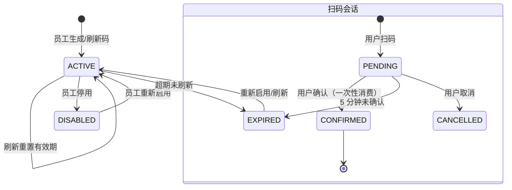
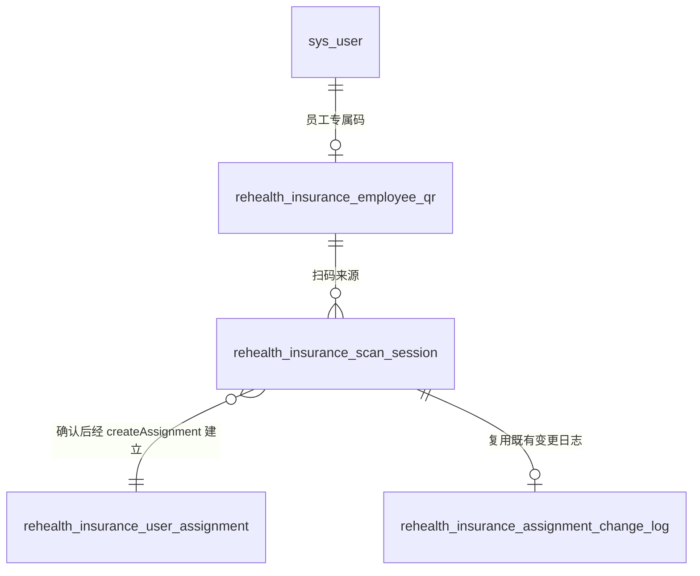

# 保险侧扫码关联用户与员工 · 设计方案

> 本文回答"保险侧扫码关联用户与员工该怎么实现"：完整的数据模型、API 契约、状态机、
> 安全防滥用规则、前端交互与分期验收。当前代码中扫码关联为二期预留（官网按钮占位、
> App `POST /rehealth/mobile/insurance/assignments/scan` 与官网 `POST /assignments/invite-codes`
> 返回 501），本方案是二期的实现蓝本，与一期已上线的"手机号认领"共用同一核心方法。
> 配套文档：《保险侧用户服务关系方案.md》、《保险侧用户服务关系-实施计划与闭环流程.md》、
> `backend/contracts/INSURANCE_BUSINESS_API.md`。

## 1. 背景与目标

一期已打通"员工认领 App 用户"的闭环，认领方式只有一种：**员工在官网输入用户手机号**。
这要求员工知道用户手机号且手动输入，现场场景（柜台、网点、地推、体检车）体验差。

二期目标：

1. **员工出码**：官网为当前员工生成专属二维码（含一次性/限期绑定的员工码）；
2. **用户扫码**：App 用户扫员工的码，**零输入**定位到员工（无需双方互报手机号）；
3. **用户确认**：App 弹出员工信息，用户确认后建立/恢复服务关系；
4. **与一期完全同轨**：定位到用户后复用 `createAssignment()`（唯一约束、变更日志、
   审计、数据范围全部一致），只是"用户定位"从"员工输入手机号"换成"用户扫码"。

## 2. 场景与角色



| 角色 | 动作 | 入口 |
| --- | --- | --- |
| 保险员工 | 生成/查看/停用专属二维码 | 官网「我的客户 → 扫码关联」弹窗 |
| App 用户 | 扫员工码 → 查看员工信息 → 确认建立关系 | App「我的 → 服务专员 → 添加服务专员 → 扫码」 |
| 系统 | 校验码有效性、防重放、幂等、审计 | JeecgBoot |

与**邀请码**的区别：邀请码是员工把码"发给"用户（远程、用户手动输入，接口
`POST /rehealth/mobile/insurance/assignments/redeem`）；扫码是"现场扫"（App 相机识别，
接口 `POST /rehealth/mobile/insurance/assignments/scan`）。两者共用同一套"码 + 会话 + 确认"
机制，只差"码如何到达用户"。

## 3. 总体流程与状态机

### 3.1 全链路时序



### 3.2 状态机



## 4. 数据模型

新增两张表（software-db 迁移，沿用 `V<date>_<n>__*.sql` 命名）：

```sql
-- 员工二维码绑定表：一人一码（同租户），码即二维码内容的核心
CREATE TABLE rehealth_insurance_employee_qr (
    id            VARCHAR(64)  NOT NULL COMMENT '主键',
    tenant_id     INT          NOT NULL COMMENT '租户（保险机构）',
    employee_id   VARCHAR(64)  NOT NULL COMMENT '员工账号 ID（sys_user.id）',
    code          VARCHAR(16)  NOT NULL COMMENT '员工码：8 位 Base32，排除 0/O/1/I/L',
    status        VARCHAR(32)  NOT NULL DEFAULT 'active' COMMENT 'active/disabled/expired',
    expires_at    DATETIME     NULL     COMMENT '码有效期（默认 30 天，刷新重置）',
    created_at    DATETIME     NOT NULL,
    updated_at    DATETIME     NULL,
    PRIMARY KEY (id),
    UNIQUE KEY uk_tenant_code (tenant_id, code),
    UNIQUE KEY uk_tenant_employee (tenant_id, employee_id)
) ENGINE=InnoDB DEFAULT CHARSET=utf8mb4 COMMENT='保险员工专属二维码绑定';

-- 扫码会话表：扫码 → 确认 的中间态，防重放、可审计
CREATE TABLE rehealth_insurance_scan_session (
    id            VARCHAR(64)  NOT NULL COMMENT '主键',
    tenant_id     INT          NOT NULL COMMENT '租户',
    employee_id   VARCHAR(64)  NOT NULL COMMENT '目标员工账号 ID',
    qr_id         VARCHAR(64)  NOT NULL COMMENT '来源员工码（employee_qr.id）',
    user_id       VARCHAR(64)  NOT NULL COMMENT '扫码的 App 用户 ID（App 登录态）',
    status        VARCHAR(32)  NOT NULL DEFAULT 'pending' COMMENT 'pending/confirmed/cancelled/expired',
    expires_at    DATETIME     NOT NULL COMMENT '会话有效期（5 分钟）',
    confirmed_at  DATETIME     NULL,
    created_at    DATETIME     NOT NULL,
    updated_at    DATETIME     NULL,
    PRIMARY KEY (id),
    KEY idx_user (user_id),
    KEY idx_qr (qr_id),
    KEY idx_expires (status, expires_at)
) ENGINE=InnoDB DEFAULT CHARSET=utf8mb4 COMMENT='保险扫码关联会话';
```

关系图：



## 5. API 契约（对齐既有预留路径）

基础路径：官网侧 `/jeecg-boot/rehealth/insurance/v1`，App 侧 `/jeecg-boot/rehealth/mobile/insurance`。

### 5.1 员工侧（官网 BFF 转发，权限 `rehealth:insurance:assignment:manage`）

| 方法 | 路径 | 说明 |
| --- | --- | --- |
| `POST` | `/assignments/invite-codes` | **由 501 升级实现**：生成/刷新当前员工二维码。请求 `{phone?（校验码归属，可空）, expiresInMinutes?（默认 43200=30 天）}` → 响应 `{code, expiresAt, payload: "rehealth://insurance/scan?c=<code>&t=<tenantId>"}` |
| `GET` | `/assignments/invite-codes/current` | 查询当前员工的码（code/status/expiresAt/累计扫码次数），供弹窗打开时展示 |
| `POST` | `/assignments/invite-codes/disable` | 停用当前码（码被泄露时的止损入口）；停用后可重新生成 |

### 5.2 App 用户侧（App 登录态，零输入定位用户）

| 方法 | 路径 | 说明 |
| --- | --- | --- |
| `POST` | `/mobile/insurance/assignments/scan` | **由 501 升级实现**：请求 `{employeeCode, tenantId}`（扫码解析得到）→ 校验码 → 创建 pending 会话 → 响应 `{sessionId, expiresAt, employee: {name, orgName, departmentName, avatarInitial}}`（脱敏，不返回手机号/账号 ID） |
| `POST` | `/mobile/insurance/assignments/scan/{sessionId}/confirm` | 用户确认：会话一次性消费（pending→confirmed）→ 定位当前登录用户 → 复用 `createAssignment(PRIMARY)` → 响应 `{created, alreadyServed, contact}` |
| `POST` | `/mobile/insurance/assignments/scan/{sessionId}/cancel` | 用户取消（可选；不调用则 5 分钟自然过期） |

**确认时的既有业务校验（复用认领口径）**：

- 用户须已在本机构参保（`enrollment=active`）；未参保 → 400 引导"请联系保险机构导入参保"
- 已是该员工的活跃客户 → 幂等返回 `alreadyServed=true`（不产生重复关系）
- 已有其他主负责人 → 提示"您已有服务专员，如需更换请联系对方转移"（不自动转移，防劫持）

## 6. 安全与防滥用

1. **码不可枚举**：8 位 Base32（排除 `0/O/1/I/L`，26 字符集）≈ 2.08×10¹¹ 空间；`scan` 接口
   限流（同用户/同 IP 每分钟 ≤ 10 次，失败 5 次锁 5 分钟）；
2. **码有期限与归属**：默认 30 天，员工可刷新/停用；码只含随机 token，**不含员工 ID/手机号**，
   泄露不会暴露身份；二维码内容 `rehealth://insurance/scan?c=<code>&t=<tenantId>` 中 tenantId
   仅用于路由提示，服务端不信任客户端 tenantId（以码反查租户）；
3. **会话一次性**：confirm 把 pending→confirmed（条件 UPDATE 防并发双花）；过期会话拒绝；
4. **身份来自登录态**：用户 ID 取 App token（`currentUserId()`），扫码接口不接受用户自报身份——
   防"扫别人的码冒充别人"；
5. **确认是用户动作**：服务关系由用户本人确认建立（与"授权是用户动作"一致），员工不能替用户确认；
6. **审计留痕**：扫码（session 创建）与关系建立（复用 createAssignment 的变更日志 + audit）
   均落库，可追溯"谁在什么时间扫了谁的码"；
7. **范围隔离**：码属租户（`tenant_id` 唯一键），跨机构扫码 → 404「码不存在」，不泄露机构信息。

## 7. 前端设计

### 7.1 官网「我的客户 → 扫码关联」弹窗

- 打开弹窗 → `GET invite-codes/current` → 已有码直接展示，无码则生成；
- 二维码渲染：前端用轻量 qrcode 库（本地 vendored `qrcode.min.js`，不引第三方 CDN 遥测）
  渲染 `payload` 字符串；
- 展示：二维码 + 码值（复制）+ 有效期 + 累计扫码次数 + 「刷新码」「停用」按钮；
- 建立关系成功后弹窗内提示"已有新用户扫码加入"（轮询或提示刷新「我的客户」）。

### 7.2 App「我的 → 服务专员 → 添加服务专员 → 扫码」

- 扫码页：相机权限申请（与设备采集权限流程一致）、取景框识别二维码/条形码；
- 解析 `rehealth://insurance/scan?c=...&t=...`（也兼容纯文本码）；
- 确认弹窗：员工姓名 + 机构 + 部门 + "确认添加该服务专员？"；
- 成功页：显示服务专员卡片（与既有 Profile 服务专员卡片一致）；失败给出可操作提示
  （码已失效/未参保/已有专员）；
- 无相机/拒绝权限时降级：手动输入 8 位码（走同一 scan 接口）。

## 8. 与既有能力的复用关系

| 能力 | 复用 |
| --- | --- |
| 关系建立 | 复用 `InsuranceAssignmentService.createAssignment()`（PRIMARY/区间化/唯一索引/变更日志/审计） |
| 用户定位 | 扫码后从 App 登录态取 userId → subjectRef=sha256(tenantId:userId)，与认领完全一致 |
| 数据范围 | 员工只见自己客户；建立关系无范围过滤（新关系），查询沿用 SELF/TEAM |
| 邀请码 | `redeem` 与 `scan` 共用"码校验 + 会话 + 确认"三件套，仅码的传输方式不同（发送 vs 扫码） |

## 9. 边界与异常矩阵

| 场景 | 行为 |
| --- | --- |
| 码不存在 / 跨机构 / 已停用 / 已过期 | 404「码无效或已失效」 |
| 员工已停用/离职 | 403「该员工已不在服务状态」 |
| 会话超 5 分钟 | 410「扫码已超时，请重新扫码」 |
| 重复扫码同一员工 | 幂等：返回已存在关系 `alreadyServed=true` |
| 已有其他主负责人 | 409「您已有服务专员」+ 引导转移 |
| 用户未参保 | 400「请先联系保险机构参保」 |
| confirm 并发双花 | 条件 UPDATE，第二次返回会话已消费 |
| 二维码截图传播 | 码可被任何人扫，但关系建立必须"扫的人"本人确认，风险可控；泄露时员工「停用」止损 |

## 10. 里程碑与验收

| 里程碑 | 内容 | 验收 |
| --- | --- | --- |
| M1 后端 | 两张表迁移 + 员工码生成/查询/停用 + scan/confirm 接口 + 限流 | Java 单测：码生成唯一/状态机/会话一次性/幂等/越权 404 |
| M2 官网 | 扫码关联弹窗（二维码渲染/刷新/停用） | 弹窗出码、停用后 App 扫码 404 |
| M3 App | 扫码页 + 确认弹窗 + 成功页 + 手动输码降级 | 真机扫码全链路 |
| M4 端到端 | 扫码 → 确认 → 「我的客户」立即可见 → 责任链/审计可查 | E2E + QA 数据（合成员工码/会话，勿用真实手机号） |

安全基线复测：错误码、过期会话、跨租户码、未参保用户、双花并发、限流触发。

## 11. 决策记录（待拍板项）

| 议题 | 建议 | 备选 |
| --- | --- | --- |
| 谁确认关系 | App 用户确认（扫码即本人意愿表达） | 员工侧二次确认（多一步，现场体验差） |
| 码有效期 | 30 天 + 可刷新/停用 | 一次性码（更安全但现场要频繁换码） |
| 未参保能否扫码建立关系 | 否（与认领口径一致：先参保、后关系） | 扫码自动参保（改动大，暂不做） |
| 已有其他主负责人 | 拒绝 + 引导转移（防劫持） | 自动替换（风险高，不推荐） |

---

**落地顺序建议**：M1 → M2 → M3 → M4，每步独立可验证；M1 完成后即可与一期认领并行使用
（扫码只是新增一种用户定位方式）。
