# 保险侧服务关系与扫码关联 · 全流程全景（当前实现版）

> 本文按**当前已上线实现**整理保险侧完整能力：用户参保 → 服务关系（认领/扫码关联）→
> 基础保单库 → 员工为用户添加/取消保单 → App 授权绑定 → 工作台。尽量以图呈现，
> 配套细节见《保险侧用户服务关系方案.md》《保险侧保单创建与派发流程.md》
> 《保险侧扫码关联设计方案.md》《保险侧保单数据设计.md》《保险侧认领到干预改善全链路.md》
> 与 `backend/contracts/INSURANCE_BUSINESS_API.md`。

## 1. 全景一图流

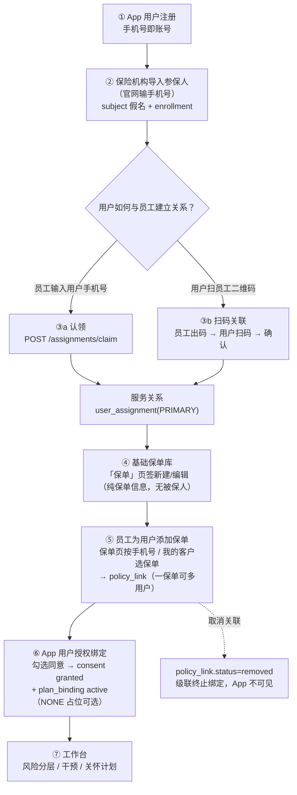

## 2. 角色与入口

```mermaid
flowchart LR
    subgraph 保险机构（官网）
        E1["机构管理员<br>全机构范围"] --> W1["我的客户 / 保单 / 计划目录"]
        E2["部门经理（保险经理）<br>本部门范围"] --> W1
        E3["运营员（员工）<br>自己客户范围"] --> W1
    end
    subgraph App用户
        U1["参保用户"] --> U2["服务专员卡片 / 保险计划 / 扫码关联"]
    end
    W1 --> BFF["官网 BFF（会话转发，<br>浏览器不持 Jeecg 凭据）"]
    BFF --> JEE["JeecgBoot"]
    U2 --> JEE
```

| 角色 | 核心动作 | 权限 |
| --- | --- | --- |
| 机构管理员 | 全机构范围：导入参保/认领/转移/保单/扫码码管理 | `assignment:manage/transfer/view`、`business:import` |
| 部门经理 | 本部门范围：同上（团队视图已下线，TEAM 范围仍用于各列表） | 同上 |
| 运营员（员工） | 自己客户范围：认领/保单添加给用户/扫码码 | 同上 |
| App 用户 | 扫码关联（本人确认）、授权绑定（本人动作） | App 登录态 |

## 3. 服务关系：认领 / 转移 / 结束

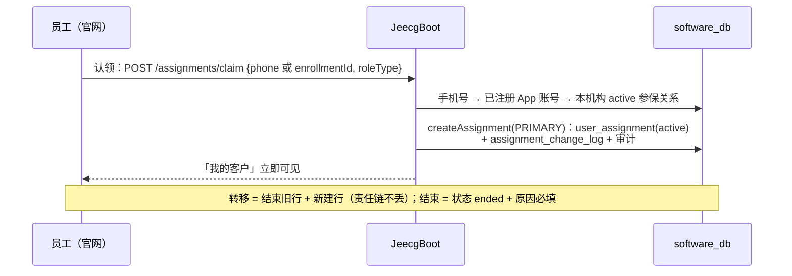

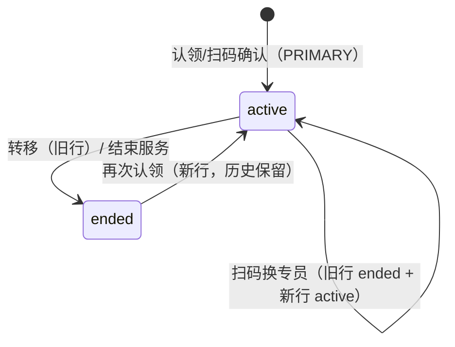

**关键规则**：同一参与记录同一时刻至多一条 active PRIMARY（数据库唯一索引）；所有变更写 `assignment_change_log`；员工看自己客户（SELF）、主管看本部门（TEAM）、管理员全机构。

## 4. 基础保单库：新建 / 编辑 / 添加 / 取消关联

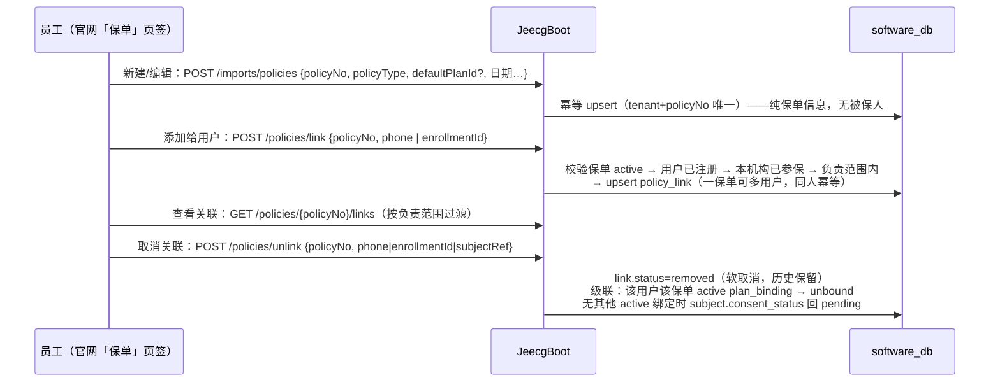

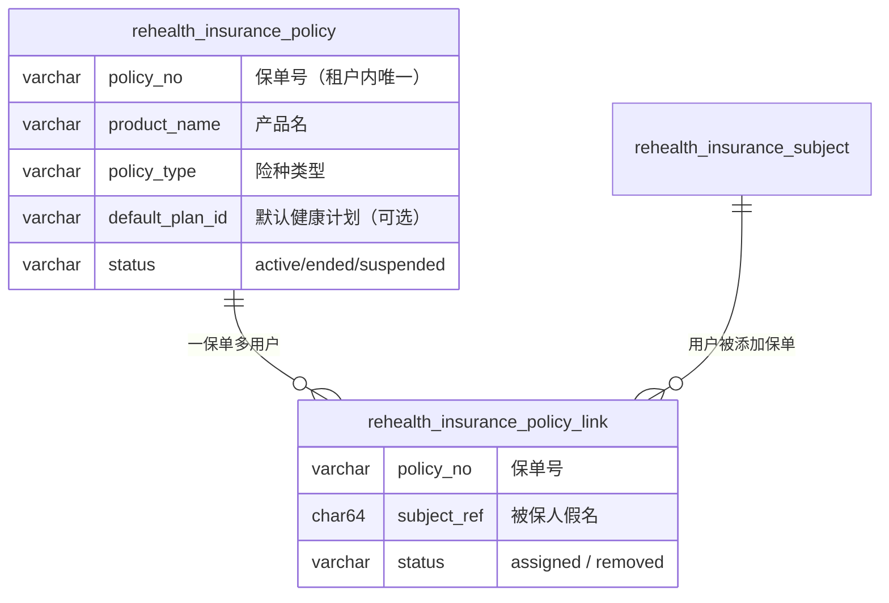

## 5. 扫码关联：员工出码 → 用户扫码 → 确认

### 5.1 全链路时序

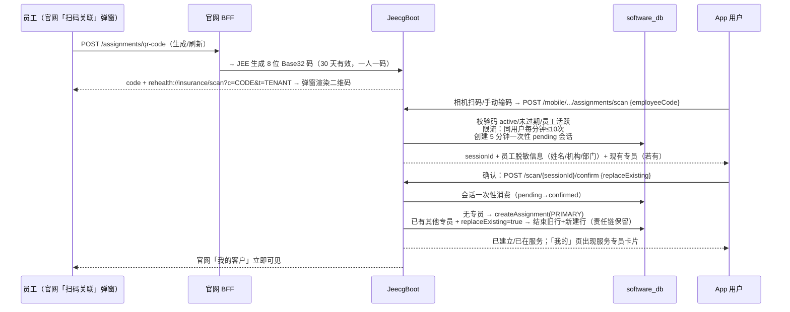

### 5.2 两个状态机

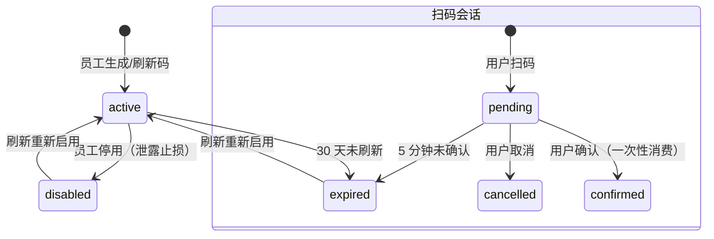

### 5.3 更换专员（二次确认）

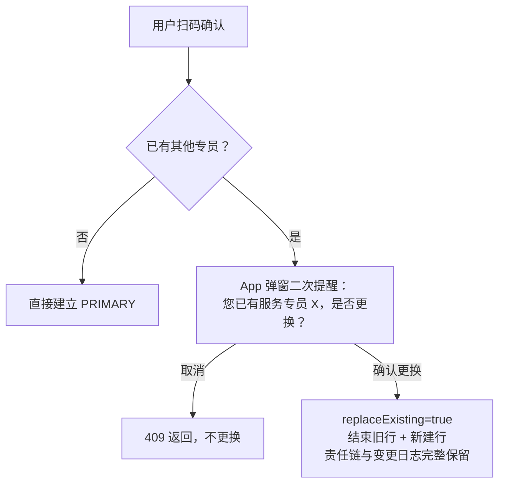

## 6. App 授权绑定（零输入 + 计划可选）

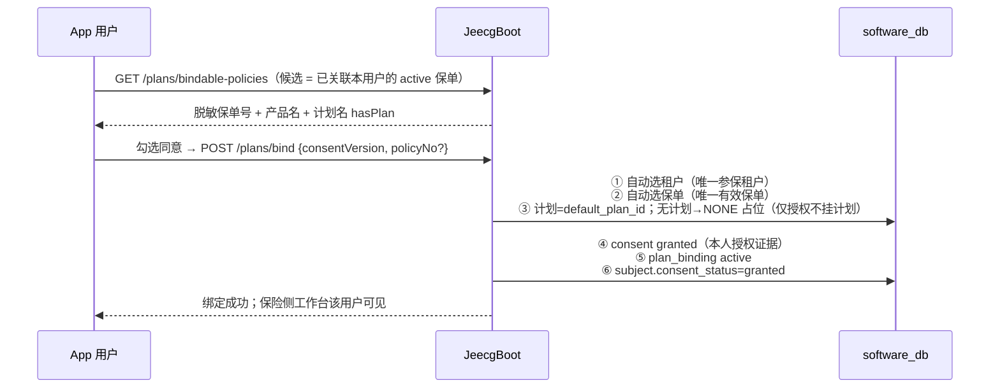

## 7. 数据模型总览

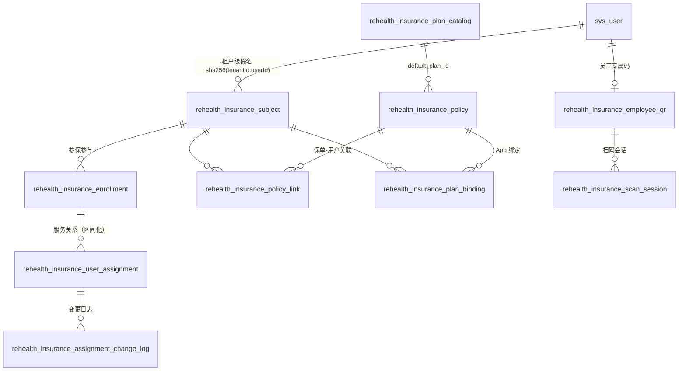

## 8. 权限与数据范围

| 权限码 | 用途 |
| --- | --- |
| `rehealth:insurance:assignment:view` | 我的客户 / 被保人池 / 责任链 |
| `rehealth:insurance:assignment:manage` | 认领 / 结束 / 员工码生成·查询·停用 |
| `rehealth:insurance:assignment:transfer` | 转移服务关系 |
| `rehealth:insurance:business:import` | 基础保单库 / 添加·取消关联 / 保单列表（机构管理员、部门经理、运营员、admin） |
| `rehealth:insurance:care-plan:view/manage/publish` | 计划目录 / 关怀计划 |

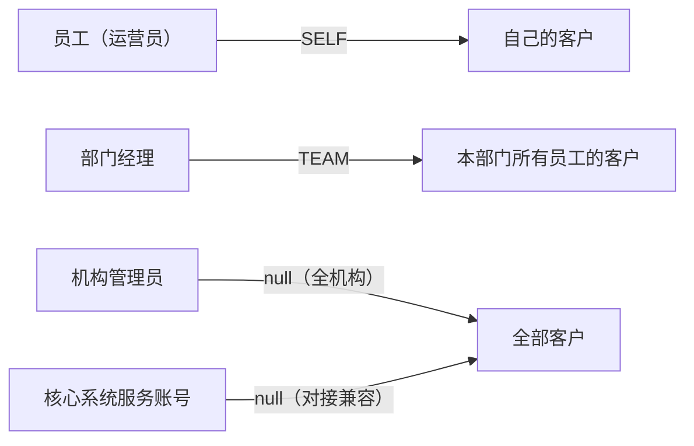

## 9. 幂等与状态速查

| 操作 | 幂等/状态 |
| --- | --- |
| 导入参保人 | `(tenant, subject_ref)` upsert；重复导入不产生重复参保 |
| 认领 | 已是本人客户 → 返回已在服务，不重复建关系 |
| 保单新建/编辑 | `(tenant, policy_no)` upsert；编辑不清除既有用户关联 |
| 添加保单给用户 | `(tenant, policy_no, subject_ref)` 唯一；同人重复添加幂等；一保单多用户 |
| 取消关联 | 软取消 `removed`；重复取消幂等；可再次添加恢复 |
| 扫码 | 会话一次性（pending→confirmed 条件更新防双花）；5 分钟过期 410 |
| 授权绑定 | `(tenant, subject, policy, plan)` upsert；重复绑定不重复记录 |

## 10. 端到端验收路径（已实测）

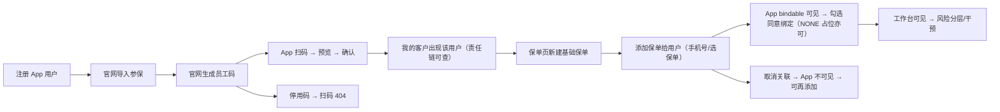

> 本地 QA 账号：经理 `local_insurance_manager_01`（1000）、机构管理员 `local_ins_9102_admin`（9102）、
> 运营员 `local_ins_9101_operator`（9101）、App 用户 `local_app_9101_02` / `local_app_shared_01`
> 密码均为 `123456`；王老五 `18890254413` 为 App 自助注册用户。
