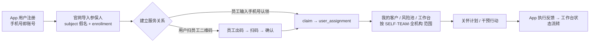
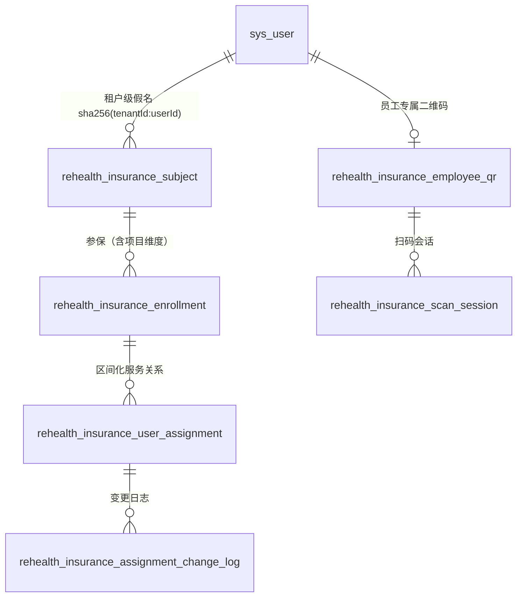
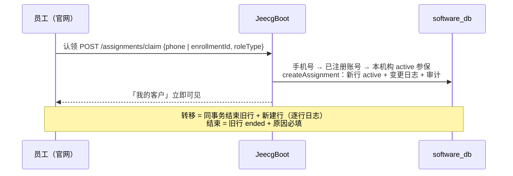
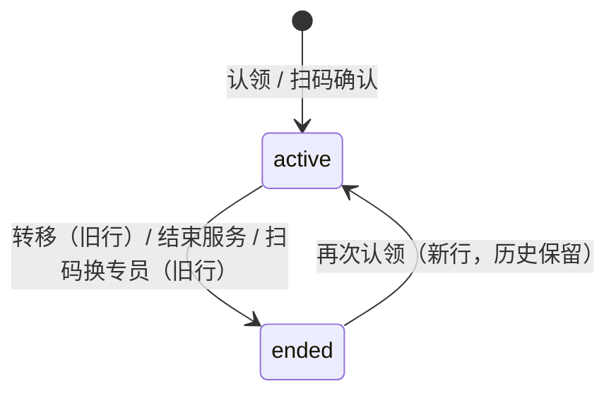
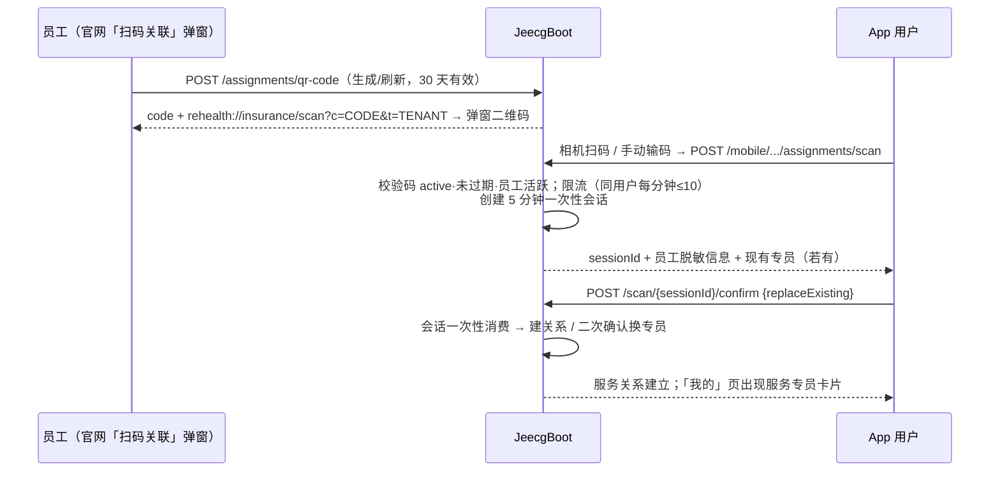
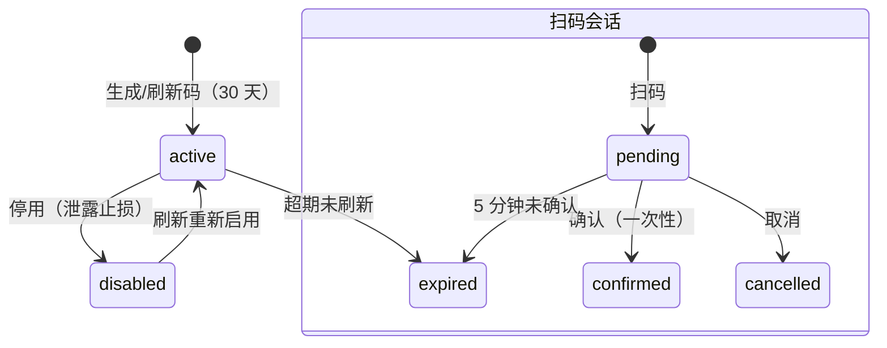
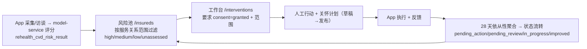

# 保险侧服务关系与扫码关联（当前实现 · 内容优化版）

> 本文以**当前代码实现**为准，重写自早期"方案/实施计划/链路/扫码设计/全景"五份文档，
> 消除已过时内容（团队视图已下线、扫码已从预留转为实现等），历史演进放入 §8。
> 接口契约以 `backend/contracts/INSURANCE_BUSINESS_API.md` 为权威。

## 1. 能力全景

一句话：**用户归属于保险机构/项目（subject+enrollment），员工只是阶段性的服务负责人
（user_assignment 区间化）**；负责人可变更，责任链、健康数据与历史永不丢失。

## 2. 核心数据模型

| 表 | 关键字段与约束 |
| --- | --- |
| `subject` | `subject_ref = sha256(tenantId:userId)`（**租户级假名**，跨机构不可关联）；`enrollment_status`、`consent_status(pending/granted)` |
| `enrollment` | `project_id`（多项目参与）、`subject_ref`、`rehealth_user_id`、状态 active/pending/ended |
| `user_assignment` | `employee_id`、`role_type`(PRIMARY/BACKUP/TEMPORARY/SUPERVISOR)、`start_time/end_time/status`(active/ended)、`change_reason`、`operator_id`；**生成列 `active_marker` + 唯一索引保证同一 enrollment 同时刻至多一条 active PRIMARY** |
| `assignment_change_log` | 变更前后快照(JSON)、原因、操作人——责任链可追溯 |
| `employee_qr` | `code`（8 位 Base32）、`expires_at`（30 天）、status(active/disabled)；`(tenant, employee)` 唯一 |
| `scan_session` | `user_id`、`qr_id`、`employee_id`、status(pending/confirmed/cancelled/expired)、`expires_at`（5 分钟） |

## 3. 服务关系操作

**端点与权限**（`/rehealth/insurance/v1/assignments`）：

| 端点 | 权限 | 说明 |
| --- | --- | --- |
| `POST /claim` | `assignment:manage` | 手机号/enrollmentId 认领（员工为自己建关系） |
| `POST /transfer` | `assignment:transfer` | 单/批量转移，责任链不丢 |
| `POST /{assignmentId}/end` | `assignment:manage` | 结束关系（原因必填） |
| `GET /mine` | `assignment:view` | 我的客户（SELF；管理员为全机构） |
| `GET /enrollments` / `POST /enrollments` | view / manage | 被保人池 / 手机号批量导入参保（幂等） |
| `GET /{enrollmentId}/history` | `assignment:view` | 责任链 + 变更日志 |
| `POST /invite-codes` | `assignment:manage` | 邀请码（仍为 501 预留） |

> 团队视图已下线（2026-08-26）：`GET /department` 端点、官网页签均已移除；
> **TEAM 数据范围本身保留**，仍用于风险池/工作台/保单添加给用户。

## 4. 三级数据范围（SQL 层强制）

| 范围 | 适用角色 | 规则 |
| --- | --- | --- |
| SELF | 运营员/分析员/查看员 | 只看自己名下的 user_assignment |
| TEAM | 部门经理（保险经理） | 自己 + 同部门所有员工的客户（sys_user_depart 同部门判定） |
| 全机构(null) | 机构管理员/审计员 | 全部客户；审计员只读+脱敏 |

解析入口 `InsuranceTenantAccessGuard.assignmentScope(user, tenant)`；对无保险责任角色的
核心系统服务账号返回 null（保持服务端批量对接兼容）。写操作（转移/结束/保单添加/取消关联）
同样按范围校验，越权 403「该被保人不在您的负责范围内」。

## 5. 扫码关联（已实现）

### 5.1 全链路

### 5.2 状态机

### 5.3 关键规则

- **确认是用户动作**：App 预览员工信息后由用户确认建立关系；
- **未参保不可扫**：confirm 时校验本机构 active 参保，否则 400 引导先导入参保；
- **已有其他专员 → 二次确认**：返回 409「您已有服务专员 X，是否确认更换？」，App 弹窗
  二次提醒，确认后 `replaceExisting=true` 结束旧行+新建行（复用转移逻辑，责任链保留）；
- **防滥用**：码不可枚举（8 位 Base32≈2×10¹¹）+ 扫码限流 + 会话一次性 + 身份取登录态 +
  跨租户码 404 不泄露机构信息 + 审计留痕（谁在何时扫了谁的码）；
- **码管理**：官网可查询当前码/刷新/停用；`GET/POST /assignments/qr-code` 等端点权限
  `assignment:manage`。

## 6. 风险分层与干预工作台链路

要点：风险数据与保险侧解耦（原始健康信号不进保险官网）；工作台以 **consent=granted** 为
数据使用门槛；关怀计划发布需 `care-plan:publish`（仅管理员/经理），运营员可建草稿。

## 7. 常见问题

- **认领的用户 App 里看不到专员？** 关系建立在服务端，用户「我的」页读取
  `GET /mobile/.../assignments/current`；多机构用户按租户分别展示。
- **想换负责人？** 官网转移（结束旧行+新建行）；用户侧可用扫码「更换专员」（二次确认）。
- **员工码泄露？** 官网「停用」立即止损，重新生成即可。
- **扫码 429？** 同用户每分钟最多 10 次，稍后重试。

## 8. 历史演进记录（决策留痕）

| 时间 | 决策/变更 |
| --- | --- |
| 一期 | 5 条定稿决策：多保险多项目支持；存量 subject_manager 迁移为新表**首条 PRIMARY 历史**（`start_time_source='legacy'`，多行 active 冲突取 updated_at 最新为 active、其余 ended+`migration_conflict_resolved`，迁移前先跑 `precheck-legacy-assignment-data.sql` 体检）；员工 SELF/主管 TEAM/管理员全机构；关联免 App 确认（数据授权仍走 consent）；一期建项目层 |
| 一期 | 认领/扫码/邀请码三者仅"定位用户"方式不同，共用 `createAssignment()` 核心（唯一约束/审计/范围一致） |
| 2026-08-26 | 团队视图下线（`GET /department` 与页签移除，TEAM 范围保留） |
| 2026-08-26 | 扫码关联实现落地：员工码 30 天/会话 5 分钟/用户确认/**已有专员需 replaceExisting 二次确认更换**/未参保 400/限流每分钟 10；App 相机扫码（CameraX+ML Kit）+手动输码；邀请码 redeem 仍 501 预留 |
| 待办 | 邀请码核销、离职批量迁移、临时代理到期自动失效（二期） |
