# 保险侧服务关系与扫码关联（整合版）

> 本文由 5 篇原文档整合：服务关系设计方案、实施计划与闭环流程、认领到干预改善全链路、
> 扫码关联设计方案、服务与扫码关联全流程全景。各原文内容完整保留为本文章节；
> 接口契约见 `backend/contracts/INSURANCE_BUSINESS_API.md`。

---

## 第 1 部分 · 服务关系设计方案（已定稿决策）（原文档：保险侧服务关系与扫码关联.md）

## 保险侧"用户服务关系"设计方案（结合现有代码 · 已定稿决策版）

> 核心原则：**用户归属于保险机构/项目，员工只是阶段性的服务负责人。**
> 负责人可变更，但用户、健康数据、干预记录、归因结果和历史责任链不丢失、不覆盖。
> 与后续"群体归因 + 可审计结算"方向一致。

## 0. 已确认的 5 条决策

1. **一个用户可以同时归属多家保险公司**（多租户）；同一自然人可同时参与多个保险项目（一期支持）。
2. **存量归属数据迁移为新表首条 PRIMARY 历史**（详见第 7 节）。
3. **数据范围**：员工只看自己负责的用户；主管可看本团队（部门下所有员工负责的用户）；总部管理员看全机构。
4. **关联不需要用户在 App 内确认**：员工可直接认领/分配；但"数据授权（consent）"仍走现有机制，用户使用 App/绑定计划时补授权。
5. 一期即建"项目"层与多项目参与，不做"一租户=一项目"的简化。

## 1. 现状对照：已有雏形 vs 目标设计

| 目标概念 | 现有实现 | 差距 |
|---|---|---|
| 用户服务关系表 | `rehealth_insurance_subject_manager`（tenant_id、subject_ref、manager_user_id、department_id、status、created_at、updated_at） | 无 `role_type`、`end_time`、变更原因/操作人；status 直接覆盖；**换人时旧行不会自动结束**，同一 subject 可能多行 active；无历史 |
| 参保/参与记录 | `insurance_subject`（tenant、subject_ref=sha256(tenant:userId)、rehealth_user_id、enrollment_status、consent_status） | 无"项目"维度 |
| 保险项目 | 无独立表；最接近 care_plan 与 `insurance_study` | 需新增 |
| 机构/团队/员工 | `sys_tenant` / `sys_depart` / `sys_user` + 保险员工角色 | 已具备 |
| 变更日志 | `insurance_audit_event`（通用审计） | 需专用 assignment_change_log |
| 数据范围权限 | `InsuranceTenantAccessGuard.responsibilityScope()` + `InsuranceRiskService` 的 `scope_mode=assigned_app_users`（SQL 层过滤） | 已有雏形；需按决策 3 分层（自己/团队/全机构） |

## 2. 目标数据模型（合并现有命名）

```text
sys_tenant  (insurance_org，一个用户可属多个租户)
├── sys_depart            (insurance_team，沿用现有部门)
├── sys_user + 保险角色    (insurance_employee，沿用现有员工账号)
├── insurance_project     【新表，一期】
│     id, tenant_id, project_no, name, status, start_date, end_date
├── insurance_enrollment  【新表，一期】
│     id, tenant_id, project_id, subject_ref, rehealth_user_id,
│     enrollment_status(pending/active/ended), consent_status,
│     consent_version, consented_at, source_system, source_record_id
└── user_assignment       【升级 rehealth_insurance_subject_manager】
      id, tenant_id, enrollment_id, employee_id,
      role_type,          -- PRIMARY / BACKUP / TEMPORARY / SUPERVISOR
      start_time, end_time, status,   -- active / ended / revoked
      start_time_source,  -- 'legacy'（迁移写入）/ 'system'
      change_reason, operator_id, created_at
```

辅助表：

```text
assignment_change_log    -- enrollment_id, assignment_id, 变更前/后快照(JSON), 原因, 操作人, 时间
employee_operation_log   -- 员工离职/调岗/代理设置等操作记录（或复用 insurance_audit_event）
```

### 身份与多保险的关系（决策 1/5 的落地）

- **subject_ref 保持"租户级假名"**：`sha256(tenantId : userId)`。同一自然人在不同保险公司拥有**不同 subject_ref**，两家公司之间无法通过 subject_ref 关联到同一人——多保险场景下天然隐私隔离，且现有 policy/claim/binding/intervention 全部按 subject_ref 引用，**不需要改动这些表**。
- **项目维度放在 enrollment 上**：同一租户内，同一 subject 可有多条 enrollment（一条一个项目），各自有独立的责任链（user_assignment）和 consent。
- **注意点**：现有 `RehealthUserHealthService` 的官网"App 用户"聚合（`/rehealth/admin/v1/patients`）带有"用户只能属于一个租户"的 `NOT EXISTS` 限制，与多保险冲突。保险侧页面应统一改用 `/rehealth/insurance/v1/insureds`（按 subject/enrollment 查询），admin patients 保留给单租户场景。

### 最重要的数据库规则

```text
同一个 insurance_enrollment
同一时刻
最多只能有一个 status='active' 且 role_type='PRIMARY' 的 user_assignment
```

落地：生成列 `active_marker`（active 时=1，否则=id）+ 唯一索引 `(enrollment_id, role_type, active_marker)`，数据库强制，业务代码无法绕过。BACKUP 可多个，TEMPORARY 带截止时间。

## 3. 负责人变更与多人协作

- **单人转移**：同事务 `旧行 end_time=now、status=ended、change_reason=transfer` + `新行 status=active、role_type=新角色`，写 assignment_change_log（前后快照）。
- **批量转移 / 离职迁移**：按员工或部门批量结束旧关系、创建新关系，逐行记日志；员工离职只**禁用账号**（`sys_user.status`），不删除。
- **临时代理**：`role_type=TEMPORARY` + `end_time=截止`，查询时按时间判定失效。
- **协作**：PRIMARY（唯一主负责人）+ BACKUP（多个协作者）+ SUPERVISOR（主管）。同一 enrollment 可同时有多条 active，但 PRIMARY 只有一条。

## 4. 关联方式落地（决策 4：无需 App 确认）

| 方式 | 期次 | 实现 | 说明 |
|---|---|---|---|
| 员工主动认领 | **一期完整实现** | `POST /rehealth/insurance/v1/assignments/claim`（手机号定位用户） | 一期唯一用户侧入口，直接建立关系 |
| 用户扫员工二维码 | **一期预留接口** | `POST /rehealth/mobile/insurance/assignments/scan`（契约先定，占位返回） | 二期实现：替换"定位用户"步骤 |
| 邀请码关联 | **一期预留接口** | `POST /assignments/invite-codes` + `POST /assignments/redeem`（契约先定） | 二期实现，防枚举规则与表结构一期定好 |
| 系统自动分配 | 按需 | 导入时按区域/产品规则自动挂 PRIMARY | 扩展 `InsuranceImportService.importSubjects` |
| 批量导入 | 按需 | CSV 手机号 → enrollment(pending) → 用户注册 App 后按手机号匹配激活 | 存量客户先形成"待激活" |

**核心设计**：认领/扫码/邀请码只是"定位用户"的方式不同，定位到用户后共用同一个 `createAssignment()` 核心方法（唯一约束、审计、范围过滤完全一致）——一期把核心做扎实，二期只需替换入口。

**服务关系 ≠ 数据授权**：关联立即生效（员工可见用户基本档案），但用户健康明细读取、计划下发仍受 enrollment.consent_status 约束；用户绑定计划时补授权（现有 `InsuranceMobilePlanService.bind` 已校验 enrollment active + 保单）。

## 5. 权限 = 角色权限 + 数据范围权限（决策 3）

沿用现有保险角色，扩展 `InsuranceTenantAccessGuard` 为三级范围解析器，全部在 SQL 层过滤（沿用现有 subject_manager 子查询模式）：

| 范围 | 规则 |
|---|---|
| 员工（operator/viewer/analyst） | 自己名下 `user_assignment` 的 enrollment（现有 responsibilityScope 逻辑） |
| 部门主管（insurance_department_manager） | 本部门所有员工负责的 enrollment：`user_assignment.employee_id IN (本部门 sys_user_depart)` 或直接挂在主管名下 |
| 总部管理员（insurance_org_admin） | 全租户 |
| 审计（insurer_auditor） | 全租户只读 + 敏感字段脱敏 + 变更日志可见 |

## 6. 改造清单

| 层 | 改动 |
|---|---|
| JeecgBoot | Flyway：`insurance_project`、`insurance_enrollment`、`user_assignment`（唯一索引）、`assignment_change_log`；重构 `InsuranceSettingsService.upsertAssignment` 为区间化变更服务；新增认领与转移端点（扫码/邀请码一期仅预留契约）；`InsuranceTenantAccessGuard` 增加三级范围解析；`InsuranceRiskService` 查询改为按 enrollment 关联过滤 |
| 官网 BFF | `app_backend_client.py` 新方法；新增 `insurer_assignment_routes.py`；前端"我的客户"页（列表+变更记录+手机号认领弹窗+批量转移；二维码/邀请码入口放占位按钮） |
| App | 一期仅"我的服务专员"展示；扫码/邀请码入口二期再做（均为触发动作，无确认弹窗） |
| 迁移 | 存量 `rehealth_insurance_subject_manager` → `user_assignment`（详见第 7 节）；旧表保留只读过渡期后下线 |

## 7. 存量归属数据迁移详解（决策 2）

**旧表现状**：`rehealth_insurance_subject_manager(id, tenant_id, manager_user_id, department_id, subject_ref, status, source_system, created_at, updated_at)`，通过 `ON DUPLICATE KEY UPDATE` 覆盖 `department_id/status/updated_at`。它只记录"现在谁是负责人"，没有开始/结束时间和历史；且换负责人时旧行不会自动结束，**同一 subject 可能同时存在多行 active**。

**"迁移为首条 PRIMARY 历史"的含义**：把旧表每一行都原样搬进新表 `user_assignment`，作为该 enrollment 责任链的**第一条历史记录**，具体映射：

| 旧表字段 | 新表字段 | 取值规则 |
|---|---|---|
| manager_user_id | employee_id | 直接对应 |
| — | role_type | `PRIMARY`（旧表只有一种负责人，只能假设为主负责人） |
| created_at | start_time | 直接取旧值，`start_time_source='legacy'` 标记为近似值 |
| status=active | end_time / status | end_time=NULL、status=active（关系延续） |
| status=disabled | end_time / status | end_time=updated_at、status=ended（作为一段已结束的历史） |
| — | change_reason / operator_id | `legacy_migration` / 迁移服务账号 |
| — | enrollment_id | 按 tenant+subject_ref 反查新 enrollment（无项目归属的归入"默认项目"） |
| 旧行全量 | assignment_change_log | 每条写一条迁移日志，快照里保留旧表原始行 |

**同一 subject 多行 active 的冲突处理**：取 `updated_at` 最新的一行作为 PRIMARY active，其余全部写为 status=ended、change_reason=`migration_conflict_resolved`（也记日志）。

**为什么要这么做（不迁移的后果）**：
- 若不迁移：迁移时刻之前"谁负责过谁"彻底丢失，换人后历史责任链从新表启用那天才起步，前面是黑洞——将来按责任链出归因/结算时，存量用户的归属期算不出来。
- 若只迁 active 不迁 disabled：历史上已经换过负责人的用户，其前任负责人信息被丢弃。
- 迁移成"首条 PRIMARY 历史"后，链从第一天就连续：`[旧负责人(legacy)] → [新负责人] → …`，之后所有变更都走"结束旧行+新建行"的标准流程。

**风险与前提**：旧表 `created_at` 是数据写入时间，不一定等于真实生效时间，所以打 `start_time_source='legacy'` 标记，将来审计报表可注明"迁移前时间为近似值"；迁移脚本须先做数据体检（重复 active、孤儿行、非法 subject_ref），体检报告通过后再执行，且整个迁移在一个事务/批次内完成。

## 8. 分期

- **一期**：project + enrollment + user_assignment（时间区间/角色/唯一约束/变更日志）+ 存量迁移 + **手机号认领（完整实现）与转移** + 三级数据范围过滤（团队视图已于 2026-08-26 下线，TEAM 范围仍用于风险池/工作台/保单添加给用户）—— 打通"员工认领用户且可追溯"；**扫码/邀请码仅预留接口契约**
- **二期**：扫码/邀请码实现、离职迁移/临时代理、批量转移增强、审计报表
- **三期**：按责任链出归因/结算数据（与 PIAS/PSM 对齐）

## 9. 风险提示

- 多保险多项目后，官网"App 用户"聚合（admin patients）的"单租户独占"限制必须同步调整，否则多保险用户会从列表消失（改用 insurance 侧查询可规避）。
- 决策 4（免确认关联）下，员工可看到未经用户确认的档案，需在 UI 明示"仅建立服务关系、数据使用以用户授权为准"，并在审计日志中记录每次认领，防止员工随意翻看。

---

## 第 2 部分 · 实施计划与闭环流程（原文档：保险侧服务关系与扫码关联.md）

## 保险侧"用户服务关系"—— 实施计划与闭环流程

> 承接《保险侧用户服务关系方案（已定稿决策版）》。本文档给出**详细改动计划**（按里程碑、文件级）和**五条闭环流程**（含图）。
> 已确认决策：① 多保险多项目一期支持；② 存量归属数据迁移为新表首条 PRIMARY 历史；③ 员工看自己、主管看团队；④ 关联免用户 App 确认；⑤ 一期建项目层。

## 一、总体闭环（先看全局）

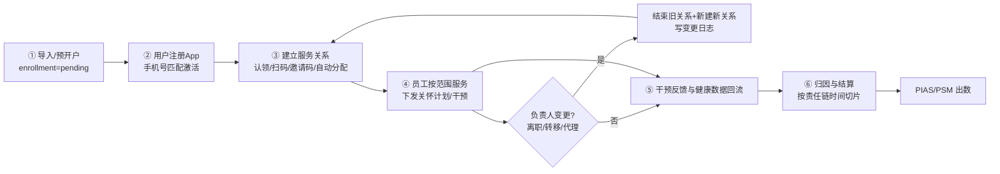

六个环节全部落地后，任何时刻都能回答：**"某段时间谁负责这个用户、谁实施了干预、效果归到谁"**。

## 二、详细改动计划（里程碑制）

### M1 数据库与存量迁移（JeecgBoot，Flyway）

**1.1 新增表（Flyway V 脚本，仿照 `insurance` 包现有迁移）**

| 表 | 关键字段 |
|---|---|
| `insurance_project` | id, tenant_id, project_no, name, status, start_date, end_date, created_at, updated_at |
| `insurance_enrollment` | id, tenant_id, project_id, subject_ref, rehealth_user_id, enrollment_status(pending/active/ended), consent_status, consent_version, consented_at, source_system, source_record_id, created_at, updated_at |
| `user_assignment` | id, tenant_id, enrollment_id, employee_id, role_type(PRIMARY/BACKUP/TEMPORARY/SUPERVISOR), start_time, end_time, status(active/ended/revoked), **active_marker(生成列)**, start_time_source(legacy/system), change_reason, operator_id, created_at |
| `assignment_change_log` | id, tenant_id, enrollment_id, assignment_id, before_json, after_json, change_type, reason, operator_id, created_at |

**强制约束**：唯一索引 `(enrollment_id, role_type, active_marker)`，其中 `active_marker = IF(status='active' AND role_type='PRIMARY', 1, id)`——保证**同一 enrollment 同一时刻最多一条 active PRIMARY**，由数据库兜底。

**1.2 存量迁移流程（决策 2，分四步）**

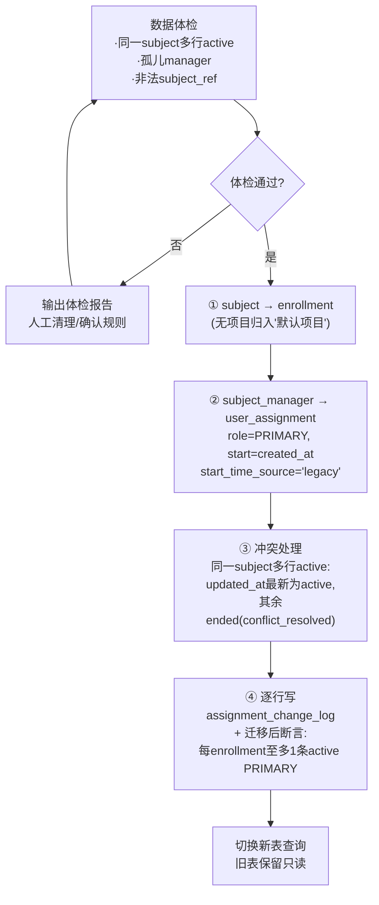

- 迁移脚本做成**幂等 + 可回放**（按批次、带批次表记录），上线前在测试库跑两遍验证一致性。
- 切换策略：一次性切流（同一次发版内 `InsuranceRiskService` 全部改查新表），旧表保留只读一个月后下线。

### M2 JeecgBoot 服务端

**2.1 新服务 `InsuranceAssignmentService`**（区间化变更，所有写操作同事务 + 记日志）

| 端点（`/rehealth/insurance/v1/assignments`） | 期次 | 说明 |
|---|---|---|
| `POST /claim` | **一期完整实现** | 员工认领：手机号/subjectRef + roleType → 建立关系（唯一关联入口） |
| `POST /invite-codes` | **一期预留接口** | 只定契约、占位返回"暂未开放"；表结构与防枚举规则一并定好，二期实现 |
| `POST /transfer` | **一期完整实现** | 单/批量转移：结束旧行 + 新建行 + 逐行日志 |
| `POST /{assignmentId}/end` | 一期完整实现 | 结束单条关系（原因必填） |
| `POST /departure-migration` | 二期 | 离职迁移：按员工批量结束/转移 |
| `GET /mine` | 一期完整实现 | 我的客户（分页，按当前员工过滤） |
| ~~`GET /department`~~ | 已下线（2026-08-26） | 团队视图已移除；TEAM 数据范围仍用于风险池/工作台/保单添加给用户 |
| `GET /{enrollmentId}/history` | 一期完整实现 | 责任链历史 + 变更日志 |
| 权限码 | — | `rehealth:insurance:assignment:view/manage/transfer` |

**预留接口的实现策略**：认领、扫码、邀请码三者只是"定位用户"的方式不同，定位到用户后**共用同一个 `createAssignment()` 核心方法**（唯一约束、审计、范围过滤全部一致）。一期把 `createAssignment` 做扎实，扫码/邀请码二期只需要替换"用户定位"这一步。

**2.2 改造既有代码**

- `InsuranceSettingsService.upsertAssignment` → 迁移期只读，改由 `InsuranceAssignmentService` 承接（避免双写）。
- `InsuranceTenantAccessGuard` → 新增三级范围解析 `scope(user, tenant)`：员工=自己、主管=本部门、管理员=全租户、审计=全租户只读（返回 scope 对象，供 SQL 拼接）。
- `InsuranceRiskService.insureds/dashboard` → 过滤条件从 `rehealth_insurance_subject_manager` 改为 `user_assignment`（按 enrollment join），保持 SQL 层强制。
- 写操作复用 `InsuranceAuditEventEntity` 记录审计；`employee_operation_log` 二期再拆。

**2.3 App 端（`/rehealth/mobile/insurance`）**

| 端点 | 期次 | 说明 |
|---|---|---|
| `GET /assignments/current` | 一期完整实现 | 展示"我的服务专员"（脱敏姓名/工号） |
| `POST /assignments/redeem` | 一期预留接口 | 邀请码核销：契约先定、占位返回，二期实现（复用服务端 `createAssignment`） |
| `POST /assignments/scan` | 一期预留接口 | 扫员工二维码：契约先定、占位返回，二期实现（复用服务端 `createAssignment`） |

### M3 官网 BFF 与前端

- `backend/api/app_backend_client.py`：新增 assignments 各方法（claim/transfer/mine/department/history；invite-codes 一期预留）。
- 新增 `backend/api/insurer_assignment_routes.py`：权限校验沿用 `_require_insurer` + 新权限码。
- `frontend/` 新增 `insurer_assignments.html`：一期已交付"我的客户"列表（团队视图已于 2026-08-26 下线）、**手机号认领弹窗**、被保人池（keyword 搜索与池内认领）、导入参保人弹窗（手机号批量纳入、幂等）、变更记录抽屉、批量转移入口与「计划目录」弹窗（查看/新增产品级计划）；员工二维码/邀请码入口先放占位按钮（"即将上线"），二期启用。

### M4 Android App

- "我的 → 我的服务专员"页：展示负责人（关系建立后即可见，无需本地存储）。
- 扫码与邀请码输入入口一期不做，只保留服务端接口；二期再上 UI。
- 无需 Room 新表（关系全在服务端）。

### M5 测试与验收

| 层 | 命令/动作 |
|---|---|
| JeecgBoot | `mvn test -pl jeecg-boot-module/jeecg-module-rehealth -DskipTests=false`；契约测试仿 `InsuranceRiskControllerContractTest`；迁移测试仿 `InsuranceSchemaMigrationTest` |
| 官网 | `pytest backend/tests/`（仿 `test_insurer_settings.py` 写 assignments 用例） |
| Android | `gradlew testDebugUnitTest`（网络契约测试仿 `ReHealthMobileApiRouteContractTest`） |
| 验收点 | 同一 enrollment 并发两次转移只成功一次（唯一索引生效）；离职迁移后责任链完整；主管可见团队、员工只见自己；多保险用户出现在两家租户各自列表 |

## 三、五条闭环流程（图）

### 闭环① 导入 → 注册匹配 → 激活

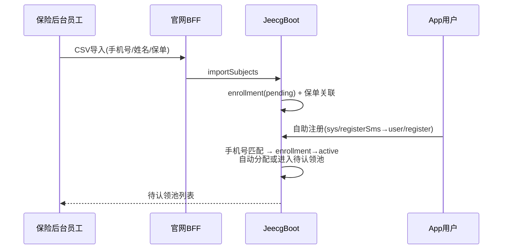

### 闭环② 建立服务关系（一期只有认领；扫码/邀请码预留）

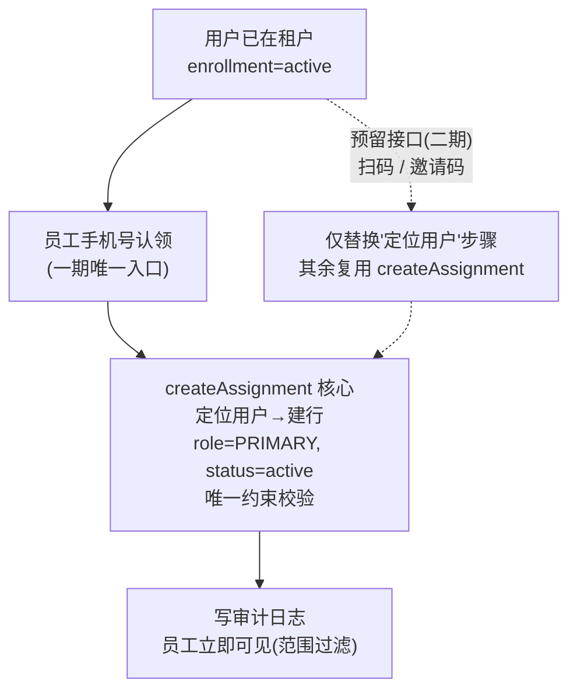

- 一期：认领 = 手机号定位用户 → `createAssignment`（完整实现）。
- 二期：扫码、邀请码只是把"定位用户"换成"解析二维码/核销邀请码"，其余逻辑零改动。

### 闭环③ 负责人变更 / 离职（责任链不中断）

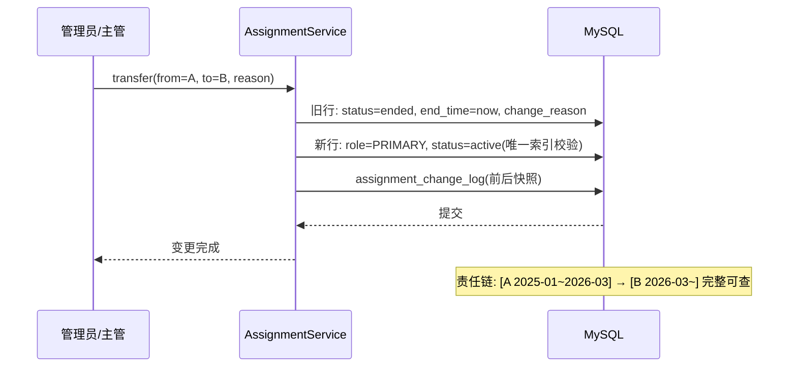

### 闭环④ 数据范围（角色 + 范围，SQL 层强制）

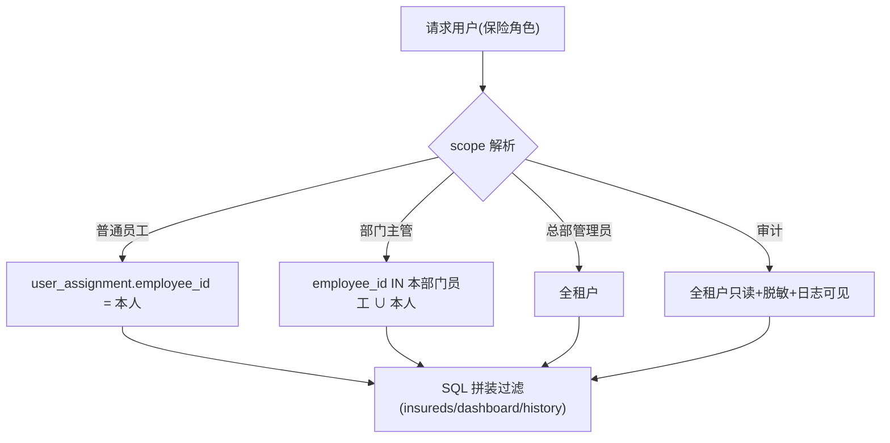

### 闭环⑤ 归因与结算（按责任链切片）

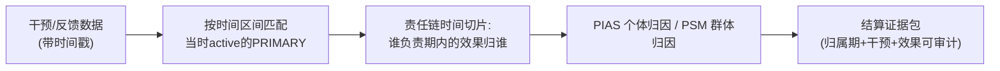

## 四、里程碑与依赖

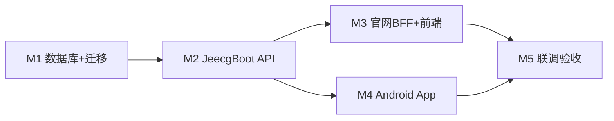

- M1 是硬前置（新表 + 唯一约束 + 迁移断言通过后才能动 M2）。
- M3/M4 可并行。
- 上线顺序：先发 JeecgBoot（含迁移）→ 官网 BFF/前端 → App 灰度。

## 五、回滚与风险

| 风险 | 对策 |
|---|---|
| 迁移数据异常 | 迁移前体检报告人工确认；迁移脚本幂等可回放；旧表保留只读一个月 |
| 并发转移产生两条 PRIMARY | 唯一索引兜底，第二条 insert 直接失败，返回冲突提示 |
| 多保险用户从官网"App 用户"列表消失 | 保险侧页面统一改用 insurance 侧查询（enrollment 维度） |
| 免确认关联被滥用（员工随意翻看） | 每次 claim 必记审计日志；UI 明示"仅服务关系，数据使用以授权为准"；明细读取仍受 consent 约束 |

**下一动作**：确认 M1 的 Flyway 迁移脚本（含体检 SQL 与迁移 SQL）可以开始编写，随后按 M2 端点清单实现。

---

## 第 3 部分 · 认领 → 风险分层 → 干预改善链路（原文档：保险侧服务关系与扫码关联.md）

## 保险侧全链路：认领 App 用户 → 风险分层 → 干预改善

> 本文档串起保险侧"服务关系（认领）→ 投保人风险分层 → 干预改善工作台"的完整业务链路，
> 图与端点均与当前代码一致。设计决策见《保险侧服务关系与扫码关联.md》与
> 《保险侧服务关系与扫码关联.md》，接口契约见 `backend/contracts/INSURANCE_BUSINESS_API.md`。

## 1. 总览

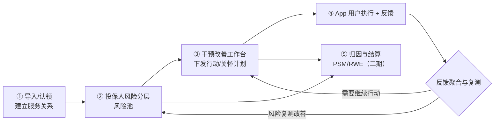

## 2. 阶段① 导入与认领（服务关系）

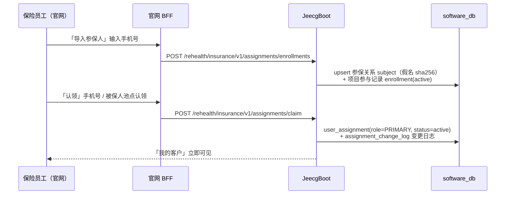

| 官网页面 | 端点 | 说明 |
| --- | --- | --- |
| 我的客户 | `GET /rehealth/insurance/v1/assignments/mine` | 员工本人负责的用户（管理员为全机构） |
| 被保人池 | `GET /rehealth/insurance/v1/assignments/enrollments` | 租户参与记录 + 当前主负责人，供认领 |
| 导入参保人 | `POST /rehealth/insurance/v1/assignments/enrollments` | 按手机号批量纳入（幂等） |
| 认领 | `POST /rehealth/insurance/v1/assignments/claim` | 按手机号或 enrollmentId 建 PRIMARY 关系 |
| 转移 / 结束 | `POST /assignments/transfer`、`POST /assignments/{id}/end` | 结束旧行 + 新建行，责任链不丢 |
| 责任链 | `GET /assignments/{enrollmentId}/history` | 历史关系 + 变更日志 |

要点：认领只建立**服务关系**；用户归属保险机构/项目，员工是阶段负责人。换负责人走转移
（结束旧行 + 新建行），历史责任链永不覆盖。扫码/邀请码为预留契约（二期）。

## 3. 阶段② 风险数据的来源（前置链路，保险侧无需操作）

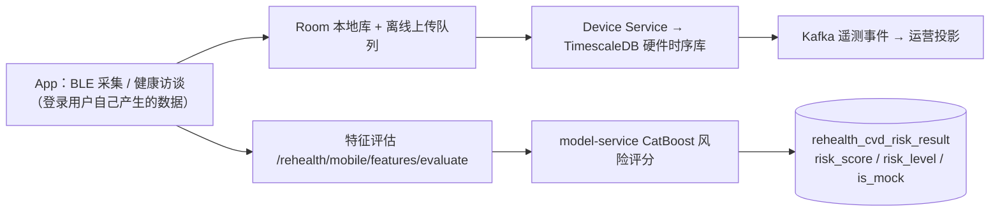

风险结果按 `user_id` 落库，与保险侧解耦；保险侧查询时通过 subject 假名把"投保人"与
"App 用户健康数据"关联，原始健康信号不进保险官网。

## 4. 阶段③ 投保人风险分层（风险池页）

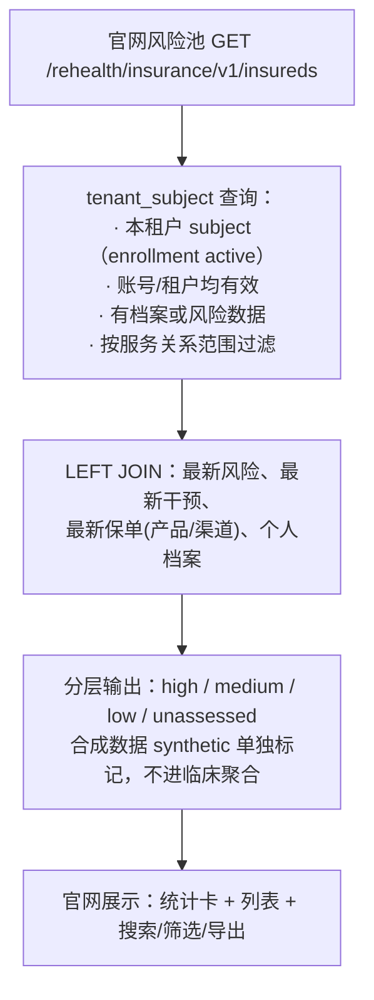

相关端点：

| 端点 | 说明 |
| --- | --- |
| `GET /rehealth/insurance/v1/dashboard/risk` | 租户级风险看板（总数/已评估/合成/高中低分布） |
| `GET /rehealth/insurance/v1/insureds` | 被保人分页（keyword/riskLevel/channel/age 筛选） |
| `GET /rehealth/insurance/v1/insureds/{subjectId}` | 单个被保人详情（含业务快照：保单/保障/理赔/授权） |

风险池每一行都是"被保人 + 其最新真实风险"，且只展示当前账号**范围内负责的用户**。

## 5. 阶段④⑤ 干预改善工作台闭环

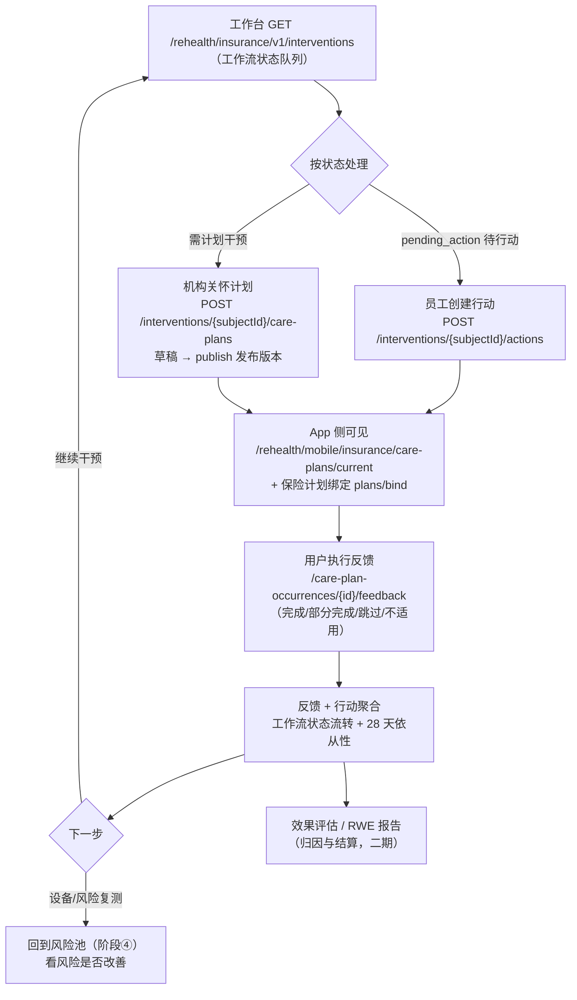

工作流状态机（数据中实际使用的四个状态）：

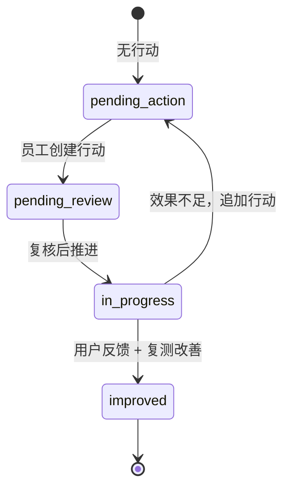

| 工作台端点 | 说明 |
| --- | --- |
| `GET /rehealth/insurance/v1/interventions/dashboard` | 干预看板聚合 |
| `GET /rehealth/insurance/v1/interventions` | 工作流队列（按状态分页） |
| `GET /rehealth/insurance/v1/interventions/{subjectId}` | 单个被保人干预详情 |
| `POST /rehealth/insurance/v1/interventions/{subjectId}/actions` | 创建人工行动 |
| `POST /rehealth/insurance/v1/interventions/actions/batch` | 批量创建行动 |
| `PUT /rehealth/insurance/v1/intervention-actions/{actionId}` | 更新行动 |
| `GET /rehealth/insurance/v1/interventions/report-data` | 干预效果报告数据 |
| `POST /rehealth/insurance/v1/interventions/{subjectId}/care-plans` | 创建关怀计划 |
| `POST /rehealth/insurance/v1/care-plans/{planId}/publish` | 发布计划版本（发布后内容不可变） |

App 侧对应端点：`GET /rehealth/mobile/insurance/care-plans/current`（今日任务 + 28 天依从性）、
`POST /rehealth/mobile/insurance/care-plan-occurrences/{occurrenceId}/feedback`（幂等反馈）、
`GET /rehealth/mobile/insurance/plans/bindable-policies`（候选保单 + 计划名称）与
`POST /rehealth/mobile/insurance/plans/bind`（保险计划零输入绑定：自动选租户/保单/计划，需有效保单与授权）。

## 6. 数据范围贯穿全程（横向约束）

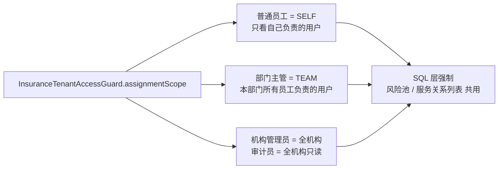

## 7. 已知衔接点与提醒

1. **工作台/关怀计划/干预报告的范围过滤**已切到新的三级 `assignmentScope`
   （与风险池一致），认领后的用户按 SELF/TEAM/全机构范围进入工作台。
2. **进入工作台需要用户授权**：范围 SQL 要求 `consent_status='granted'`。
   真实授权路径是用户在 App 内零输入绑定保险计划（`POST /rehealth/mobile/insurance/plans/bind`，
   服务端自动选参保租户、有效保单与保单 `default_plan_id` 计划，用户勾选同意授权）时完成；
   未授权用户只在风险池可见，不在工作台队列。
3. **风险接口带开发模式开关**（`rehealth.insurance.tenant-membership-dev-scope-enabled`），
   生产环境需按配置开启后才能提供范围化查询。
4. **归因与结算**（PSM/RWE 报告、结算证据包）为二期内容，届时按 `user_assignment`
   时间区间切片，把干预效果归到当时的 PRIMARY 负责人。
5. 扫码/邀请码关联为预留接口（返回 501），二期实现时复用 `createAssignment` 核心。

## 8. 一句话总结

**导入参保人 → 认领建服务关系 →（App 数据自动算风险）→ 风险池按"我负责的人"分层 →
对高风险人群创建干预行动/发布关怀计划 → App 用户执行并反馈 → 工作台聚合反馈推进状态 →
复测看风险改善 → 最终归因结算（二期）。**

---

## 第 4 部分 · 扫码关联设计（含实施状态）（原文档：保险侧服务关系与扫码关联.md）

## 保险侧扫码关联用户与员工 · 设计方案

> 本文回答"保险侧扫码关联用户与员工该怎么实现"：完整的数据模型、API 契约、状态机、
> 安全防滥用规则、前端交互与分期验收。
>
> **实施状态（2026-08-26）**：M1 后端（员工码生成/查询/停用 + scan/confirm/cancel + 限流）、
> M2 官网（「扫码关联」弹窗二维码/刷新/停用）与 M3 App 手动输码 + 确认弹窗已落地；
> **相机扫码**与邀请码（redeem）留待后续（App 手动输码为设计中的降级路径）。
> 与设计文档的差异：限流简化为"同用户每分钟 ≤10 次"（失败锁定未单独实现）；
> 员工码接口落在 `/assignments/qr-code*`（未复用 invite-codes 路径）。
> 配套文档：《保险侧服务关系与扫码关联.md》、《保险侧服务关系与扫码关联.md》、
> `backend/contracts/INSURANCE_BUSINESS_API.md`。

## 1. 背景与目标

一期已打通"员工认领 App 用户"的闭环，认领方式只有一种：**员工在官网输入用户手机号**。
这要求员工知道用户手机号且手动输入，现场场景（柜台、网点、地推、体检车）体验差。

二期目标：

1. **员工出码**：官网为当前员工生成专属二维码（含一次性/限期绑定的员工码）；
2. **用户扫码**：App 用户扫员工的码，**零输入**定位到员工（无需双方互报手机号）；
3. **用户确认**：App 弹出员工信息，用户确认后建立/恢复服务关系；
4. **与一期完全同轨**：定位到用户后复用 `createAssignment()`（唯一约束、变更日志、
   审计、数据范围全部一致），只是"用户定位"从"员工输入手机号"换成"用户扫码"。

## 2. 场景与角色

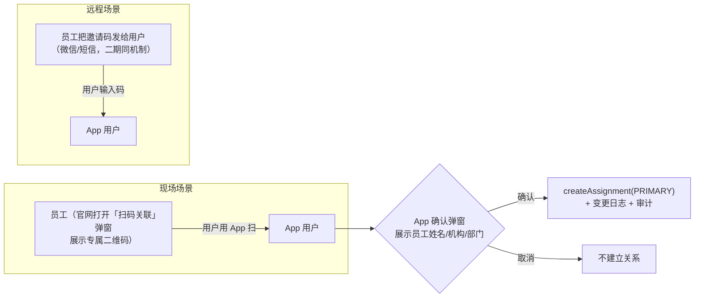

| 角色 | 动作 | 入口 |
| --- | --- | --- |
| 保险员工 | 生成/查看/停用专属二维码 | 官网「我的客户 → 扫码关联」弹窗 |
| App 用户 | 扫员工码 → 查看员工信息 → 确认建立关系 | App「我的 → 服务专员 → 添加服务专员 → 扫码」 |
| 系统 | 校验码有效性、防重放、幂等、审计 | JeecgBoot |

与**邀请码**的区别：邀请码是员工把码"发给"用户（远程、用户手动输入，接口
`POST /rehealth/mobile/insurance/assignments/redeem`）；扫码是"现场扫"（App 相机识别，
接口 `POST /rehealth/mobile/insurance/assignments/scan`）。两者共用同一套"码 + 会话 + 确认"
机制，只差"码如何到达用户"。

## 3. 总体流程与状态机

### 3.1 全链路时序

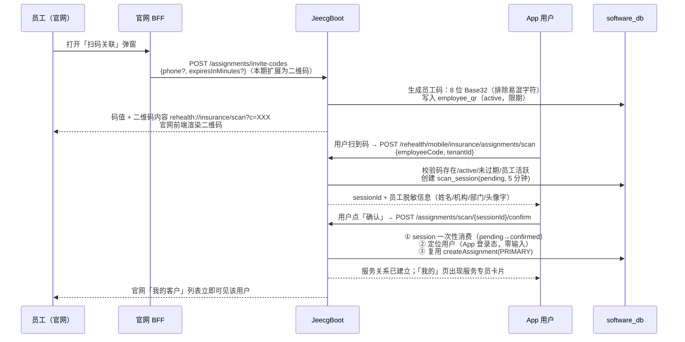

### 3.2 状态机

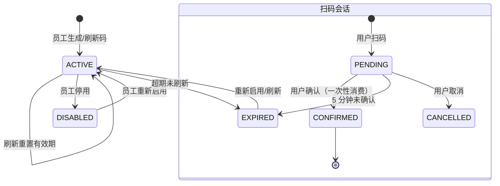

## 4. 数据模型

新增两张表（software-db 迁移，沿用 `V<date>_<n>__*.sql` 命名）：

```sql
-- 员工二维码绑定表：一人一码（同租户），码即二维码内容的核心
CREATE TABLE rehealth_insurance_employee_qr (
    id            VARCHAR(64)  NOT NULL COMMENT '主键',
    tenant_id     INT          NOT NULL COMMENT '租户（保险机构）',
    employee_id   VARCHAR(64)  NOT NULL COMMENT '员工账号 ID（sys_user.id）',
    code          VARCHAR(16)  NOT NULL COMMENT '员工码：8 位 Base32，排除 0/O/1/I/L',
    status        VARCHAR(32)  NOT NULL DEFAULT 'active' COMMENT 'active/disabled/expired',
    expires_at    DATETIME     NULL     COMMENT '码有效期（默认 30 天，刷新重置）',
    created_at    DATETIME     NOT NULL,
    updated_at    DATETIME     NULL,
    PRIMARY KEY (id),
    UNIQUE KEY uk_tenant_code (tenant_id, code),
    UNIQUE KEY uk_tenant_employee (tenant_id, employee_id)
) ENGINE=InnoDB DEFAULT CHARSET=utf8mb4 COMMENT='保险员工专属二维码绑定';

-- 扫码会话表：扫码 → 确认 的中间态，防重放、可审计
CREATE TABLE rehealth_insurance_scan_session (
    id            VARCHAR(64)  NOT NULL COMMENT '主键',
    tenant_id     INT          NOT NULL COMMENT '租户',
    employee_id   VARCHAR(64)  NOT NULL COMMENT '目标员工账号 ID',
    qr_id         VARCHAR(64)  NOT NULL COMMENT '来源员工码（employee_qr.id）',
    user_id       VARCHAR(64)  NOT NULL COMMENT '扫码的 App 用户 ID（App 登录态）',
    status        VARCHAR(32)  NOT NULL DEFAULT 'pending' COMMENT 'pending/confirmed/cancelled/expired',
    expires_at    DATETIME     NOT NULL COMMENT '会话有效期（5 分钟）',
    confirmed_at  DATETIME     NULL,
    created_at    DATETIME     NOT NULL,
    updated_at    DATETIME     NULL,
    PRIMARY KEY (id),
    KEY idx_user (user_id),
    KEY idx_qr (qr_id),
    KEY idx_expires (status, expires_at)
) ENGINE=InnoDB DEFAULT CHARSET=utf8mb4 COMMENT='保险扫码关联会话';
```

关系图：

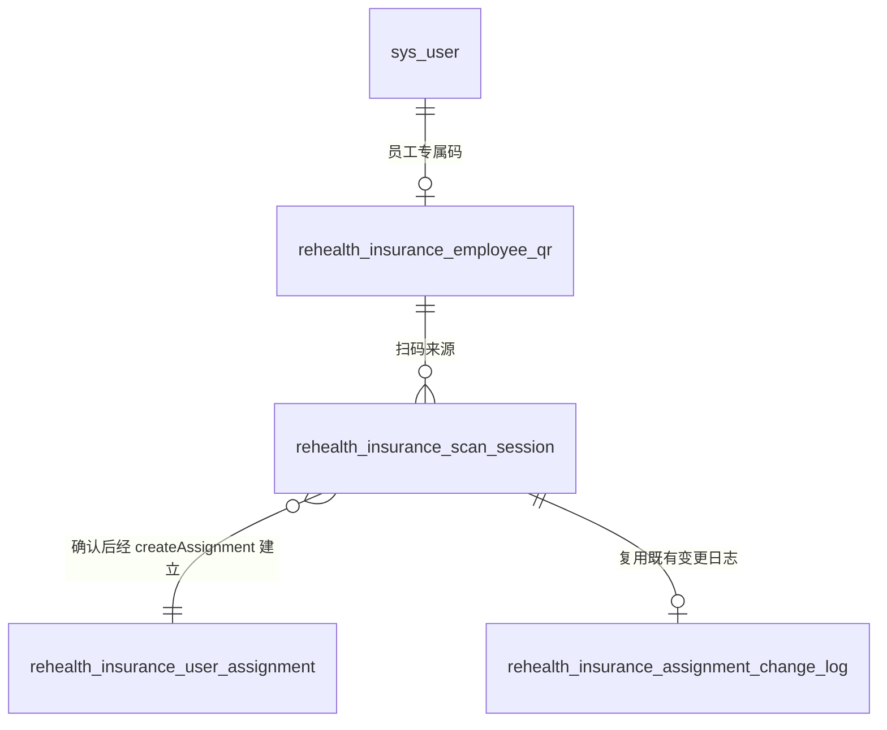

## 5. API 契约（对齐既有预留路径）

基础路径：官网侧 `/jeecg-boot/rehealth/insurance/v1`，App 侧 `/jeecg-boot/rehealth/mobile/insurance`。

### 5.1 员工侧（官网 BFF 转发，权限 `rehealth:insurance:assignment:manage`）

| 方法 | 路径 | 说明 |
| --- | --- | --- |
| `POST` | `/assignments/invite-codes` | **由 501 升级实现**：生成/刷新当前员工二维码。请求 `{phone?（校验码归属，可空）, expiresInMinutes?（默认 43200=30 天）}` → 响应 `{code, expiresAt, payload: "rehealth://insurance/scan?c=<code>&t=<tenantId>"}` |
| `GET` | `/assignments/invite-codes/current` | 查询当前员工的码（code/status/expiresAt/累计扫码次数），供弹窗打开时展示 |
| `POST` | `/assignments/invite-codes/disable` | 停用当前码（码被泄露时的止损入口）；停用后可重新生成 |

### 5.2 App 用户侧（App 登录态，零输入定位用户）

| 方法 | 路径 | 说明 |
| --- | --- | --- |
| `POST` | `/mobile/insurance/assignments/scan` | **由 501 升级实现**：请求 `{employeeCode, tenantId}`（扫码解析得到）→ 校验码 → 创建 pending 会话 → 响应 `{sessionId, expiresAt, employee: {name, orgName, departmentName, avatarInitial}}`（脱敏，不返回手机号/账号 ID） |
| `POST` | `/mobile/insurance/assignments/scan/{sessionId}/confirm` | 用户确认：会话一次性消费（pending→confirmed）→ 定位当前登录用户 → 复用 `createAssignment(PRIMARY)` → 响应 `{created, alreadyServed, contact}` |
| `POST` | `/mobile/insurance/assignments/scan/{sessionId}/cancel` | 用户取消（可选；不调用则 5 分钟自然过期） |

**确认时的既有业务校验（复用认领口径）**：

- 用户须已在本机构参保（`enrollment=active`）；未参保 → 400 引导"请联系保险机构导入参保"
- 已是该员工的活跃客户 → 幂等返回 `alreadyServed=true`（不产生重复关系）
- 已有其他主负责人 → 提示"您已有服务专员，如需更换请联系对方转移"（不自动转移，防劫持）

## 6. 安全与防滥用

1. **码不可枚举**：8 位 Base32（排除 `0/O/1/I/L`，26 字符集）≈ 2.08×10¹¹ 空间；`scan` 接口
   限流（同用户/同 IP 每分钟 ≤ 10 次，失败 5 次锁 5 分钟）；
2. **码有期限与归属**：默认 30 天，员工可刷新/停用；码只含随机 token，**不含员工 ID/手机号**，
   泄露不会暴露身份；二维码内容 `rehealth://insurance/scan?c=<code>&t=<tenantId>` 中 tenantId
   仅用于路由提示，服务端不信任客户端 tenantId（以码反查租户）；
3. **会话一次性**：confirm 把 pending→confirmed（条件 UPDATE 防并发双花）；过期会话拒绝；
4. **身份来自登录态**：用户 ID 取 App token（`currentUserId()`），扫码接口不接受用户自报身份——
   防"扫别人的码冒充别人"；
5. **确认是用户动作**：服务关系由用户本人确认建立（与"授权是用户动作"一致），员工不能替用户确认；
6. **审计留痕**：扫码（session 创建）与关系建立（复用 createAssignment 的变更日志 + audit）
   均落库，可追溯"谁在什么时间扫了谁的码"；
7. **范围隔离**：码属租户（`tenant_id` 唯一键），跨机构扫码 → 404「码不存在」，不泄露机构信息。

## 7. 前端设计

### 7.1 官网「我的客户 → 扫码关联」弹窗

- 打开弹窗 → `GET invite-codes/current` → 已有码直接展示，无码则生成；
- 二维码渲染：前端用轻量 qrcode 库（本地 vendored `qrcode.min.js`，不引第三方 CDN 遥测）
  渲染 `payload` 字符串；
- 展示：二维码 + 码值（复制）+ 有效期 + 累计扫码次数 + 「刷新码」「停用」按钮；
- 建立关系成功后弹窗内提示"已有新用户扫码加入"（轮询或提示刷新「我的客户」）。

### 7.2 App「我的 → 服务专员 → 添加服务专员 → 扫码」

- 扫码页：相机权限申请（与设备采集权限流程一致）、取景框识别二维码/条形码；
- 解析 `rehealth://insurance/scan?c=...&t=...`（也兼容纯文本码）；
- 确认弹窗：员工姓名 + 机构 + 部门 + "确认添加该服务专员？"；
- 成功页：显示服务专员卡片（与既有 Profile 服务专员卡片一致）；失败给出可操作提示
  （码已失效/未参保/已有专员）；
- 无相机/拒绝权限时降级：手动输入 8 位码（走同一 scan 接口）。

## 8. 与既有能力的复用关系

| 能力 | 复用 |
| --- | --- |
| 关系建立 | 复用 `InsuranceAssignmentService.createAssignment()`（PRIMARY/区间化/唯一索引/变更日志/审计） |
| 用户定位 | 扫码后从 App 登录态取 userId → subjectRef=sha256(tenantId:userId)，与认领完全一致 |
| 数据范围 | 员工只见自己客户；建立关系无范围过滤（新关系），查询沿用 SELF/TEAM |
| 邀请码 | `redeem` 与 `scan` 共用"码校验 + 会话 + 确认"三件套，仅码的传输方式不同（发送 vs 扫码） |

## 9. 边界与异常矩阵

| 场景 | 行为 |
| --- | --- |
| 码不存在 / 跨机构 / 已停用 / 已过期 | 404「码无效或已失效」 |
| 员工已停用/离职 | 403「该员工已不在服务状态」 |
| 会话超 5 分钟 | 410「扫码已超时，请重新扫码」 |
| 重复扫码同一员工 | 幂等：返回已存在关系 `alreadyServed=true` |
| 已有其他主负责人 | 409「您已有服务专员」+ 引导转移 |
| 用户未参保 | 400「请先联系保险机构参保」 |
| confirm 并发双花 | 条件 UPDATE，第二次返回会话已消费 |
| 二维码截图传播 | 码可被任何人扫，但关系建立必须"扫的人"本人确认，风险可控；泄露时员工「停用」止损 |

## 10. 里程碑与验收

| 里程碑 | 内容 | 验收 |
| --- | --- | --- |
| M1 后端 | 两张表迁移 + 员工码生成/查询/停用 + scan/confirm 接口 + 限流 | Java 单测：码生成唯一/状态机/会话一次性/幂等/越权 404 |
| M2 官网 | 扫码关联弹窗（二维码渲染/刷新/停用） | 弹窗出码、停用后 App 扫码 404 |
| M3 App | 扫码页 + 确认弹窗 + 成功页 + 手动输码降级 | 真机扫码全链路 |
| M4 端到端 | 扫码 → 确认 → 「我的客户」立即可见 → 责任链/审计可查 | E2E + QA 数据（合成员工码/会话，勿用真实手机号） |

安全基线复测：错误码、过期会话、跨租户码、未参保用户、双花并发、限流触发。

## 11. 决策记录（待拍板项）

| 议题 | 建议 | 备选 |
| --- | --- | --- |
| 谁确认关系 | App 用户确认（扫码即本人意愿表达） | 员工侧二次确认（多一步，现场体验差） |
| 码有效期 | 30 天 + 可刷新/停用 | 一次性码（更安全但现场要频繁换码） |
| 未参保能否扫码建立关系 | 否（与认领口径一致：先参保、后关系） | 扫码自动参保（改动大，暂不做） |
| 已有其他主负责人 | 拒绝 + 引导转移（防劫持） | 自动替换（风险高，不推荐） |

---

**落地顺序建议**：M1 → M2 → M3 → M4，每步独立可验证；M1 完成后即可与一期认领并行使用
（扫码只是新增一种用户定位方式）。

---

## 第 5 部分 · 当前实现全景（重图速览）（原文档：保险侧服务关系与扫码关联.md）

## 保险侧服务关系与扫码关联 · 全流程全景（当前实现版）

> 本文按**当前已上线实现**整理保险侧完整能力：用户参保 → 服务关系（认领/扫码关联）→
> 基础保单库 → 员工为用户添加/取消保单 → App 授权绑定 → 工作台。尽量以图呈现，
> 配套细节见《保险侧服务关系与扫码关联.md》《保险侧保单与计划管理.md》
> 《保险侧服务关系与扫码关联.md》《保险侧保单与计划管理.md》《保险侧服务关系与扫码关联.md》
> 与 `backend/contracts/INSURANCE_BUSINESS_API.md`。

## 1. 全景一图流

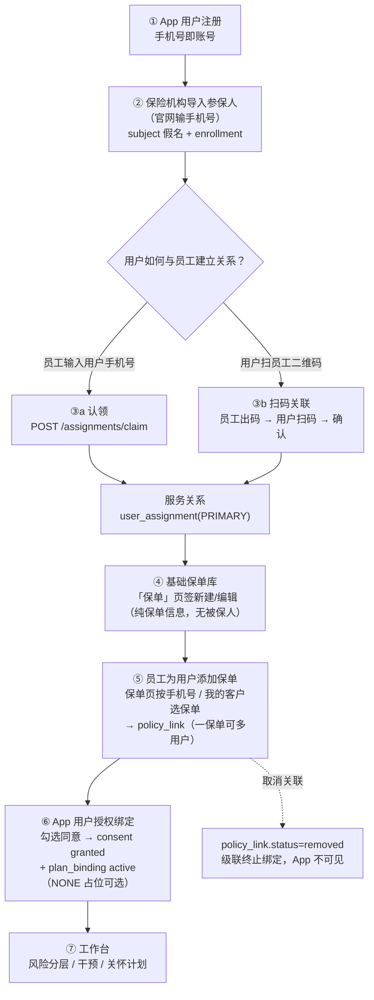

## 2. 角色与入口

```mermaid
flowchart LR
    subgraph 保险机构（官网）
        E1["机构管理员<br>全机构范围"] --> W1["我的客户 / 保单 / 计划目录"]
        E2["部门经理（保险经理）<br>本部门范围"] --> W1
        E3["运营员（员工）<br>自己客户范围"] --> W1
    end
    subgraph App用户
        U1["参保用户"] --> U2["服务专员卡片 / 保险计划 / 扫码关联"]
    end
    W1 --> BFF["官网 BFF（会话转发，<br>浏览器不持 Jeecg 凭据）"]
    BFF --> JEE["JeecgBoot"]
    U2 --> JEE
```

| 角色 | 核心动作 | 权限 |
| --- | --- | --- |
| 机构管理员 | 全机构范围：导入参保/认领/转移/保单/扫码码管理 | `assignment:manage/transfer/view`、`business:import` |
| 部门经理 | 本部门范围：同上（团队视图已下线，TEAM 范围仍用于各列表） | 同上 |
| 运营员（员工） | 自己客户范围：认领/保单添加给用户/扫码码 | 同上 |
| App 用户 | 扫码关联（本人确认）、授权绑定（本人动作） | App 登录态 |

## 3. 服务关系：认领 / 转移 / 结束

```mermaid
sequenceDiagram
    participant EMP as 员工（官网）
    participant JEE as JeecgBoot
    participant DB as software_db
    EMP->>JEE: 认领：POST /assignments/claim {phone 或 enrollmentId, roleType}
    JEE->>DB: 手机号 → 已注册 App 账号 → 本机构 active 参保关系
    JEE->>DB: createAssignment(PRIMARY)：user_assignment(active)<br>+ assignment_change_log + 审计
    JEE-->>EMP: 「我的客户」立即可见
    Note over EMP,DB: 转移 = 结束旧行 + 新建行（责任链不丢）；结束 = 状态 ended + 原因必填
```

```mermaid
stateDiagram-v2
    [*] --> active: 认领/扫码确认（PRIMARY）
    active --> ended: 转移（旧行）/ 结束服务
    ended --> active: 再次认领（新行，历史保留）
    active --> active: 扫码换专员（旧行 ended + 新行 active）
```

**关键规则**：同一参与记录同一时刻至多一条 active PRIMARY（数据库唯一索引）；所有变更写 `assignment_change_log`；员工看自己客户（SELF）、主管看本部门（TEAM）、管理员全机构。

## 4. 基础保单库：新建 / 编辑 / 添加 / 取消关联

```mermaid
sequenceDiagram
    participant M as 员工（官网「保单」页签）
    participant JEE as JeecgBoot
    participant DB as software_db
    M->>JEE: 新建/编辑：POST /imports/policies {policyNo, policyType, defaultPlanId?, 日期…}
    JEE->>DB: 幂等 upsert（tenant+policyNo 唯一）——纯保单信息，无被保人
    M->>JEE: 添加给用户：POST /policies/link {policyNo, phone | enrollmentId}
    JEE->>DB: 校验保单 active → 用户已注册 → 本机构已参保 → 负责范围内<br>→ upsert policy_link（一保单可多用户，同人幂等）
    M->>JEE: 查看关联：GET /policies/{policyNo}/links（按负责范围过滤）
    M->>JEE: 取消关联：POST /policies/unlink {policyNo, phone|enrollmentId|subjectRef}
    JEE->>DB: link.status=removed（软取消，历史保留）<br>级联：该用户该保单 active plan_binding → unbound<br>无其他 active 绑定时 subject.consent_status 回 pending
```

```mermaid
erDiagram
    rehealth_insurance_policy ||--o{ rehealth_insurance_policy_link : "一保单多用户"
    rehealth_insurance_subject ||--o{ rehealth_insurance_policy_link : "用户被添加保单"
    rehealth_insurance_policy {
        varchar policy_no "保单号（租户内唯一）"
        varchar product_name "产品名"
        varchar policy_type "险种类型"
        varchar default_plan_id "默认健康计划（可选）"
        varchar status "active/ended/suspended"
    }
    rehealth_insurance_policy_link {
        varchar policy_no "保单号"
        char64 subject_ref "被保人假名"
        varchar status "assigned / removed"
    }
```

## 5. 扫码关联：员工出码 → 用户扫码 → 确认

### 5.1 全链路时序

```mermaid
sequenceDiagram
    participant E as 员工（官网「扫码关联」弹窗）
    participant BFF as 官网 BFF
    participant JEE as JeecgBoot
    participant DB as software_db
    participant APP as App 用户
    E->>BFF: POST /assignments/qr-code（生成/刷新）
    BFF->>JEE: → JEE 生成 8 位 Base32 码（30 天有效，一人一码）
    JEE-->>E: code + rehealth://insurance/scan?c=CODE&t=TENANT → 弹窗渲染二维码
    APP->>JEE: 相机扫码/手动输码 → POST /mobile/.../assignments/scan {employeeCode}
    JEE->>DB: 校验码 active/未过期/员工活跃<br>限流：同用户每分钟≤10次<br>创建 5 分钟一次性 pending 会话
    JEE-->>APP: sessionId + 员工脱敏信息（姓名/机构/部门）+ 现有专员（若有）
    APP->>JEE: 确认：POST /scan/{sessionId}/confirm {replaceExisting}
    JEE->>DB: 会话一次性消费（pending→confirmed）
    JEE->>DB: 无专员 → createAssignment(PRIMARY)<br>已有其他专员 + replaceExisting=true → 结束旧行+新建行（责任链保留）
    JEE-->>APP: 已建立/已在服务；「我的」页出现服务专员卡片
    JEE-->>E: 官网「我的客户」立即可见
```

### 5.2 两个状态机

```mermaid
stateDiagram-v2
    [*] --> active: 员工生成/刷新码
    active --> disabled: 员工停用（泄露止损）
    disabled --> active: 刷新重新启用
    active --> expired: 30 天未刷新
    expired --> active: 刷新重新启用

    state 扫码会话 {
        [*] --> pending: 用户扫码
        pending --> confirmed: 用户确认（一次性消费）
        pending --> cancelled: 用户取消
        pending --> expired: 5 分钟未确认
    }
```

### 5.3 更换专员（二次确认）

```mermaid
flowchart TD
    A["用户扫码确认"] --> B{"已有其他专员？"}
    B -- 否 --> C["直接建立 PRIMARY"]
    B -- 是 --> D["App 弹窗二次提醒：<br>您已有服务专员 X，是否更换？"]
    D -- 取消 --> E["409 返回，不更换"]
    D -- 确认更换 --> F["replaceExisting=true<br>结束旧行 + 新建行<br>责任链与变更日志完整保留"]
```

## 6. App 授权绑定（零输入 + 计划可选）

```mermaid
sequenceDiagram
    participant APP as App 用户
    participant JEE as JeecgBoot
    participant DB as software_db
    APP->>JEE: GET /plans/bindable-policies（候选 = 已关联本用户的 active 保单）
    JEE-->>APP: 脱敏保单号 + 产品名 + 计划名 hasPlan
    APP->>JEE: 勾选同意 → POST /plans/bind {consentVersion, policyNo?}
    JEE->>DB: ① 自动选租户（唯一参保租户）<br>② 自动选保单（唯一有效保单）<br>③ 计划=default_plan_id；无计划→NONE 占位（仅授权不挂计划）
    JEE->>DB: ④ consent granted（本人授权证据）<br>⑤ plan_binding active<br>⑥ subject.consent_status=granted
    JEE-->>APP: 绑定成功；保险侧工作台该用户可见
```

## 7. 数据模型总览

```mermaid
erDiagram
    sys_user ||--o{ rehealth_insurance_subject : "租户级假名 sha256(tenantId:userId)"
    rehealth_insurance_subject ||--o{ rehealth_insurance_enrollment : "参保参与"
    rehealth_insurance_enrollment ||--o{ rehealth_insurance_user_assignment : "服务关系（区间化）"
    rehealth_insurance_user_assignment ||--o{ rehealth_insurance_assignment_change_log : "变更日志"
    rehealth_insurance_policy ||--o{ rehealth_insurance_policy_link : "保单-用户关联"
    rehealth_insurance_subject ||--o{ rehealth_insurance_policy_link : ""
    rehealth_insurance_plan_catalog ||--o{ rehealth_insurance_policy : "default_plan_id"
    rehealth_insurance_policy ||--o{ rehealth_insurance_plan_binding : "App 绑定"
    rehealth_insurance_subject ||--o{ rehealth_insurance_plan_binding : ""
    sys_user ||--o| rehealth_insurance_employee_qr : "员工专属码"
    rehealth_insurance_employee_qr ||--o{ rehealth_insurance_scan_session : "扫码会话"
```

## 8. 权限与数据范围

| 权限码 | 用途 |
| --- | --- |
| `rehealth:insurance:assignment:view` | 我的客户 / 被保人池 / 责任链 |
| `rehealth:insurance:assignment:manage` | 认领 / 结束 / 员工码生成·查询·停用 |
| `rehealth:insurance:assignment:transfer` | 转移服务关系 |
| `rehealth:insurance:business:import` | 基础保单库 / 添加·取消关联 / 保单列表（机构管理员、部门经理、运营员、admin） |
| `rehealth:insurance:care-plan:view/manage/publish` | 计划目录 / 关怀计划 |

```mermaid
flowchart LR
    S["员工（运营员）"] -->|"SELF"| A["自己的客户"]
    M["部门经理"] -->|"TEAM"| B["本部门所有员工的客户"]
    O["机构管理员"] -->|"null（全机构）"| C["全部客户"]
    X["核心系统服务账号"] -->|"null（对接兼容）"| C
```

## 9. 幂等与状态速查

| 操作 | 幂等/状态 |
| --- | --- |
| 导入参保人 | `(tenant, subject_ref)` upsert；重复导入不产生重复参保 |
| 认领 | 已是本人客户 → 返回已在服务，不重复建关系 |
| 保单新建/编辑 | `(tenant, policy_no)` upsert；编辑不清除既有用户关联 |
| 添加保单给用户 | `(tenant, policy_no, subject_ref)` 唯一；同人重复添加幂等；一保单多用户 |
| 取消关联 | 软取消 `removed`；重复取消幂等；可再次添加恢复 |
| 扫码 | 会话一次性（pending→confirmed 条件更新防双花）；5 分钟过期 410 |
| 授权绑定 | `(tenant, subject, policy, plan)` upsert；重复绑定不重复记录 |

## 10. 端到端验收路径（已实测）

```mermaid
flowchart LR
    T1["注册 App 用户"] --> T2["官网导入参保"]
    T2 --> T3["官网生成员工码"]
    T3 --> T4["App 扫码 → 预览 → 确认"]
    T4 --> T5["我的客户出现该用户（责任链可查）"]
    T5 --> T6["保单页新建基础保单"]
    T6 --> T7["添加保单给用户（手机号/选保单）"]
    T7 --> T8["App bindable 可见 → 勾选同意绑定（NONE 占位亦可）"]
    T8 --> T9["工作台可见 → 风险分层/干预"]
    T7 --> T10["取消关联 → App 不可见 → 可再添加"]
    T3 --> T11["停用码 → 扫码 404"]
```

> 本地 QA 账号：经理 `local_insurance_manager_01`（1000）、机构管理员 `local_ins_9102_admin`（9102）、
> 运营员 `local_ins_9101_operator`（9101）、App 用户 `local_app_9101_02` / `local_app_shared_01`
> 密码均为 `123456`；王老五 `18890254413` 为 App 自助注册用户。
