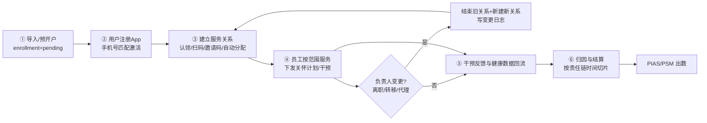
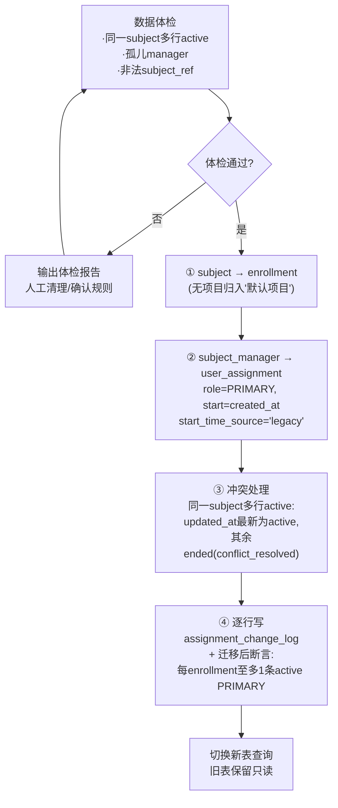
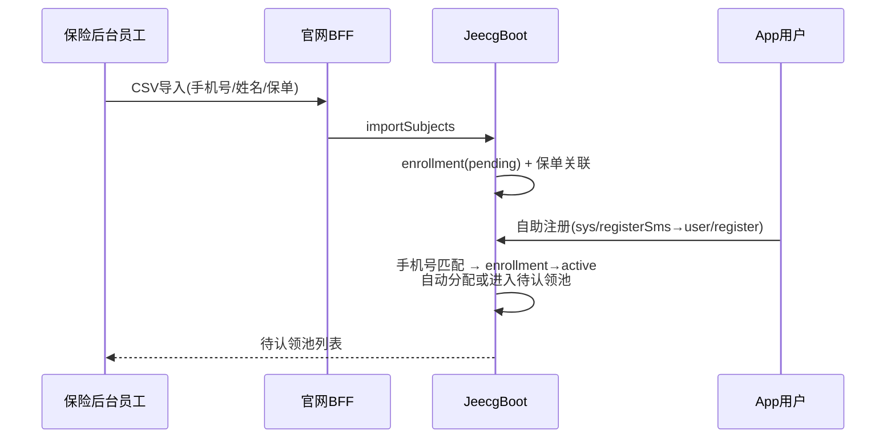
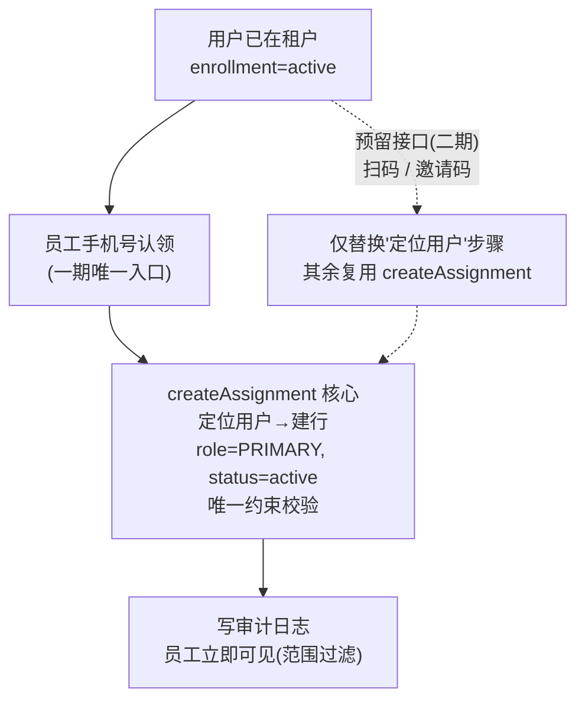
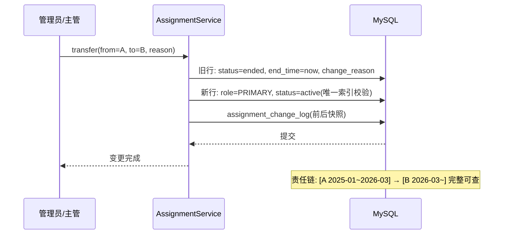
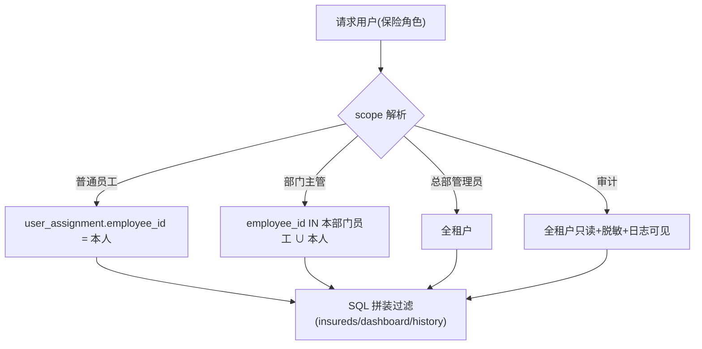
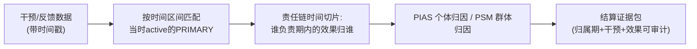
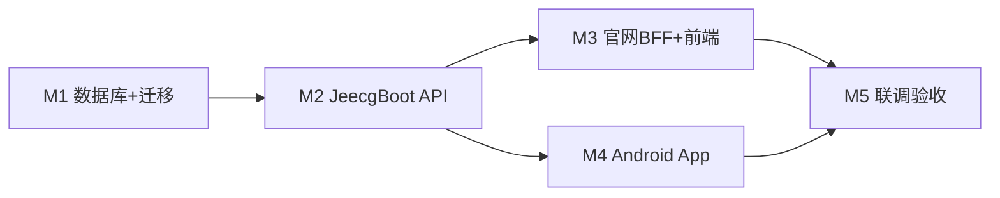

# 保险侧"用户服务关系"—— 实施计划与闭环流程

> 承接《保险侧用户服务关系方案（已定稿决策版）》。本文档给出**详细改动计划**（按里程碑、文件级）和**五条闭环流程**（含图）。
> 已确认决策：① 多保险多项目一期支持；② 存量归属数据迁移为新表首条 PRIMARY 历史；③ 员工看自己、主管看团队；④ 关联免用户 App 确认；⑤ 一期建项目层。

## 一、总体闭环（先看全局）

六个环节全部落地后，任何时刻都能回答：**"某段时间谁负责这个用户、谁实施了干预、效果归到谁"**。

## 二、详细改动计划（里程碑制）

### M1 数据库与存量迁移（JeecgBoot，Flyway）

**1.1 新增表（Flyway V 脚本，仿照 `insurance` 包现有迁移）**

| 表 | 关键字段 |
|---|---|
| `insurance_project` | id, tenant_id, project_no, name, status, start_date, end_date, created_at, updated_at |
| `insurance_enrollment` | id, tenant_id, project_id, subject_ref, rehealth_user_id, enrollment_status(pending/active/ended), consent_status, consent_version, consented_at, source_system, source_record_id, created_at, updated_at |
| `user_assignment` | id, tenant_id, enrollment_id, employee_id, role_type(PRIMARY/BACKUP/TEMPORARY/SUPERVISOR), start_time, end_time, status(active/ended/revoked), **active_marker(生成列)**, start_time_source(legacy/system), change_reason, operator_id, created_at |
| `assignment_change_log` | id, tenant_id, enrollment_id, assignment_id, before_json, after_json, change_type, reason, operator_id, created_at |

**强制约束**：唯一索引 `(enrollment_id, role_type, active_marker)`，其中 `active_marker = IF(status='active' AND role_type='PRIMARY', 1, id)`——保证**同一 enrollment 同一时刻最多一条 active PRIMARY**，由数据库兜底。

**1.2 存量迁移流程（决策 2，分四步）**

- 迁移脚本做成**幂等 + 可回放**（按批次、带批次表记录），上线前在测试库跑两遍验证一致性。
- 切换策略：一次性切流（同一次发版内 `InsuranceRiskService` 全部改查新表），旧表保留只读一个月后下线。

### M2 JeecgBoot 服务端

**2.1 新服务 `InsuranceAssignmentService`**（区间化变更，所有写操作同事务 + 记日志）

| 端点（`/rehealth/insurance/v1/assignments`） | 期次 | 说明 |
|---|---|---|
| `POST /claim` | **一期完整实现** | 员工认领：手机号/subjectRef + roleType → 建立关系（唯一关联入口） |
| `POST /invite-codes` | **一期预留接口** | 只定契约、占位返回"暂未开放"；表结构与防枚举规则一并定好，二期实现 |
| `POST /transfer` | **一期完整实现** | 单/批量转移：结束旧行 + 新建行 + 逐行日志 |
| `POST /{assignmentId}/end` | 一期完整实现 | 结束单条关系（原因必填） |
| `POST /departure-migration` | 二期 | 离职迁移：按员工批量结束/转移 |
| `GET /mine` | 一期完整实现 | 我的客户（分页，按当前员工过滤） |
| ~~`GET /department`~~ | 已下线（2026-08-26） | 团队视图已移除；TEAM 数据范围仍用于风险池/工作台/保单添加给用户 |
| `GET /{enrollmentId}/history` | 一期完整实现 | 责任链历史 + 变更日志 |
| 权限码 | — | `rehealth:insurance:assignment:view/manage/transfer` |

**预留接口的实现策略**：认领、扫码、邀请码三者只是"定位用户"的方式不同，定位到用户后**共用同一个 `createAssignment()` 核心方法**（唯一约束、审计、范围过滤全部一致）。一期把 `createAssignment` 做扎实，扫码/邀请码二期只需要替换"用户定位"这一步。

**2.2 改造既有代码**

- `InsuranceSettingsService.upsertAssignment` → 迁移期只读，改由 `InsuranceAssignmentService` 承接（避免双写）。
- `InsuranceTenantAccessGuard` → 新增三级范围解析 `scope(user, tenant)`：员工=自己、主管=本部门、管理员=全租户、审计=全租户只读（返回 scope 对象，供 SQL 拼接）。
- `InsuranceRiskService.insureds/dashboard` → 过滤条件从 `rehealth_insurance_subject_manager` 改为 `user_assignment`（按 enrollment join），保持 SQL 层强制。
- 写操作复用 `InsuranceAuditEventEntity` 记录审计；`employee_operation_log` 二期再拆。

**2.3 App 端（`/rehealth/mobile/insurance`）**

| 端点 | 期次 | 说明 |
|---|---|---|
| `GET /assignments/current` | 一期完整实现 | 展示"我的服务专员"（脱敏姓名/工号） |
| `POST /assignments/redeem` | 一期预留接口 | 邀请码核销：契约先定、占位返回，二期实现（复用服务端 `createAssignment`） |
| `POST /assignments/scan` | 一期预留接口 | 扫员工二维码：契约先定、占位返回，二期实现（复用服务端 `createAssignment`） |

### M3 官网 BFF 与前端

- `backend/api/app_backend_client.py`：新增 assignments 各方法（claim/transfer/mine/department/history；invite-codes 一期预留）。
- 新增 `backend/api/insurer_assignment_routes.py`：权限校验沿用 `_require_insurer` + 新权限码。
- `frontend/` 新增 `insurer_assignments.html`：一期已交付"我的客户"列表（团队视图已于 2026-08-26 下线）、**手机号认领弹窗**、被保人池（keyword 搜索与池内认领）、导入参保人弹窗（手机号批量纳入、幂等）、变更记录抽屉、批量转移入口与「计划目录」弹窗（查看/新增产品级计划）；员工二维码/邀请码入口先放占位按钮（"即将上线"），二期启用。

### M4 Android App

- "我的 → 我的服务专员"页：展示负责人（关系建立后即可见，无需本地存储）。
- 扫码与邀请码输入入口一期不做，只保留服务端接口；二期再上 UI。
- 无需 Room 新表（关系全在服务端）。

### M5 测试与验收

| 层 | 命令/动作 |
|---|---|
| JeecgBoot | `mvn test -pl jeecg-boot-module/jeecg-module-rehealth -DskipTests=false`；契约测试仿 `InsuranceRiskControllerContractTest`；迁移测试仿 `InsuranceSchemaMigrationTest` |
| 官网 | `pytest backend/tests/`（仿 `test_insurer_settings.py` 写 assignments 用例） |
| Android | `gradlew testDebugUnitTest`（网络契约测试仿 `ReHealthMobileApiRouteContractTest`） |
| 验收点 | 同一 enrollment 并发两次转移只成功一次（唯一索引生效）；离职迁移后责任链完整；主管可见团队、员工只见自己；多保险用户出现在两家租户各自列表 |

## 三、五条闭环流程（图）

### 闭环① 导入 → 注册匹配 → 激活

### 闭环② 建立服务关系（一期只有认领；扫码/邀请码预留）

- 一期：认领 = 手机号定位用户 → `createAssignment`（完整实现）。
- 二期：扫码、邀请码只是把"定位用户"换成"解析二维码/核销邀请码"，其余逻辑零改动。

### 闭环③ 负责人变更 / 离职（责任链不中断）

### 闭环④ 数据范围（角色 + 范围，SQL 层强制）

### 闭环⑤ 归因与结算（按责任链切片）

## 四、里程碑与依赖

- M1 是硬前置（新表 + 唯一约束 + 迁移断言通过后才能动 M2）。
- M3/M4 可并行。
- 上线顺序：先发 JeecgBoot（含迁移）→ 官网 BFF/前端 → App 灰度。

## 五、回滚与风险

| 风险 | 对策 |
|---|---|
| 迁移数据异常 | 迁移前体检报告人工确认；迁移脚本幂等可回放；旧表保留只读一个月 |
| 并发转移产生两条 PRIMARY | 唯一索引兜底，第二条 insert 直接失败，返回冲突提示 |
| 多保险用户从官网"App 用户"列表消失 | 保险侧页面统一改用 insurance 侧查询（enrollment 维度） |
| 免确认关联被滥用（员工随意翻看） | 每次 claim 必记审计日志；UI 明示"仅服务关系，数据使用以授权为准"；明细读取仍受 consent 约束 |

**下一动作**：确认 M1 的 Flyway 迁移脚本（含体检 SQL 与迁移 SQL）可以开始编写，随后按 M2 端点清单实现。
