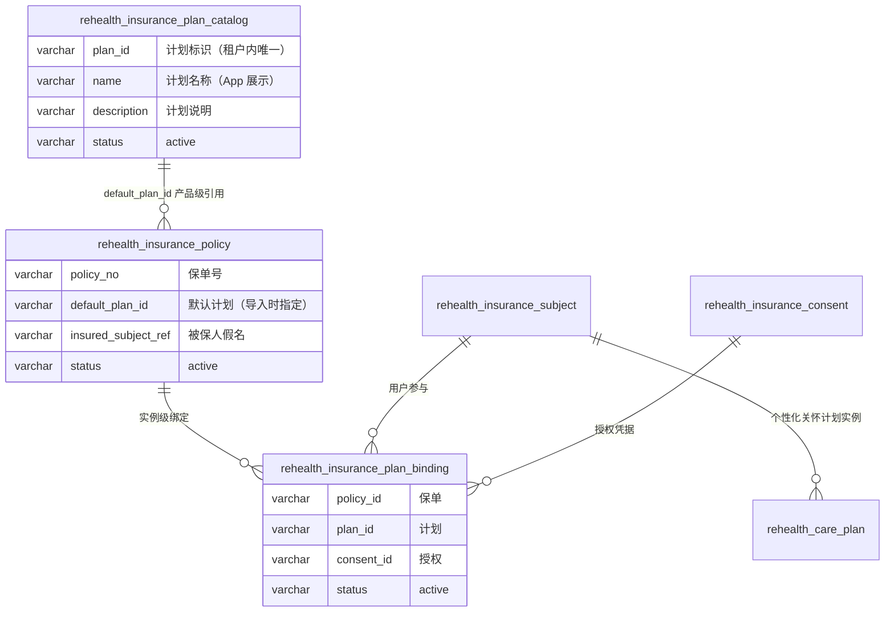
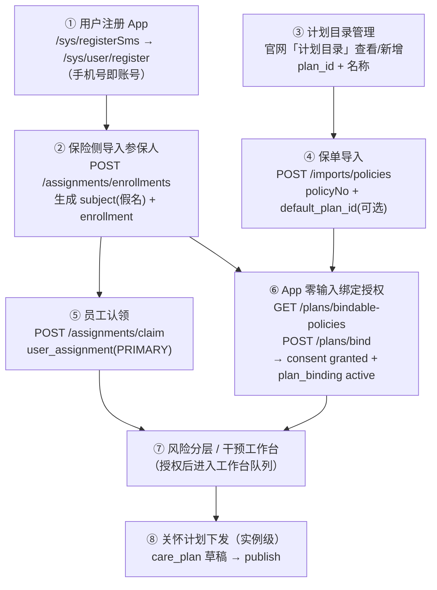
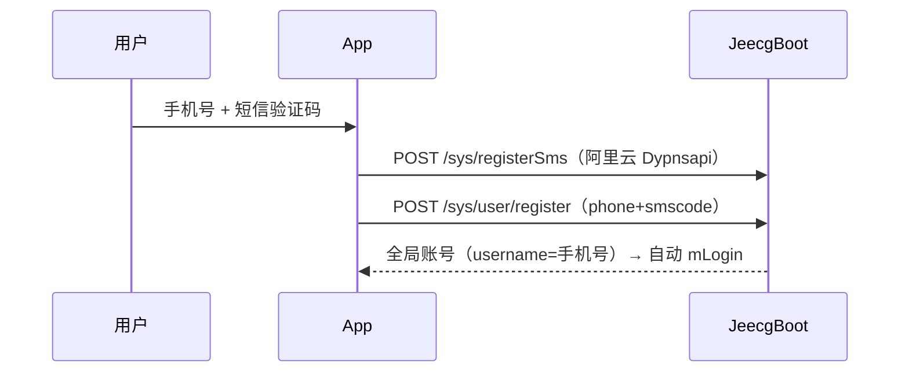
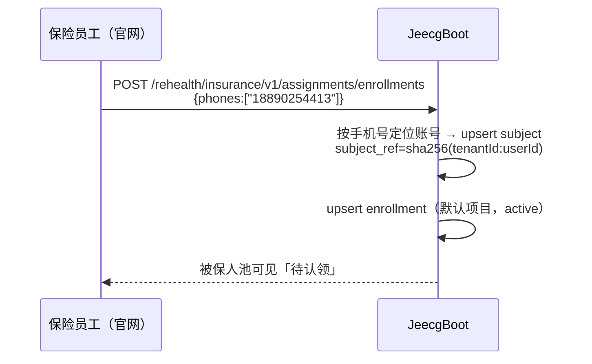
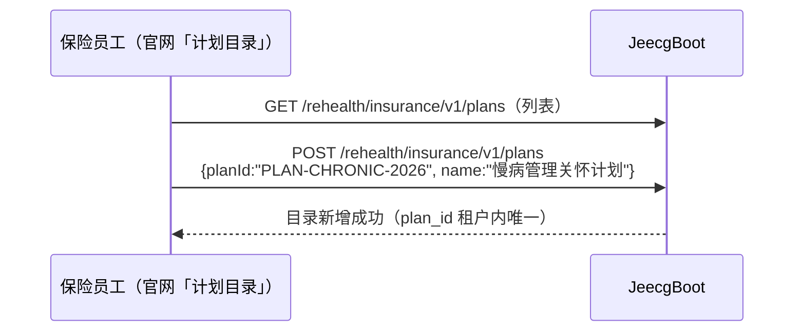
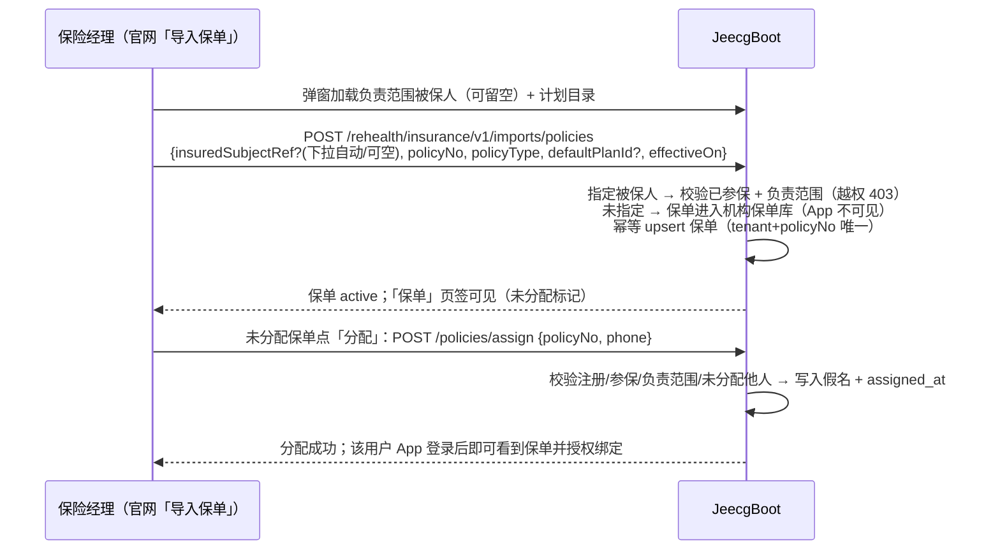
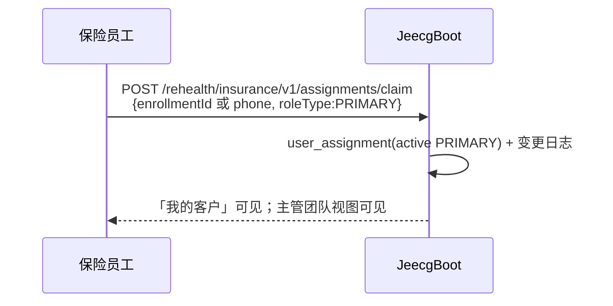
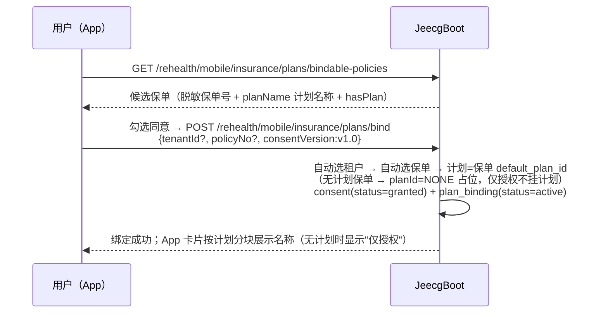

# 保险侧计划与保单设计 · 从用户注册到保单分配的全流程闭环

> 本文档说明"健康计划"与"保单"在系统中的两层设计关系，并串起
> **用户注册 → 导入参保人 → 计划目录 → 保单导入（指定计划）→ 认领 →
> App 零输入绑定授权 → 风险分层/干预工作台** 的完整闭环。
> 表结构与接口均与当前代码一致，配套文档：《保险侧保单数据设计.md》、
> 《保险侧认领到干预改善全链路.md》、`backend/contracts/INSURANCE_BUSINESS_API.md`。

## 1. 计划与保单的设计关系（两层模型）

**两层设计**：

| 层 | 表 | 含义 | 谁操作 |
| --- | --- | --- | --- |
| **产品层**（模板） | `rehealth_insurance_plan_catalog` | 计划目录：`plan_id → 名称/说明`，租户级产品模板 | 保险侧（官网「计划目录」查看/新增） |
| **产品层**（挂接） | `rehealth_insurance_policy.default_plan_id` | 保单导入时指定该保单对应哪个计划 | 保险侧导入保单时指定 |
| **实例层**（生效） | `rehealth_insurance_plan_binding` | 用户 × 保单 × 计划 × 授权 的绑定（计划真正落到用户头上） | 用户在 App 一键授权绑定 |
| **实例层**（个性化） | `rehealth_care_plan`（版本化） | 针对具体用户发布的关怀计划内容与任务（可覆盖/增强产品级计划） | 保险侧在工作台创建并发布 |

一句话：**计划目录是"计划是什么"，保单的 default_plan_id 是"这张保单给什么计划"，计划绑定是"这个用户通过这张保单实际加入了什么计划"，关怀计划是"给这个人定制的计划内容"。**

## 2. 全流程闭环总览

各阶段可以独立发生，但 **⑥ 绑定** 需要 ②（参保）+ ④（保单）+ ⑤（服务关系可选，管理员视角不需要）全部就绪；
**⑦ 工作台** 额外要求 ⑥ 的授权 `consent=granted`。

## 3. 分阶段详解

### 阶段① 用户注册（App 侧）

落点：`sys_user`（全局账号，**不归属任何保险租户**）。此时保险侧还看不到该用户。

### 阶段② 保险侧导入参保人

落点：`rehealth_insurance_subject`（consent=pending）、`rehealth_insurance_enrollment`。

### 阶段③ 计划目录管理（保险侧）

落点：`rehealth_insurance_plan_catalog`。

### 阶段④ 保单入库与分配（保险经理/管理员，两步式，计划可选）

落点：`rehealth_insurance_policy`（`insured_subject_ref` 可空 + `assigned_at`、`default_plan_id` 可空）。
约束：指定被保人时须已参保（即先做阶段②）且在负责范围内；分配时手机号须为已注册 App 的参保用户；
`default_plan_id` 可选，指定时建议先在目录中登记。官网入口为「我的客户 → 导入保单 / 保单页签分配」，
服务端批量导入走同一 JeecgBoot 导入接口。

### 阶段⑤ 员工认领（服务关系）

落点：`rehealth_insurance_user_assignment` + `rehealth_insurance_assignment_change_log`。

### 阶段⑥ App 零输入绑定授权（计划真正落到用户）

落点：`rehealth_insurance_consent`（granted）、`rehealth_insurance_plan_binding`（active）、
`rehealth_insurance_subject.consent_status=granted`。
多保单/多机构时用户点选候选即可，仍无需输入任何号码。

**计划可选（折中方案）**：`default_plan_id` 允许为空。保单未指定计划时绑定照常成功，
`plan_binding.plan_id = 'NONE'` 占位（仅授权，不挂计划），App 只显示保单、卡片副文案
"仅授权，暂无健康计划"；`planName` 对 `NONE` 返回空。后续补录计划后，同一保单可再次
绑定切换到真实计划。

### 阶段⑦ 风险分层与干预工作台

- 风险池：按服务关系范围展示被保人（不需授权）
- 工作台：要求 `consent=granted`（授权是数据使用的合规门槛），低风险进入"待复核"、
  高风险进入"待行动"，员工创建行动/关怀计划推动 in_progress → improved

### 阶段⑧ 关怀计划下发（实例级个性化）

保险侧在工作台对已授权用户创建关怀计划（`POST /interventions/{subjectId}/care-plans` → 草稿 →
`publish` 发布版本），App 展示计划内容与今日任务，用户反馈驱动依从性与状态流转。

## 4. 各阶段数据落点总表

| 阶段 | 写入表 | 关键状态 |
| --- | --- | --- |
| ① 注册 | `sys_user` | 全局账号，无租户归属 |
| ② 导入参保人 | `rehealth_insurance_subject`、`rehealth_insurance_enrollment` | enrollment=active，consent=pending |
| ③ 计划目录 | `rehealth_insurance_plan_catalog` | active |
| ④ 保单导入 | `rehealth_insurance_policy` | active，default_plan_id 可选（为空=仅保单，无计划） |
| ⑤ 认领 | `rehealth_insurance_user_assignment` + change_log | active PRIMARY |
| ⑥ 绑定授权 | `rehealth_insurance_consent`、`rehealth_insurance_plan_binding`、subject.consent | granted / active（plan_id 可为 NONE 占位） |
| ⑦ 工作台 | 只读聚合（风险/反馈/行动） | 按范围 + 授权过滤 |
| ⑧ 关怀计划 | `rehealth_care_plan*` 版本化表 | 草稿 → published |

## 5. 关键约束与幂等规则

1. 保单与计划都是**租户级**：`(tenant_id, policy_no)`、`(tenant_id, plan_id)` 唯一
2. 保单的被保人假名必须在同一租户内已存在（先参保、后保单）
3. `default_plan_id` 可选：指定时建议在计划目录中登记（未登记也能绑定，App 显示计划标识而非名称）；为空时保单照常导入，用户绑定为 `plan_id=NONE` 占位（仅授权、不挂计划，App 显示"仅授权，暂无健康计划"）
4. 绑定授权是**用户本人动作**（App 勾选同意），服务端不做代授权；这是进入工作台的合规门槛
5. 重复导入/重复绑定全部幂等（upsert），不会产生重复保单或重复绑定
6. 一个用户可在多家机构各自参保、各自有保单、各自绑定计划——实例层互相隔离

## 6. 与真实用户对照（王老五实例）

| 阶段 | 实际数据 |
| --- | --- |
| ① 注册 | 账号 18890254413（王老五），App 自助注册 |
| ② 参保 | 租户 1000 与 9102 各有 subject + enrollment（active） |
| ③ 计划目录 | PLAN-CHRONIC-2026 = 慢病管理关怀计划（1000/9102 均有） |
| ④ 保单 | 1000：8850882026080003712；9102：8850882026090004821，均指定 PLAN-CHRONIC-2026 |
| ⑤ 认领 | 1000：陈立峰（PRIMARY）；9102：管理员视角（无需归属） |
| ⑥ 绑定 | 1000 已授权绑定；9102 待用户在 App 点「加入」 |
| ⑦ 工作台 | 1000 已进入（待复核）；9102 授权后进入 |
