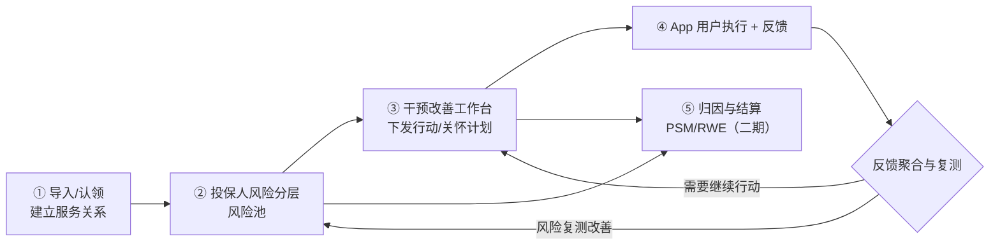
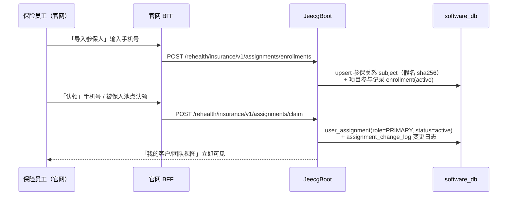
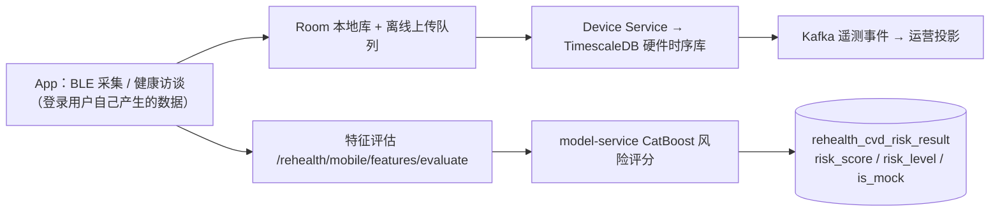
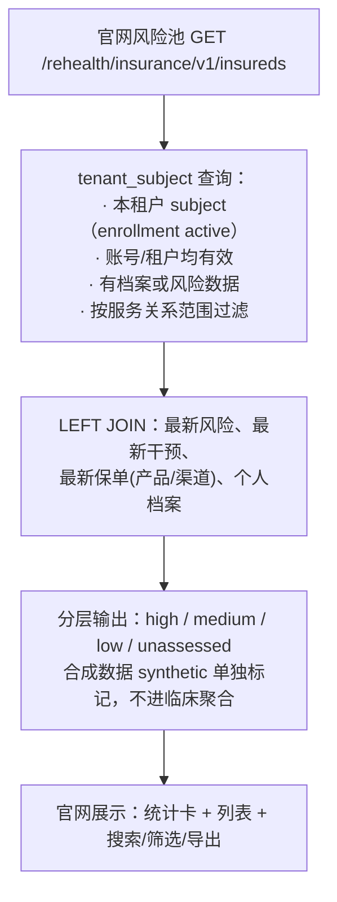
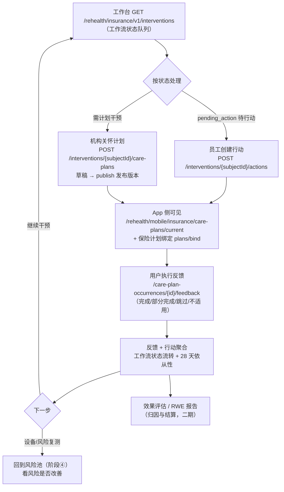
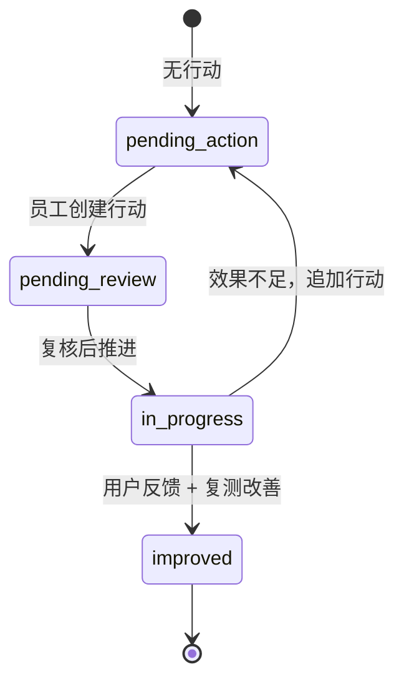
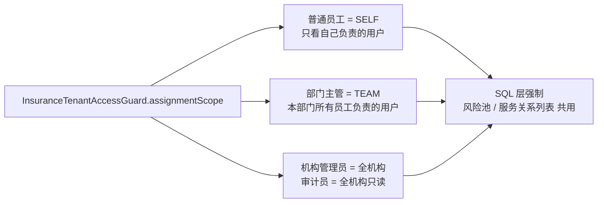

# 保险侧全链路：认领 App 用户 → 风险分层 → 干预改善

> 本文档串起保险侧"服务关系（认领）→ 投保人风险分层 → 干预改善工作台"的完整业务链路，
> 图与端点均与当前代码一致。设计决策见《保险侧用户服务关系方案.md》与
> 《保险侧用户服务关系-实施计划与闭环流程.md》，接口契约见 `backend/contracts/INSURANCE_BUSINESS_API.md`。

## 1. 总览

## 2. 阶段① 导入与认领（服务关系）

| 官网页面 | 端点 | 说明 |
| --- | --- | --- |
| 我的客户 | `GET /rehealth/insurance/v1/assignments/mine` | 员工本人负责的用户（管理员为全机构） |
| 团队视图 | `GET /rehealth/insurance/v1/assignments/department` | 主管：本部门所有员工负责的用户 |
| 被保人池 | `GET /rehealth/insurance/v1/assignments/enrollments` | 租户参与记录 + 当前主负责人，供认领 |
| 导入参保人 | `POST /rehealth/insurance/v1/assignments/enrollments` | 按手机号批量纳入（幂等） |
| 认领 | `POST /rehealth/insurance/v1/assignments/claim` | 按手机号或 enrollmentId 建 PRIMARY 关系 |
| 转移 / 结束 | `POST /assignments/transfer`、`POST /assignments/{id}/end` | 结束旧行 + 新建行，责任链不丢 |
| 责任链 | `GET /assignments/{enrollmentId}/history` | 历史关系 + 变更日志 |

要点：认领只建立**服务关系**；用户归属保险机构/项目，员工是阶段负责人。换负责人走转移
（结束旧行 + 新建行），历史责任链永不覆盖。扫码/邀请码为预留契约（二期）。

## 3. 阶段② 风险数据的来源（前置链路，保险侧无需操作）

风险结果按 `user_id` 落库，与保险侧解耦；保险侧查询时通过 subject 假名把"投保人"与
"App 用户健康数据"关联，原始健康信号不进保险官网。

## 4. 阶段③ 投保人风险分层（风险池页）

相关端点：

| 端点 | 说明 |
| --- | --- |
| `GET /rehealth/insurance/v1/dashboard/risk` | 租户级风险看板（总数/已评估/合成/高中低分布） |
| `GET /rehealth/insurance/v1/insureds` | 被保人分页（keyword/riskLevel/channel/age 筛选） |
| `GET /rehealth/insurance/v1/insureds/{subjectId}` | 单个被保人详情（含业务快照：保单/保障/理赔/授权） |

风险池每一行都是"被保人 + 其最新真实风险"，且只展示当前账号**范围内负责的用户**。

## 5. 阶段④⑤ 干预改善工作台闭环

工作流状态机（数据中实际使用的四个状态）：

| 工作台端点 | 说明 |
| --- | --- |
| `GET /rehealth/insurance/v1/interventions/dashboard` | 干预看板聚合 |
| `GET /rehealth/insurance/v1/interventions` | 工作流队列（按状态分页） |
| `GET /rehealth/insurance/v1/interventions/{subjectId}` | 单个被保人干预详情 |
| `POST /rehealth/insurance/v1/interventions/{subjectId}/actions` | 创建人工行动 |
| `POST /rehealth/insurance/v1/interventions/actions/batch` | 批量创建行动 |
| `PUT /rehealth/insurance/v1/intervention-actions/{actionId}` | 更新行动 |
| `GET /rehealth/insurance/v1/interventions/report-data` | 干预效果报告数据 |
| `POST /rehealth/insurance/v1/interventions/{subjectId}/care-plans` | 创建关怀计划 |
| `POST /rehealth/insurance/v1/care-plans/{planId}/publish` | 发布计划版本（发布后内容不可变） |

App 侧对应端点：`GET /rehealth/mobile/insurance/care-plans/current`（今日任务 + 28 天依从性）、
`POST /rehealth/mobile/insurance/care-plan-occurrences/{occurrenceId}/feedback`（幂等反馈）、
`POST /rehealth/mobile/insurance/plans/bind`（保险计划绑定，需有效保单与授权）。

## 6. 数据范围贯穿全程（横向约束）

## 7. 已知衔接点与提醒

1. **干预工作台/关怀计划的范围过滤**目前仍按"本人负责"（`responsibilityScope`）过滤，
   尚未切换到新的三级 `assignmentScope`；主管在团队视角下的干预队列覆盖需后续统一。
2. **风险接口带开发模式开关**（`rehealth.insurance.tenant-membership-dev-scope-enabled`），
   生产环境需按配置开启后才能提供范围化查询。
3. **归因与结算**（PSM/RWE 报告、结算证据包）为二期内容，届时按 `user_assignment`
   时间区间切片，把干预效果归到当时的 PRIMARY 负责人。
4. 扫码/邀请码关联为预留接口（返回 501），二期实现时复用 `createAssignment` 核心。

## 8. 一句话总结

**导入参保人 → 认领建服务关系 →（App 数据自动算风险）→ 风险池按"我负责的人"分层 →
对高风险人群创建干预行动/发布关怀计划 → App 用户执行并反馈 → 工作台聚合反馈推进状态 →
复测看风险改善 → 最终归因结算（二期）。**
