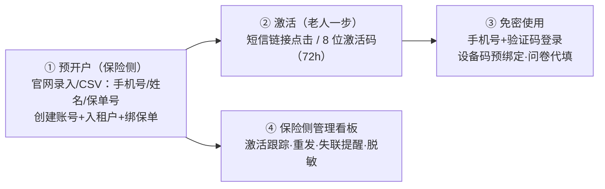
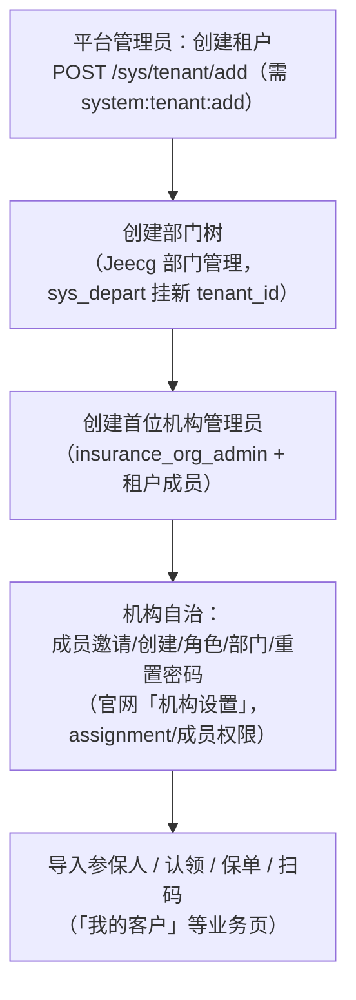

# 保险侧运营与开户（当前实现 · 内容优化版）

> 本文覆盖三类运营主题：App 用户开通方案（**讨论稿，未实施**）、新保险公司两阶段开户
> （当前流程）、测试数据与验收基线（当前约定）。原《测试数据生成提示词》全文（1172 行
> 提示词模板）已归档于 git 历史（commit c53a9ea0 之前），需要原文可恢复。

## 1. App 用户开通方案（面向老年用户 · 讨论稿）

> 状态：**讨论稿，未实施**。当前线上开通方式仍是用户 App 自助注册（手机号+验证码）。

### 1.1 背景与目标

保险机构需要把老年客户（被保险人）接入 App 做健康监测与干预关怀。三个缺口：
老人自己注册困难（手机号+验证码+密码）；保险侧无开通入口（「成员管理」只管内部员工）；
无激活状态跟踪/家属协助/失联提醒等运营能力。

**目标**：把注册与操作负担从老人转移到机构/代理人/家属——老人只需
"收一条短信 → 点一下（或报一个码）→ 戴上设备"。

### 1.2 核心流程与设计点

| # | 设计点 | 说明 |
| --- | --- | --- |
| 1 | 保险侧预开户 | 单个录入或 CSV 批量：一次完成建账号、入租户、绑保单 |
| 2 | 两种激活方式 | 短信链接（首选）/ 8 位激活码 72 小时有效（代理人电话报码） |
| 3 | 免密登录 | 手机号+验证码，不设密码；后续可选运营商一键登录 |
| 4 | 设备与问卷代办 | 设备码预录入自动绑定；健康问卷由代理人/家属代填 |
| 5 | 运营看板 | 未激活/已激活/已绑设备/失联状态；重发激活、重置登录 |
| 6 | 合规与隐私 | 知情同意+代签记录；紧急联系人；手机号脱敏；操作审计 |

### 1.3 对现有系统的影响（实施时的改动面）

- JeecgBoot：预开户、激活码、免密登录 3 个接口 + 1 张激活码表（复用短信/租户/角色/保单能力）；
- 官网：新增「参保人管理」页（批量导入、状态看板）；
- App：激活页、免密登录页（大字体、持久在线）。
基础能力（账号/租户/短信/保单导入）已具备，本方案主要补"开通+无感使用"这一段。

## 2. 新保险公司两阶段开户（当前流程）

**原则**：平台管理员建租户边界与首位管理员；机构管理员只能管自己租户内的人员/角色/部门/投保人范围。

**当前实现要点**：

- 租户与部门仍由平台管理员（或有 Jeecg 部门权限的租户管理员）创建；
- 官网「机构设置」已支持：成员邀请（手机号，`POST /settings/members/invitations`）、
  创建成员（返回一次性临时密码）、启用/停用、调整部门、分配角色（白名单，不可授机构管理员）、
  重置密码（`123456` + 首次改密）；
- 机构管理员角色 `insurance_org_admin` 授予范围=全机构；部门经理=TEAM；运营员=SELF；
- 完整流程与接口见 `backend/contracts/INSURANCE_BUSINESS_API.md` §机构设置。

## 3. 测试数据与验收基线

### 3.1 种子脚本（`backend/deploy/rehealth/scripts/`）

| 脚本 | 基线 | 内容 |
| --- | --- | --- |
| `seed-insurance-workflow-test-data.ps1/.sql` | `LOCAL_INSURANCE_QA` | 12 投保人/保单/理赔 + PSM 候选 + 草稿研究 |
| `seed-multi-insurer-tenant-test-data.ps1` | `LOCAL_MULTI_INSURER_QA` | 9101–9103 机构/部门/角色/经理（不生成业务数据） |
| `seed-multi-insurer-app-user-test-data.ps1/.sql` | 多机构 App 用户 | 14 账号、36 服务关系、120 负责人关系、设备/RHI/RDI/授权/绑定/反馈/行动/理赔全量（`-AnchorDate 2026-08-14`） |
| `seed-multi-insurer-app-user-hardware-test-data.sql` | 硬件测量 | TimescaleDB 口径的测量/睡眠/活动/饮食 |
| `seed-versioned-care-plan-test-data.ps1` | 关怀计划 | 版本化计划种子 |
| `precheck-legacy-assignment-data.sql` | 迁移体检 | 存量归属迁移前必跑 |

### 3.2 基线约定

- 种子脚本一律幂等（固定业务键 upsert，重复执行不重复插入）；
- 合成账号密码 `123456`，来源标记 `LOCAL_*_QA`，仅限本地非临床验收；
- `is_mock`/`synthetic` 严格区分：合成风险 `is_mock=0` 但 `artifact_name=*NOT_A_MODEL*`、
  `clinicalUseAllowed=false`，页面明确显示"测试/合成数据"；
- 合成用户无密码/手机号/邮箱者不能登录；带 phone 的 QA 账号用于 App 端链路验证。

### 3.3 常用 QA 账号

| 账号 | 租户/角色 | 用途 |
| --- | --- | --- |
| `local_insurance_manager_01`（陈立峰） | 1000 部门经理 | 服务关系/保单/扫码全链路 |
| `local_ins_9101_operator`（何静） | 9101 运营员 | SELF 范围验证 |
| `local_ins_9101_mgr_health`（周启明） | 9101 部门经理 | 关怀计划发布权限验证 |
| `local_ins_9102_admin`（王景川） | 9102 机构管理员 | 全机构范围验证 |
| `local_app_9101_02` / `local_app_shared_01` | App 用户（9101） | App 绑定/扫码/计划可见验证 |
| `18890254413`（王老五） | App 自助注册 | 真实注册链路（1000 已授权、9102 待授权） |

### 3.4 测试数据生成提示词（核心框架）

原 1172 行提示词模板的核心方法论（原文在 git 历史 `c53a9ea0` 之前可恢复）：

1. **先分析数据库再生成**：扫描 `*.sql` 真实 DDL、唯一约束、外键，不做随机 INSERT；
2. **保真四要素**：符合真实结构、字段约束、业务逻辑、表间关联；
3. **覆盖状态**：常见业务状态 + 异常场景（越权/过期/重复/边界）；
4. **可复用**：固定业务键幂等、支持前后端联调、接口测试、功能测试；
5. **安全底线**：本地/测试环境专用，禁止写入生产库（合成数据显式标记）。
