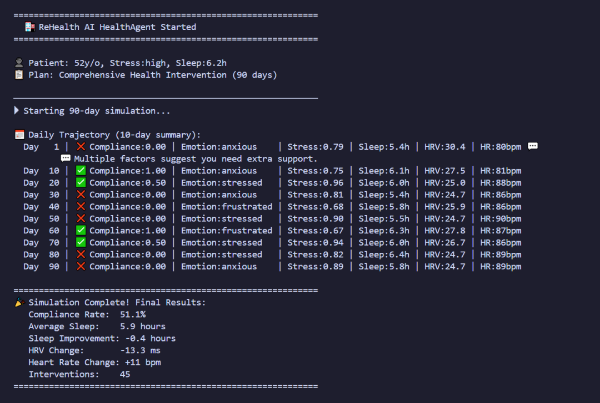

# 🧠 ReHealth AI HealthAgent

### Multi-Agent Health Intervention Simulation Engine

> Repository role: model training, wearable feature research, HealthAgent/PIAS
> simulation, and algorithm validation. This is not the patient Android app;
> the production Android client lives in `Android-apk` and reaches algorithms
> only through `backend` and `model-service`.

Predict how humans respond to health interventions **before running real-world trials.**

Built for **AI researchers, digital health builders, and multi-agent experimentation.**

---

# 🚀 What is HealthAgent?

**HealthAgent** is a **multi-agent simulation framework** that models how human **emotion, behavior, and physiology** interact during health interventions.

Instead of running expensive real-world trials, HealthAgent allows researchers and builders to:

✔ simulate long-term patient trajectories  
✔ test behavioral interventions  
✔ evaluate compliance strategies  
✔ study digital health systems  

All inside a **fast AI-powered simulation environment**.

Think of it as a **health behavior simulator for digital health research.**

---

# 🧠 Why This Project Exists

Testing health interventions in the real world is:

- expensive  
- slow  
- ethically constrained  

You cannot easily run **large randomized trials** just to test a new behavioral nudge.

HealthAgent allows you to simulate those trials **in seconds**.

The system models realistic human behavior patterns:

- compliance rates around **40–60%** for high-stress individuals  
- emotional fluctuation driven by sleep and fatigue  
- physiological response to behavioral adherence  

---

# 📊 Simulation Demo

Example output from a **90-day simulation**.

---

# 🧠 Multi-Agent Architecture

HealthAgent models health behavior using collaborating agents.

    Orchestrator Agent
        ├ Emotion Agent
        │   ├ stress
        │   ├ motivation
        │   └ fatigue
        │
        ├ Compliance Agent
        │   ├ decision probability
        │   └ adherence score
        │
        ├ Physiology Agent
        │   ├ HRV
        │   ├ resting HR
        │   └ sleep dynamics
        │
        └ Intervention Agent
            ├ risk detection
            └ behavioral nudges

Simulation loop:

    Emotion → Compliance → Physiology → Intervention → Record

---

# ⚡ Quick Start

Clone repository

    git clone https://github.com/csong8904-spec/ReHealthAI-HealthAgent.git
    cd ReHealthAI-HealthAgent

Create environment

    python -m venv venv
    source venv/bin/activate

Install dependencies

    pip install -r requirements.txt

Add API key

    DEEPSEEK_API_KEY=your_key_here

Run simulation

    python simulate.py

Visualize results

    python visualize.py

---

# 🐍 Python Example

    from healthagent import SimulationEngine
    from healthagent.models import PatientProfile, InterventionPlan

    patient = PatientProfile(
        age=52,
        bmi=27.5,
        stress_level="HIGH",
        sleep_avg_hours=6.2
    )

    plan = InterventionPlan(
        name="Lifestyle Optimization",
        duration_days=90,
        rules=[
            "30-minute walk daily",
            "sleep before 10:30 PM",
            "10 min mindfulness"
        ]
    )

    engine = SimulationEngine(seed=42)

    result = engine.run_simulation(patient, plan)

    print(result.compliance_rate)
    print(result.sleep_improvement)
    print(result.hrv_change)

---

# 📦 Project Structure

    ReHealthAI-HealthAgent
    │
    ├ healthagent
    │   ├ agents
    │   │   ├ emotion_agent.py
    │   │   ├ compliance_agent.py
    │   │   ├ physiology_agent.py
    │   │   ├ intervention_agent.py
    │   │   └ orchestrator.py
    │   │
    │   ├ models
    │   │   ├ patient_profile.py
    │   │   ├ intervention.py
    │   │   └ trajectory.py
    │   │
    │   └ engine
    │       └ simulation_engine.py
    │
    ├ examples
    │   ├ sleep_simulation.py
    │   └ cardio_simulation.py
    │
    ├ simulate.py
    ├ visualize.py
    ├ requirements.txt

---

# 🧪 Use Cases

Digital Health Research  
Study behavioral drivers behind intervention adherence.

Healthcare Analytics  
Estimate success probability of interventions.

Digital Therapeutics  
Prototype behavioral health treatments.

AI Agent Research  
Experiment with LLM-driven agent simulations.

---

# 🌍 Vision

HealthAgent is part of the **ReHealth AI platform**.

Our long-term vision is to build a **digital twin simulation environment for human health**.

---

# 🤝 Contributing

Fork repository

    git checkout -b feature/my-feature

Commit changes

    git commit -m "Add feature"

Push branch

    git push origin feature/my-feature

Open Pull Request.

---

# 📄 License

Apache 2.0 License

---

# ⭐ Support the Project

If this project is useful:

Star the repo  
Fork it  
Report issues  
Share it

---

Built with ❤️ by **ReHealth AI · 2026**

